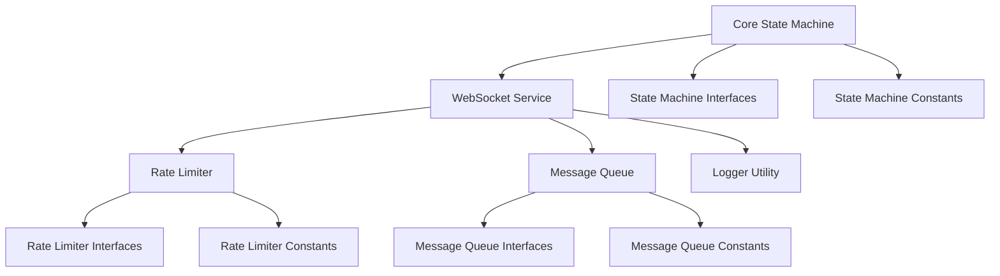

## 8. Implementation Mapping

This section maps the formal concepts of the state machine to concrete components using **xstate v5** and **ws** libraries. It outlines the file directory structures, component interfaces, constants definitions, and diagrams illustrating the relationships between components and concepts.

### 8.1 File Directory Structures

The project is organized to separate core functionalities from optional features, ensuring modularity and maintainability.

```
/src
├── /core
│   ├── stateMachine/          # Core state machine definitions
│   │   ├── interfaces.js      # Interfaces for states, events, actions
│   │   └── constants.js       # Constants for states and events
│   ├── services/              # Core services
│   │   └── websocketService.js
│   └── index.js               # Entry point for core functionalities
├── /optional
│   ├── rateLimiter/           # Rate limiting feature
│   │   ├── interfaces.js
│   │   └── constants.js
│   ├── messageQueue/          # Message queuing feature
│   │   ├── interfaces.js
│   │   └── constants.js
│   └── index.js               # Entry point for optional features
├── /utils
│   └── logger.js              # Utility for logging
├── /tests
│   ├── core/                  # Tests for core components
│   ├── optional/              # Tests for optional features
│   └── utils/                 # Tests for utilities
└── 

package.json


```

#### Description:

1. **/core:** Contains the core state machine and WebSocket service implementation.
2. **/optional:** Houses optional features like rate limiting and message queuing.
3. **/utils:** Utility modules, such as logging.
4. **/tests:** Unit and integration tests for the application components.

### 8.2 Component Structures

#### 8.2.1 Core Components

- **stateMachine/interfaces.js**

  Defines the interfaces for states, events, and actions within the core state machine.

  ```javascript
  // Conceptual Definition
  export interface State {
    name: string;
    on: EventHandler;
  }

  export interface Event {
    type: string;
    payload?: any;
  }

  export interface Action {
    name: string;
    execute: (context: Context, event: Event) => void;
  }

  export interface EventHandler {
    [eventType: string]: Transition;
  }

  export interface Transition {
    target: string;
    actions: string[];
  }
  ```

- **stateMachine/constants.js**

  Defines constants for states and events to ensure consistency across the application.

  ```javascript
  // Conceptual Definition
  export const STATES = {
    DISCONNECTED: 'Disconnected',
    CONNECTING: 'Connecting',
    CONNECTED: 'Connected',
    ERROR: 'Error',
  };

  export const EVENTS = {
    CONNECT_REQUEST: 'CONNECT_REQUEST',
    CONNECTION_SUCCESS: 'CONNECTION_SUCCESS',
    CONNECTION_FAILURE: 'CONNECTION_FAILURE',
    DISCONNECT_REQUEST: 'DISCONNECT_REQUEST',
    CONNECTION_CLOSED: 'CONNECTION_CLOSED',
    SEND_MESSAGE: 'SEND_MESSAGE',
    MESSAGE_RECEIVED: 'MESSAGE_RECEIVED',
    ERROR_OCCURRED: 'ERROR_OCCURRED',
  };

  export const ACTIONS = {
    INITIATE_CONNECTION: 'InitiateConnection',
    HANDLE_CONNECTION_SUCCESS: 'HandleConnectionSuccess',
    HANDLE_CONNECTION_FAILURE: 'HandleConnectionFailure',
    TERMINATE_CONNECTION: 'TerminateConnection',
    SEND_MESSAGE: 'SendMessage',
    RECEIVE_MESSAGE: 'ReceiveMessage',
    LOG_ERROR: 'LogError',
  };
  ```

- **services/websocketService.js**

  Maps the state machine actions to actual WebSocket service behaviors using the **ws** library.

  ```javascript
  // Conceptual Definition
  export interface WebSocketService {
    connect: () => void;
    disconnect: () => void;
    sendMessage: (message: string) => void;
    onMessage: (callback: (message: string) => void) => void;
    onError: (callback: (error: Error) => void) => void;
    onClose: (callback: () => void) => void;
  }
  ```

#### 8.2.2 Optional Components

- **rateLimiter/interfaces.js**

  Defines the interface for the rate limiter component.

  ```javascript
  // Conceptual Definition
  export interface RateLimiter {
    canSend: () => boolean;
    recordSend: () => void;
    reset: () => void;
  }
  ```

- **rateLimiter/constants.js**

  Defines constants related to rate limiting.

  ```javascript
  // Conceptual Definition
  export const RATE_LIMIT = {
    MAX_MESSAGES: 100,
    WINDOW_SIZE: 60000, // in milliseconds
  };
  ```

- **messageQueue/interfaces.js**

  Defines the interface for the message queue component.

  ```javascript
  // Conceptual Definition
  export interface MessageQueue {
    enqueue: (message: string) => void;
    dequeue: () => string | null;
    isFull: () => boolean;
    clear: () => void;
  }
  ```

- **messageQueue/constants.js**

  Defines constants related to the message queue.

  ```javascript
  // Conceptual Definition
  export const QUEUE_CONFIG = {
    MAX_QUEUE_SIZE: 1000,
  };
  ```

### 8.3 Relationships within File and Components Structures

The following diagram illustrates the relationships between the core components and optional features within the project structure.



#### Description:

- **Core State Machine:** Central component managing the primary states, events, actions, and transitions as defined in the formal specification.
- **WebSocket Service:** Interfaces with the **ws** library to handle real-time WebSocket connections and events, interacting with the core state machine.
- **Rate Limiter:** An optional feature that controls the rate of message sending, ensuring compliance with predefined limits.
- **Message Queue:** An optional feature that manages outgoing messages, ensuring they are sent in order and handling overflow scenarios.
- **Logger Utility:** Provides consistent logging across core and optional components for monitoring and debugging purposes.
- **Interfaces and Constants:** Define the contracts and constants used by respective components to maintain consistency and adherence to the formal specification.

## 9. System Invariants

System invariants ensure that $\mathcal{WC}$ maintains consistency and adheres to defined constraints throughout its operation.

### 9.1 Single Active State

The system is always in exactly one state at any given time.

$$
\forall t, \, |\{ s \in S \ | \ \mathcal{M}(t) = s \}| = 1
$$

### 9.2 Deterministic Transitions

For each state and event pair, there is exactly one defined transition.

$$
\forall s \in S, \, e \in E, \, |\delta(s, e)| = 1
$$

### 9.3 No Undefined States

All transitions result in states within the defined set $S$.

$$
\forall s \in S, \, e \in E, \, \delta(s, e).S \in S
$$

## 10. Safety Properties

Safety properties ensure that $\mathcal{WC}$ operates reliably, preventing undesirable scenarios and maintaining system integrity.

### 10.1 No Invalid State Entry

The system cannot enter a state outside the defined set $S$.

$$
\forall t, \, \mathcal{WC}(t) \in S
$$

### 10.2 Error Handling

Upon encountering an error, the system transitions to the `Error` state, ensuring errors are consistently managed.

$$
\forall s \in S, \, e = \text{ERROR_OCCURRED}, \, \delta(s, e).S = \text{Error}
$$

### 10.3 Connection Consistency

A successful connection leads to the `Connected` state, and a failure results in the `Disconnected` state, maintaining logical consistency.

$$
\begin{align*}
\forall s = \text{Connecting}, \, e = \text{CONNECTION_SUCCESS}, \, \delta(s, e).S &= \text{Connected} \\
\forall s = \text{Connecting}, \, e = \text{CONNECTION_FAILURE}, \, \delta(s, e).S &= \text{Disconnected}
\end{align*}
$$
