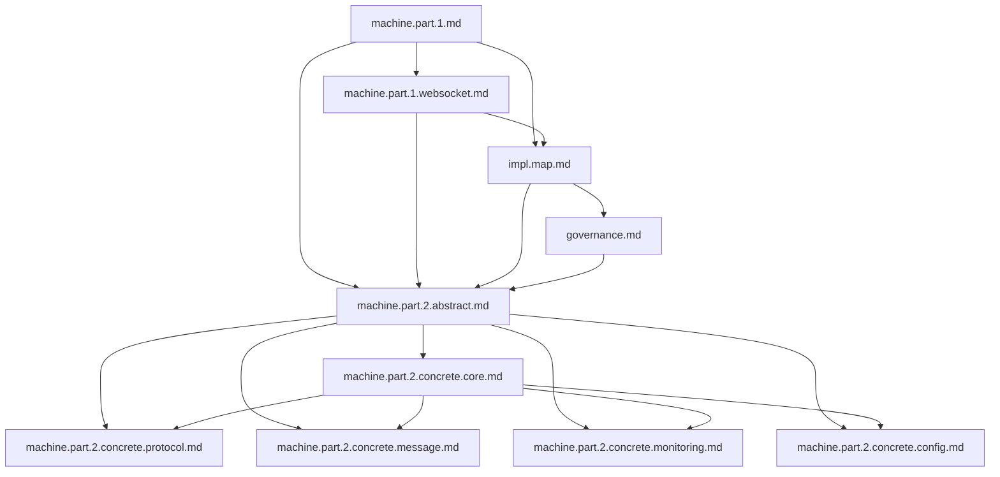

# WebSocket Implementation Design: Document Structure

## 1. Document Dependencies



## 2. Document Focus Areas

### 2.1 machine.part.2.concrete.core.md
- State machine implementation mappings
- Core event and context handling
- Action and guard definitions
- Validation framework
- Core property mappings

### 2.2 machine.part.2.concrete.protocol.md
- WebSocket protocol handlers
- Connection lifecycle management
- Protocol state mappings
- Error classification and handling
- Protocol constraints and validations

### 2.3 machine.part.2.concrete.message.md
- Message queuing system
- Rate limiting and flow control
- Message processing and transformation
- Message reliability and tracking
- Queue management

### 2.4 machine.part.2.concrete.monitoring.md
- Health check system
- Performance monitoring
- Connection tracking
- Error monitoring
- Metrics collection and reporting

### 2.5 machine.part.2.concrete.config.md
- Configuration management system
- Environment variable handling
- Schema validation
- Configuration loading process
- Cache integration

## 3. Cross-Document References

### 3.1 Required References
Each concrete document must reference:
```
This document provides detailed component designs that implement the high-level 
architecture defined in machine.part.2.abstract.md.

Document Dependencies:
1. machine.part.1.md: Core mathematical specification
2. machine.part.1.websocket.md: Protocol specification
3. impl.map.md: Implementation mappings
4. governance.md: Design stability guidelines
5. machine.part.2.abstract.md: High-level architecture
```

### 3.2 Inter-Document References
- Core document referenced by all others
- Protocol document references core state mappings
- Message document references protocol constraints
- Monitoring document references all component states
- Config document references core validation framework

## 4. Document Structure Template

Each concrete document should follow this structure:

```markdown
# [Component] Implementation Design

## Preamble
- Document dependencies
- Relationship to abstract design
- Design constraints

## Core Components
- Component interfaces
- Type hierarchies
- Required behaviors

## Implementation Requirements
- Component creation rules
- Extension points
- Validation requirements

## Integration Guidelines
- Inter-component communication
- External tool integration
- Error handling patterns

## Health and Monitoring
- Component-specific health checks
- Performance metrics
- Resource monitoring
```

## 5. Implementation Mappings

Each document must maintain mappings to:

### 5.1 Formal Model ($\mathcal{WC}$)
- Core state machine properties
- Protocol definitions
- Message constraints
- Timing properties

### 5.2 Type Hierarchies
- Interface definitions
- Type constraints
- Property mappings

### 5.3 Validation Rules
- Schema validations
- Runtime checks
- Property constraints

## 6. Design Constraints

All concrete documents must:

### 6.1 Follow Governance Rules
- Maintain core immutability
- Use defined extension points
- Follow implementation order

### 6.2 Preserve Properties
- Maintain formal model guarantees
- Ensure type safety
- Preserve component boundaries

### 6.3 Enable Implementation
- Provide clear interfaces
- Define required behaviors
- Specify validation rules