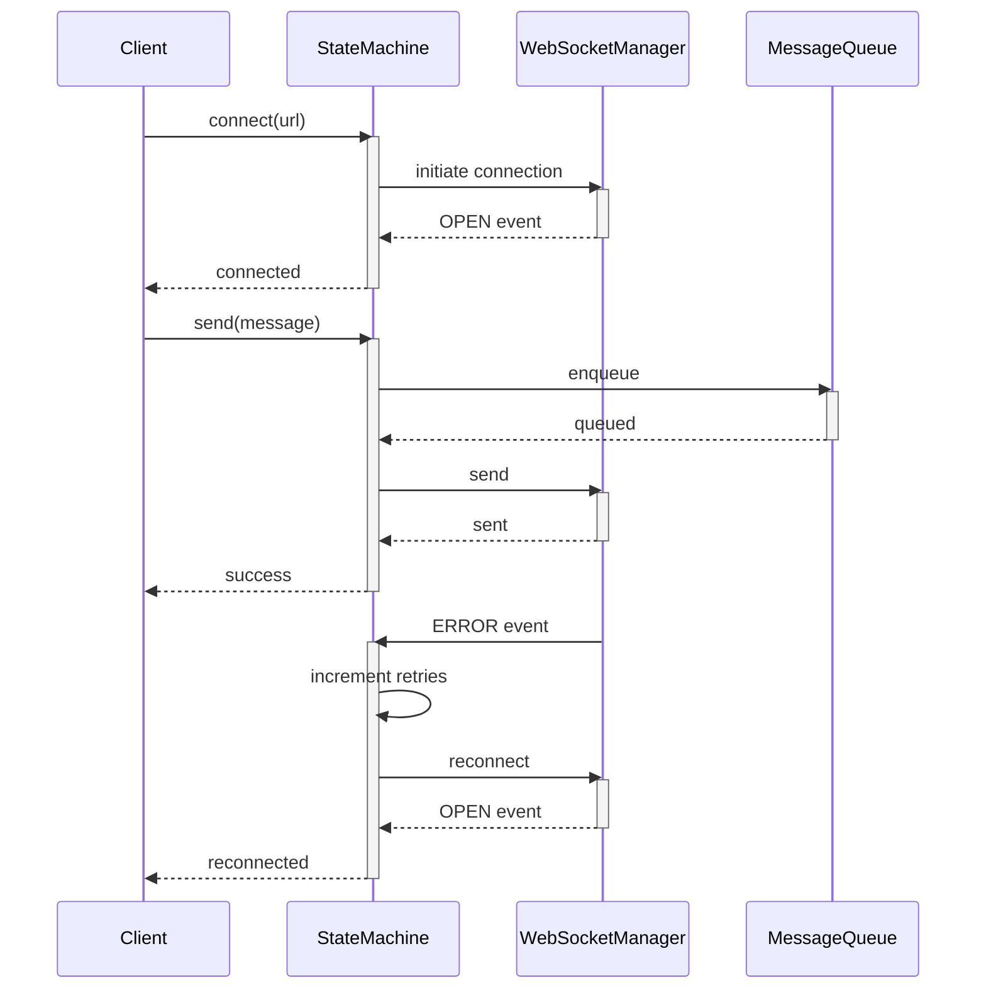

For the initial version, we should focus on critical documentation improvements while keeping things simple. Here's what I recommend addressing now vs. later:

### Address Now:

1. **Key Workflow Sequence Diagrams**
Let me create a sequence diagram for the core connection flow:

2. **Basic Troubleshooting Guide**
Let me create a concise troubleshooting guide: [Troubleshooting Guide](./guide.troubleshooting.md)

3. **Resource Cleanup Documentation**
Let me add essential resource cleanup guidelines: [Resource Cleanup Guidelines](./guide.resource.cleanup.md)

### Defer for Later:

1. **Migration Guide**
- Can be added when we have multiple versions
- Should be based on actual usage patterns
- Will be more valuable after initial adoption

2. **Advanced Features**
- Connection pooling
- Detailed metrics collection
- Advanced logging strategies

This approach:
- Adds critical documentation for implementation and troubleshooting
- Maintains simplicity while ensuring proper resource management
- Defers complex features until needed
- Keeps focus on core functionality

Would you like me to elaborate on any of these additions or make adjustments to the documentation I've created?