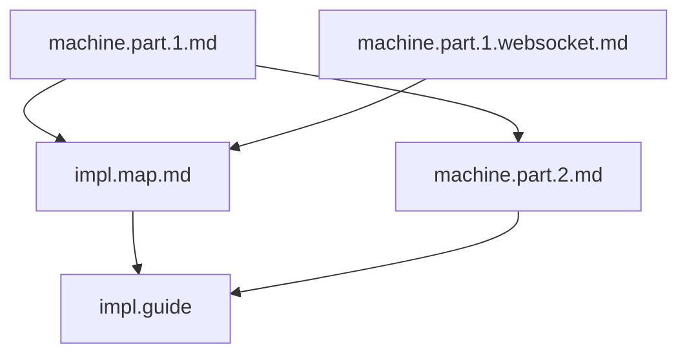
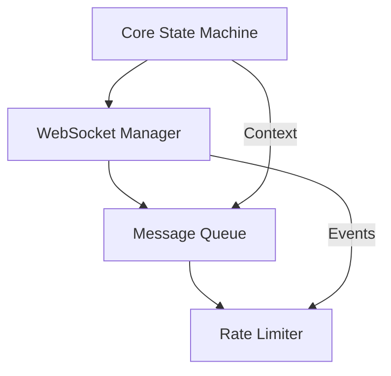

# Guide on Implementation

## Component Organization

### 1. Document Hierarchy

#### Core Documentation

```
├── Formal Specification
│   ├── machine.part.1.md           # Core mathematical spec
│   │   ├── System tuple 𝒲 = (S, E, δ, s₀, C, γ, F)
│   │   ├── State Machine Properties
│   │   └── System Properties
│   │
│   └── machine.part.1.websocket.md # Protocol-specific mappings
│       ├── WebSocket state mappings
│       ├── Protocol constraints
│       └── WebSocket-specific properties
│
├── Implementation Design (machine.part.2.md)
│   ├── Component Architecture (C4)
│   ├── Core Workflows (Sequence Diagrams)
│   ├── Directory Structure
│   └── Implementation Guidelines
│
├── Implementation Mapping (impl.map.md)
│   ├── State Space Mapping
│   ├── Event Space Mapping
│   ├── Context Mapping
│   └── Property Mapping
│
└── Governance Guidelines (governance.md)
    ├── AI Engineering Insights
    ├── Stability Rules
    ├── Implementation Guidelines
    └── Review Process
```

#### Implementation Guides

```
└── guides/
    ├── implementation.md           # This document
    │   ├── Component Organization
    │   └── Implementation Plan
    │
    └── maintenance.md
        ├── Troubleshooting
        │   ├── Common Issues
        │   ├── Diagnostic Steps
        │   └── Prevention Guidelines
        ├── Resource Cleanup
        │   ├── Connection Cleanup
        │   ├── Queue Cleanup
        │   └── Client Shutdown
        └── Operational Guidelines
```

#### Testing Documentation

```
└── test.md
    ├── Test Design
    │   ├── State Machine Tests
    │   ├── WebSocket Manager Tests
    │   ├── Message Queue Tests
    │   └── Integration Tests
    └── Test Specifications
        ├── Coverage Requirements
        ├── Performance Requirements
        └── Stability Requirements
```

### 2. Cross-Document Mappings

#### 2.1 State Machine
- **Formal Spec**: Defines $S = \{disconnected, connecting, connected, reconnecting\}$
- **WebSocket Protocol**: Maps to WebSocket connection states
- **Implementation Design**: Maps to xstate machine structure
- **Directory Location**: `/core/state/`

#### 2.2 Event System
- **Formal Spec**: Defines $E$ as event space
- **WebSocket Protocol**: Maps to WebSocket events (open, close, error, message)
- **Implementation Design**: Maps to handler system
- **Directory Location**: `/core/events/`

#### 2.3 WebSocket Operations
- **Formal Spec**: Defined in transition function $δ$
- **WebSocket Protocol**: Maps to WebSocket lifecycle events
- **Implementation Design**: Maps to WebSocket Manager
- **Directory Location**: `/core/socket/`

#### 2.4 Message System
- **Formal Spec**: Part of context space $C$
- **WebSocket Protocol**: Maps to message handling protocol
- **Implementation Design**: Maps to Message Queue
- **Directory Location**: `/core/queue/`

### 3. Document Dependencies



### 4. Document Purposes

#### 4.1 machine.part.1.md
- Defines mathematical foundation
- Establishes core properties
- Sets system boundaries

#### 4.2 machine.part.1.websocket.md
- Defines protocol-specific mappings
- Establishes WebSocket constraints
- Maps core concepts to protocol

#### 4.3 machine.part.2.md
- Maps math to components
- Defines implementation structure
- Provides architectural guidance

#### 4.4 impl.map.md
- Links formal spec to implementation
- Ensures property preservation
- Defines mapping rules

#### 4.5 governance.md
- Organizes implementation
- Defines component interactions
- Establishes stability rules

### 5. Change Management

#### 5.1 Formal Changes
1. Update machine.part.1.md
2. Update machine.part.1.websocket.md if protocol-specific
3. Reflect in impl.map.md
4. Update test cases

#### 5.2 Implementation Changes
1. Check against machine.part.2.md
2. Verify with impl.map.md
3. Follow governance.md rules
4. Update tests

#### 5.3 Extension Changes
1. Verify against formal spec
2. Follow design guidelines
3. Maintain stability rules
4. Add extension tests

## Implementation Plan

### 1. Workflow in Each Step

Implementation order and process follows the governance rules defined in `governance.md`. Each implementation step must:

1. Comply with stability requirements
2. Follow extension patterns
3. Maintain core boundaries
4. Pass governance review process

### 2. Implementation Dependencies



### 3. Implementation Order

From the design document, we should implement in this order:

1. **Core State Machine** using xstate v5
   - Implement state transitions
   - Actions and guards
   - Context management

2. **WebSocket Manager**
   - Basic ws integration
   - Message handling
   - Error handling
   - Integration with state machine

3. **Message Queue**
   - FIFO implementation
   - Size management
   - Queue operations

4. **Rate Limiter**
   - Window tracking
   - Rate calculations
   - Limit enforcement