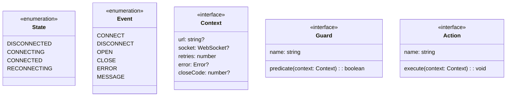
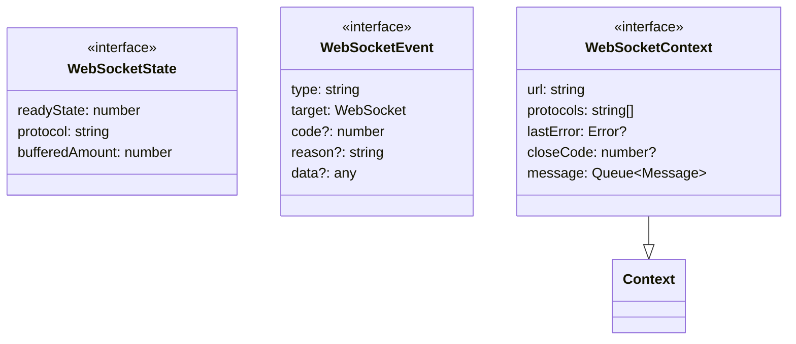
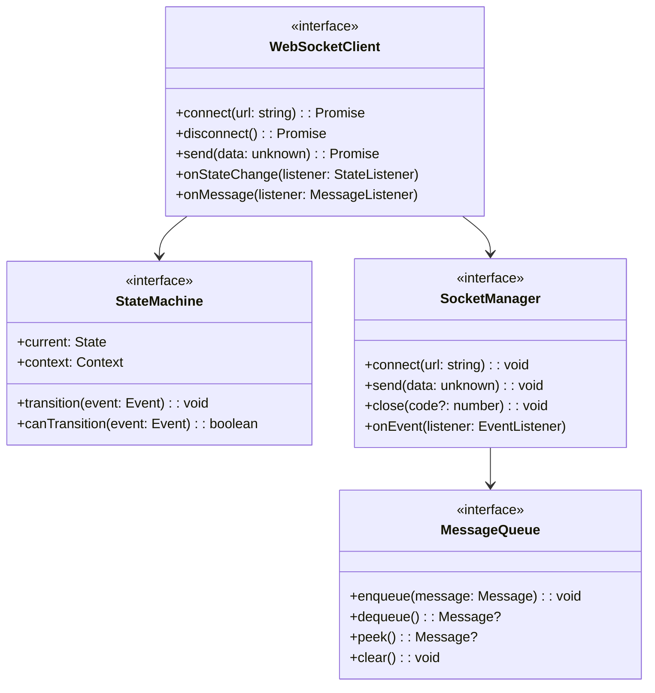
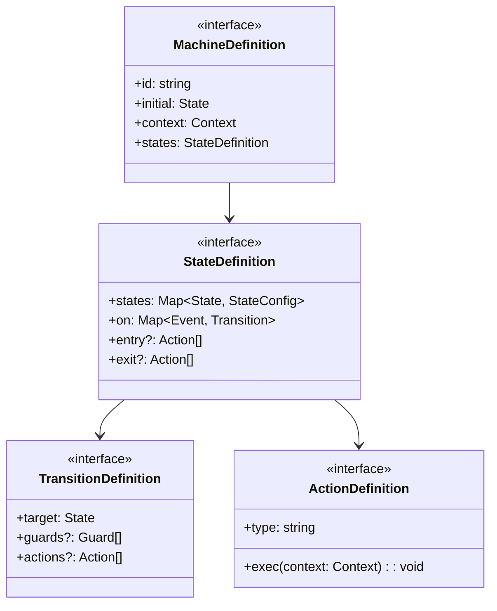
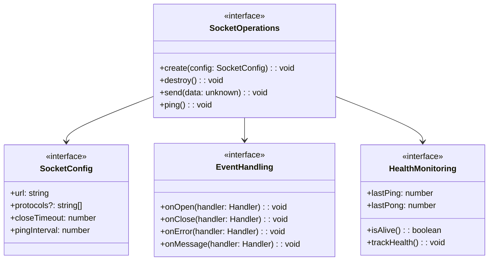
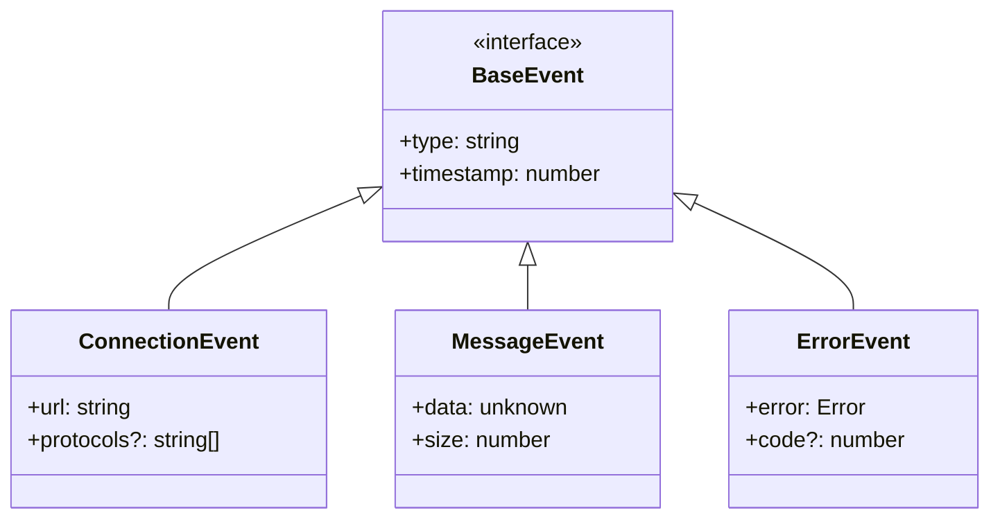
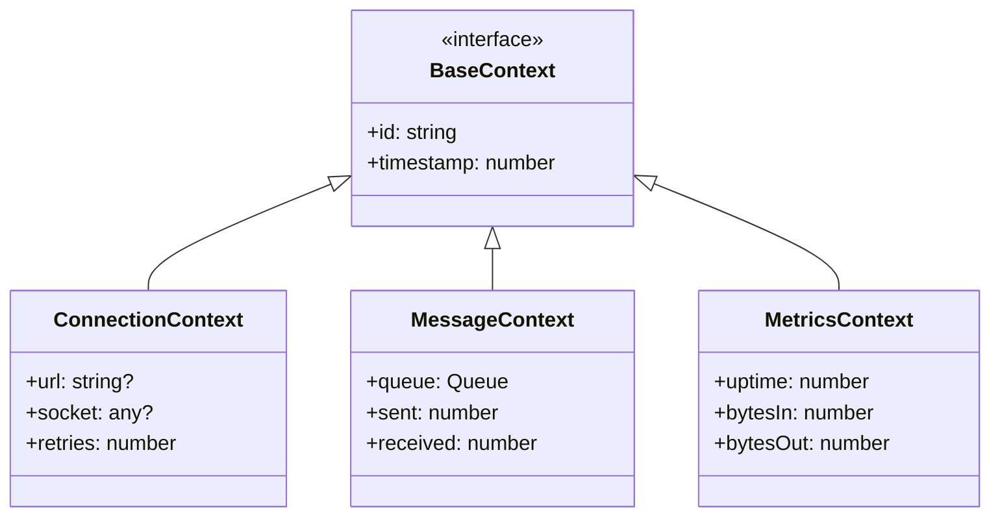

# WebSocket Implementation Design: Abstract Layer

## Preamble

This document defines the high-level architecture and domain language for implementing the WebSocket Client ($\mathcal{WC}$) specified in `machine.part.1.md`. It establishes the core abstractions and component boundaries that bridge between:

1. Formal mathematical model ($\mathcal{WC}$ and protocol mappings)
2. Implementation tools (xstate v5 and ws library)

### Document Purpose

- Defines domain-specific language (DSL) for our WebSocket Client
- Establishes core abstractions and boundaries
- Maps formal concepts to implementation components
- Creates clear separation of concerns

### Document Scope

This document FOCUSES on:

- System context and container design
- Core domain language definitions
- Primary component relationships
- Type hierarchies and boundaries
- Directory structure
- Property mappings

This document does NOT cover:

- Detailed component designs (see machine.part.2.concrete.md)
- Implementation code
- Tool-specific configurations
- Deployment concerns

### Related Documents

- `machine.part.1.md`: Core mathematical specification
- `machine.part.1.websocket.md`: Protocol formal specification
- `machine.part.2.concrete.md`: Detailed component designs
- `impl.map.md`: Implementation to model mappings
- `governance.md`: Design stability guidelines

### Design Philosophy

Following our governance rules, this design:

1. Uses but does not implement state machines
2. Uses but does not implement WebSocket protocol
3. Maintains clear boundaries between domain and tools
4. Preserves formal properties while enabling extension
5. Creates stable interfaces for implementation

## 1. Domain Language

Our WebSocket Client domain model uses a specific language that maps formal concepts to implementation tools:

### 1.1 Core Types



### 1.2 Protocol Types



## 2. Component Design

### 2.1 Core Component Relations



### 2.2 State Machine Design

Maps our domain states and events to xstate:



### 2.3 Socket Management Design

Maps socket operations to ws library:



## 3. Component Boundaries

### 3.1 Client Layer

Owns the domain model and coordinates between state and socket layers:

- Exposes public client API
- Manages state transitions
- Coordinates socket operations
- Handles message flow
- Enforces protocol constraints

### 3.2 State Layer

Manages state machine behavior through xstate:

- Defines state configurations
- Manages transitions
- Executes actions
- Evaluates guards
- Maintains context

### 3.3 Socket Layer

Handles WebSocket operations through ws:

- Manages socket lifecycle
- Handles protocol events
- Buffers messages
- Monitors connection health
- Implements reconnection

## 4. Type Hierarchies

### 4.1 Event Hierarchy



### 4.2 Context Hierarchy



## 5. Directory Structure

Organized by domain concepts:

```
src/
├── client/          # Main domain interfaces
├── state/           # State management interfaces
├── socket/          # Socket management interfaces
└── types/           # Type definitions
```

## 6. Property Mappings

### 6.1 State Machine Properties ($\mathcal{WC}$)

- States map to xstate state nodes
- Events map to xstate events
- Context maps to xstate context
- Transitions map to xstate transitions
- Actions map to xstate actions

### 6.2 Protocol Properties ($E_{ws}$)

- Socket states map to ws readyState
- Protocol events map to ws event handlers
- Socket operations map to ws methods
- Protocol constraints map to runtime checks
