# WebSocket Implementation Design: Configuration System Components

## Preamble

This document provides detailed configuration system designs that implement the high-level
architecture defined in machine.part.2.abstract.md.

### Document Dependencies

This document inherits all dependencies from `machine.part.2.abstract.md` and additionally requires:

1. `machine.part.2.concrete.core.md`: Core component design
   - Provides validation foundation
   - Defines base interfaces and types
   - Establishes extension patterns

### Document Purpose

- Details configuration management
- Defines environment handling
- Establishes validation system
- Provides caching framework

### Document Scope

This document FOCUSES on:

- Configuration loading
- Environment integration
- Schema validation
- Cache management
- Value transformation

This document does NOT cover:

- Core state implementations
- Protocol-specific settings
- Message system configuration
- Monitoring configuration

### Implementation Requirements

1. Code Generation Governance

   - Generated code must maintain formal properties
   - Implementation must follow specified patterns
   - Extensions must use defined mechanisms
   - Changes must preserve core guarantees

2. Verification Requirements

   - Property validation criteria
   - Test coverage requirements
   - Performance constraints
   - Error handling verification

3. Documentation Requirements
   - Implementation mapping documentation
   - Property preservation evidence
   - Extension point documentation
   - Test coverage reporting

### Property Preservation

1. Formal Properties

   - State machine invariants
   - Protocol guarantees
   - Timing constraints
   - Safety properties

2. Implementation Properties

   - Type safety requirements
   - Error handling patterns
   - Extension mechanisms
   - Performance requirements

3. Verification Properties
   - Test coverage criteria
   - Validation requirements
   - Monitoring needs
   - Documentation standards

## 1. Configuration System Architecture

### 1.1 Core Configuration Components

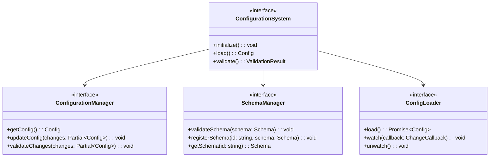

Configuration system must:

1. Manage configuration lifecycle
2. Validate configurations
3. Handle schema registration
4. Support configuration changes

### 1.2 Configuration Structure

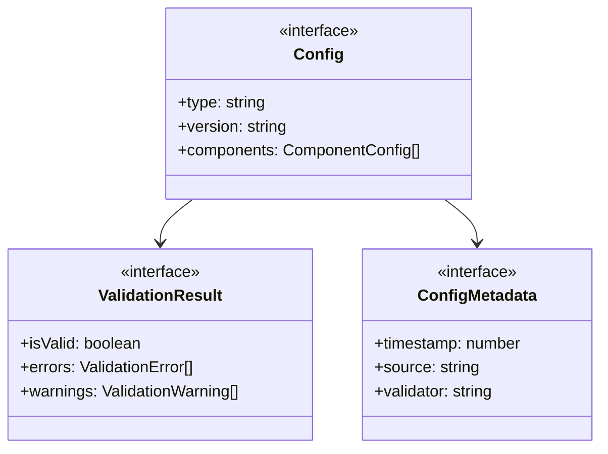

Configuration must:

1. Maintain type safety
2. Track metadata
3. Enable validation
4. Support versioning

## 2. Schema Management Requirements

### 2.1 Schema Registry

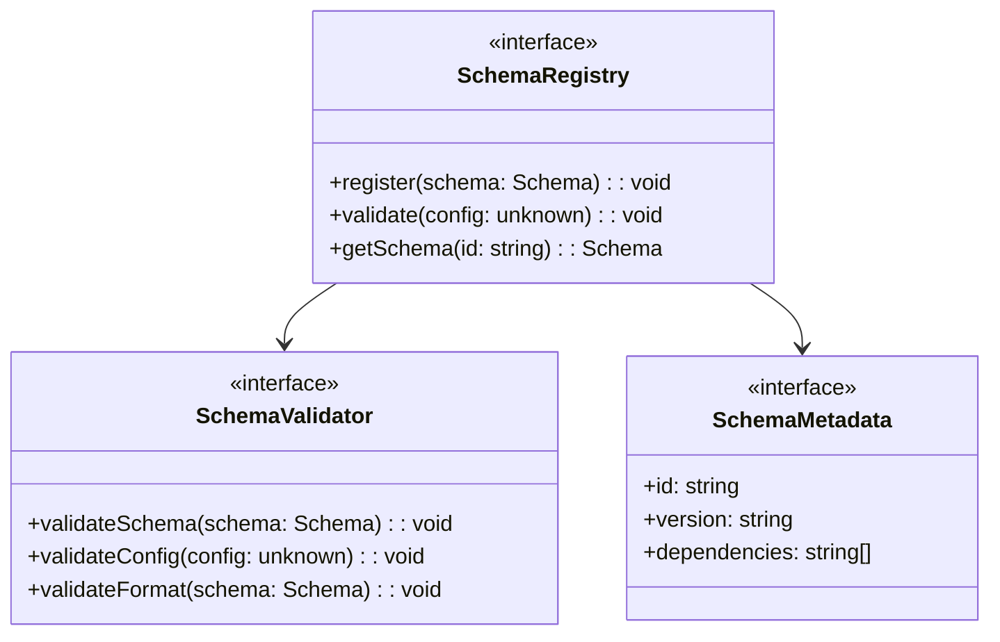

Schema management must:

1. Register schemas
2. Validate schemas
3. Track dependencies
4. Maintain registry

### 2.2 Schema Validation

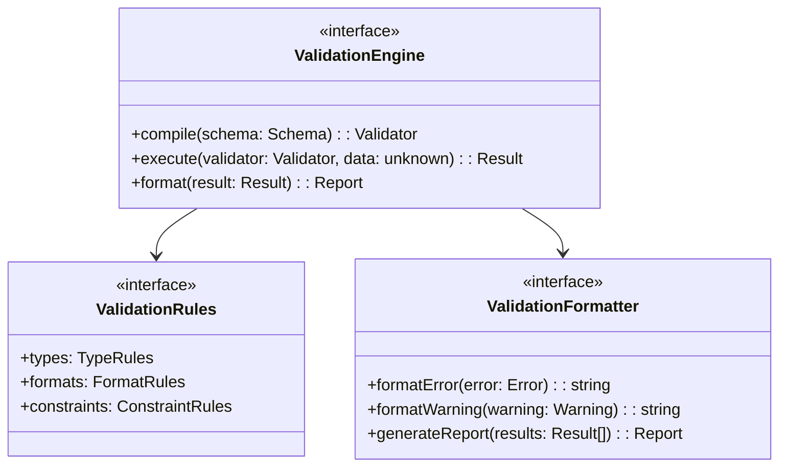

Validation must:

1. Compile schemas
2. Execute validation
3. Format results
4. Generate reports

## 3. Configuration Loading Requirements

### 3.1 Loading Process

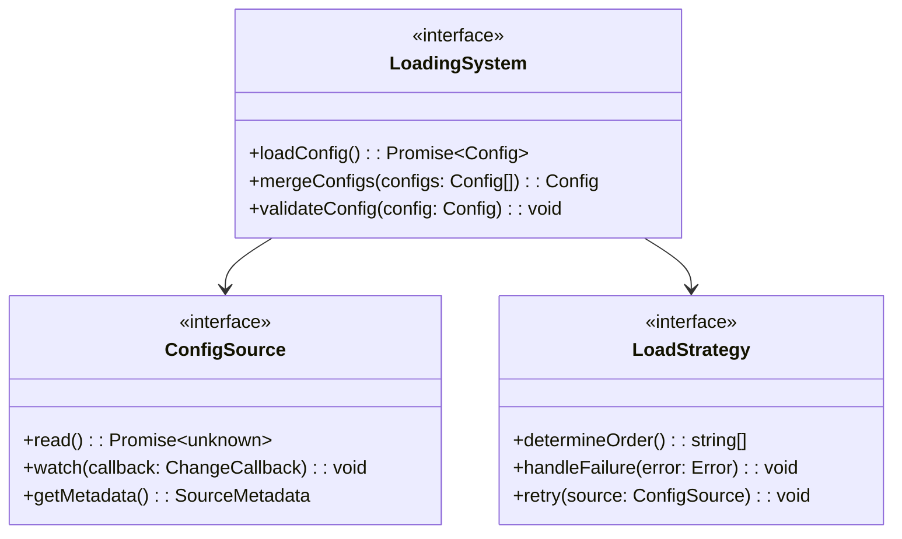

Loading must:

1. Load configurations
2. Merge sources
3. Handle failures
4. Support watching

### 3.2 Source Management

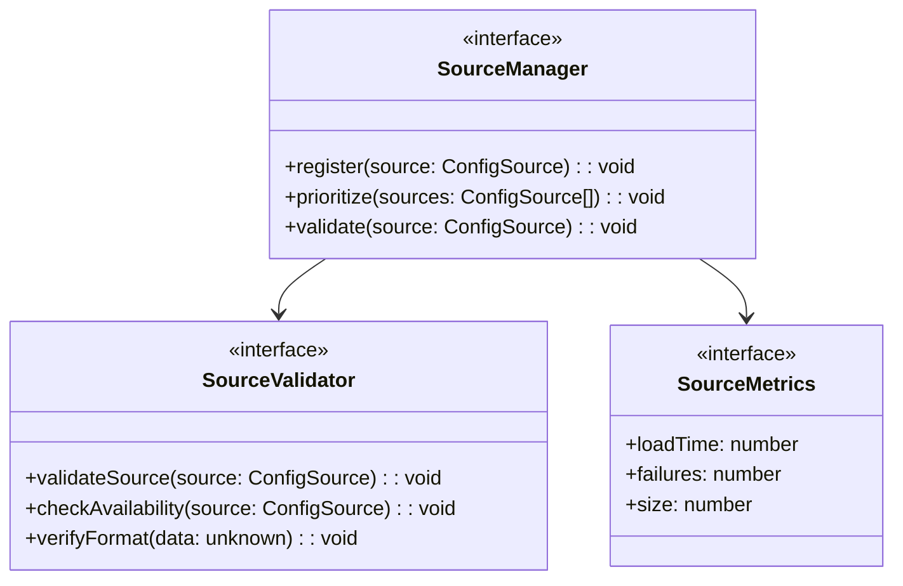

Source management must:

1. Register sources
2. Validate sources
3. Track metrics
4. Handle failures

## 4. Cache Management Requirements

### 4.1 Cache Operations

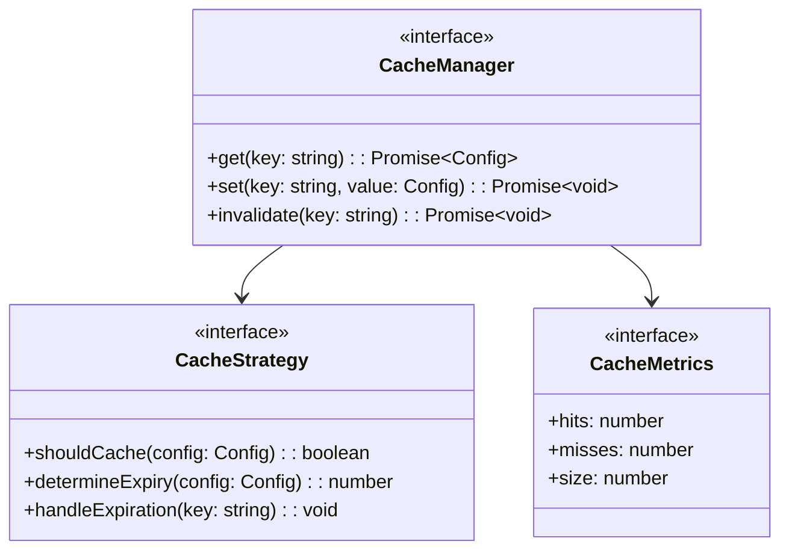

Cache must:

1. Manage cached configs
2. Handle expiration
3. Track metrics
4. Apply strategies

### 4.2 Cache Synchronization

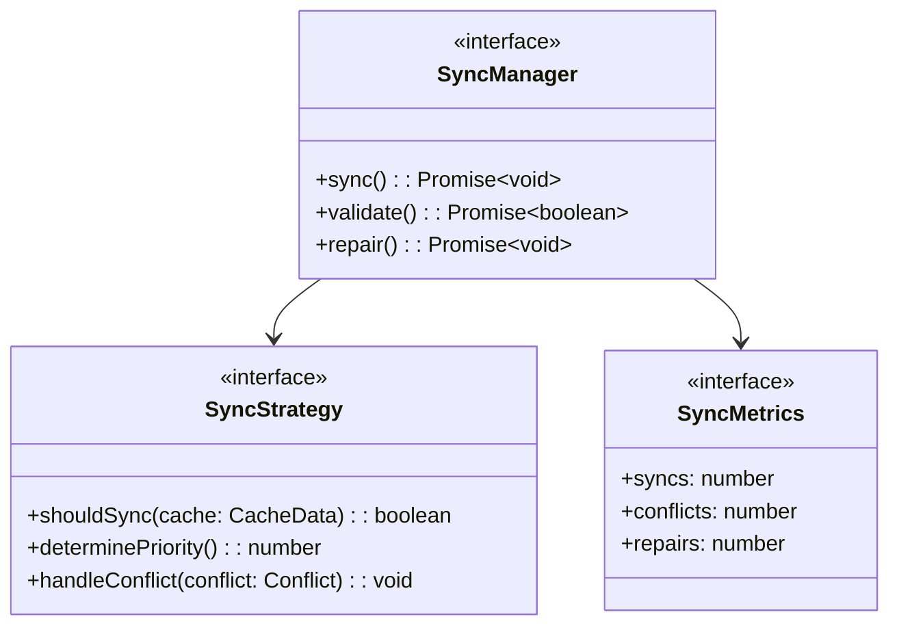

Synchronization must:

1. Maintain consistency
2. Handle conflicts
3. Track sync status
4. Enable repairs

## 5. Environment Integration Requirements

### 5.1 Environment Loading

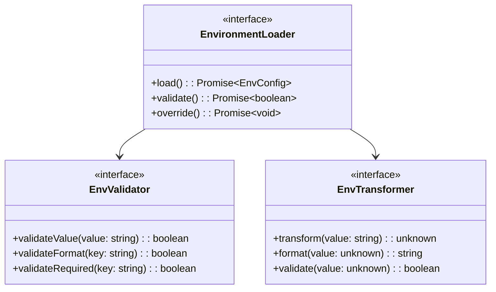

Environment loading must:

1. Load variables
2. Validate values
3. Transform types
4. Handle overrides

### 5.2 Environment Management

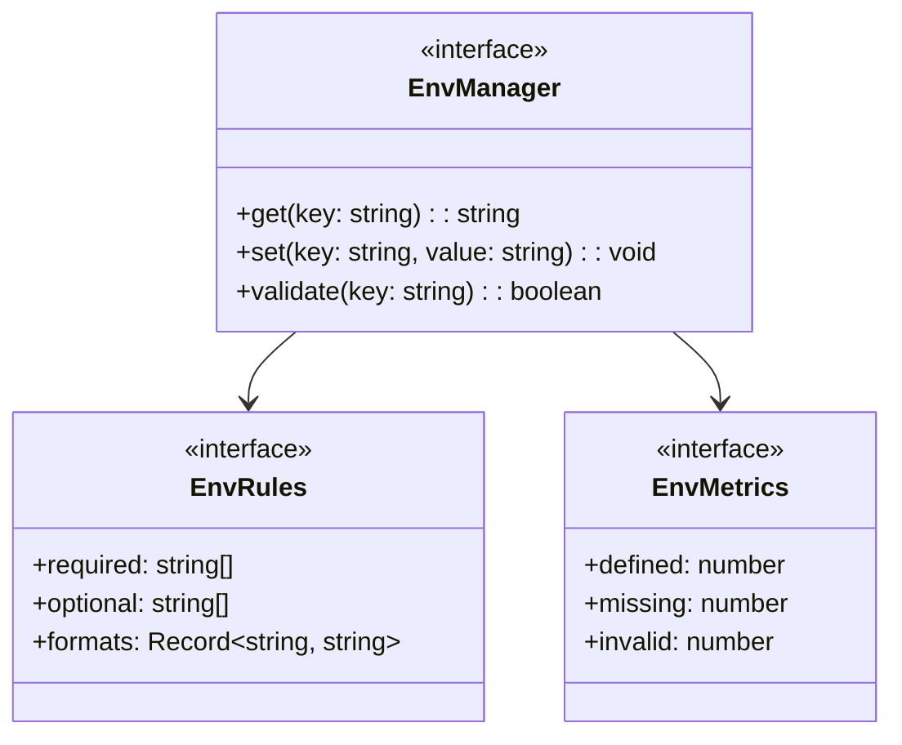

Environment must:

1. Manage variables
2. Apply rules
3. Track metrics
4. Validate values

## 6. Change Management Requirements

### 6.1 Change Tracking

Change tracking must:

1. Track changes
2. Validate changes
3. Assess impact
4. Notify listeners

### 6.2 Change Application

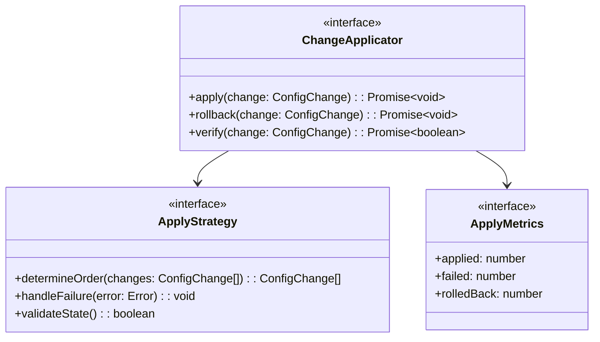

Change application must:

1. Apply changes
2. Handle rollbacks
3. Verify state
4. Track metrics

## 7. Implementation Verification

### 7.1 Verification Requirements

Must verify:

1. Configuration loading

   - Source loading
   - Validation process
   - Cache operations
   - Environment integration

2. Change management

   - Change tracking
   - Change application
   - Rollback process
   - State verification

3. Schema handling
   - Schema validation
   - Config validation
   - Type checking
   - Format verification

### 7.2 Testing Requirements

Must include:

1. Functional tests

   - Loading process
   - Validation rules
   - Cache operations
   - Change handling

2. Performance tests

   - Load times
   - Cache efficiency
   - Change application
   - Memory usage

3. Integration tests
   - Environment integration
   - Schema validation
   - Change propagation
   - Error handling

## 8. Security Requirements

### 8.1 Access Control

Must implement:

1. Configuration access

   - Read permissions
   - Write permissions
   - Change authorization
   - Audit logging

2. Schema access
   - Schema registration
   - Validation access
   - Schema updates
   - Version control

### 8.2 Data Protection

Must ensure:

1. Sensitive data

   - Value encryption
   - Secret handling
   - Secure storage
   - Secure transmission

2. Audit requirements
   - Change tracking
   - Access logging
   - Validation records
   - Error logging
