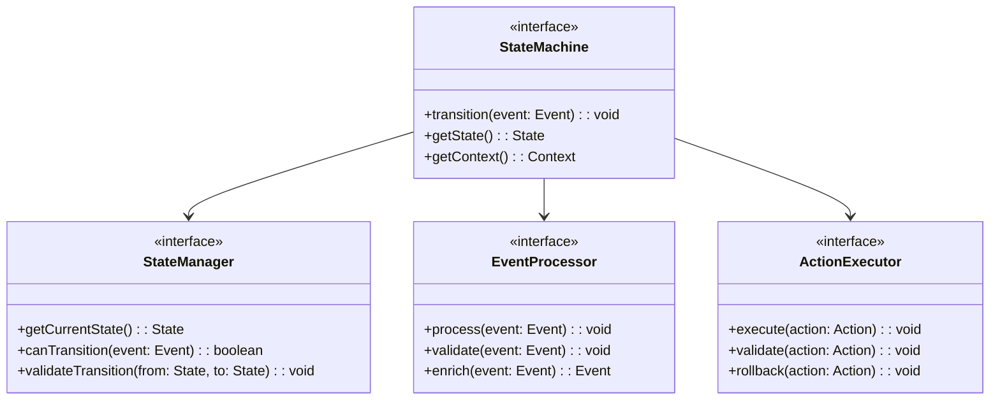
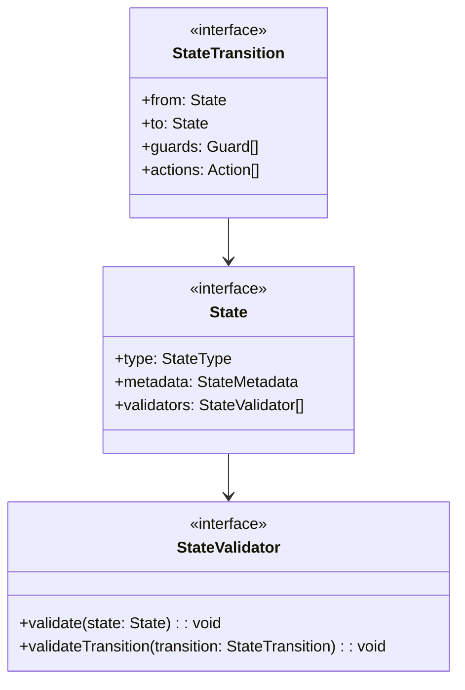
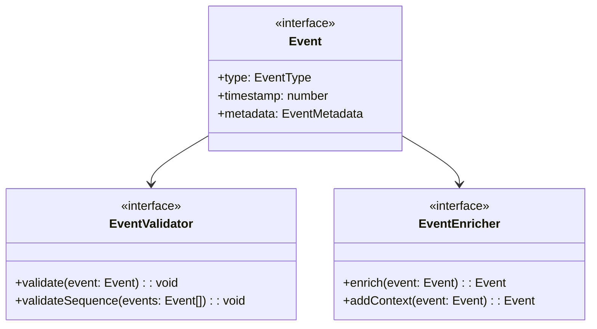
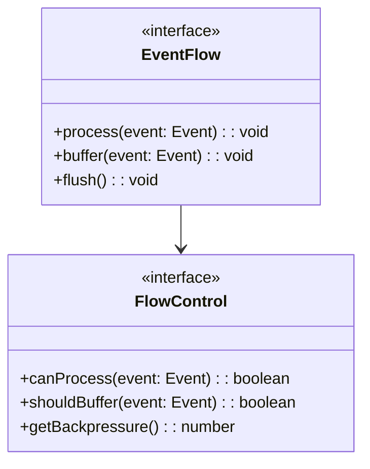
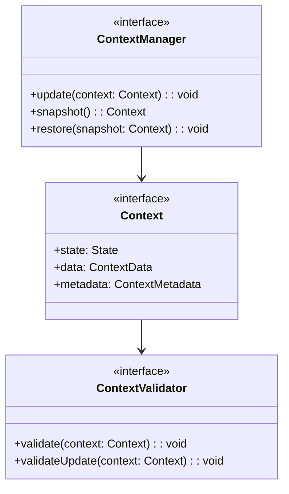
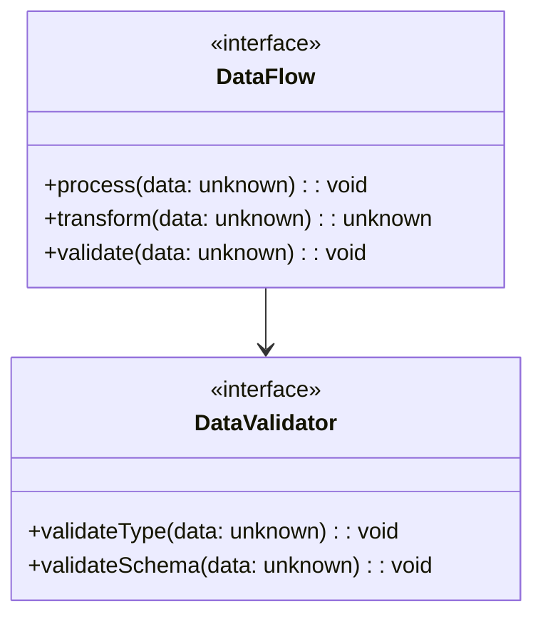
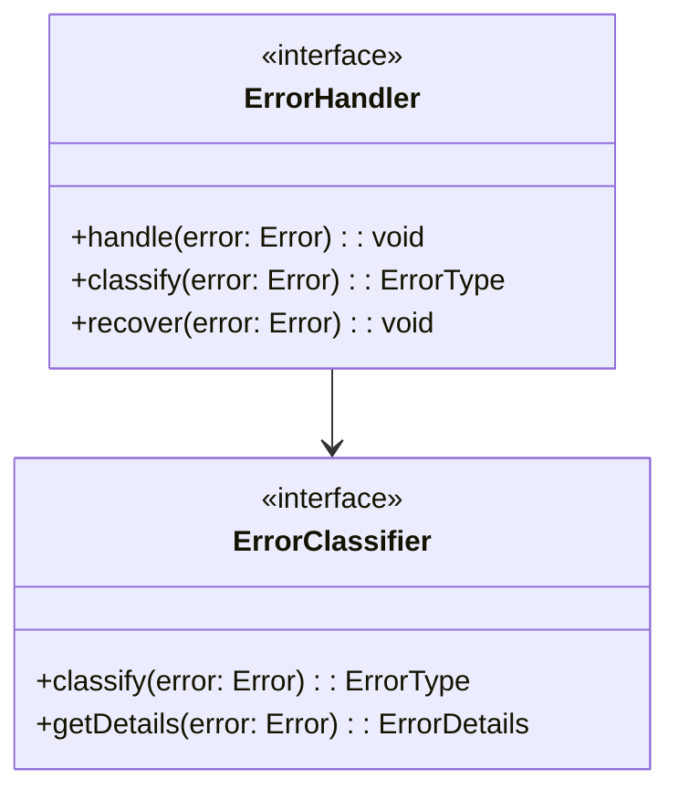
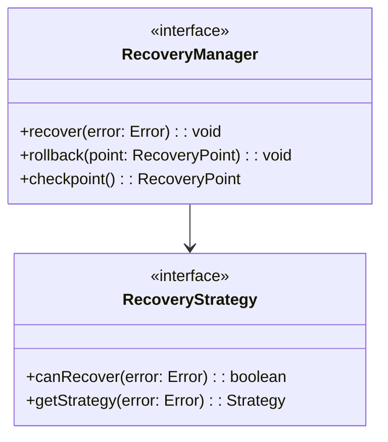

# WebSocket Implementation Design: Core Components

## Preamble

This document defines the core state machine implementation requirements that govern
code generation based on the high-level architecture in machine.part.2.abstract.md.
It provides specifications for generating implementations that maintain formal properties
while enabling practical extensibility.

### Document Dependencies

This document depends on and is constrained by the following specifications, in order:

1. `machine.part.1.md`: Core mathematical specification

   - Formal state machine model ($\mathcal{WC}$)
   - System constants and properties
   - Formal proofs and invariants
   - Safety properties

2. `machine.part.1.websocket.md`: Protocol specification

   - Protocol state mappings
   - WebSocket-specific behaviors
   - Protocol invariants
   - Event mappings

3. `impl.map.md`: Implementation mappings

   - Type hierarchy definitions
   - Property preservation rules
   - Implementation constraints
   - Tool integration patterns

4. `governance.md`: Design stability guidelines
   - Core immutability rules
   - Extension point requirements
   - Implementation sequencing
   - Property preservation

### Document Purpose

- Define requirements for state machine implementation
- Specify interface and type definitions for code generation
- Establish validation and verification criteria
- Provide extension mechanisms that preserve core properties
- Define testing and verification requirements

### Document Scope

This document SPECIFIES:

- State machine implementation requirements
- Event and transition system specifications
- Action and guard implementation patterns
- Context management requirements
- Core property validation rules
- Type system requirements
- Testing criteria

This document EXCLUDES:

- Direct implementation code
- Protocol-specific behaviors
- Message handling details
- Tool-specific configurations
- Deployment aspects

### Implementation Requirements

1. Code Generation Governance

   - Generated code must maintain formal properties
   - Implementation must follow specified patterns
   - Extensions must use defined mechanisms
   - Changes must preserve core guarantees

2. Verification Requirements

   - Property validation criteria
   - Test coverage requirements
   - Performance constraints
   - Error handling verification

3. Documentation Requirements
   - Implementation mapping documentation
   - Property preservation evidence
   - Extension point documentation
   - Test coverage reporting

### Property Preservation

1. Formal Properties

   - State machine invariants
   - Protocol guarantees
   - Timing constraints
   - Safety properties

2. Implementation Properties

   - Type safety requirements
   - Error handling patterns
   - Extension mechanisms
   - Performance requirements

3. Verification Properties
   - Test coverage criteria
   - Validation requirements
   - Monitoring needs
   - Documentation standards
   
## 1. Core State Machine Components

### 1.1 State Machine Architecture

Core components must:

1. Maintain formal state machine properties
2. Enforce state transition rules
3. Validate events and actions
4. Preserve context integrity
5. Enable property verification

### 1.2 State Management

State management must:

1. Enforce state invariants
2. Validate transitions
3. Maintain state metadata
4. Enable state monitoring

## 2. Event System Requirements

### 2.1 Event Processing

Event system must:

1. Type-safe event handling
2. Event validation
3. Event enrichment
4. Sequence validation

### 2.2 Event Flow Control

Flow control must:

1. Prevent event overflow
2. Manage backpressure
3. Enable buffering
4. Maintain ordering

## 3. Context Management Requirements

### 3.1 Context Structure

Context management must:

1. Maintain type safety
2. Enable snapshots
3. Validate updates
4. Track history

### 3.2 Data Flow Requirements

Data flow must:

1. Type-safe processing
2. Schema validation
3. Transformation rules
4. Flow tracking

## 4. Error Handling Requirements

### 4.1 Error Classification

Error handling must:

1. Classify errors
2. Enable recovery
3. Maintain context
4. Track error states

### 4.2 Recovery Requirements

Recovery must:

1. Define strategies
2. Enable rollback
3. Maintain consistency
4. Track recovery states

## 5. Implementation Verification

### 5.1 Property Verification

Must verify:

1. State machine properties

   - Single active state
   - Valid transitions
   - State invariants
   - Context consistency

2. Event properties

   - Event ordering
   - Valid sequences
   - Type safety
   - Flow control

3. Error handling
   - Error classification
   - Recovery paths
   - State consistency
   - Context preservation

### 5.2 Testing Requirements

Must include:

1. State coverage

   - All states reachable
   - All transitions tested
   - Invalid transitions blocked
   - State invariants maintained

2. Event coverage

   - All event types
   - Event sequences
   - Invalid events
   - Flow control limits

3. Error coverage
   - All error types
   - Recovery paths
   - State preservation
   - Context integrity

## 6. Extension Mechanisms

### 6.1 Extension Points

Must provide:

1. State extensions

   - Custom states
   - State metadata
   - State validators
   - Transition guards

2. Event extensions

   - Custom events
   - Event enrichment
   - Event validation
   - Flow control

3. Context extensions
   - Custom data
   - Data validation
   - Update hooks
   - History tracking

### 6.2 Extension Validation

Must verify:

1. Property preservation

   - Core state machine properties
   - Event ordering
   - Type safety
   - Recovery paths

2. Performance impact

   - Transition times
   - Event processing
   - Memory usage
   - Recovery time

3. Stability guarantees
   - Error handling
   - State consistency
   - Data integrity
   - Recovery success
