# WebSocket Implementation Design: Concrete Components

## Preamble

This document provides detailed component designs that implement the high-level architecture defined in `machine.part.2.abstract.md`. It maps the abstract concepts to concrete interfaces and relationships while maintaining implementation independence.

### Document Purpose

- Details concrete component designs for each major subsystem
- Defines clear interfaces between components
- Maps abstract concepts to concrete structures
- Preserves formal properties in implementation design
- Maintains tool independence at design level

### Document Scope

This document FOCUSES on:

- Detailed component interfaces
- Precise relationship definitions
- Type hierarchies for each subsystem
- Integration points with external tools
- Protocol and message mappings
- Monitoring and health tracking

This document does NOT include:

- Source code implementation
- Tool-specific configuration details
- Environment-specific concerns
- Deployment considerations

### Component Chapters

1. State Machine Design

   - Maps formal state machine to xstate concepts
   - Defines state, event, and action interfaces
   - Establishes context and guard structures

2. WebSocket Protocol Design

   - Maps protocol specifications to ws library
   - Defines protocol handlers and adapters
   - Manages connection lifecycle

3. Message System Design

   - Implements message queuing and flow
   - Manages rate limiting and windows
   - Handles backpressure and reliability

4. Health Monitoring Design
   - Tracks system health and metrics
   - Manages error detection and handling
   - Provides monitoring interfaces

### Design Constraints

Following governance.md guidelines:

1. Components must use but not implement core state machine
2. Protocol handling must use but not reimplement WebSocket
3. All extensions must occur through defined points
4. Core interfaces must remain stable
5. Implementation details must be isolated

### Relationship to Abstract Design

This document:

1. Implements abstractions from machine.part.2.abstract.md
2. Maintains boundaries defined in abstract layer
3. Maps formal properties to concrete structures
4. Preserves extension points for implementation
5. Details how tools (xstate, ws) are used

### Related Documents

- `machine.part.2.abstract.md`: High-level architecture
- `machine.part.1.md`: Core mathematical specification
- `machine.part.1.websocket.md`: Protocol specification
- `impl.map.md`: Implementation mappings
- `governance.md`: Design stability rules

## Chapter 1: State Machine Mappings

### 1.1 Core Components

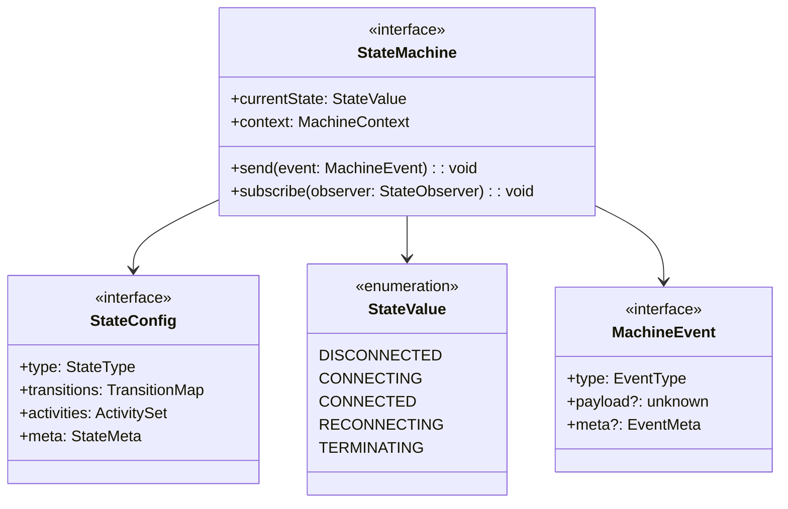

### 1.2 Events & Transitions

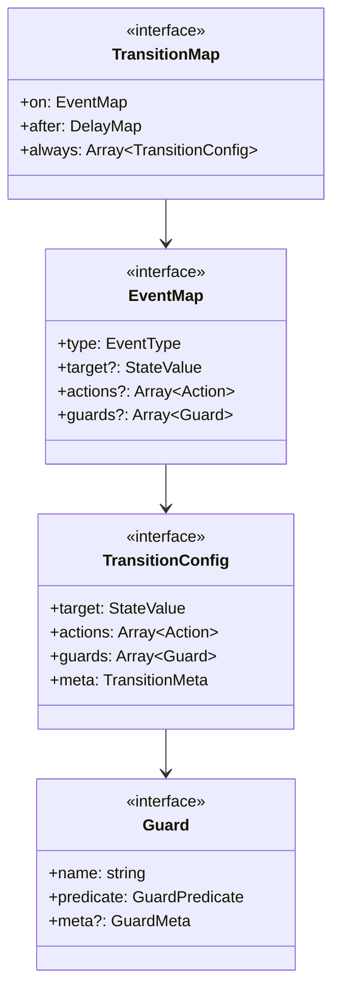

### 1.3 Actions & Activities

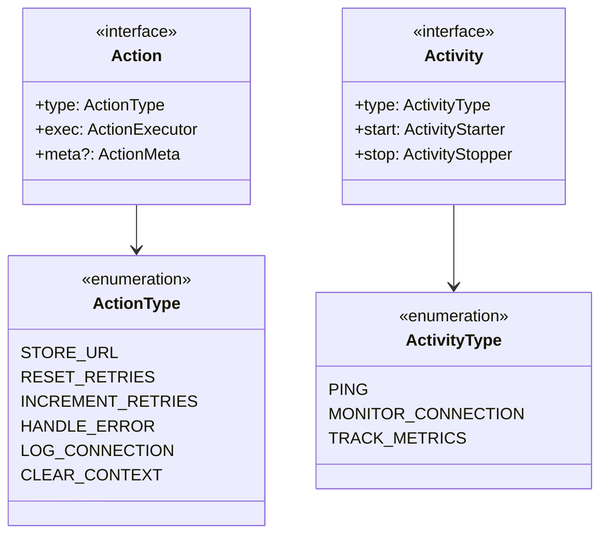

### 1.4 Context Management

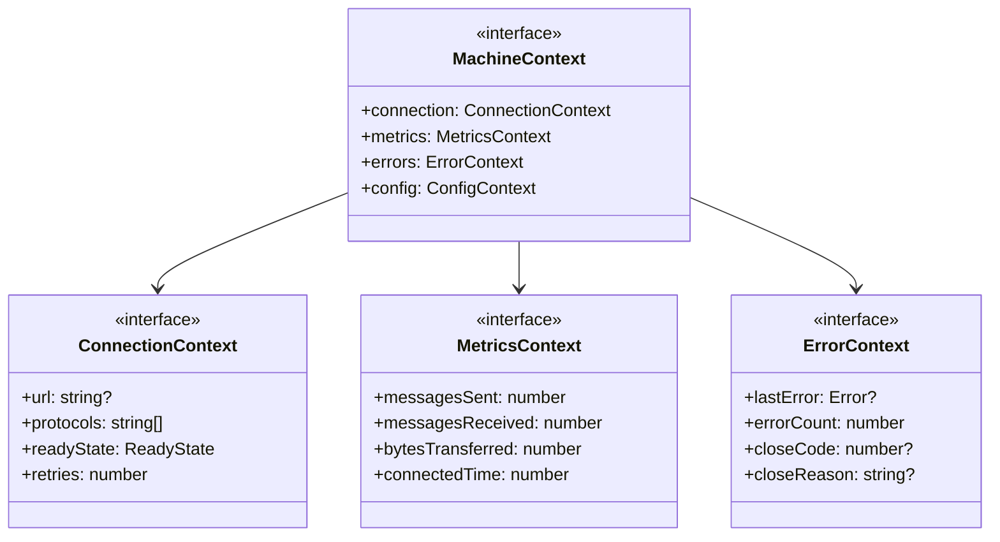

## 2. State Mappings

### 2.1 State Definitions

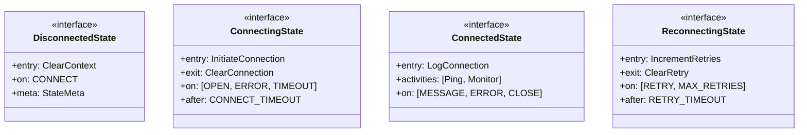

### 2.2 Event Mappings

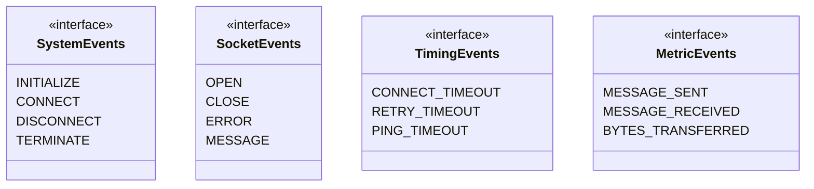

### 2.3 Guard Mappings

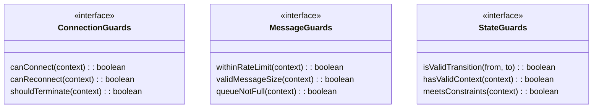

### 2.4 Activity Mappings

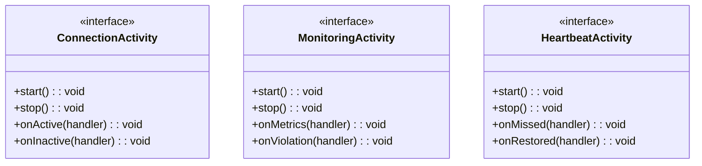

## 3. Xstate Integration Points

### 3.1 Machine Definition Interface

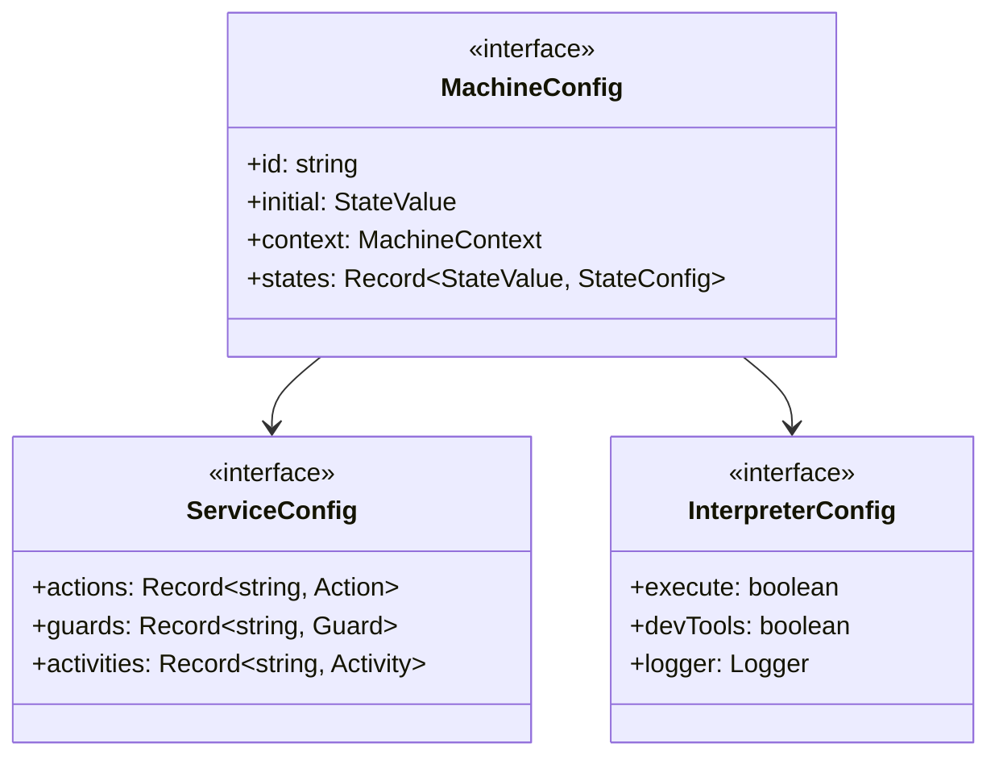

### 3.2 State Machine Integration

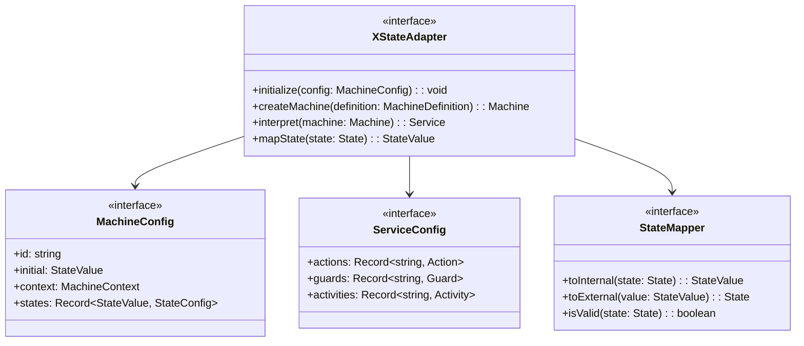

This completes Chapter 1, detailing the State Machine Design. The chapter maps our formal state machine specifications to implementation concepts, covering:

1. Core state machine components and interfaces
2. Event and transition system
3. Action and activity definitions
4. Context management
5. State configurations and mappings
6. Guard system design
7. Integration with xstate v5

Each section uses interface definitions and class diagrams to show relationships, maintaining a conceptual focus without implementation details.

## Chapter 2: WebSocket Protocol Design

### 1. Protocol Components

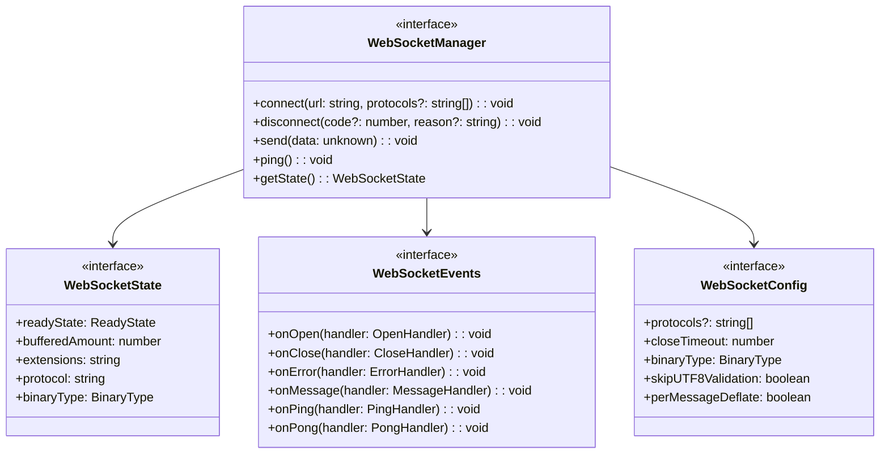

### 2. Protocol Mappings

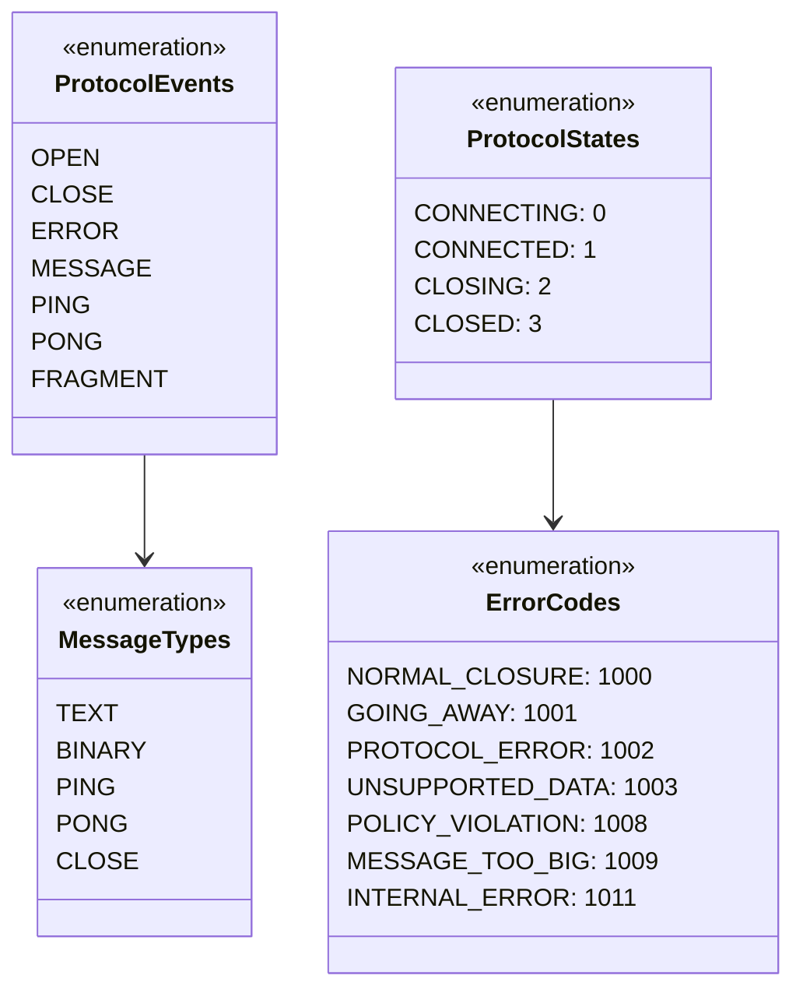

### 3. Event Handling

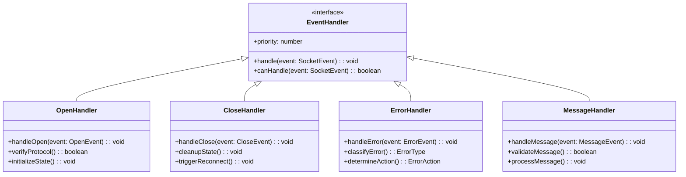

### 4. Connection Management

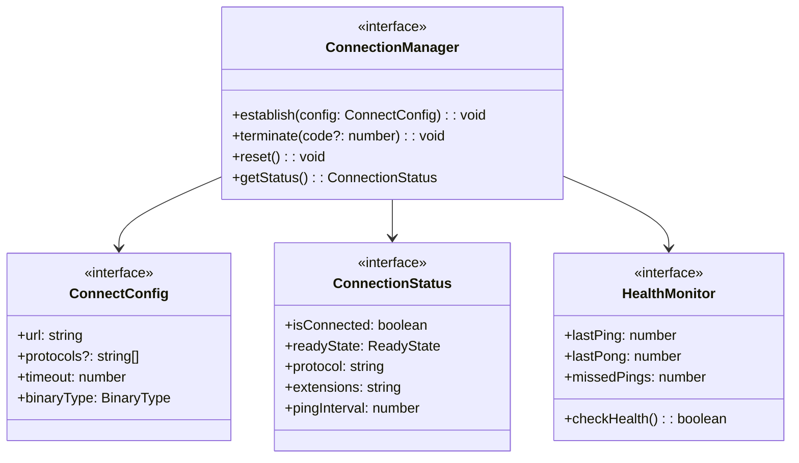

### 5. Error Classification

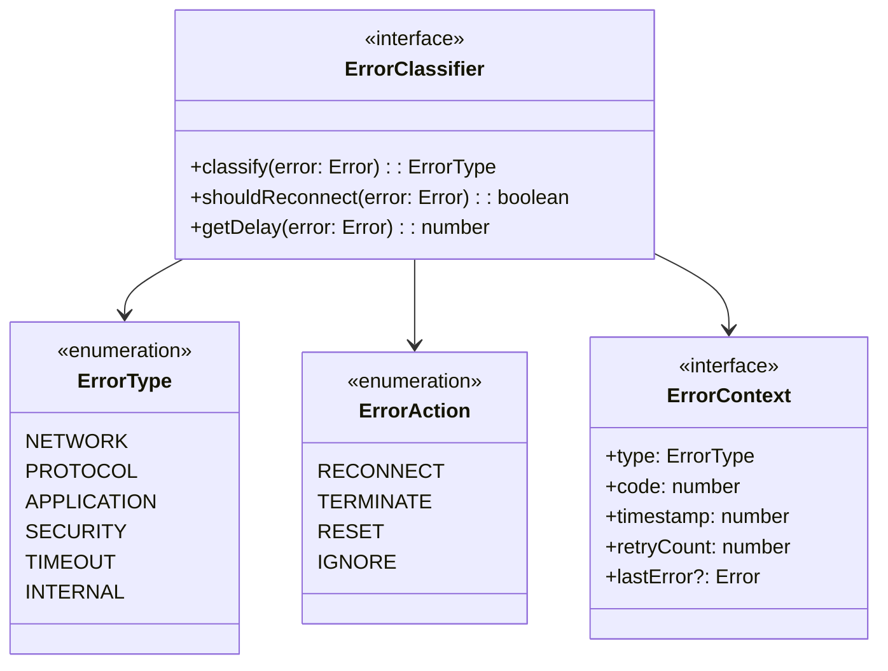

### 6. Protocol Constraints

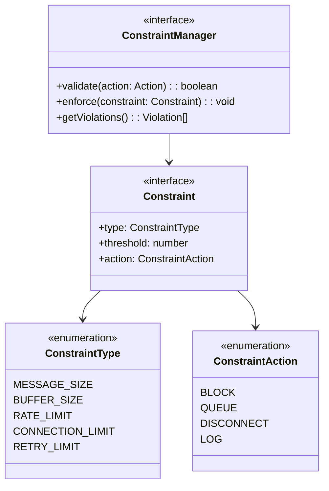

### 7. Integration Points

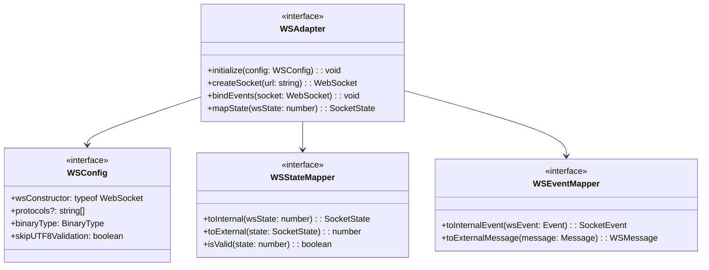

This completes Chapter 2, detailing the WebSocket Protocol Design. The chapter covers:

1. Core protocol components and interfaces
2. Protocol state and event mappings
3. Event handling system
4. Connection management
5. Error handling and classification
6. Protocol constraints and validation
7. Integration with ws library

Each section uses interface definitions and class diagrams to show relationships, maintaining a conceptual focus without implementation details.

## Chapter 3: Message System Design

### 1. Message Components

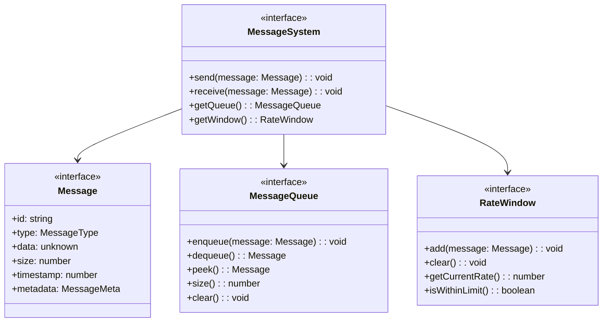

### 2. Queue Management

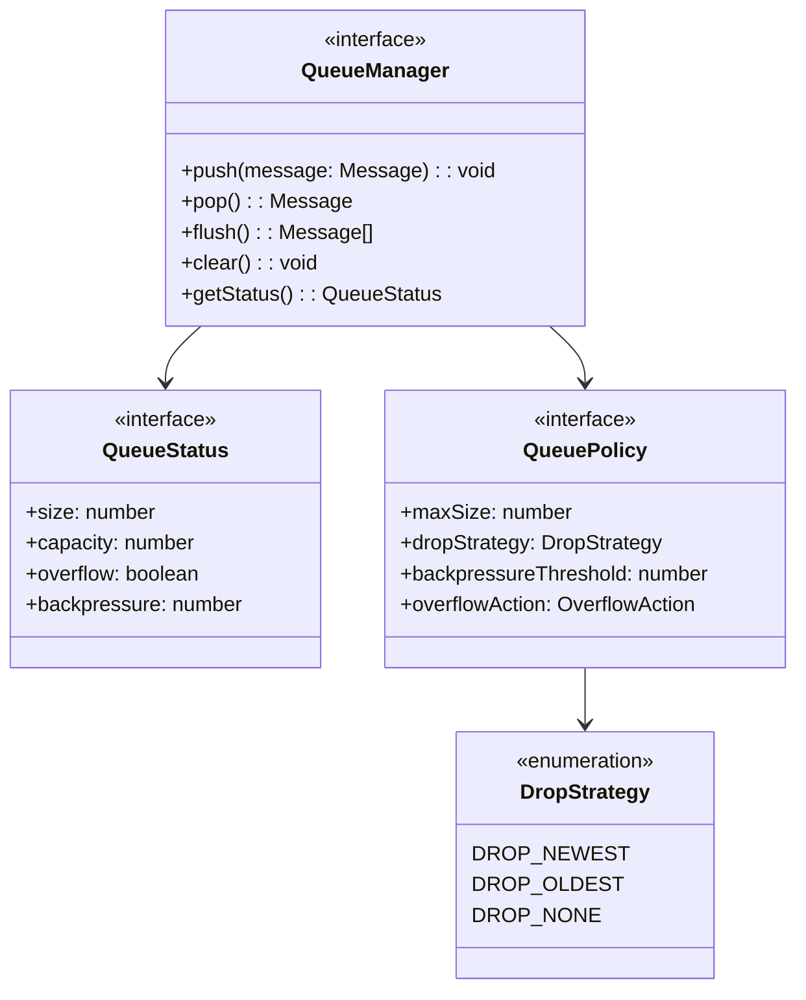

### 3. Rate Limiting

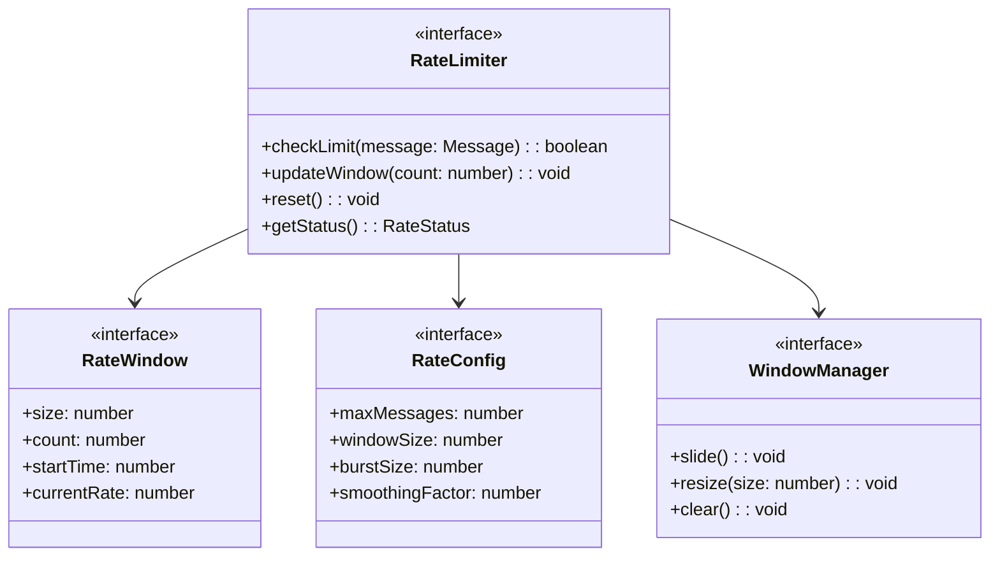

### 4. Message Processing

```mermaid
classDiagram
    class MessageProcessor {
        <<interface>>
        +process(message: Message): void
        +validate(message: Message): boolean
        +transform(message: Message): Message
        +route(message: Message): void
    }

    class MessageValidator {
        <<interface>>
        +validateSize(size: number): boolean
        +validateType(type: MessageType): boolean
        +validateContent(data: unknown): boolean
    }

    class MessageTransformer {
        <<interface>>
        +encode(message: Message): Buffer
        +decode(data: Buffer): Message
        +compress(message: Message): Message
        +decompress(message: Message): Message
    }

    class MessageRouter {
        <<interface>>
        +route(message: Message): void
        +broadcast(message: Message): void
        +publish(topic: string, message: Message): void
    }

    MessageProcessor --> MessageValidator
    MessageProcessor --> MessageTransformer
    MessageProcessor --> MessageRouter
```

### 5. Message Flow Control

```mermaid
classDiagram
    class FlowController {
        <<interface>>
        +control(message: Message): void
        +backpressure(): number
        +getStatus(): FlowStatus
        +reset(): void
    }

    class FlowStrategy {
        <<enumeration>>
        BLOCK
        DROP
        THROTTLE
        BUFFER
    }

    class FlowMetrics {
        <<interface>>
        +inRate: number
        +outRate: number
        +dropRate: number
        +bufferSize: number
    }

    class FlowConfig {
        <<interface>>
        +strategy: FlowStrategy
        +highWaterMark: number
        +lowWaterMark: number
        +timeout: number
    }

    FlowController --> FlowStrategy
    FlowController --> FlowMetrics
    FlowController --> FlowConfig
```

### 6. Message Reliability

```mermaid
classDiagram
    class ReliabilityManager {
        <<interface>>
        +track(message: Message): void
        +acknowledge(id: string): void
        +retry(message: Message): void
        +getStatus(): ReliabilityStatus
    }

    class DeliveryTracker {
        <<interface>>
        +sent: Map~string, SentInfo~
        +received: Map~string, ReceivedInfo~
        +failed: Map~string, FailureInfo~
    }

    class RetryPolicy {
        <<interface>>
        +maxAttempts: number
        +backoff: BackoffStrategy
        +timeout: number
        +jitter: number
    }

    class BackoffStrategy {
        <<enumeration>>
        FIXED
        LINEAR
        EXPONENTIAL
        FIBONACCI
    }

    ReliabilityManager --> DeliveryTracker
    ReliabilityManager --> RetryPolicy
    RetryPolicy --> BackoffStrategy
```

### 7. Integration Points

```mermaid
classDiagram
    class MessageAdapter {
        <<interface>>
        +initialize(config: MessageConfig): void
        +handleIncoming(data: unknown): void
        +prepareOutgoing(message: Message): unknown
        +mapMessageType(type: string): MessageType
    }

    class MessageConfig {
        <<interface>>
        +queueSize: number
        +windowSize: number
        +rateLimit: number
        +reliability: ReliabilityConfig
    }

    class MessageMapper {
        <<interface>>
        +toInternal(data: unknown): Message
        +toExternal(message: Message): unknown
        +isValid(data: unknown): boolean
    }

    class TypeRegistry {
        <<interface>>
        +register(type: string): void
        +lookup(type: string): MessageType
        +validate(type: string): boolean
    }

    MessageAdapter --> MessageConfig
    MessageAdapter --> MessageMapper
    MessageAdapter --> TypeRegistry
```

This chapter maps the formal message handling specifications to implementation concepts, covering:

1. Core message system components
2. Queue management and policies
3. Rate limiting and window management
4. Message processing and validation
5. Flow control strategies
6. Message reliability and tracking
7. Integration with the messaging system

## Chapter 4: Health Monitoring Design

### 1. Health Components

```mermaid
classDiagram
    class HealthMonitor {
        <<interface>>
        +checkHealth(): HealthStatus
        +trackMetrics(): void
        +reportStatus(): void
        +handleAlert(alert: Alert): void
    }

    class HealthStatus {
        <<interface>>
        +isHealthy: boolean
        +readyState: ReadyState
        +lastCheck: number
        +indicators: HealthIndicators
    }

    class HealthIndicators {
        <<interface>>
        +connection: ConnectionHealth
        +messages: MessageHealth
        +performance: PerformanceHealth
        +resources: ResourceHealth
    }

    class Alert {
        <<interface>>
        +type: AlertType
        +severity: AlertSeverity
        +timestamp: number
        +context: AlertContext
    }

    HealthMonitor --> HealthStatus
    HealthStatus --> HealthIndicators
    HealthMonitor --> Alert
```

### 2. Connection Monitoring

```mermaid
classDiagram
    class ConnectionMonitor {
        <<interface>>
        +monitor(): void
        +checkLatency(): number
        +verifyConnection(): boolean
        +getMetrics(): ConnectionMetrics
    }

    class ConnectionMetrics {
        <<interface>>
        +uptime: number
        +disconnects: number
        +reconnects: number
        +latency: MovingAverage
    }

    class HeartbeatMonitor {
        <<interface>>
        +start(): void
        +stop(): void
        +missed(): number
        +lastBeat: number
    }

    class LatencyTracker {
        <<interface>>
        +track(rtt: number): void
        +getStats(): LatencyStats
        +reset(): void
    }

    ConnectionMonitor --> ConnectionMetrics
    ConnectionMonitor --> HeartbeatMonitor
    ConnectionMonitor --> LatencyTracker
```

### 3. Performance Monitoring

```mermaid
classDiagram
    class PerformanceMonitor {
        <<interface>>
        +track(): void
        +measure(metric: Metric): void
        +analyze(): PerformanceReport
        +alert(threshold: Threshold): void
    }

    class PerformanceMetrics {
        <<interface>>
        +messageRate: Rate
        +processTime: Duration
        +queueSize: number
        +backpressure: number
    }

    class ResourceUsage {
        <<interface>>
        +memory: MemoryStats
        +cpu: CPUStats
        +network: NetworkStats
    }

    class Threshold {
        <<interface>>
        +metric: string
        +value: number
        +duration: number
        +action: ThresholdAction
    }

    PerformanceMonitor --> PerformanceMetrics
    PerformanceMonitor --> ResourceUsage
    PerformanceMonitor --> Threshold
```

### 4. Message Monitoring

```mermaid
classDiagram
    class MessageMonitor {
        <<interface>>
        +trackMessages(): void
        +analyzeFlow(): FlowAnalysis
        +detectAnomalies(): void
        +getStats(): MessageStats
    }

    class MessageMetrics {
        <<interface>>
        +sent: Counter
        +received: Counter
        +failed: Counter
        +pending: Counter
    }

    class MessageLatency {
        <<interface>>
        +endToEnd: Histogram
        +processing: Histogram
        +queueing: Histogram
    }

    class MessagePatterns {
        <<interface>>
        +types: Distribution
        +sizes: Distribution
        +timing: TimeSeries
    }

    MessageMonitor --> MessageMetrics
    MessageMonitor --> MessageLatency
    MessageMonitor --> MessagePatterns
```

### 5. Error Tracking

```mermaid
classDiagram
    class ErrorTracker {
        <<interface>>
        +track(error: Error): void
        +analyze(): ErrorAnalysis
        +getHistory(): ErrorHistory
        +clear(): void
    }

    class ErrorMetrics {
        <<interface>>
        +count: number
        +rate: number
        +types: Map~string, number~
        +lastError: Error
    }

    class ErrorPattern {
        <<interface>>
        +frequency: TimeDistribution
        +correlation: CorrelationMatrix
        +impact: ImpactMetrics
    }

    class ErrorClassification {
        <<interface>>
        +type: ErrorType
        +severity: ErrorSeverity
        +category: ErrorCategory
        +context: ErrorContext
    }

    ErrorTracker --> ErrorMetrics
    ErrorTracker --> ErrorPattern
    ErrorTracker --> ErrorClassification
```

### 6. Health Reporting

```mermaid
classDiagram
    class HealthReporter {
        <<interface>>
        +generateReport(): HealthReport
        +streamMetrics(): MetricsStream
        +logStatus(): void
        +alertStatus(): void
    }

    class HealthReport {
        <<interface>>
        +timestamp: number
        +status: HealthStatus
        +metrics: MetricsSnapshot
        +alerts: Alert[]
    }

    class MetricsSnapshot {
        <<interface>>
        +connection: ConnectionMetrics
        +messages: MessageMetrics
        +performance: PerformanceMetrics
        +errors: ErrorMetrics
    }

    class ReportingConfig {
        <<interface>>
        +interval: number
        +format: ReportFormat
        +retention: RetentionPolicy
    }

    HealthReporter --> HealthReport
    HealthReport --> MetricsSnapshot
    HealthReporter --> ReportingConfig
```

### 7. Integration Points

```mermaid
classDiagram
    class HealthAdapter {
        <<interface>>
        +initialize(config: HealthConfig): void
        +attachMonitors(): void
        +startMonitoring(): void
        +stopMonitoring(): void
    }

    class HealthConfig {
        <<interface>>
        +checkInterval: number
        +metrics: MetricsConfig
        +alerts: AlertConfig
        +reporting: ReportConfig
    }

    class MonitorRegistry {
        <<interface>>
        +register(monitor: Monitor): void
        +unregister(monitor: Monitor): void
        +getMonitors(): Monitor[]
    }

    class MetricsMapper {
        <<interface>>
        +mapMetric(name: string): Metric
        +transformValue(value: unknown): number
        +aggregateMetrics(metrics: Metric[]): Stats
    }

    HealthAdapter --> HealthConfig
    HealthAdapter --> MonitorRegistry
    HealthAdapter --> MetricsMapper
```

This chapter maps the health monitoring specifications to implementation concepts, covering:

1. Core health monitoring components
2. Connection monitoring and heartbeats
3. Performance monitoring and thresholds
4. Message flow monitoring
5. Error tracking and analysis
6. Health reporting system
7. Integration with monitoring tools
