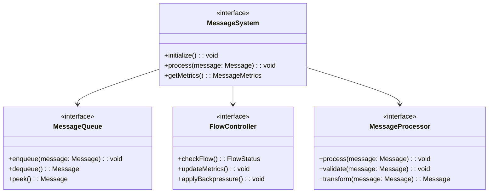
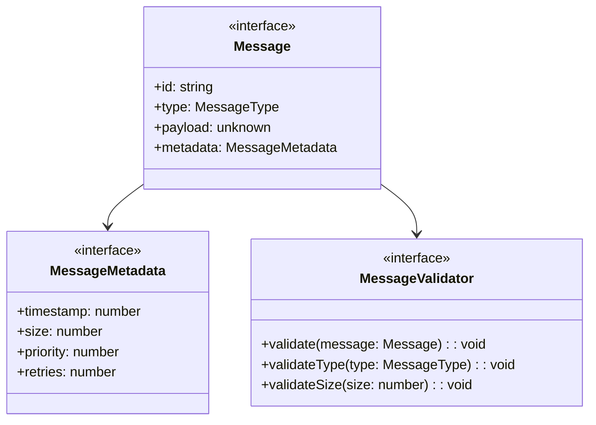
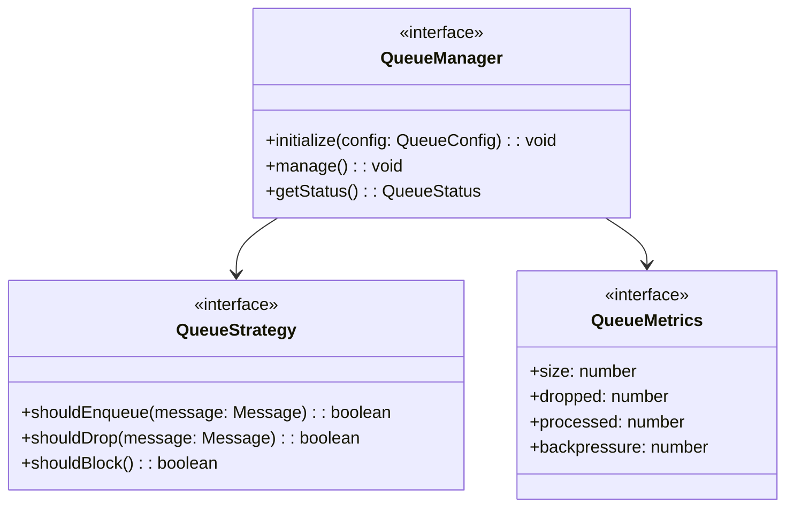
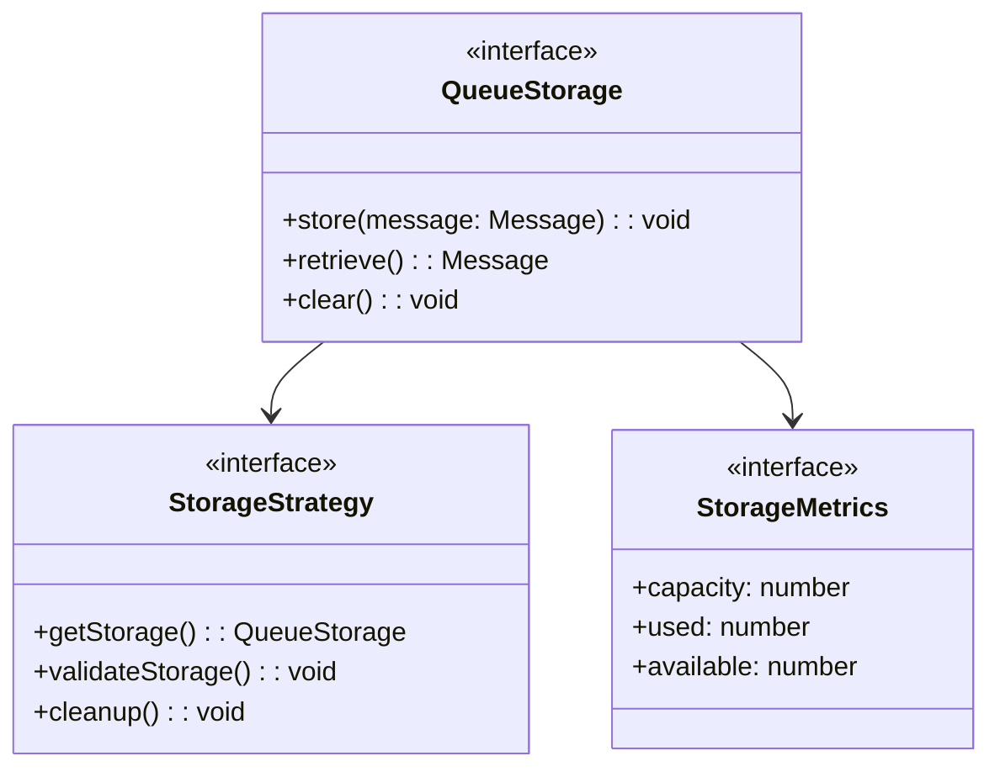
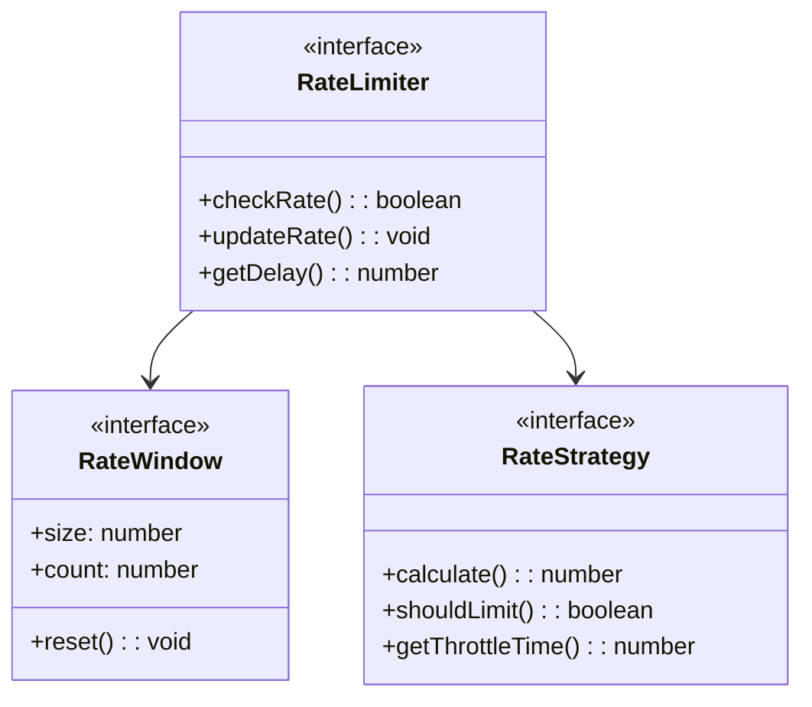
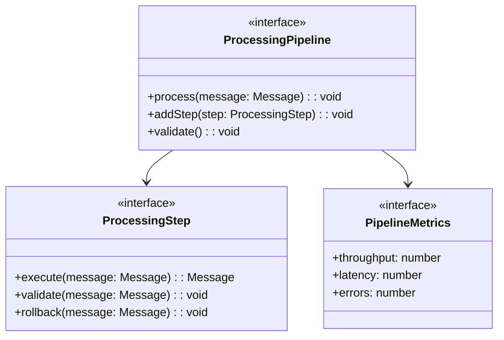
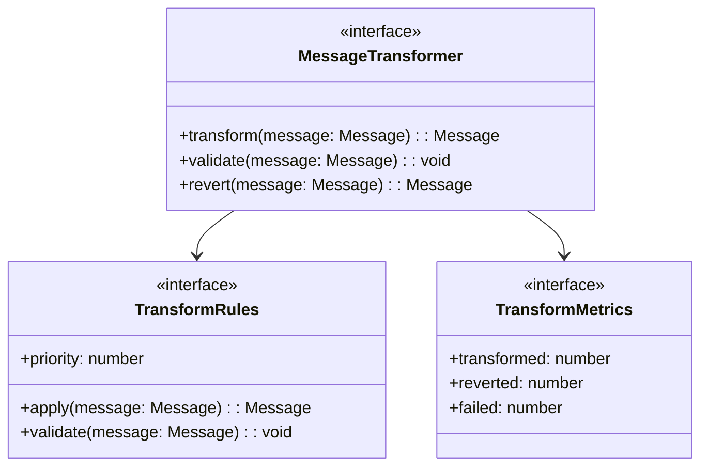
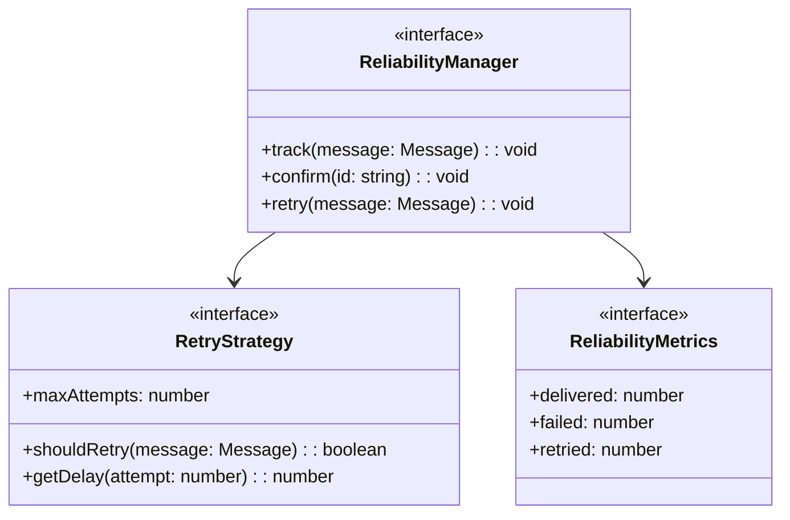
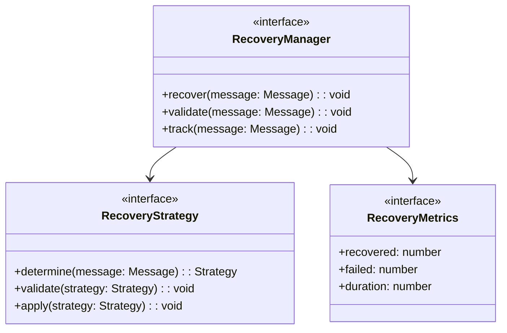

# WebSocket Implementation Design: Message System Components

## Preamble

This document provides detailed message system designs that implement the high-level 
architecture defined in machine.part.2.abstract.md.

### Document Dependencies
This document inherits all dependencies from machine.part.2.abstract.md and additionally requires:

1. `machine.part.2.concrete.core.md`: Core component design
   - Provides state management foundation
   - Defines base interfaces and types
   - Establishes validation patterns

2. `machine.part.2.concrete.protocol.md`: Protocol design
   - Defines protocol constraints
   - Establishes connection handling
   - Provides error classification

### Document Purpose
- Details message handling system
- Defines queuing mechanisms
- Establishes flow control
- Provides reliability guarantees

### Document Scope

This document FOCUSES on:
- Message queuing implementation
- Flow control mechanisms
- Rate limiting systems
- Message processing
- Reliability handling

This document does NOT cover:
- Core state implementations
- Protocol-specific handling
- Monitoring systems
- Configuration management

### Implementation Requirements

1. Code Generation Governance

   - Generated code must maintain formal properties
   - Implementation must follow specified patterns
   - Extensions must use defined mechanisms
   - Changes must preserve core guarantees

2. Verification Requirements

   - Property validation criteria
   - Test coverage requirements
   - Performance constraints
   - Error handling verification

3. Documentation Requirements
   - Implementation mapping documentation
   - Property preservation evidence
   - Extension point documentation
   - Test coverage reporting

### Property Preservation

1. Formal Properties

   - State machine invariants
   - Protocol guarantees
   - Timing constraints
   - Safety properties

2. Implementation Properties

   - Type safety requirements
   - Error handling patterns
   - Extension mechanisms
   - Performance requirements

3. Verification Properties
   - Test coverage criteria
   - Validation requirements
   - Monitoring needs
   - Documentation standards
   
## 1. Message System Architecture

### 1.1 Core Message Components

Message system must:
1. Provide reliable message handling
2. Maintain message ordering
3. Control message flow
4. Track message metrics

### 1.2 Message Structure

Message handling must:
1. Ensure message integrity
2. Validate message format
3. Track message metadata
4. Support message priorities

## 2. Queue Management Requirements

### 2.1 Queue Operations

Queue management must:
1. Handle message queuing
2. Apply backpressure
3. Track queue metrics
4. Implement drop policies

### 2.2 Queue Storage

Storage must:
1. Manage memory efficiently
2. Implement storage limits
3. Handle cleanup
4. Track storage metrics

## 3. Flow Control Requirements

### 3.1 Rate Limiting

Rate limiting must:
1. Control message rates
2. Implement windows
3. Calculate delays
4. Track throughput

### 3.2 Backpressure Management

Backpressure must:
1. Calculate pressure levels
2. Apply backpressure
3. Track metrics
4. Handle thresholds

## 4. Message Processing Requirements

### 4.1 Processing Pipeline

Processing must:
1. Handle message transformation
2. Support pipeline steps
3. Enable validation
4. Track metrics

### 4.2 Message Transformation

Transformation must:
1. Apply transform rules
2. Validate results
3. Support reversion
4. Track statistics

## 5. Reliability Requirements

### 5.1 Message Reliability

Reliability must:
1. Track message delivery
2. Handle retries
3. Confirm delivery
4. Monitor failures

### 5.2 Message Recovery

Recovery must:
1. Handle message recovery
2. Apply strategies
3. Track recovery
4. Monitor success

## 6. Performance Requirements

### 6.1 Performance Criteria
Must meet:
1. Throughput targets
   - Messages per second
   - Bytes per second
   - Queue operations
   - Processing time

2. Latency targets
   - Queue operations
   - Processing time
   - Transform time
   - Recovery time

3. Resource usage
   - Memory limits
   - CPU utilization
   - Queue size
   - Buffer usage

### 6.2 Performance Monitoring
Must track:
1. Message metrics
   - Queue size
   - Processing rate
   - Error rate
   - Recovery rate

2. System metrics
   - Memory usage
   - CPU usage
   - Thread usage
   - I/O operations

3. Time metrics
   - Processing time
   - Queue time
   - Transform time
   - Recovery time

## 7. Implementation Verification

### 7.1 Functional Testing
Must verify:
1. Message handling
   - Queue operations
   - Processing steps
   - Transformations
   - Recovery processes

2. Flow control
   - Rate limiting
   - Backpressure
   - Drop policies
   - Queue limits

3. Reliability
   - Message delivery
   - Recovery processes
   - Retry handling
   - Error recovery

### 7.2 Performance Testing
Must verify:
1. Throughput tests
   - Maximum rate
   - Sustained rate
   - Burst handling
   - Recovery time

2. Latency tests
   - Processing time
   - Queue time
   - Transform time
   - Recovery time

3. Resource tests
   - Memory usage
   - CPU usage
   - Queue size
   - Buffer usage