# WebSocket Implementation Design: Monitoring System Components

## Preamble

This document provides detailed monitoring system designs that implement the high-level 
architecture defined in machine.part.2.abstract.md.

### Document Dependencies
This document inherits all dependencies from machine.part.2.abstract.md and additionally requires:

1. `machine.part.2.concrete.core.md`: Core component design
   - Provides state tracking foundation
   - Defines base interfaces and types
   - Establishes validation patterns

2. `machine.part.2.concrete.protocol.md`: Protocol design
   - Defines connection states
   - Establishes error patterns
   - Provides health check interfaces

3. `machine.part.2.concrete.message.md`: Message system design
   - Defines message flow metrics
   - Establishes queue monitoring
   - Provides performance tracking

### Document Purpose
- Details health monitoring system
- Defines performance tracking
- Establishes metrics collection
- Provides reporting framework

### Document Scope

This document FOCUSES on:
- Health check implementation
- Performance monitoring
- Error tracking systems
- Metrics collection
- Status reporting

This document does NOT cover:
- Core state implementations
- Protocol-specific handling
- Message system internals
- Configuration details

### Implementation Requirements

1. Code Generation Governance

   - Generated code must maintain formal properties
   - Implementation must follow specified patterns
   - Extensions must use defined mechanisms
   - Changes must preserve core guarantees

2. Verification Requirements

   - Property validation criteria
   - Test coverage requirements
   - Performance constraints
   - Error handling verification

3. Documentation Requirements
   - Implementation mapping documentation
   - Property preservation evidence
   - Extension point documentation
   - Test coverage reporting

### Property Preservation

1. Formal Properties

   - State machine invariants
   - Protocol guarantees
   - Timing constraints
   - Safety properties

2. Implementation Properties

   - Type safety requirements
   - Error handling patterns
   - Extension mechanisms
   - Performance requirements

3. Verification Properties
   - Test coverage criteria
   - Validation requirements
   - Monitoring needs
   - Documentation standards
 
## 1. Monitoring System Architecture

### 1.1 Core Monitoring Components
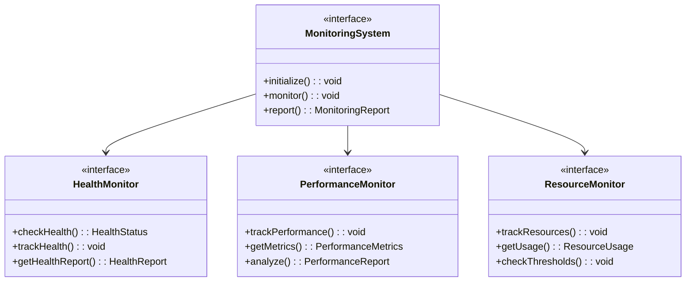

Monitoring system must:
1. Track system health
2. Monitor performance
3. Track resource usage
4. Generate reports

### 1.2 Monitoring Structure
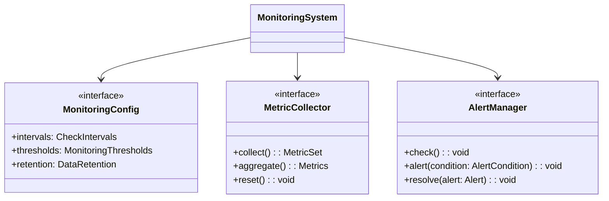

System must:
1. Configurable monitoring
2. Metric collection
3. Alert management
4. Data retention

## 2. Health Monitoring Requirements

### 2.1 Component Health
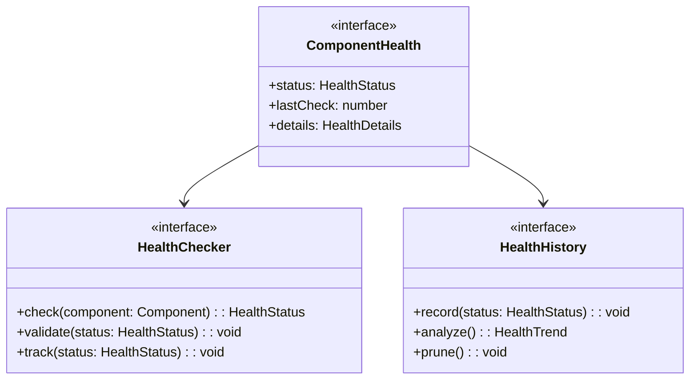

Health monitoring must:
1. Check component health
2. Track health history
3. Analyze trends
4. Generate alerts

### 2.2 Health Metrics
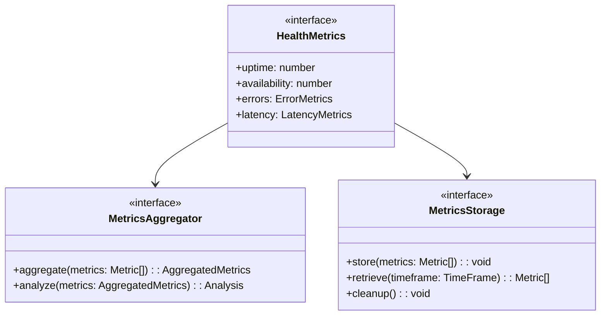

Metrics must:
1. Track health metrics
2. Aggregate data
3. Store history
4. Enable analysis

## 3. Performance Monitoring Requirements

### 3.1 Performance Tracking
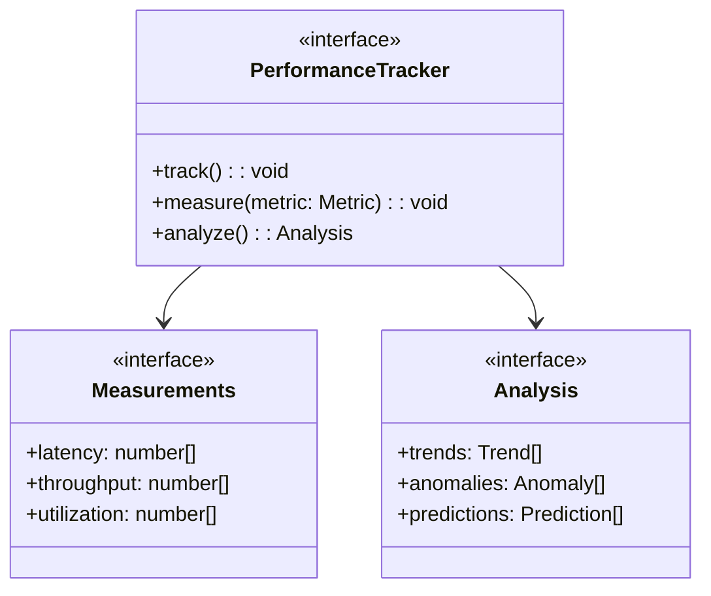

Performance tracking must:
1. Measure metrics
2. Analyze trends
3. Detect anomalies
4. Make predictions

### 3.2 Resource Monitoring
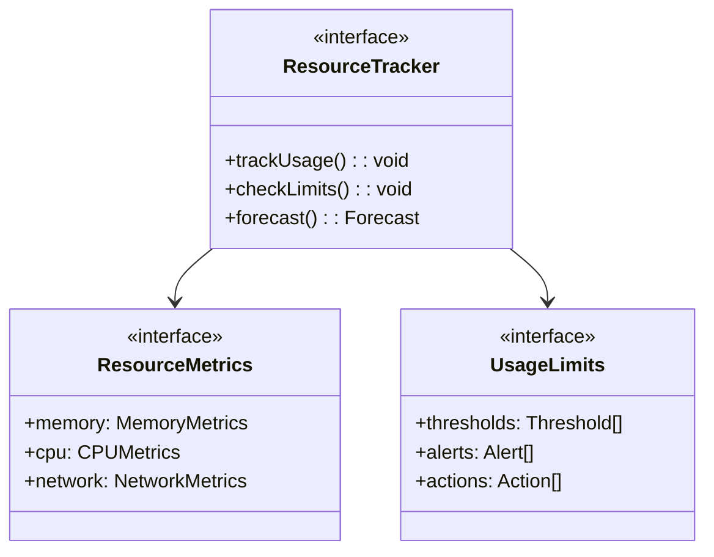

Resource monitoring must:
1. Track usage
2. Check limits
3. Generate alerts
4. Forecast needs

## 4. Connection Monitoring Requirements

### 4.1 Connection Tracking
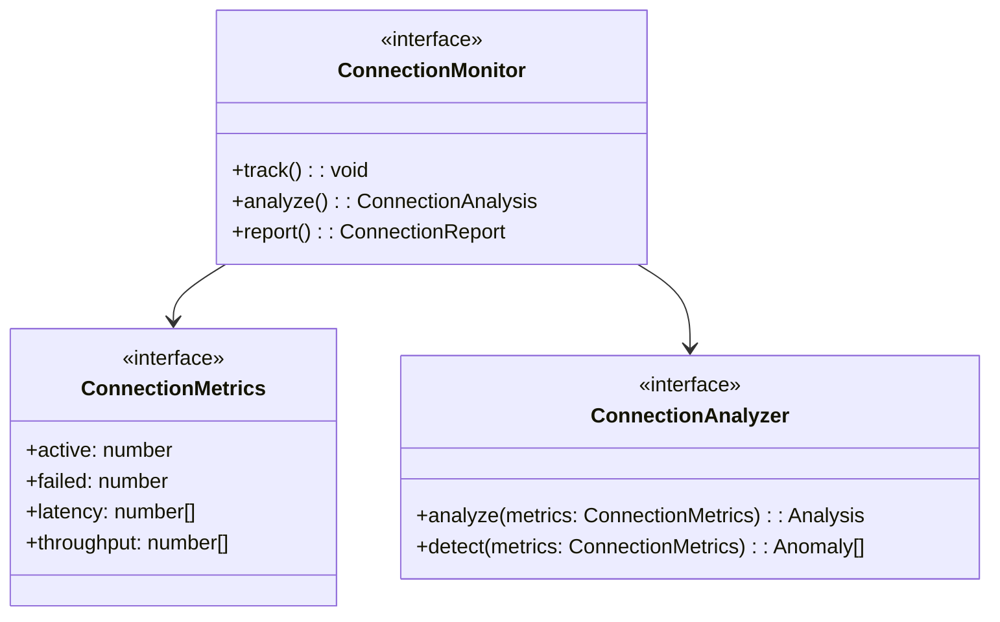

Connection monitoring must:
1. Track connections
2. Measure latency
3. Analyze patterns
4. Detect issues

### 4.2 Protocol Monitoring
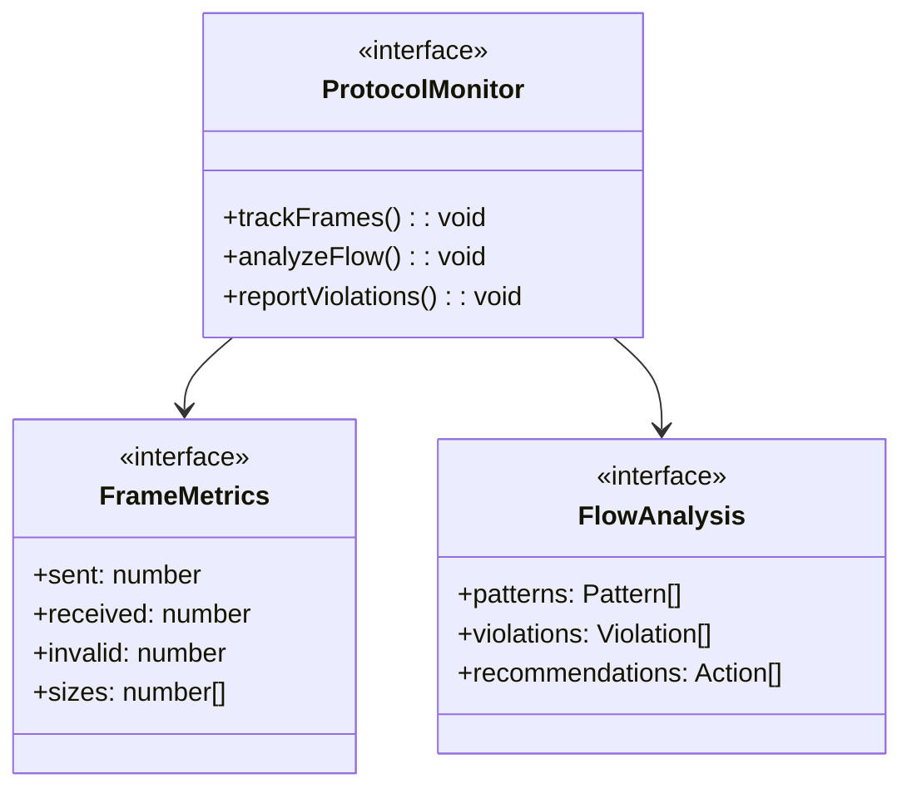

Protocol monitoring must:
1. Track frames
2. Analyze flow
3. Detect violations
4. Recommend actions

## 5. Message Monitoring Requirements

### 5.1 Message Tracking
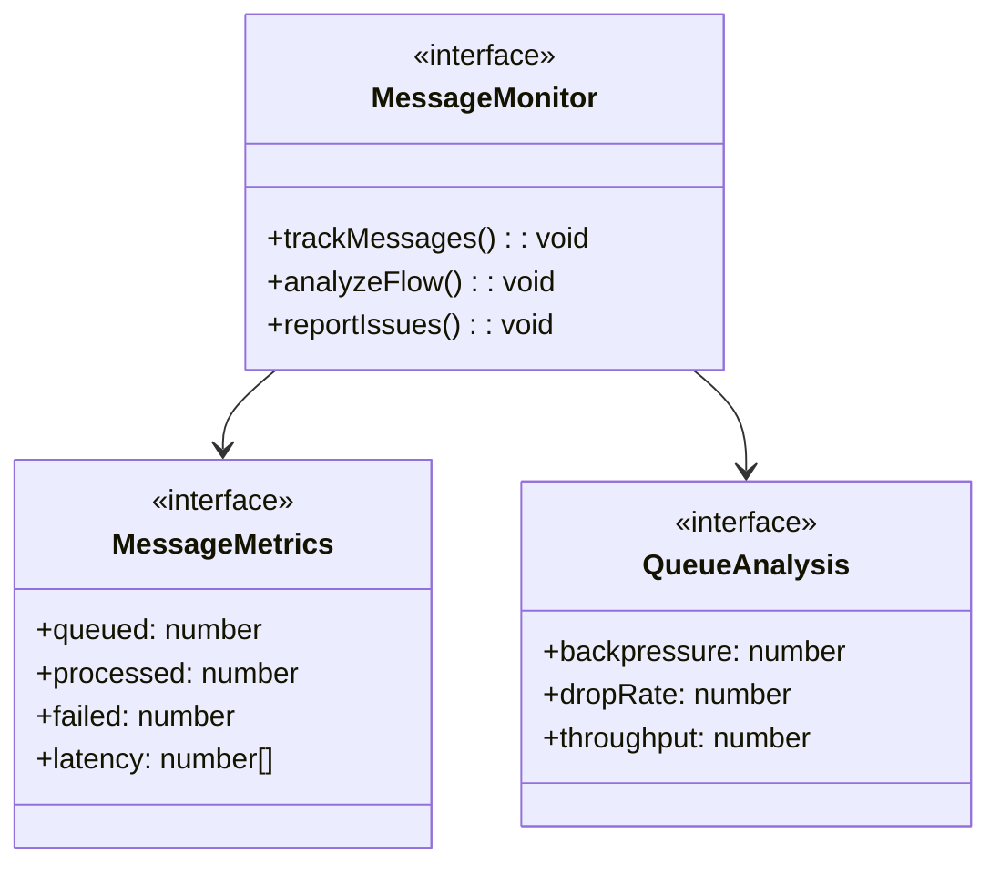

Message monitoring must:
1. Track messages
2. Analyze queues
3. Measure flow
4. Report issues

### 5.2 Flow Monitoring
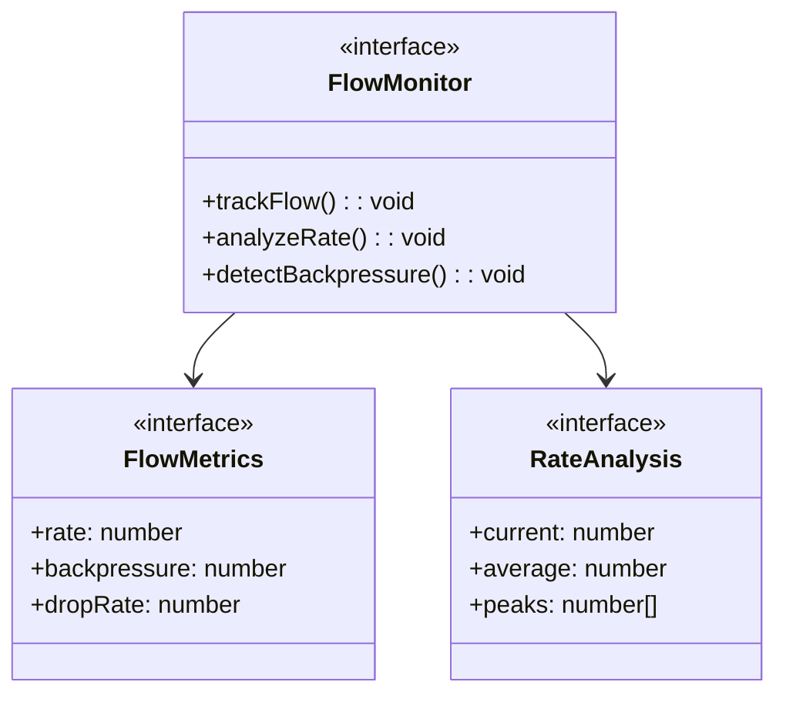

Flow monitoring must:
1. Track rates
2. Measure backpressure
3. Analyze patterns
4. Detect issues

## 6. Error Monitoring Requirements

### 6.1 Error Tracking
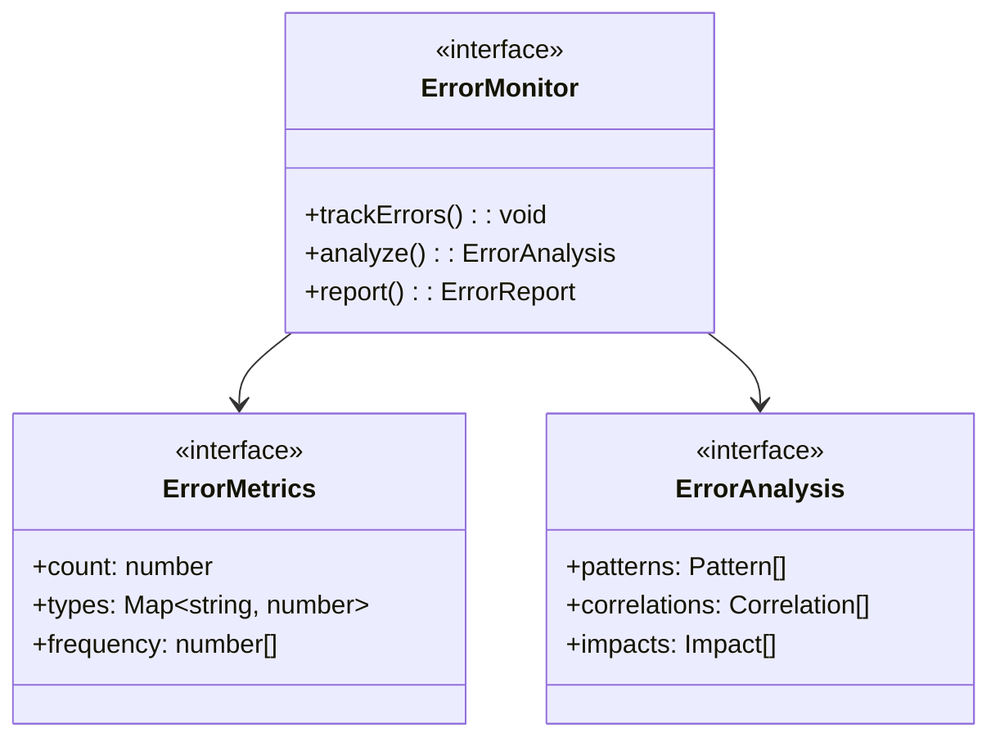

Error monitoring must:
1. Track errors
2. Analyze patterns
3. Measure impact
4. Generate reports

### 6.2 Recovery Monitoring
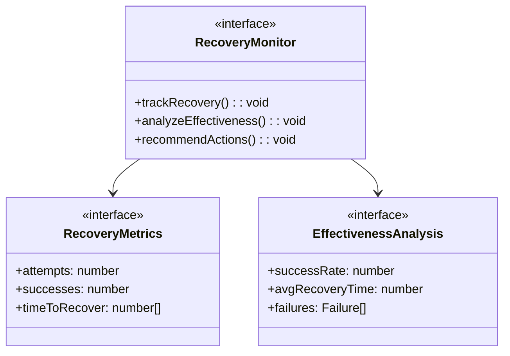

Recovery monitoring must:
1. Track attempts
2. Measure success
3. Analyze effectiveness
4. Recommend improvements

## 7. Implementation Verification

### 7.1 Monitoring Verification
Must verify:
1. Data collection
   - Metric accuracy
   - Collection frequency
   - Data completeness
   - Storage integrity

2. Analysis accuracy
   - Calculation correctness
   - Trend detection
   - Anomaly detection
   - Prediction accuracy

3. Alert system
   - Trigger accuracy
   - Alert delivery
   - Resolution tracking
   - Escalation paths

### 7.2 Performance Impact
Must verify:
1. Overhead limits
   - CPU usage
   - Memory usage
   - Network usage
   - Storage usage

2. Impact thresholds
   - Collection impact
   - Analysis impact
   - Storage impact
   - Alert impact

## 8. Security Requirements

### 8.1 Data Protection
Must implement:
1. Metric security
   - Data encryption
   - Access control
   - Audit logging
   - Data retention

2. Alert security
   - Authentication
   - Authorization
   - Secure delivery
   - Audit trails

### 8.2 Privacy Requirements
Must ensure:
1. Data privacy
   - PII protection
   - Data anonymization
   - Access controls
   - Retention limits

2. Compliance
   - Regulatory compliance
   - Data governance
   - Audit requirements
   - Reporting standards