# WebSocket System Specification

## 1. System Architecture

### 1.1 System Context (C4 Level 1)
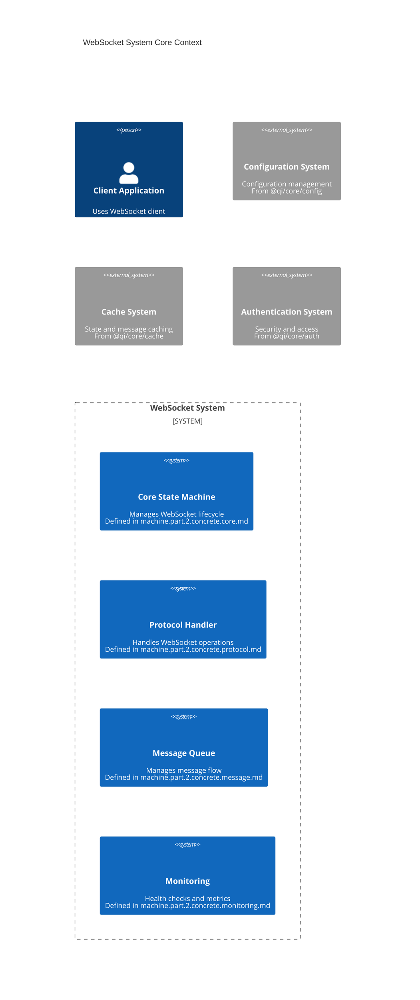

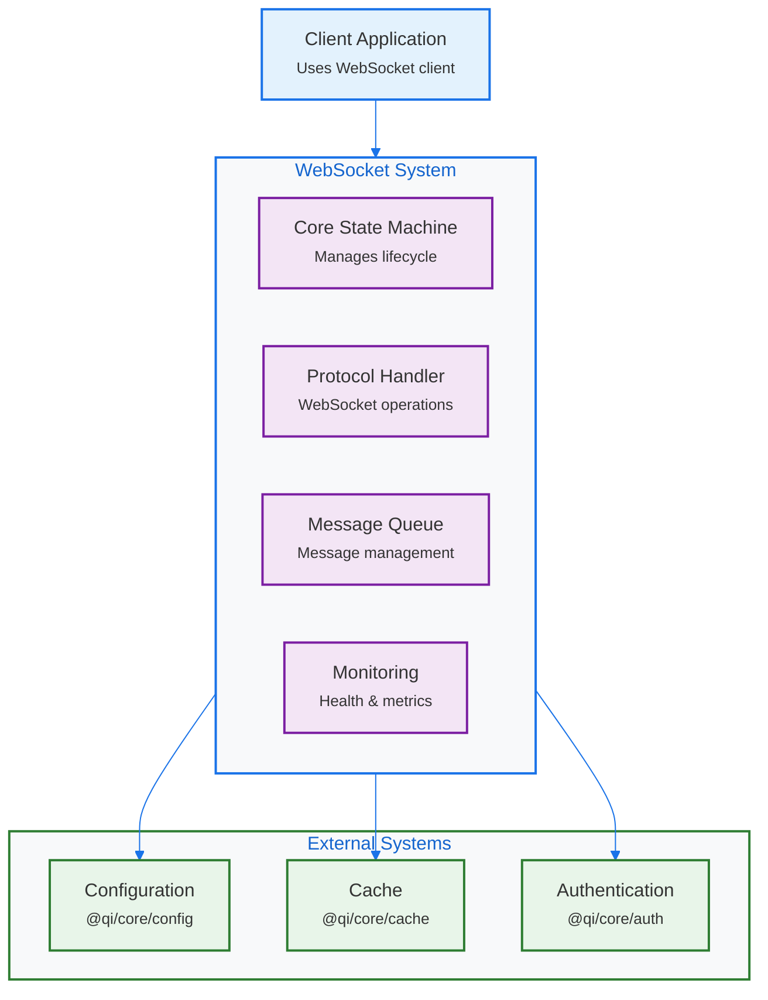

### 1.2 Cross-Component Dependencies
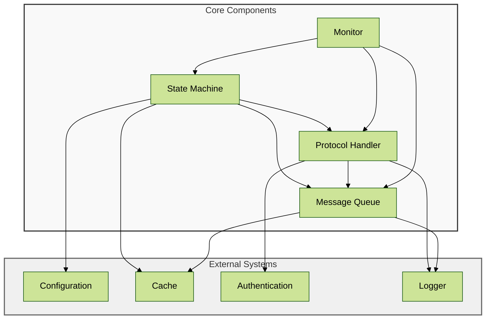

### 1.3 Security Boundaries
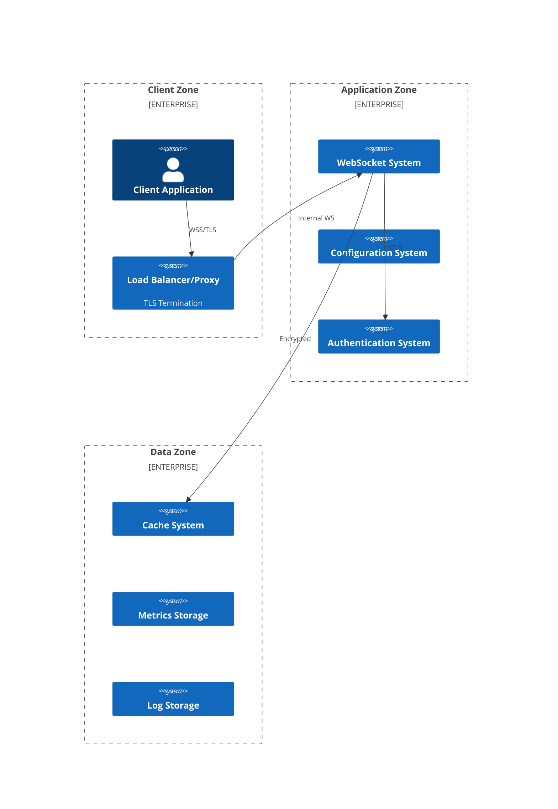

## 2. Document Dependencies

### 2.1 Core Document Structure
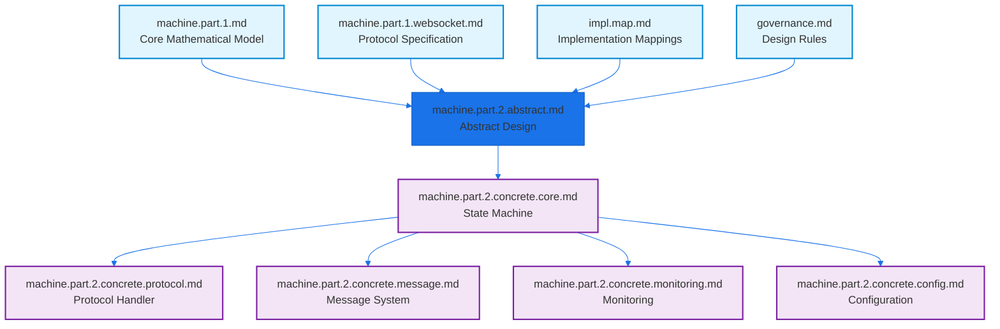

### 2.2 Version Strategy
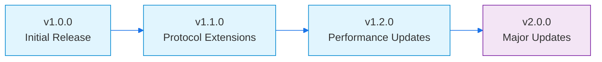

## 3. Component Integration

### 3.1 Core State Machine Integration
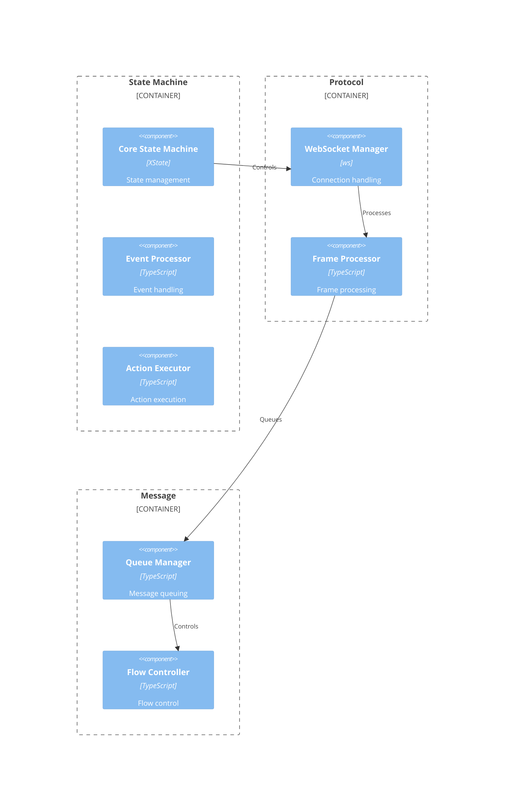

### 3.2 Implementation Bridges

#### State Machine Bridge
```typescript
interface StateMachineBridge {
    // Maps mathematical model to implementation
    stateMapping: Map<FormalState, ImplementationState>;
    eventMapping: Map<FormalEvent, ImplementationEvent>;
    actionMapping: Map<FormalAction, ImplementationAction>;
    
    // Property preservation
    validateStateInvariants(state: State): boolean;
    validateTransition(from: State, to: State): boolean;
    validateContext(context: Context): boolean;
}
```

#### Protocol Bridge
```typescript
interface ProtocolBridge {
    // Protocol state mapping
    protocolStateMapping: Map<CoreState, ProtocolState>;
    
    // Message handling
    frameHandlerMapping: Map<Opcode, FrameHandler>;
    extensionMapping: Map<string, ExtensionHandler>;
    
    // Validation
    validateProtocolState(state: ProtocolState): boolean;
    validateFrame(frame: Frame): boolean;
}
```

## 4. Deployment Architecture

### 4.1 Production Environment
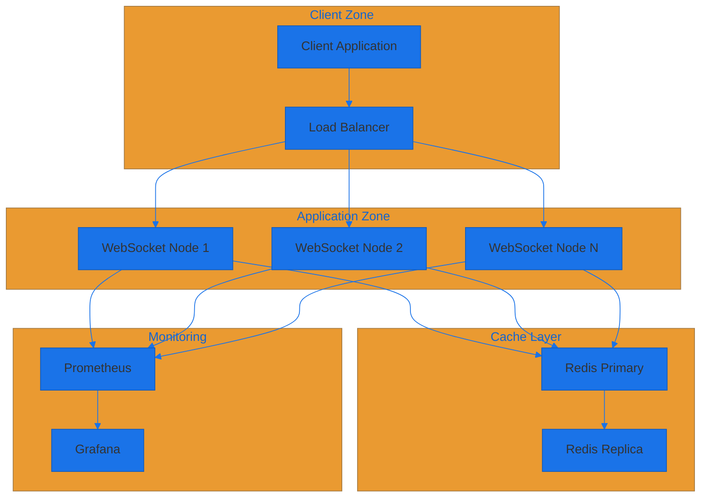

### 4.2 Development Environment
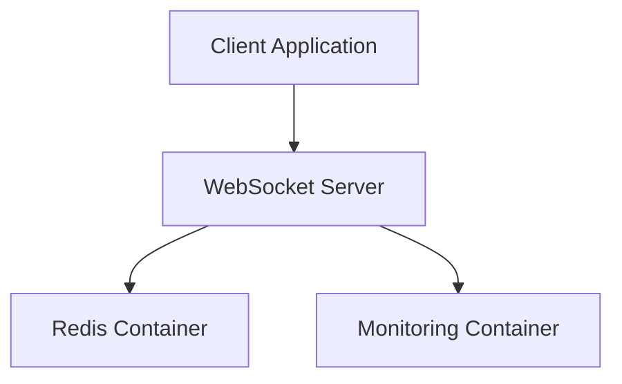

## 5. Implementation Process

### 5.1 Development Phases
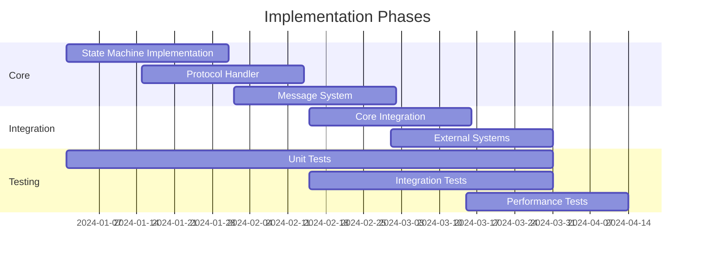

### 5.2 Migration Strategy
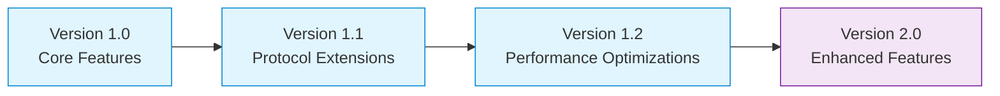

## 6. Governance Requirements

### 6.1 Core Stability Rules
- Immutable core components
- Property-preserving changes
- Backward compatibility
- Version control strategy

### 6.2 Documentation Requirements
- Implementation mappings
- Property preservation proofs
- API documentation
- Integration guides

### 6.3 Testing Requirements
- Property-based testing
- Integration testing
- Performance benchmarks
- Security verification

### 6.4 Release Process
- Version control
- Change management
- Review requirements
- Deployment validation

## 7. Core Integration Points

### 7.1 Cache Integration (@qi/core/cache)
- State caching strategy
- Message caching policy
- Cache invalidation rules
- Performance considerations

### 7.2 Configuration (@qi/core/config)
- Schema validation rules
- Environment handling
- Dynamic reconfiguration
- Default configurations

### 7.3 Error Handling (@qi/core/errors)
- Error code mapping
- Recovery strategies
- Error propagation
- Logging integration

### 7.4 Authentication (@qi/core/auth)
- Authentication flow
- Token handling
- Permission validation
- Security boundaries

## 8. Security Framework

### 8.1 Network Security
- TLS/WSS requirements
- Certificate management
- Proxy configuration
- Network isolation

### 8.2 Application Security
- Input validation
- Rate limiting
- DOS prevention
- Resource protection

### 8.3 Data Security
- Message encryption
- State protection
- Cache security
- Audit logging