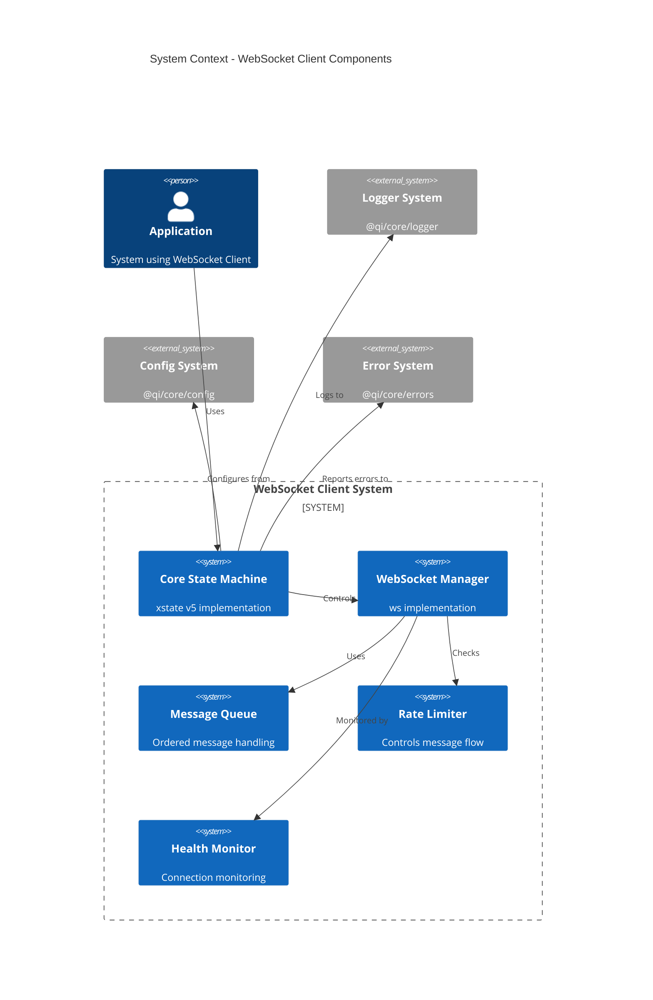
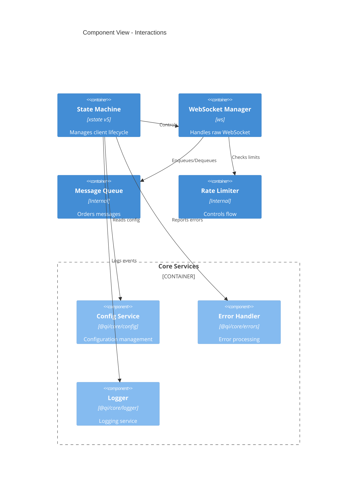

# WebSocket Client Implementation Design & Guide

## Chapter 1: Design

This implementation design follows the stability and governance guidelines defined in `governance.md`. All implementation decisions must comply with these guidelines to ensure system stability and maintainability.

### 1.1 Component Architecture



### 1.2 Component Interactions



### 1.3 Directory Structure

```
src/
├── core/
│   ├── StateMachine.ts           # xstate v5 implementation
│   ├── WebSocketManager.ts       # ws implementation
│   ├── MessageQueue.ts           # Queue implementation
│   ├── RateLimiter.ts           # Rate limiting
│   └── HealthMonitor.ts          # Health checking
│
├── types/
│   ├── index.ts                  # Type exports
│   ├── states.ts                 # State definitions
│   ├── events.ts                 # Event definitions
│   ├── messages.ts               # Message types
│   └── config.ts                 # Configuration types
│
├── services/
│   ├── retry/                    # Retry mechanism
│   │   ├── strategy.ts
│   │   └── backoff.ts
│   └── validation/               # Message validation
│       └── schema.ts
│
├── utils/
│   ├── logger.ts                 # Logging utilities
│   ├── errors.ts                 # Error utilities
│   └── constants.ts              # Constants
│
└── index.ts                      # Main entry point
```

### 1.4 Component Specifications

#### State Machine (Using xstate v5)
- Implements core state logic defined in formal spec
- Manages connection lifecycle
- Handles events and transitions
- Uses context for configuration and state data

#### WebSocket Manager
- Wraps ws library
- Handles raw socket operations
- Manages connection lifecycle
- Implements retry logic

#### Message Queue
- Implements FIFO queue
- Ensures message ordering
- Handles overflow conditions
- Maintains delivery guarantees

#### Rate Limiter
- Implements sliding window
- Enforces rate limits
- Handles backpressure
- Manages window lifecycle

## Chapter 2: Implementation Guide

### 2.1 Core Dependencies

```json
{
  "dependencies": {
    "ws": "^8.0.0",
    "xstate": "^5.0.0",
    "@qi/core": "workspace:*"
  }
}
```

### 2.2 Key Implementation Rules

1. **State Machine Implementation**
   ```typescript
   import { createMachine } from 'xstate';
   
   export const websocketMachine = createMachine({
     id: 'websocket',
     initial: 'disconnected',
     context: {
       // State machine context
     },
     states: {
       // State definitions
     }
   });
   ```

2. **WebSocket Manager**
   ```typescript
   import { WebSocket } from 'ws';
   import { logger } from '@qi/core/logger';
   
   export class WebSocketManager {
     private socket: WebSocket | null = null;
     
     constructor(private readonly config: WebSocketConfig) {}
     
     // Implementation
   }
   ```

3. **Error Handling**
   ```typescript
   import { ApplicationError, ErrorCode } from '@qi/core/errors';
   
   // Use structured error handling
   throw new ApplicationError(
     'Connection failed',
     ErrorCode.CONNECTION_ERROR,
     500,
     { details: error.message }
   );
   ```

4. **Configuration**
   ```typescript
   import { ConfigLoader } from '@qi/core/config';
   
   const config = await ConfigLoader.load('websocket.config.json');
   ```

### 2.3 Integration Points

1. **State Machine Integration**
   - Use xstate v5 service pattern
   - Implement state machine interpreters
   - Handle state transitions

2. **Error Handling Integration**
   - Use @qi/core/errors for all errors
   - Maintain error hierarchy
   - Implement error recovery

3. **Logging Integration**
   - Use @qi/core/logger consistently
   - Log appropriate levels
   - Include context in logs

4. **Configuration Integration**
   - Use @qi/core/config for all configs
   - Implement config validation
   - Handle config updates

### 2.4 Testing Strategy

1. **Unit Tests**
   - State machine transitions
   - Message queue operations
   - Rate limiter functionality

2. **Integration Tests**
   - End-to-end connection flow
   - Message delivery guarantees
   - Error recovery scenarios

3. **Performance Tests**
   - Message throughput
   - Connection handling
   - Memory usage

### 2.5 Development Guidelines

1. **Code Organization**
   - Follow directory structure
   - Maintain clean interfaces
   - Use consistent patterns

2. **State Management**
   - Use xstate v5 features
   - Maintain state invariants
   - Handle edge cases

3. **Error Handling**
   - Use structured errors
   - Implement recovery
   - Log appropriately

4. **Performance Considerations**
   - Optimize message handling
   - Manage memory usage
   - Handle backpressure
