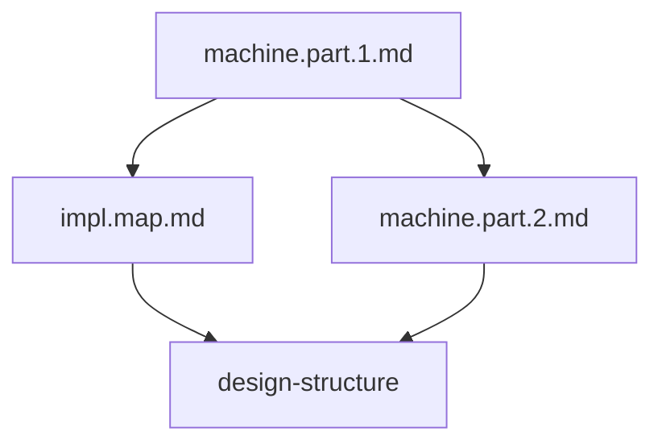

# Documentation Organization

## 1. Document Hierarchy

```
WebSocket Client System
├── Formal Specification (machine.part.1.md)
│   ├── Core Definitions
│   │   └── System tuple 𝒲 = (S, E, δ, s₀, C, γ, F)
│   ├── State Machine Properties
│   └── System Properties
│
├── Implementation Design (machine.part.2.md)
│   ├── Component Architecture (C4)
│   ├── Directory Structure
│   └── Implementation Guidelines
│
├── Implementation Mapping (impl.map.md)
│   ├── State Space Mapping
│   ├── Event Space Mapping
│   ├── Context Mapping
│   └── Property Mapping
│
├── Implementation Plan (impl.plan.md)
│   ├── Core State Machine
│   ├── WebSocket Manager
│   ├── Message Queue
│   └── Rate Limiter
│
├── Governance Guidelines (governance.md)
│   ├── AI Engineering Insights
│   │   ├── Optimality vs Stability
│   │   ├── Documentation Balance
│   │   └── Engineering Process
│   ├── Stability Rules
│   │   ├── Fixed Core Elements
│   │   ├── Extension Points
│   │   └── Change Management
│   ├── Implementation Guidelines
│   │   ├── Component Boundaries
│   │   ├── Extension Mechanisms
│   │   └── Configuration Rules
│   └── Review Process
│       ├── Change Checklist
│       ├── Testing Requirements
│       └── Documentation Requirements
│
└── System Structure (design-structure)
    ├── Component Organization
    ├── Directory Layout
    ├── Interaction Patterns
    └── Stability Rules
```

## 2. Cross-Document Mappings

### State Machine
- **Formal Spec**: Defines $S = \{disconnected, connecting, connected, reconnecting\}$
- **Implementation Design**: Maps to xstate machine structure
- **Directory Location**: `/core/state/`

### Event System
- **Formal Spec**: Defines $E$ as event space
- **Implementation Design**: Maps to handler system
- **Directory Location**: `/core/events/`

### WebSocket Operations
- **Formal Spec**: Defined in transition function $δ$
- **Implementation Design**: Maps to WebSocket Manager
- **Directory Location**: `/core/socket/`

### Message System
- **Formal Spec**: Part of context space $C$
- **Implementation Design**: Maps to Message Queue
- **Directory Location**: `/core/queue/`

## 3. Document Dependencies



## 4. Stability Enforcement

### Fixed Elements (Defined in Formal Spec)
- Core states
- Basic transitions
- System invariants
- Safety properties

### Implementation Guidelines (From Design)
- Component boundaries
- Extension points
- Directory structure
- Interaction patterns

### Mapping Rules (From impl.map)
- State mappings
- Event mappings
- Context mappings
- Property preservation

## 5. Document Purposes

### machine.part.1.md
- Defines mathematical foundation
- Establishes core properties
- Sets system boundaries

### machine.part.2.md
- Maps math to components
- Defines implementation structure
- Provides architectural guidance

### impl.map.md
- Links formal spec to implementation
- Ensures property preservation
- Defines mapping rules

### design-structure
- Organizes implementation
- Defines component interactions
- Establishes stability rules

## 6. Change Management

### Formal Changes
1. Update machine.part.1.md
2. Reflect in impl.map.md
3. Update design-structure

### Implementation Changes
1. Check against machine.part.2.md
2. Verify with impl.map.md
3. Follow design-structure rules

### Extension Changes
1. Verify against formal spec
2. Follow design guidelines
3. Maintain stability rules