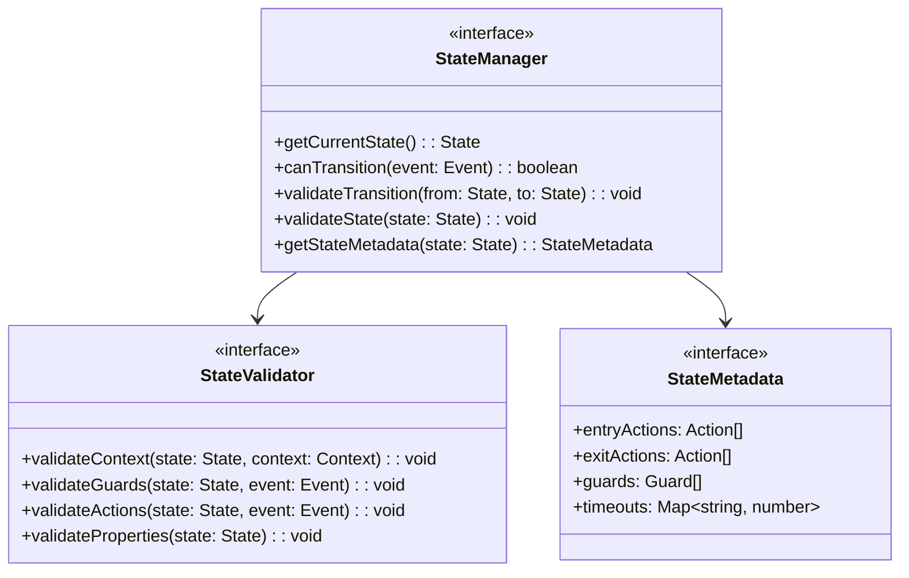
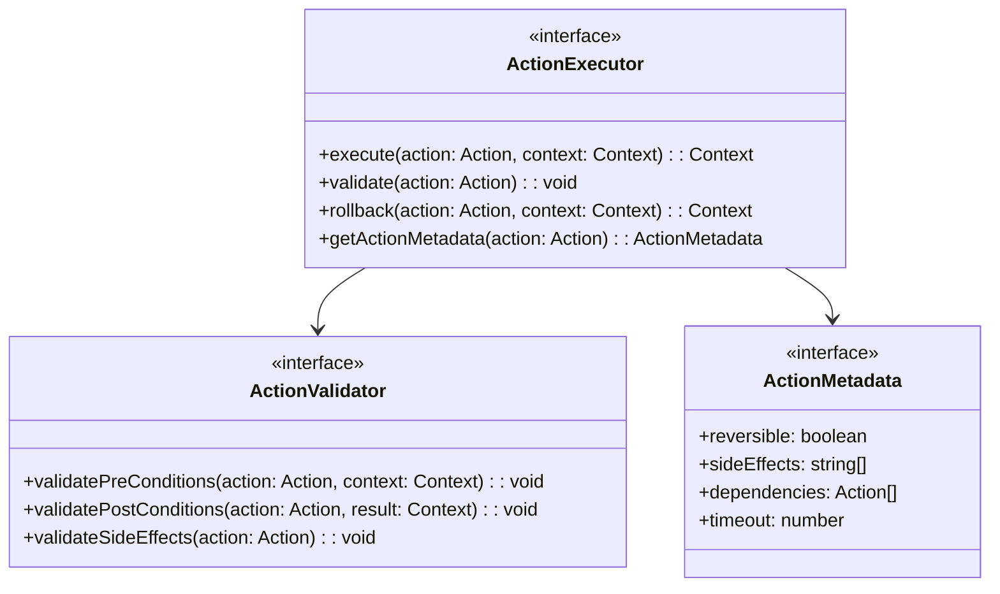
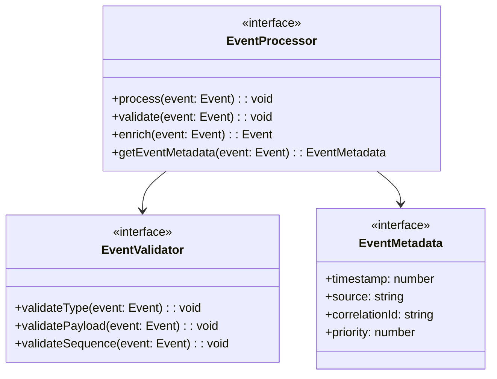
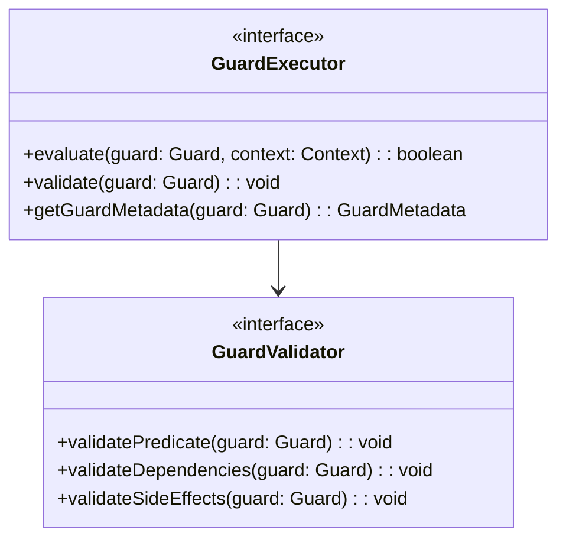
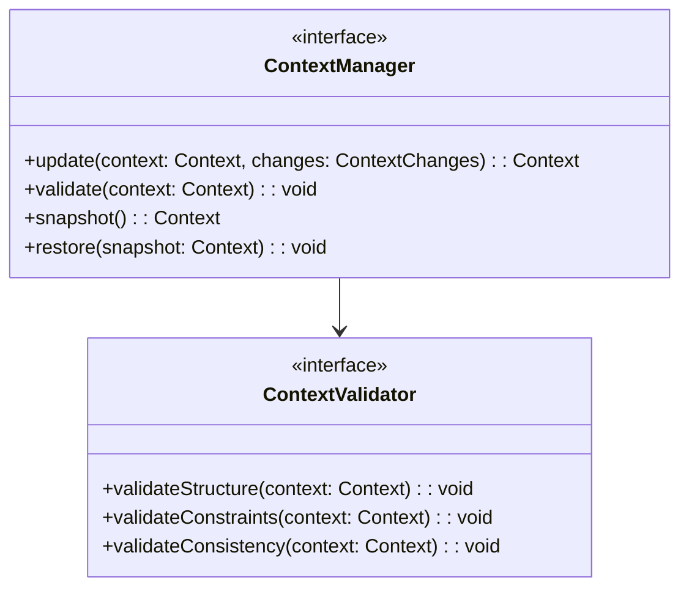
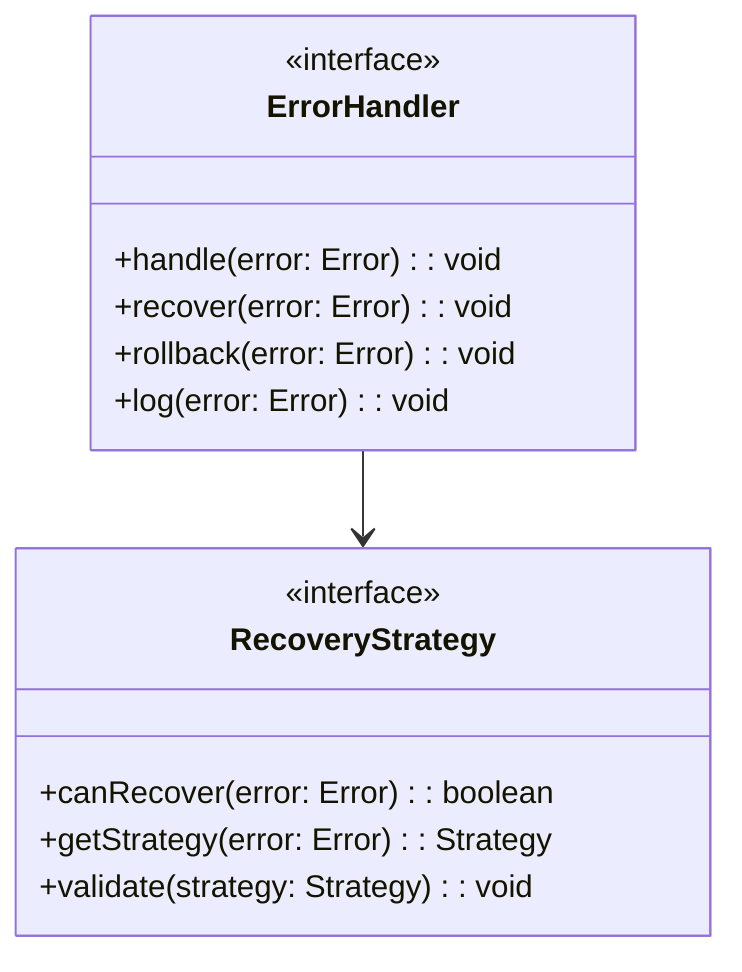

# WebSocket Implementation Design: Core Components

## Preamble

This document defines concrete state machine implementation requirements that govern code generation based on machine.part.2.abstract.md. It provides specifications for generating implementations that maintain formal properties while enabling practical extensibility.

### Document Dependencies

This document depends on and is constrained by:

1. machine.part.2.abstract.md

   - Core component interfaces
   - Type hierarchies
   - Property mappings

2. machine.part.1.md

   - Formal state machine ($\mathcal{WC}$)
   - Property requirements
   - Action definitions

3. impl.map.md
   - Implementation mappings
   - Type system definitions
   - Property preservation rules

### Document Purpose

- Define concrete state machine requirements
- Specify state transitions and actions
- Establish validation criteria
- Define error handling patterns

## 1. State Machine Core

### 1.1 State Management

### 1.2 Action Management

## 2. Event Processing

### 2.1 Event Handling

### 2.2 Guard Management

## 3. Context Management

### 3.1 Context Operations

## 4. Property Preservation

### 4.1 State Properties

The implementation must maintain:

1. Single Active State:

   - Only one state active at any time
   - State transitions atomic
   - State history maintained

2. Valid Transitions:

   - All transitions defined in formal spec
   - Guards evaluated before transition
   - Context validated after transition

3. State Invariants:
   - Properties preserved across transitions
   - Context consistency maintained
   - Resource cleanup enforced

### 4.2 Action Properties

Actions must preserve:

1. Context Immutability:

   - New context created for changes
   - Original context unchanged
   - History maintained

2. Action Atomicity:

   - All-or-nothing execution
   - Rollback on failure
   - Side effects tracked

3. Action Ordering:
   - Dependencies respected
   - Sequential execution
   - Completion verified

## 5. Error Handling

### 5.1 Recovery Strategies

## 6. Implementation Requirements

### 6.1 Core Requirements

1. State Machine Properties:

   - Maintain all formal properties
   - Preserve type safety
   - Enable monitoring
   - Support recovery

2. Performance Requirements:

   - Transition time ≤ 100ms
   - Memory usage ≤ 50MB
   - CPU usage ≤ 10%

3. Reliability Requirements:
   - Recovery time ≤ 1s
   - State consistency 100%
   - No resource leaks

### 6.2 Testing Requirements

1. Property Testing:

   - All states reachable
   - All transitions valid
   - All properties preserved

2. Performance Testing:

   - Load testing
   - Stress testing
   - Memory testing

3. Recovery Testing:
   - Error recovery
   - State recovery
   - Resource cleanup

## 7. Security Requirements

### 7.1 Implementation Security

1. State Protection:

   - State access controlled
   - Context immutable
   - History secured

2. Action Security:

   - Action validation
   - Side effect tracking
   - Resource limits

3. Error Security:
   - Error information protected
   - Recovery authenticated
   - Logging secured

### 7.2 Resource Protection

1. Memory Safety:

   - Bounds checking
   - Resource cleanup
   - Leak prevention

2. Execution Safety:
   - Timeout enforcement
   - CPU limiting
   - Stack protection

This specification provides the concrete requirements for implementing the core state machine components while maintaining all formal properties and security requirements.
