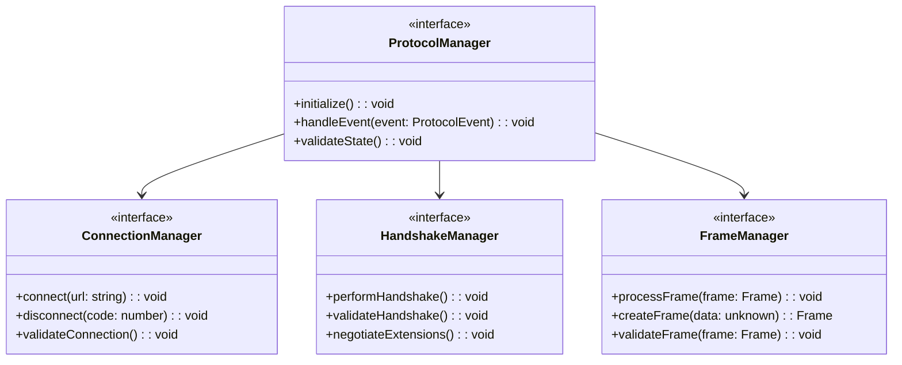
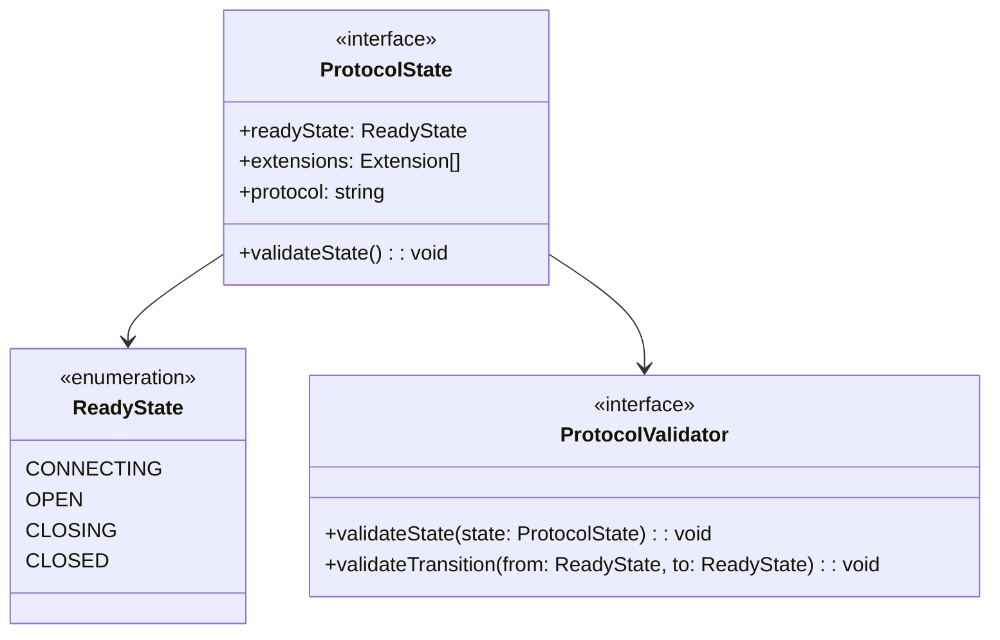
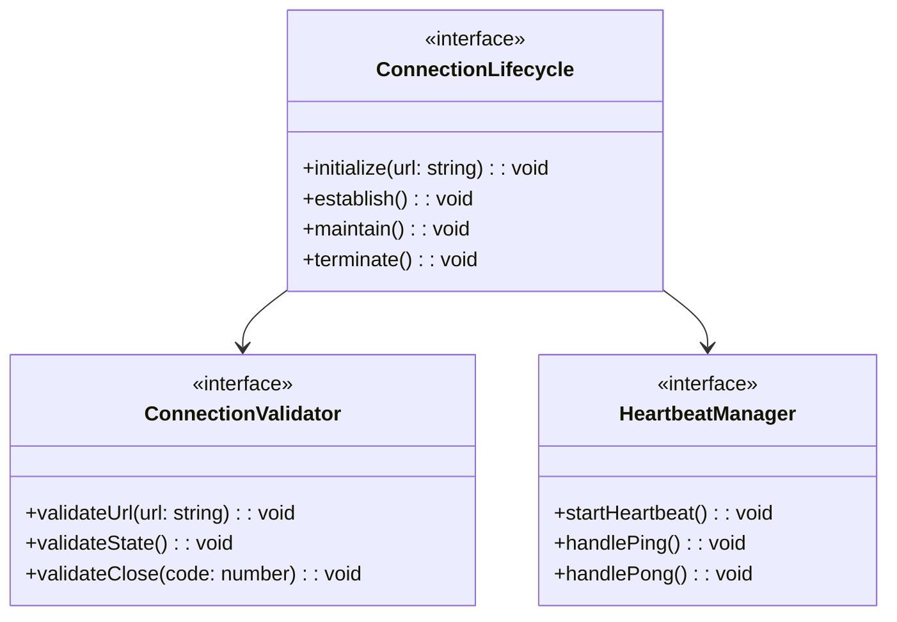
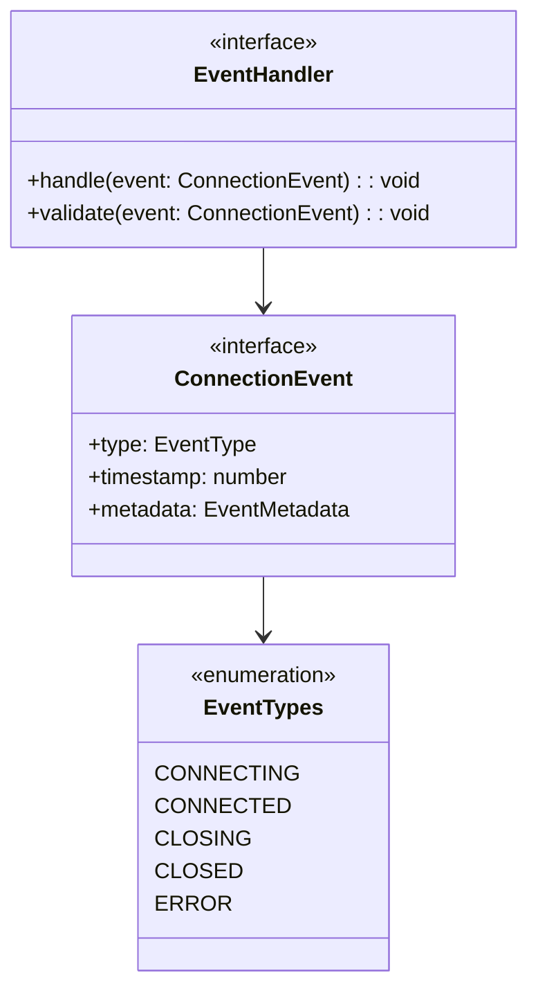
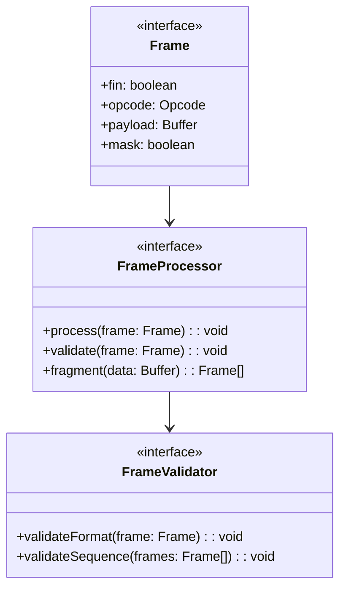
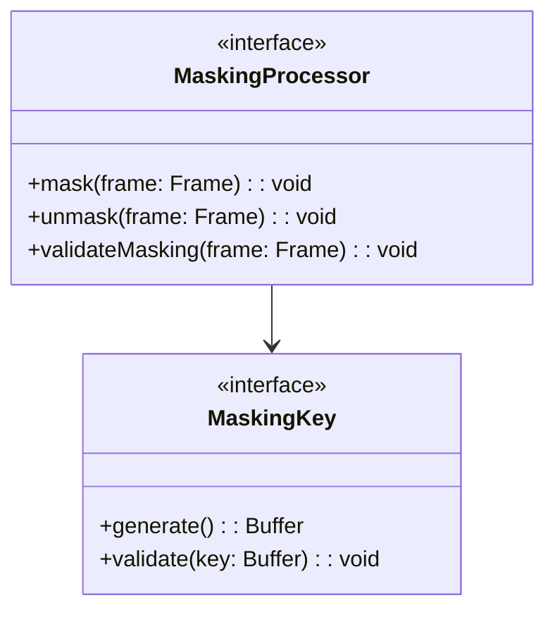
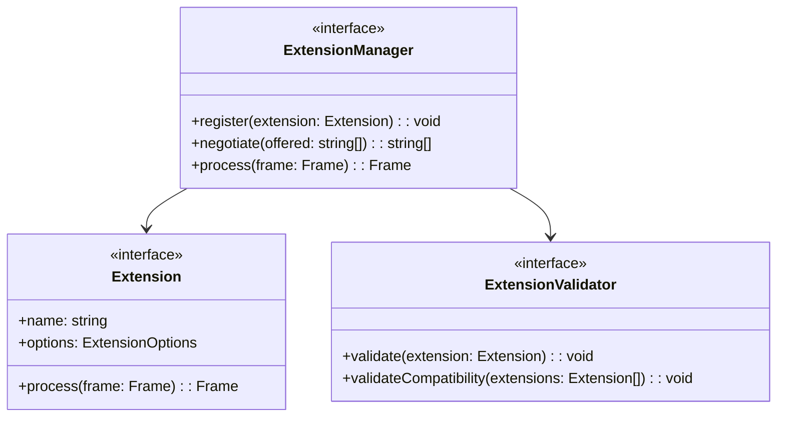
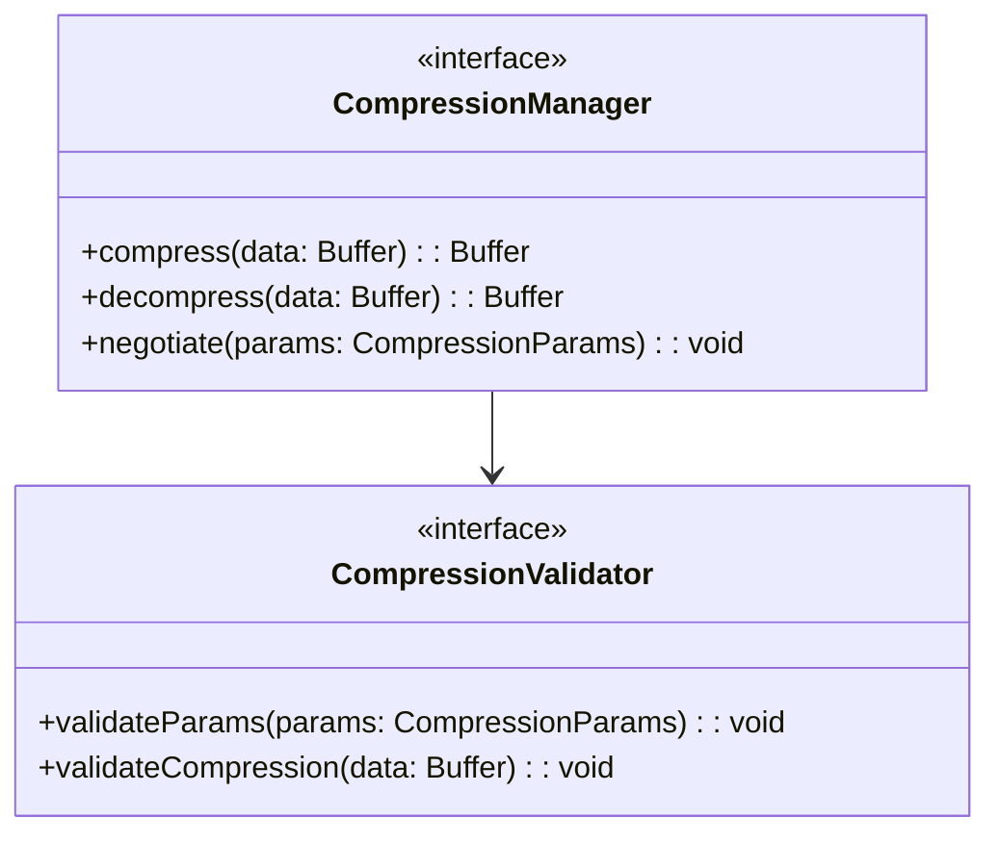
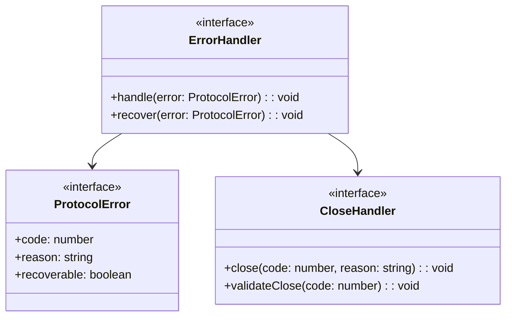
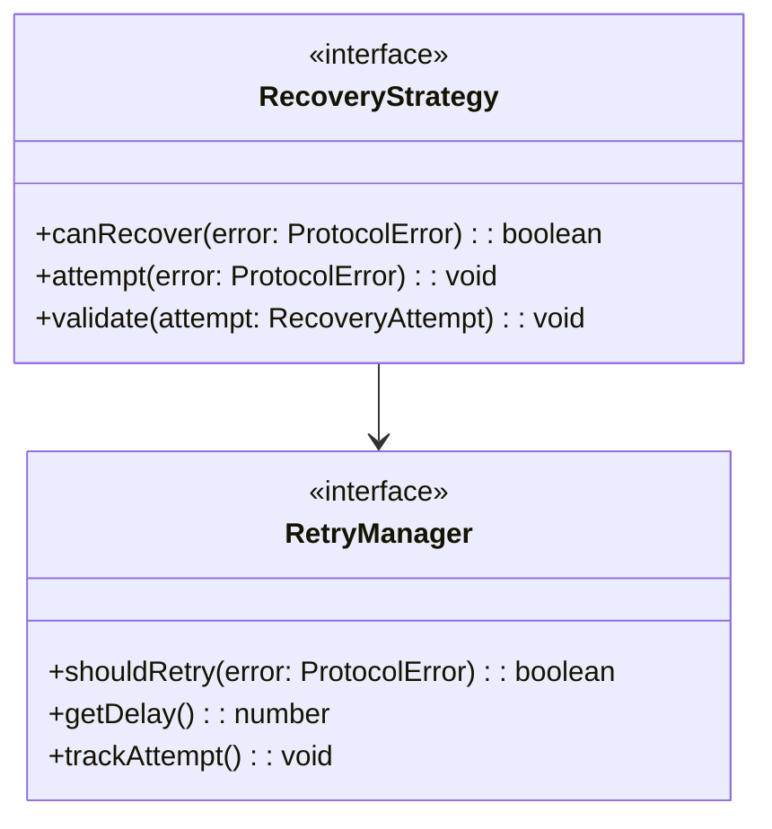

# WebSocket Implementation Design: Protocol Components

## Preamble

This document defines the WebSocket protocol implementation requirements that govern
code generation based on the core state machine design. It specifies how protocol
behaviors must be implemented while maintaining formal properties and enabling
standardized connection management.

### Document Dependencies
This document inherits all dependencies from `machine.part.2.abstract.md` and additionally requires `machine.part.2.concrete.core.md`: Core design specifications
  - State machine implementation patterns
  - Interface and type definitions
  - Validation framework requirements
  - Extension mechanisms

### Document Purpose

- Define requirements for protocol implementation
- Specify connection lifecycle management patterns
- Establish error handling requirements
- Define protocol state mapping implementations
- Specify validation and verification criteria

### Document Scope

This document SPECIFIES:

- Protocol state management requirements
- Connection handling patterns
- Event processing specifications
- Error classification system
- Protocol constraint validations
- Implementation verification criteria

This document does NOT cover:
- Core state machine implementation
- Message queuing systems
- Monitoring implementations
- Configuration details

### Implementation Requirements

1. Code Generation Governance

   - Generated code must maintain formal properties
   - Implementation must follow specified patterns
   - Extensions must use defined mechanisms
   - Changes must preserve core guarantees

2. Verification Requirements

   - Property validation criteria
   - Test coverage requirements
   - Performance constraints
   - Error handling verification

3. Documentation Requirements
   - Implementation mapping documentation
   - Property preservation evidence
   - Extension point documentation
   - Test coverage reporting

### Property Preservation

1. Formal Properties

   - State machine invariants
   - Protocol guarantees
   - Timing constraints
   - Safety properties

2. Implementation Properties

   - Type safety requirements
   - Error handling patterns
   - Extension mechanisms
   - Performance requirements

3. Verification Properties
   - Test coverage criteria
   - Validation requirements
   - Monitoring needs
   - Documentation standards

## 1. Protocol Component Architecture

### 1.1 Protocol Management Structure

Protocol components must:

1. Maintain WebSocket protocol standards
2. Handle protocol state transitions
3. Validate protocol operations
4. Manage connection lifecycle
5. Enable protocol extensions

### 1.2 Protocol State Management

State management must:

1. Track connection state
2. Validate state transitions
3. Maintain protocol metadata
4. Enable state monitoring

## 2. Connection Management Requirements

### 2.1 Connection Lifecycle

Connection management must:

1. Handle connection establishment
2. Manage connection state
3. Handle graceful closure
4. Monitor connection health

### 2.2 Connection Events

Event handling must:

1. Process protocol events
2. Validate event sequences
3. Track event timing
4. Maintain event history

## 3. Frame Processing Requirements

### 3.1 Frame Management

Frame processing must:

1. Handle frame formats
2. Process fragmentation
3. Validate frame sequences
4. Manage control frames

### 3.2 Masking Requirements

Masking must:

1. Apply frame masking
2. Generate mask keys
3. Validate masking
4. Handle unmasking

## 4. Protocol Extension Requirements

### 4.1 Extension Architecture

Extension system must:

1. Enable extension registration
2. Handle negotiation
3. Process extension data
4. Validate compatibility

### 4.2 Compression Extension

Compression must:

1. Support per-message deflate
2. Handle window negotiation
3. Manage contexts
4. Validate compression

## 5. Error Handling Requirements

### 5.1 Protocol Errors

Error handling must:

1. Classify protocol errors
2. Handle close codes
3. Enable recovery
4. Maintain consistency

### 5.2 Recovery Strategies

Recovery must:

1. Define retry strategies
2. Handle backoff
3. Track attempts
4. Validate recovery

## 6. Implementation Verification

### 6.1 Protocol Verification

Must verify:

1. Protocol compliance

   - Handshake process
   - Frame format
   - Control frames
   - Extension negotiation

2. Connection states

   - State transitions
   - Event sequences
   - Timeout handling
   - Closure processes

3. Data handling
   - Frame processing
   - Message fragmentation
   - UTF-8 validation
   - Compression

### 6.2 Testing Requirements

Must include:

1. Protocol scenarios

   - Connection establishment
   - Data exchange
   - Extension negotiation
   - Graceful closure

2. Error scenarios

   - Network failures
   - Protocol violations
   - Timeout conditions
   - Invalid frames

3. Performance scenarios
   - Connection time
   - Frame processing
   - Memory usage
   - Recovery time

## 7. Security Requirements

### 7.1 Security Measures

Must implement:

1. Input validation

   - URL validation
   - Frame validation
   - UTF-8 checking
   - Length limits

2. State protection

   - Frame masking
   - State validation
   - Connection limits
   - Resource limits

3. Error handling
   - Secure closure
   - Error masking
   - Resource cleanup
   - Logging controls

### 7.2 Security Testing

Must verify:

1. Protocol security

   - Masking compliance
   - State transitions
   - Error handling
   - Resource limits

2. Implementation security
   - Memory usage
   - CPU usage
   - Connection limits
   - Timeout handling