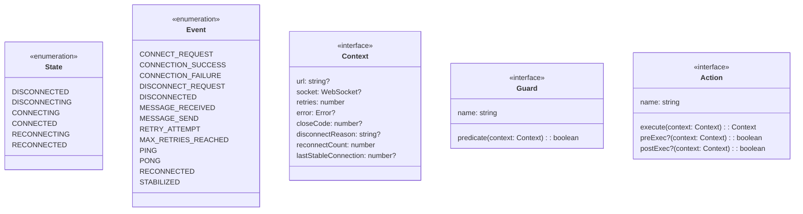
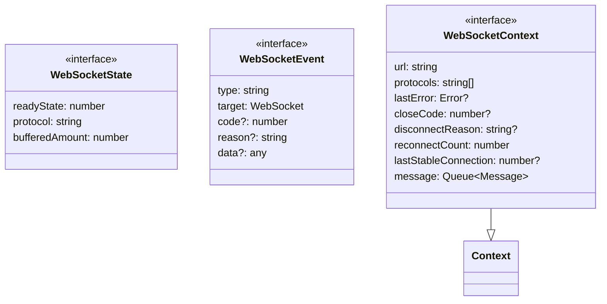
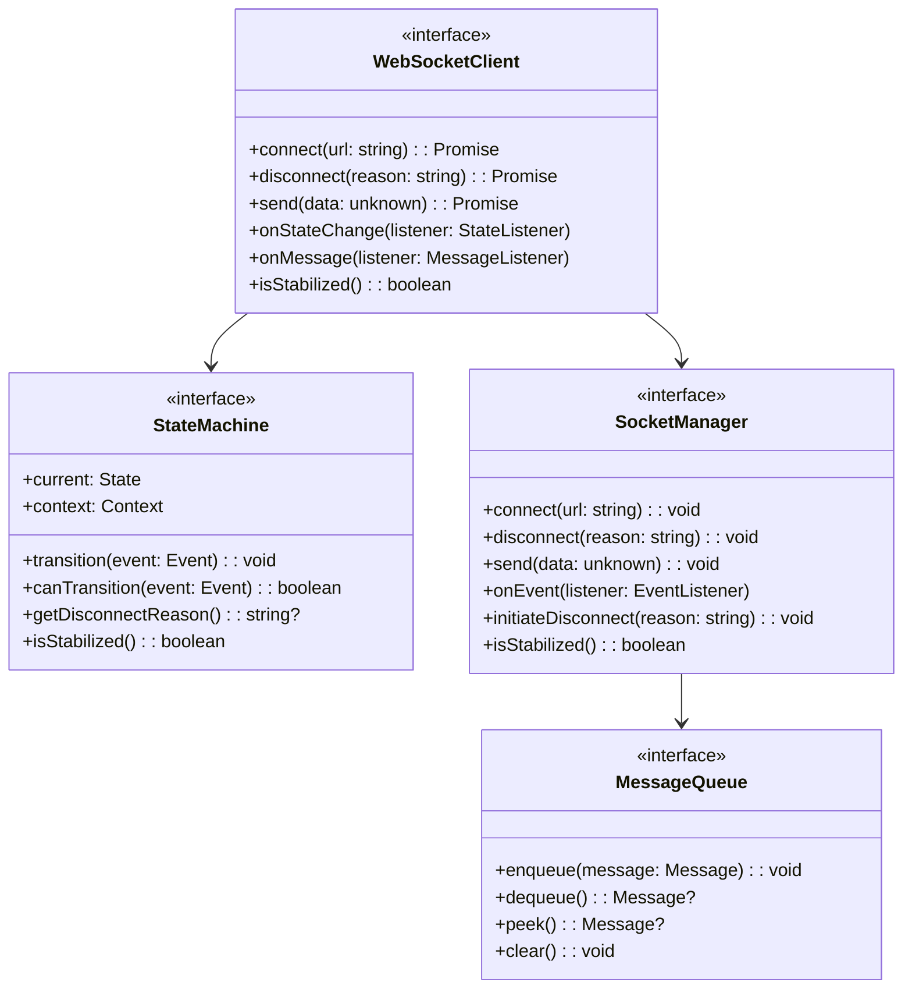
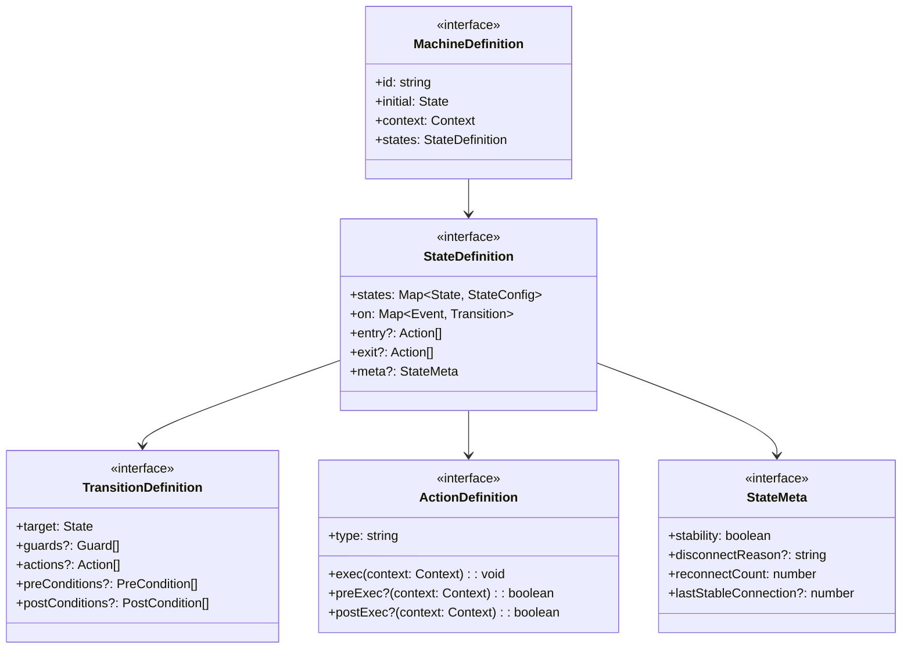
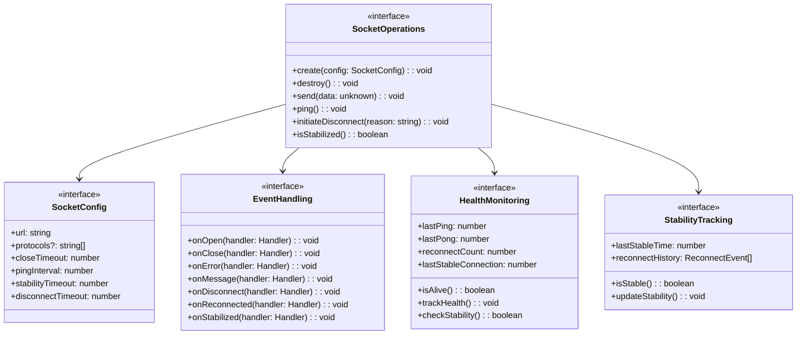
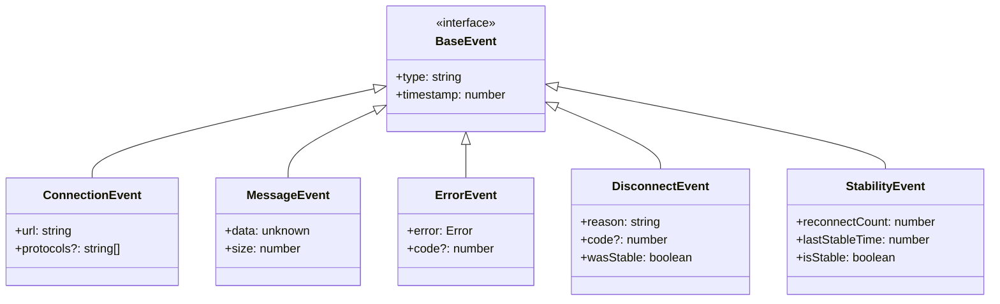
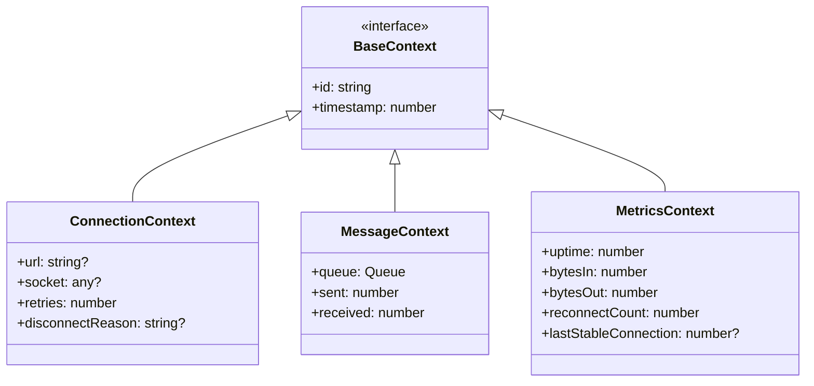

# WebSocket Implementation Design: Abstract Layer

## Preamble

This document defines the high-level architecture and domain language for implementing the WebSocket Client ($\mathcal{WC}$).

### Document Dependencies

This document depends on and is constrained by the following specifications, in order:

1. `machine.part.1.md`: Core mathematical specification
   - Defines formal state machine model ($\mathcal{WC}$)
   - Establishes system constants and properties
   - Provides formal proofs and safety guarantees

2. `machine.part.1.websocket.md`: Protocol specification
   - Maps protocol states to core state machine
   - Defines WebSocket-specific behaviors
   - Establishes protocol constraints

3. `impl.map.md`: Implementation mappings
   - Maps formal model to implementation structures
   - Defines type hierarchies and transformations
   - Establishes implementation constraints

4. `governance.md`: Design stability guidelines
   - Defines core stability requirements
   - Establishes extension mechanisms
   - Provides implementation ordering

### Document Purpose

- Defines domain-specific language (DSL) for our WebSocket Client
- Establishes core abstractions and boundaries
- Maps formal concepts to implementation components
- Creates clear separation of concerns

### Document Scope

This document FOCUSES on:
- System context and container design
- Core domain language definitions
- Primary component relationships
- Type hierarchies and boundaries
- Directory structure
- Property mappings

This document does NOT cover:
- Detailed component designs (see machine.part.2.concrete.md)
- Implementation code
- Tool-specific configurations
- Deployment concerns

## 1. Domain Language

Our WebSocket Client domain model uses a specific language that maps formal concepts to implementation tools:

### 1.1 Core Types



### 1.2 Protocol Types



## 2. Component Design

### 2.1 Core Component Relations



### 2.2 State Machine Design

Maps our domain states and events to xstate according to formal mappings:



### 2.3 Socket Management Design

Maps socket operations according to stability guidelines:



## 3. Component Boundaries

### 3.1 Client Layer

Owns the domain model and coordinates between state and socket layers:

- Exposes public client API
- Manages state transitions
- Coordinates socket operations
- Handles message flow
- Enforces protocol constraints
- Manages disconnect process
- Tracks connection stability

### 3.2 State Layer

Manages state machine behavior through xstate:

- Defines state configurations
- Manages transitions
- Executes actions with pre/post conditions
- Evaluates guards
- Maintains context
- Tracks stability metadata
- Handles disconnect reasons

### 3.3 Socket Layer

Handles WebSocket operations through ws:

- Manages socket lifecycle
- Handles protocol events
- Buffers messages
- Monitors connection health
- Implements reconnection
- Tracks stability metrics
- Manages graceful disconnection

## 4. Type Hierarchies

### 4.1 Event Hierarchy



### 4.2 Context Hierarchy



## 5. Directory Structure

Organized by domain concepts with new protocol types:

```
src/
├── client/          # Main domain interfaces
│   ├── types/       # Core type definitions
│   └── events/      # Event definitions
├── state/           # State management interfaces
│   ├── machine/     # State machine implementation
│   └── context/     # Context management
├── socket/          # Socket management interfaces
│   ├── core/        # Core socket operations
│   ├── health/      # Health monitoring
│   └── stability/   # Stability tracking
└── protocol/        # Protocol-specific types
    ├── websocket/   # WebSocket protocol types
    └── events/      # Protocol events
```

## 6. Property Mappings

### 6.1 State Machine Properties ($\mathcal{WC}$)

Maintains strict mappings to formal specification:

- States map to xstate state nodes
  - disconnected → 'disconnected'
  - disconnecting → 'disconnecting'
  - connecting → 'connecting'
  - connected → 'connected'
  - reconnecting → 'reconnecting'
  - reconnected → 'reconnected'

- Events map to xstate events
  - CONNECT_REQUEST → 'CONNECT'
  - DISCONNECT_REQUEST → 'DISCONNECT'
  - DISCONNECTED → 'DISCONNECTED'
  - RECONNECTED → 'RECONNECTED'
  - STABILIZED → 'STABILIZED'

- Context maps to xstate context
  - url → string?
  - socket → WebSocket?
  - error → Error?
  - disconnectReason → string?
  - reconnectCount → number
  - lastStableConnection → number?

- Transitions map to xstate transitions with pre/post conditions
- Actions map to xstate actions with validation

### 6.2 Protocol Properties ($E_{ws}$)

Maps WebSocket protocol elements:

- Socket states map to ws readyState
- Protocol events map to ws event handlers
- Socket operations map to ws methods
- Protocol constraints map to runtime checks
- Stability tracking maps to internal metrics
- Disconnect handling maps to close operations

Each mapping preserves formal properties while adhering to stability guidelines.