# WebSocket Implementation Design: Configuration System Components

## Preamble

This document provides detailed configuration system designs that implement the high-level
architecture defined in machine.part.2.abstract.md.

### Document Dependencies

This document inherits all dependencies from `machine.part.2.abstract.md` and additionally requires:

1. `machine.part.2.concrete.core.md`: Core component design
   - Provides validation foundation
   - Defines base interfaces and types
   - Establishes extension patterns
   - Stability tracking requirements
   - Disconnect handling patterns

### Document Purpose
- Details configuration management
- Defines environment handling
- Establishes validation system
- Provides caching framework
- Specifies stability configuration
- Defines disconnect handling

### Document Scope

This document FOCUSES on:
- Configuration loading
- Environment integration
- Schema validation
- Cache management
- Value transformation
- Stability configuration
- Disconnect management

This document does NOT cover:
- Core state implementations
- Protocol-specific settings
- Message system configuration
- Monitoring configuration

## 1. Configuration System Architecture

### 1.1 Core Configuration Components
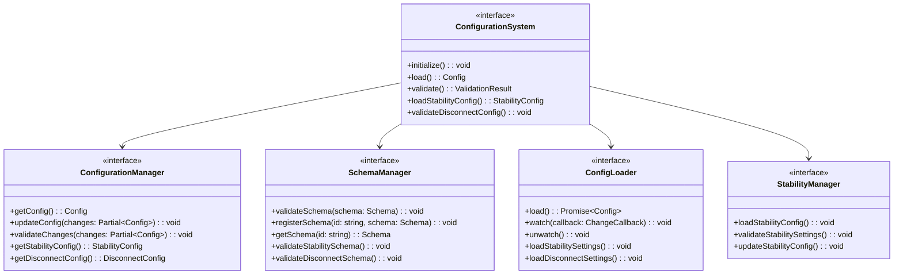

### 1.2 Configuration Structure
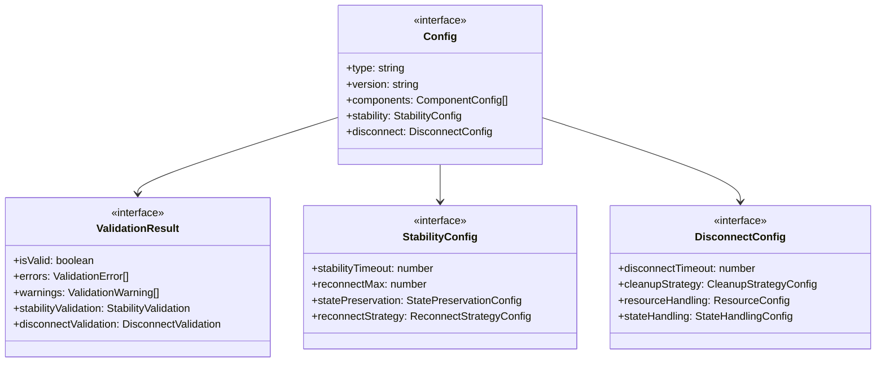

## 2. Schema Management Requirements

### 2.1 Schema Registry
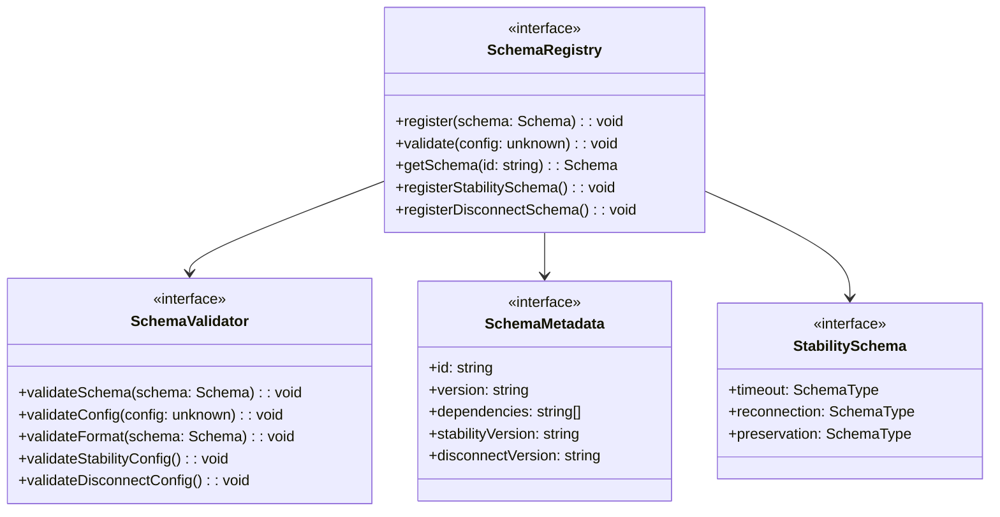

### 2.2 Schema Validation
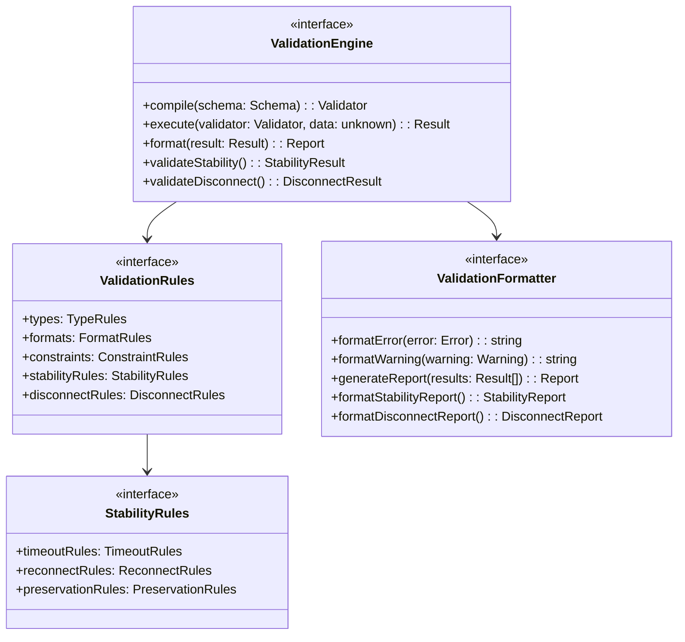

## 3. Configuration Loading Requirements

### 3.1 Loading Process
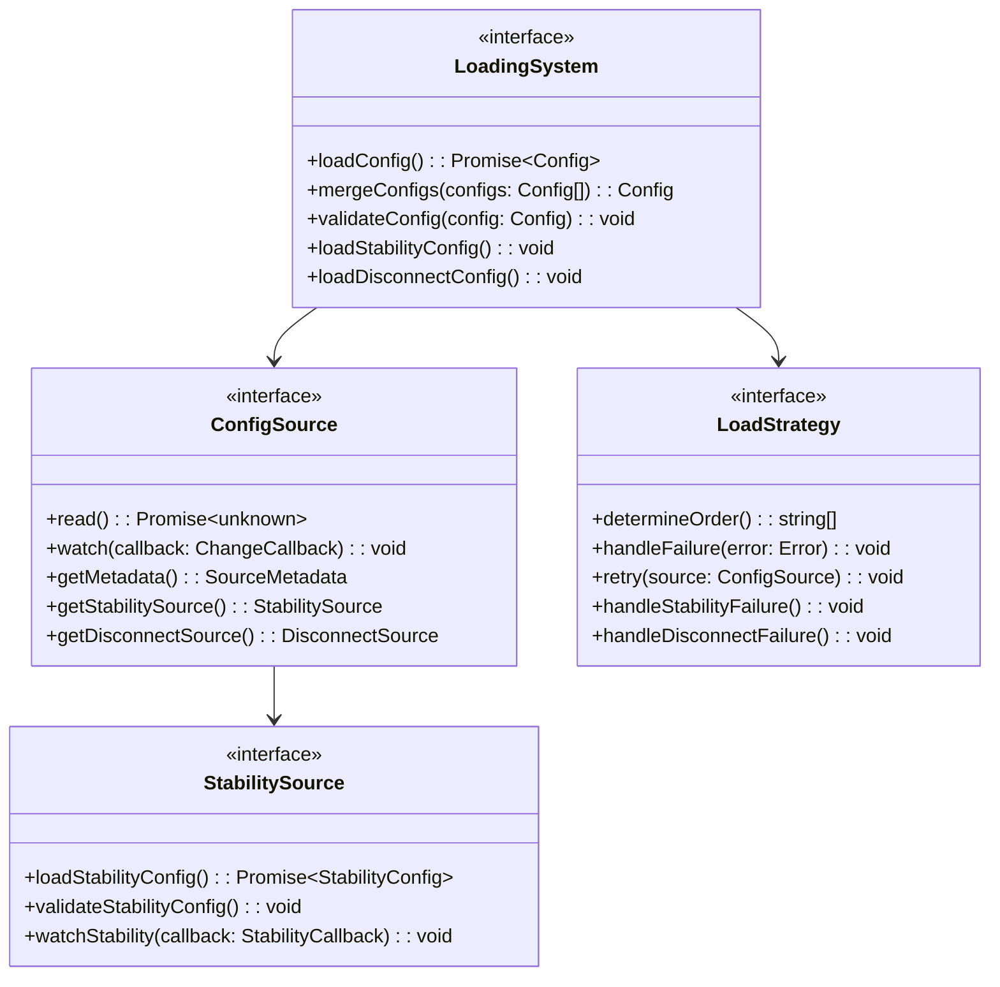

### 3.2 Source Management
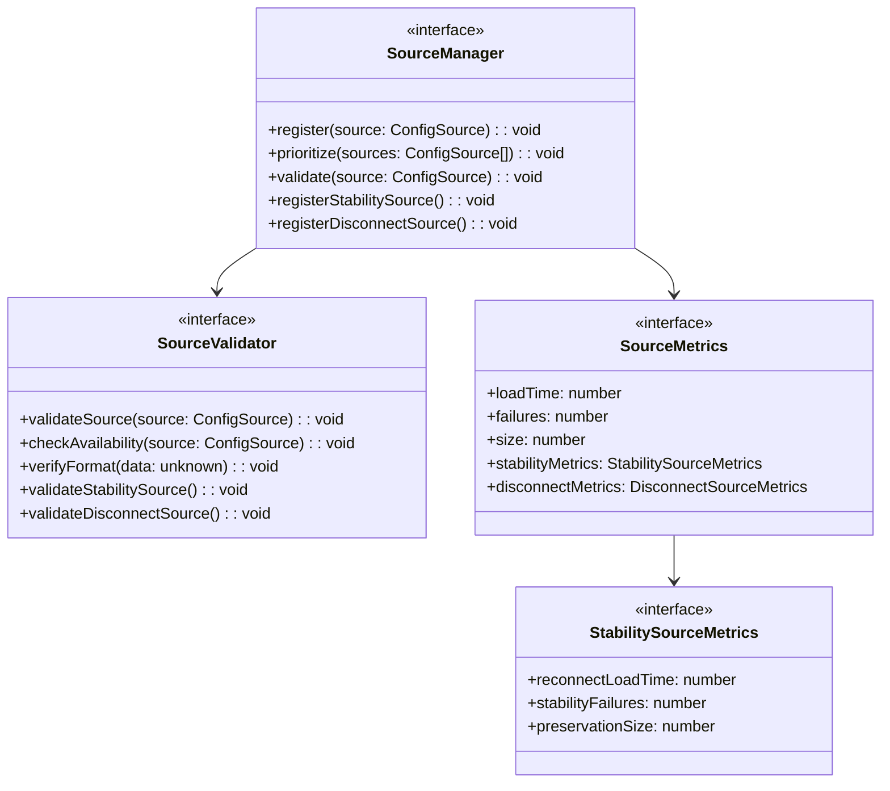

## 4. Cache Management Requirements

### 4.1 Cache Operations
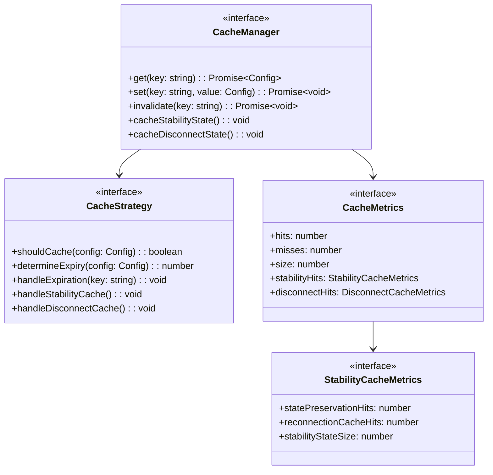

### 4.2 Cache Synchronization
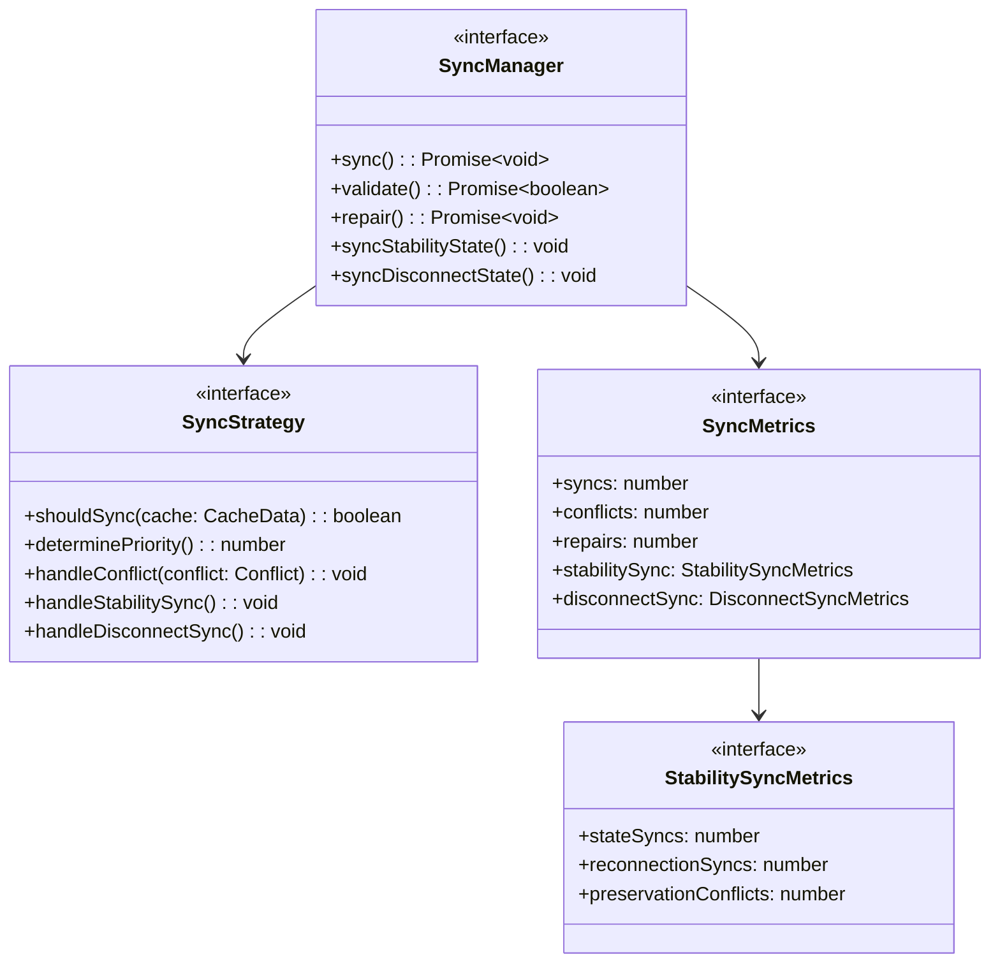

## 5. Environment Integration Requirements

### 5.1 Environment Loading
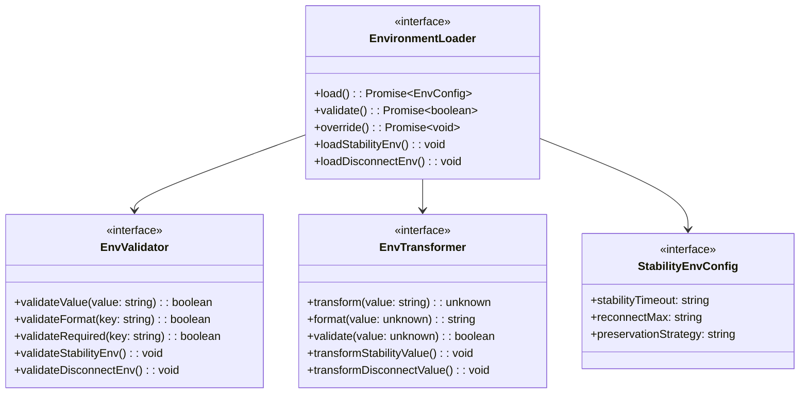

## 6. Change Management Requirements

### 6.1 Change Tracking
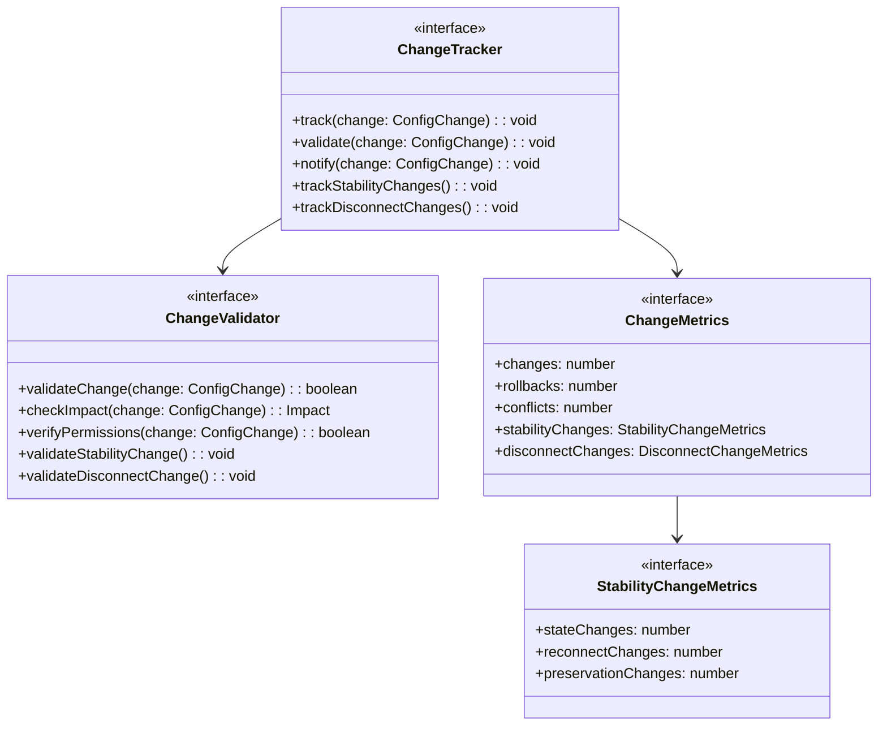

### 6.2 Change Application
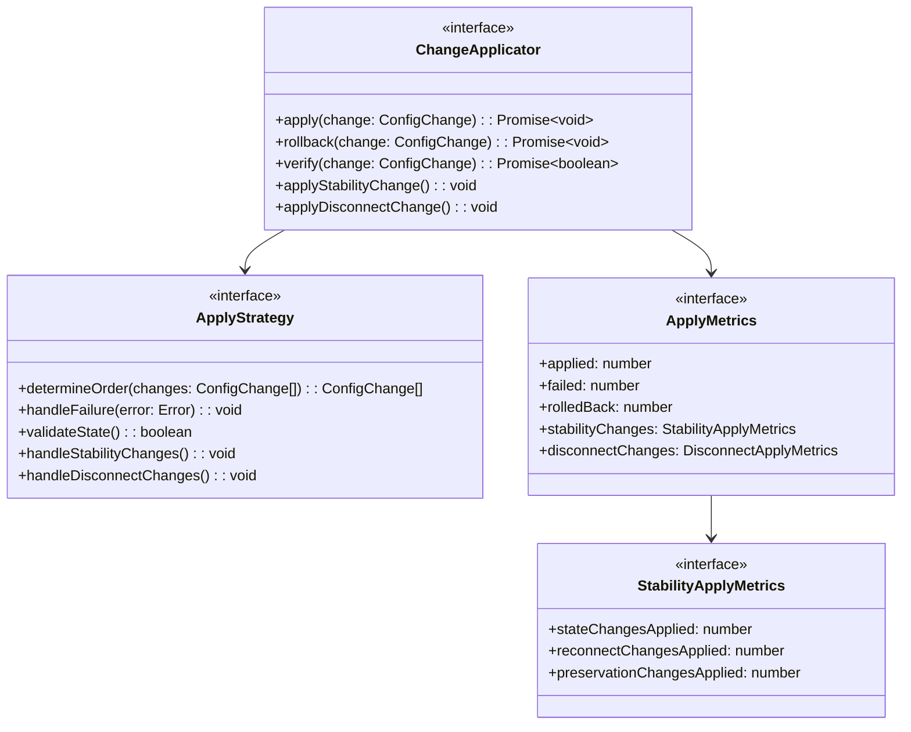

## 7. Implementation Verification

### 7.1 Verification Requirements
Must verify:

1. Configuration loading
   - Source loading
   - Validation process
   - Cache operations
   - Environment integration
   - Stability configuration
   - Disconnect settings

2. Change management
   - Change tracking
   - Change application
   - Rollback process
   - State verification
   - Stability preservation
   - Disconnect handling

3. Schema handling
   - Schema validation
   - Config validation
   - Type checking
   - Format verification
   - Stability schema
   - Disconnect schema

4. Stability verification
   - State preservation
   - Reconnection settings
   - History tracking
   - Metric preservation
   - Resource management

5. Disconnect verification
   - Clean shutdown
   - Resource cleanup
   - State preservation
   - History maintenance
   - Recovery paths

### 7.2 Testing Requirements
Must include:

1. Functional tests
   - Loading process
   - Validation rules
   - Cache operations
   - Change handling
   - Stability features
   - Disconnect flows

2. Performance tests
   - Load times
   - Cache efficiency
   - Change application
   - Memory usage
   - Stability overhead
   - Disconnect timing

3. Integration tests
   - Environment integration
   - Schema validation
   - Change propagation
   - Error handling
   - Stability integration
   - Disconnect coordination

4. Stability tests
   - State preservation
   - Reconnection flows
   - History accuracy
   - Resource efficiency
   - Clean disconnect

## 8. Security Requirements

### 8.1 Access Control
Must implement:

1. Configuration access
   - Read permissions
   - Write permissions
   - Change authorization
   - Audit logging
   - Stability access
   - Disconnect permissions

2. Schema access
   - Schema registration
   - Validation access
   - Schema updates
   - Version control
   - Stability schema
   - Disconnect schema

3. Stability security
   - State access control
   - History protection
   - Metric security
   - Resource limits
   - Recovery authentication

4. Disconnect security
   - Reason protection
   - State preservation
   - Resource cleanup
   - History security
   - Recovery validation

### 8.2 Data Protection
Must ensure:

1. Sensitive data
   - Value encryption
   - Secret handling
   - Secure storage
   - Secure transmission
   - Stability state protection
   - Disconnect state security

2. Audit requirements
   - Change tracking
   - Access logging
   - Validation records
   - Error logging
   - Stability auditing
   - Disconnect tracking

3. Stability protection
   - State encryption
   - History protection
   - Metric security
   - Resource guarding
   - Recovery validation

4. Disconnect protection
   - Reason encryption
   - State protection
   - Resource security
   - History preservation
   - Recovery verification

This specification provides comprehensive configuration requirements for the v9 WebSocket implementation, including stability tracking and disconnect management capabilities while maintaining alignment with all core v9 specifications.