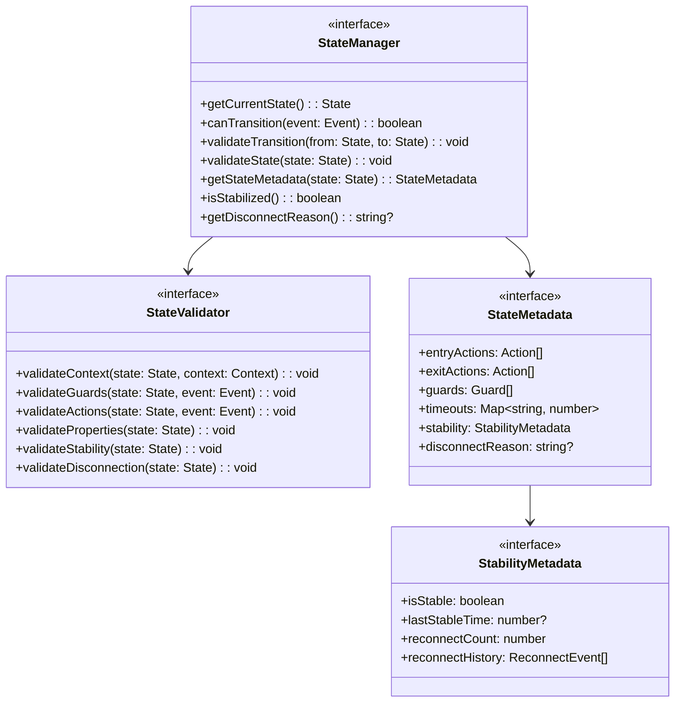
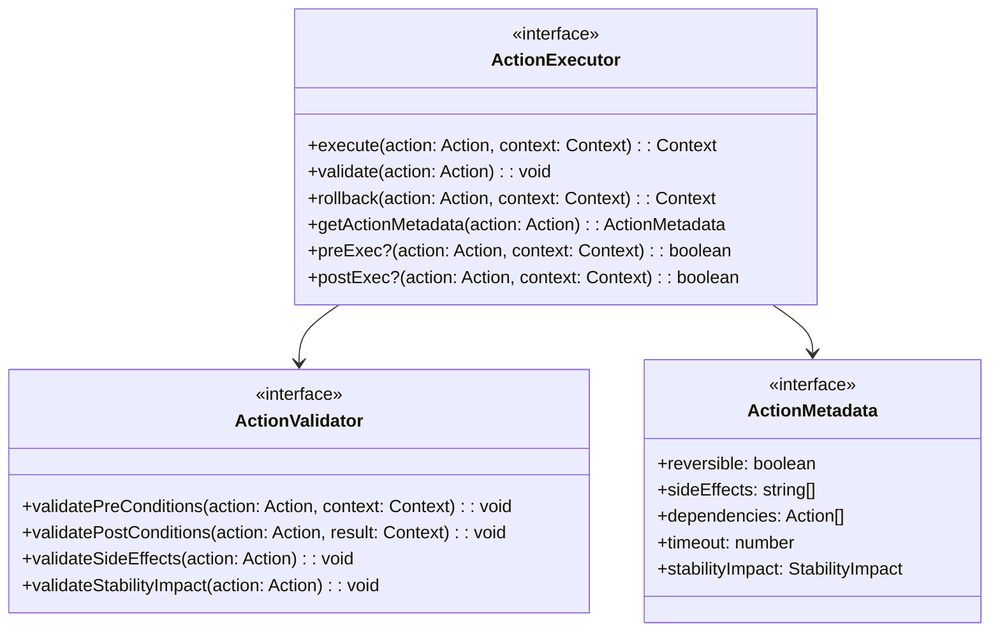
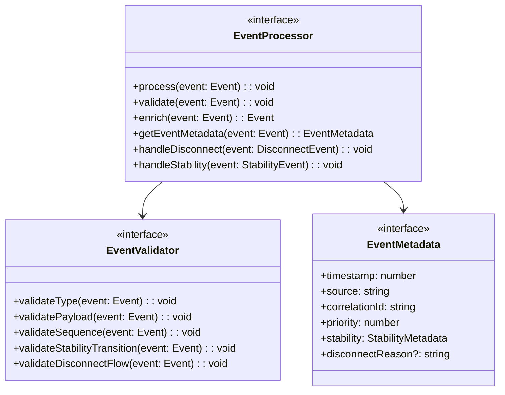
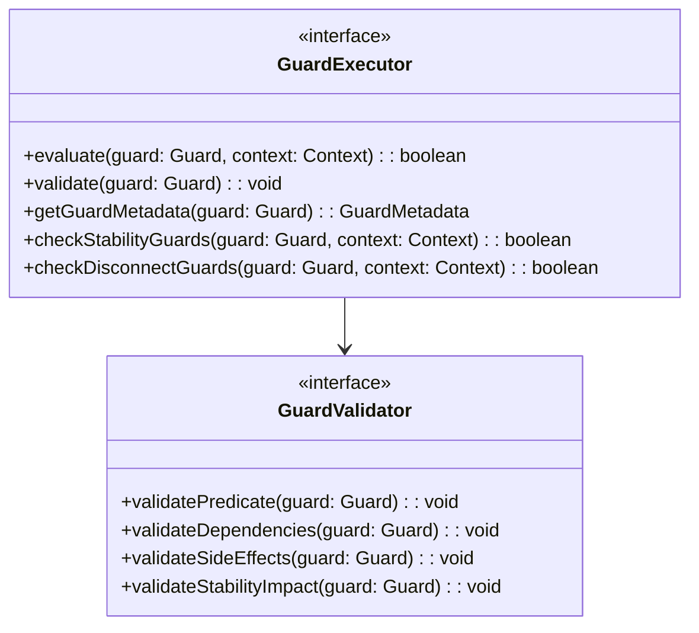
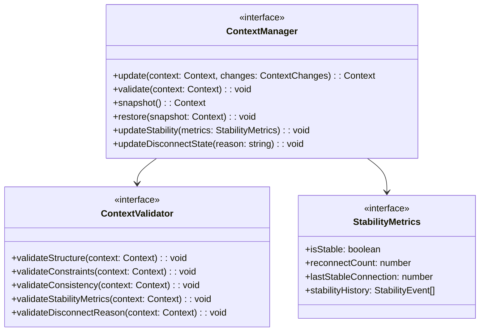
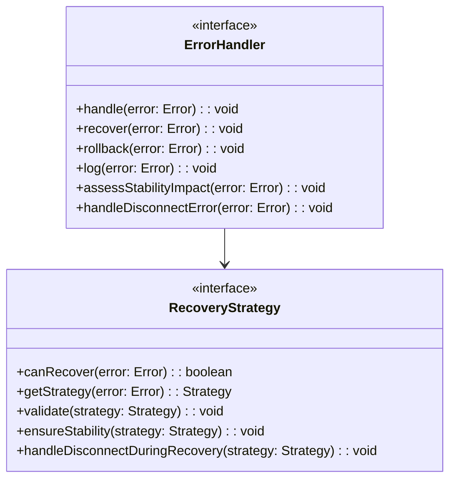

# WebSocket Implementation Design: Core Components

## Preamble

This document defines concrete state machine implementation requirements that govern code generation based on machine.part.2.abstract.md. It provides specifications for generating implementations that maintain formal properties while enabling practical extensibility.

### Document Dependencies

This document depends on and is constrained by:

1. `machine.part.2.abstract.md`
   - Core component interfaces
   - Type hierarchies
   - Property mappings
   - Stability tracking
   - Disconnect handling

2. `machine.part.1.md`
   - Formal state machine ($\mathcal{WC}$)
   - Property requirements
   - Action definitions
   - Stability properties
   - Disconnect flows

3. `impl.map.md`
   - Implementation mappings
   - Type system definitions
   - Property preservation rules
   - Stability guarantees

### Document Purpose

- Define concrete state machine requirements
- Specify state transitions and actions
- Establish validation criteria
- Define error handling patterns
- Specify stability tracking
- Define disconnect handling

## 1. State Machine Core

### 1.1 State Management

### 1.2 Action Management

## 2. Event Processing

### 2.1 Event Handling

### 2.2 Guard Management

## 3. Context Management

### 3.1 Context Operations

## 4. Property Preservation

### 4.1 State Properties

The implementation must maintain:

1. Single Active State:
   - Only one state active at any time
   - State transitions atomic
   - State history maintained
   - Stability status tracked
   - Disconnect state managed

2. Valid Transitions:
   - All transitions defined in formal spec
   - Guards evaluated before transition
   - Context validated after transition
   - Stability preserving
   - Disconnect flow respected

3. State Invariants:
   - Properties preserved across transitions
   - Context consistency maintained
   - Resource cleanup enforced
   - Stability guarantees upheld
   - Disconnect reasons preserved

### 4.2 Action Properties

Actions must preserve:

1. Context Immutability:
   - New context created for changes
   - Original context unchanged
   - History maintained
   - Stability metrics preserved
   - Disconnect state maintained

2. Action Atomicity:
   - All-or-nothing execution
   - Rollback on failure
   - Side effects tracked
   - Stability impact assessed
   - Disconnect handling atomic

3. Action Ordering:
   - Dependencies respected
   - Sequential execution
   - Completion verified
   - Stability order preserved
   - Disconnect sequence followed

## 5. Error Handling

### 5.1 Recovery Strategies

## 6. Implementation Requirements

### 6.1 Core Requirements

1. State Machine Properties:
   - Maintain all formal properties
   - Preserve type safety
   - Enable monitoring
   - Support recovery
   - Track stability
   - Handle disconnection

2. Performance Requirements:
   - Transition time ≤ 100ms
   - Memory usage ≤ 50MB
   - CPU usage ≤ 10%
   - Stability check ≤ 50ms
   - Disconnect handling ≤ 200ms

3. Reliability Requirements:
   - Recovery time ≤ 1s
   - State consistency 100%
   - No resource leaks
   - Stability guaranteed after reconnect
   - Clean disconnect guaranteed

### 6.2 Testing Requirements

1. Property Testing:
   - All states reachable
   - All transitions valid
   - All properties preserved
   - Stability verified
   - Disconnect flows validated

2. Performance Testing:
   - Load testing
   - Stress testing
   - Memory testing
   - Stability metrics
   - Disconnect timing

3. Recovery Testing:
   - Error recovery
   - State recovery
   - Resource cleanup
   - Stability restoration
   - Disconnect handling

## 7. Security Requirements

### 7.1 Implementation Security

1. State Protection:
   - State access controlled
   - Context immutable
   - History secured
   - Stability metrics protected
   - Disconnect reasons secured

2. Action Security:
   - Action validation
   - Side effect tracking
   - Resource limits
   - Stability preservation
   - Disconnect safety

3. Error Security:
   - Error information protected
   - Recovery authenticated
   - Logging secured
   - Stability status protected
   - Disconnect reasons validated

### 7.2 Resource Protection

1. Memory Safety:
   - Bounds checking
   - Resource cleanup
   - Leak prevention
   - Stability metrics cleanup
   - Disconnect resource release

2. Execution Safety:
   - Timeout enforcement
   - CPU limiting
   - Stack protection
   - Stability check timeouts
   - Disconnect timeouts

This specification provides the concrete requirements for implementing the core state machine components while maintaining all formal properties, security requirements, stability guarantees, and proper disconnect handling.