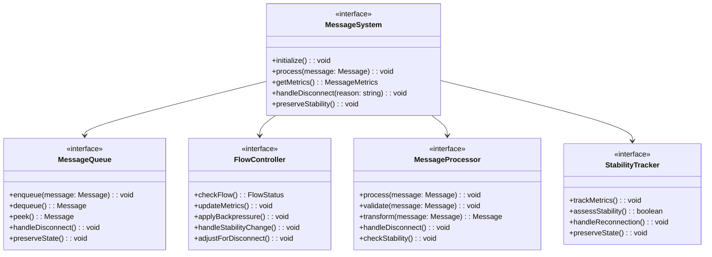
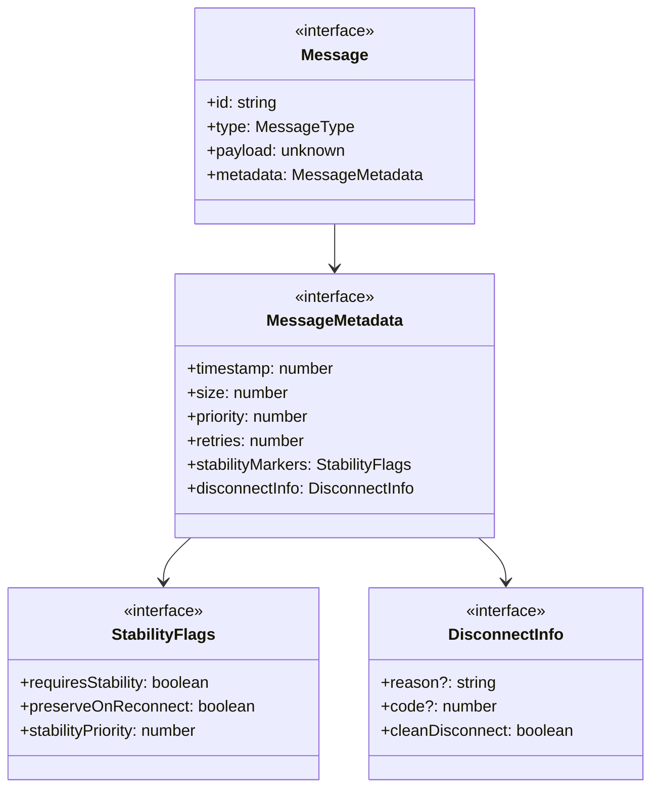
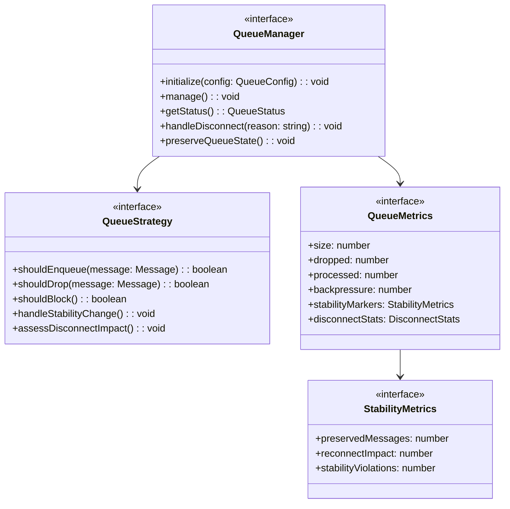
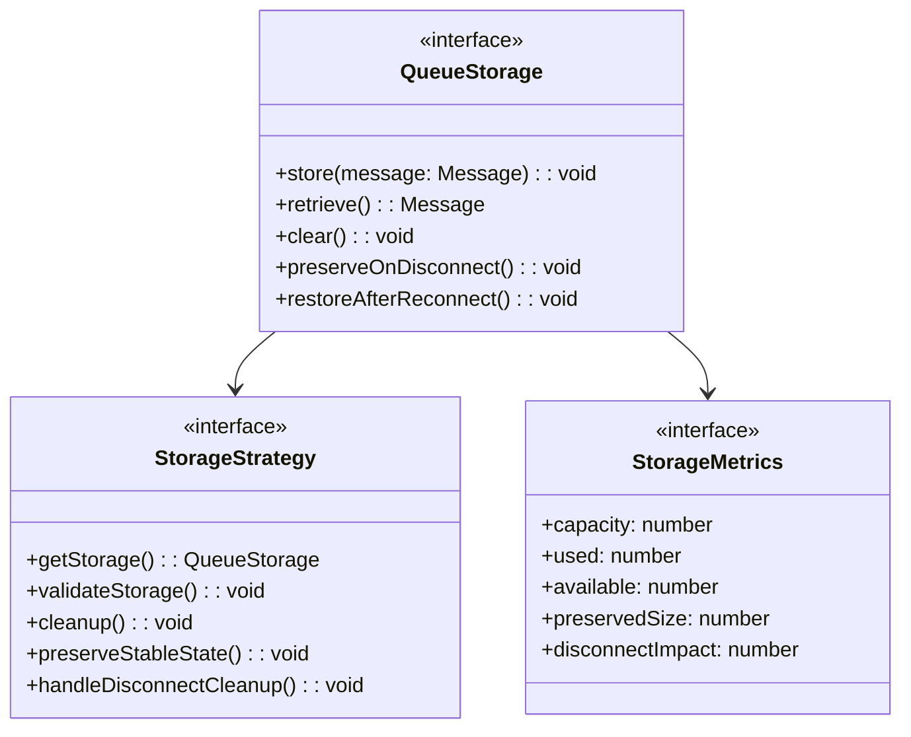
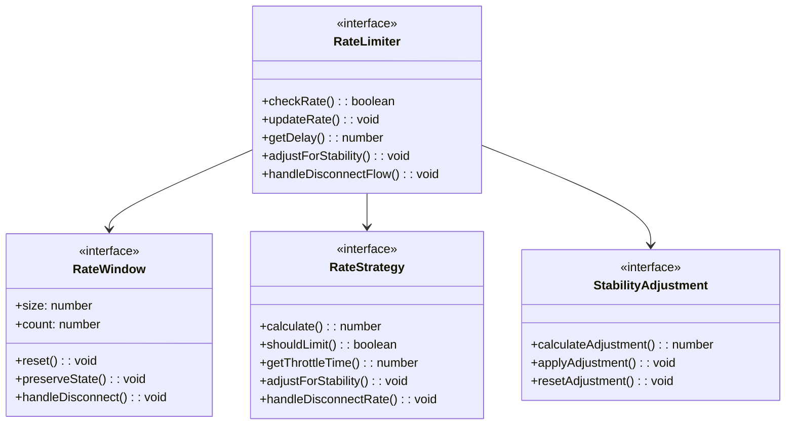
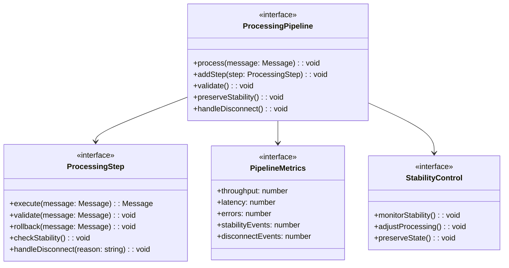
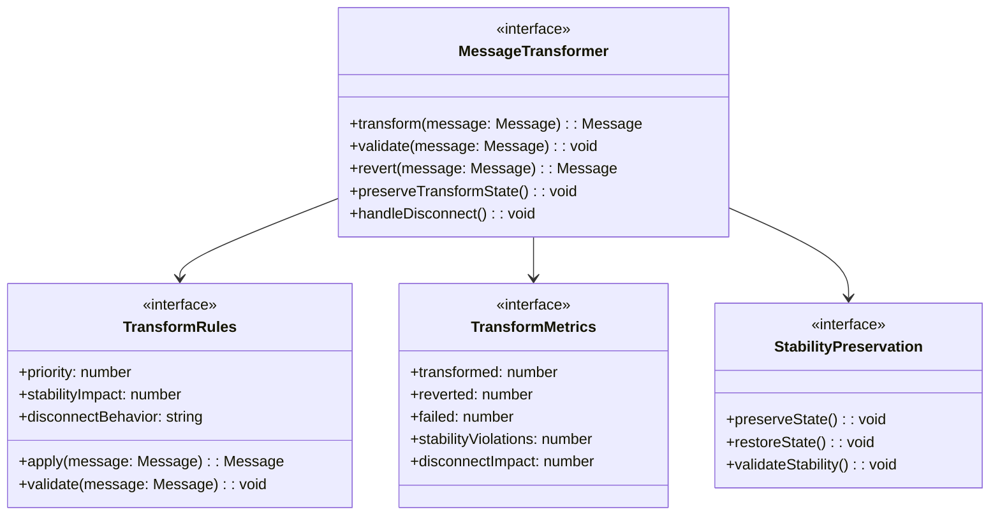
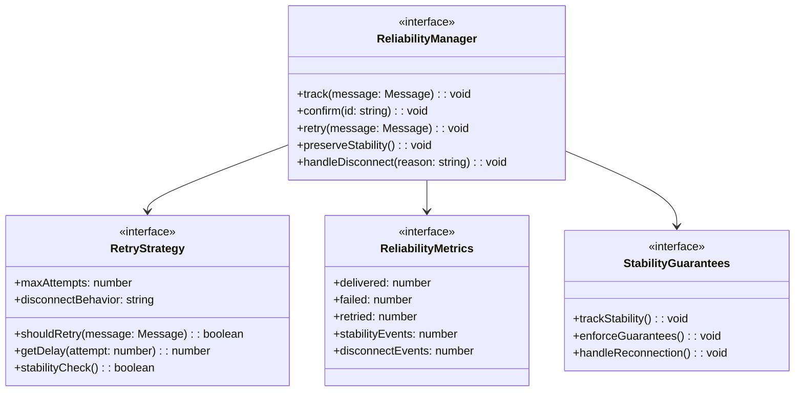
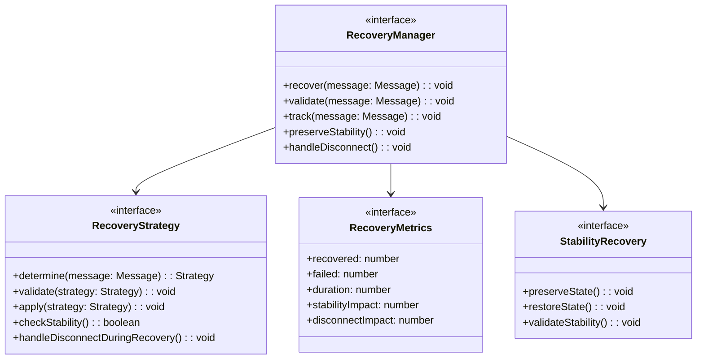

# WebSocket Implementation Design: Message System Components

## Preamble

This document provides detailed message system designs that implement the high-level 
architecture defined in machine.part.2.abstract.md.

### Document Dependencies
This document inherits all dependencies from `machine.part.2.abstract.md` and additionally requires:

1. `machine.part.2.concrete.core.md`: Core component design
   - Provides state management foundation
   - Defines base interfaces and types
   - Establishes validation patterns
   - Stability tracking requirements
   - Disconnect handling flows

2. `machine.part.2.concrete.protocol.md`: Protocol design
   - Defines protocol constraints
   - Establishes connection handling
   - Provides error classification
   - Stability monitoring
   - Disconnect processes

### Document Purpose
- Details message handling system
- Defines queuing mechanisms
- Establishes flow control
- Provides reliability guarantees
- Specifies stability preservation
- Defines disconnect behavior

### Document Scope

This document FOCUSES on:
- Message queuing implementation
- Flow control mechanisms
- Rate limiting systems
- Message processing
- Reliability handling
- Stability preservation
- Disconnect handling

This document does NOT cover:
- Core state implementations
- Protocol-specific handling
- Monitoring systems
- Configuration management

## 1. Message System Architecture

### 1.1 Core Message Components

### 1.2 Message Structure

## 2. Queue Management Requirements

### 2.1 Queue Operations

### 2.2 Queue Storage

## 3. Flow Control Requirements

### 3.1 Rate Limiting

## 4. Message Processing Requirements

### 4.1 Processing Pipeline

### 4.2 Message Transformation

## 5. Reliability Requirements

### 5.1 Message Reliability

### 5.2 Message Recovery

## 6. Performance Requirements

### 6.1 Performance Criteria
Must meet:

1. Throughput targets
   - Messages per second
   - Bytes per second
   - Queue operations
   - Processing time
   - Stability checks (≤ 50ms)
   - Disconnect handling (≤ 200ms)

2. Latency targets
   - Queue operations
   - Processing time
   - Transform time
   - Recovery time
   - Stability verification
   - Disconnect processing

3. Resource usage
   - Memory limits
   - CPU utilization
   - Queue size
   - Buffer usage
   - Stability tracking overhead
   - Disconnect cleanup resources

4. Stability requirements
   - Reconnection time ≤ 1s
   - State preservation 100%
   - Clean disconnect guaranteed
   - Resource cleanup verified
   - History maintained
   - Metrics preserved

### 6.2 Performance Monitoring
Must track:

1. Message metrics
   - Queue size
   - Processing rate
   - Error rate
   - Recovery rate
   - Stability violations
   - Disconnect events

2. System metrics
   - Memory usage
   - CPU usage
   - Thread usage
   - I/O operations
   - Stability overhead
   - Disconnect impact

3. Time metrics
   - Processing time
   - Queue time
   - Transform time
   - Recovery time
   - Stability checks
   - Disconnect handling

4. Stability metrics
   - Reconnection success rate
   - State preservation rate
   - Recovery effectiveness
   - History accuracy
   - Resource efficiency
   - Clean disconnect rate

## 7. Implementation Verification

### 7.1 Functional Testing
Must verify:

1. Message handling
   - Queue operations
   - Processing steps
   - Transformations
   - Recovery processes
   - Stability preservation
   - Disconnect flows

2. Flow control
   - Rate limiting
   - Backpressure
   - Drop policies
   - Queue limits
   - Stability impact
   - Disconnect handling

3. Reliability
   - Message delivery
   - Recovery processes
   - Retry handling
   - Error recovery
   - Stability guarantees
   - Clean disconnection

4. Stability verification
   - State preservation
   - Reconnection flows
   - History tracking
   - Metric accuracy
   - Resource cleanup
   - Disconnect completion

### 7.2 Performance Testing
Must verify:

1. Throughput tests
   - Maximum rate
   - Sustained rate
   - Burst handling
   - Recovery time
   - Stability overhead
   - Disconnect timing
   - Reconnection performance
   - State preservation speed

2. Latency tests
   - Processing time
   - Queue time
   - Transform time
   - Recovery time
   - Stability check latency
   - Disconnect handling time
   - Reconnection latency
   - State restoration time

3. Resource tests
   - Memory usage
   - CPU usage
   - Queue size
   - Buffer usage
   - Stability tracking overhead
   - Disconnect cleanup efficiency
   - State preservation cost
   - History maintenance impact

4. Stability tests
   - Reconnection success rate
   - State preservation accuracy
   - Recovery effectiveness
   - History integrity
   - Resource management
   - Clean disconnect rate
   - Metric preservation
   - Performance impact

### 7.3 Stress Testing
Must verify:

1. Load handling
   - Maximum concurrent messages
   - Queue saturation behavior
   - Backpressure effectiveness
   - Recovery under load
   - Stability under stress
   - Disconnect under load
   - Reconnection under pressure
   - Resource management

2. Failure scenarios
   - Network interruptions
   - System resource exhaustion
   - Queue overflow
   - Processing failures
   - Stability breaches
   - Disconnect failures
   - Recovery failures
   - State corruption

3. Recovery behavior
   - Message preservation
   - State recovery
   - Queue restoration
   - System stability
   - Performance recovery
   - Clean disconnect completion
   - Resource cleanup
   - History reconstruction

## 8. Security Requirements

### 8.1 Message Security
Must implement:

1. Data protection
   - Message encryption
   - Metadata protection
   - Queue security
   - State preservation security
   - Stability data protection
   - Disconnect reason security
   - History protection
   - Resource access control

2. Access control
   - Queue access validation
   - Processing authorization
   - Operation permissions
   - State access control
   - Stability monitoring rights
   - Disconnect authorization
   - Recovery permissions
   - Resource limitations

3. Validation
   - Message integrity
   - State consistency
   - Queue boundaries
   - Processing rules
   - Stability requirements
   - Disconnect conditions
   - Recovery criteria
   - Resource constraints

### 8.2 Security Monitoring
Must track:

1. Security events
   - Access attempts
   - Validation failures
   - Security breaches
   - State violations
   - Stability compromises
   - Unauthorized disconnects
   - Recovery violations
   - Resource abuse

2. Audit trails
   - Message handling
   - State changes
   - Queue operations
   - Processing steps
   - Stability events
   - Disconnect sequences
   - Recovery operations
   - Resource usage

3. Protection measures
   - Rate limiting
   - Access control
   - Data validation
   - State protection
   - Stability preservation
   - Disconnect safety
   - Recovery security
   - Resource guarding

## 9. Documentation Requirements

### 9.1 Implementation Documentation
Must include:

1. Architecture documentation
   - System design
   - Component interactions
   - State management
   - Queue handling
   - Stability mechanisms
   - Disconnect flows
   - Recovery procedures
   - Resource management

2. Interface documentation
   - API specifications
   - Message formats
   - Event definitions
   - State transitions
   - Stability interfaces
   - Disconnect protocols
   - Recovery interfaces
   - Resource APIs

3. Operation documentation
   - Configuration guides
   - Deployment procedures
   - Monitoring setup
   - Maintenance tasks
   - Stability management
   - Disconnect handling
   - Recovery processes
   - Resource optimization

### 9.2 Testing Documentation
Must include:

1. Test specifications
   - Test cases
   - Coverage requirements
   - Performance criteria
   - Validation rules
   - Stability verification
   - Disconnect validation
   - Recovery testing
   - Resource verification

2. Test results
   - Performance metrics
   - Coverage reports
   - Validation results
   - Security findings
   - Stability measurements
   - Disconnect confirmations
   - Recovery outcomes
   - Resource utilization

3. Maintenance procedures
   - Update processes
   - Migration guides
   - Rollback procedures
   - Recovery plans
   - Stability maintenance
   - Disconnect procedures
   - State preservation
   - Resource management

This specification provides comprehensive requirements for implementing the message system components while maintaining formal properties, security requirements, stability guarantees, and proper disconnect handling as defined in the v9 core specifications.