# WebSocket Implementation Design: Monitoring System Components

## Preamble

This document provides detailed monitoring system designs that implement the high-level 
architecture defined in machine.part.2.abstract.md.

### Document Dependencies
This document inherits all dependencies from `machine.part.2.abstract.md` and additionally requires:

1. `machine.part.2.concrete.core.md`: Core component design
   - Provides state tracking foundation
   - Defines base interfaces and types
   - Establishes validation patterns
   - Stability tracking requirements
   - Disconnect handling patterns

2. `machine.part.2.concrete.protocol.md`: Protocol design
   - Defines connection states
   - Establishes error patterns
   - Provides health check interfaces
   - Stability monitoring interfaces
   - Disconnect flow tracking

3. `machine.part.2.concrete.message.md`: Message system design
   - Defines message flow metrics
   - Establishes queue monitoring
   - Provides performance tracking
   - Stability preservation tracking
   - Disconnect state monitoring

### Document Purpose
- Details health monitoring system
- Defines performance tracking
- Establishes metrics collection
- Provides reporting framework
- Specifies stability monitoring
- Defines disconnect tracking

### Document Scope

This document FOCUSES on:
- Health check implementation
- Performance monitoring
- Error tracking systems
- Metrics collection
- Status reporting
- Stability verification
- Disconnect monitoring

## 1. Monitoring System Architecture

### 1.1 Core Monitoring Components
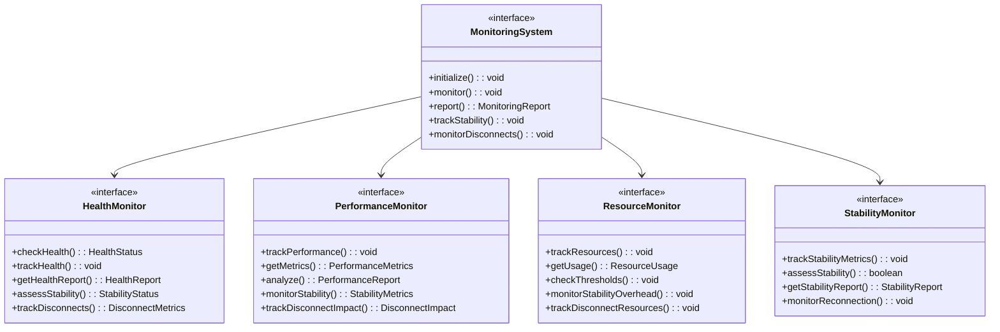

### 1.2 Monitoring Structure
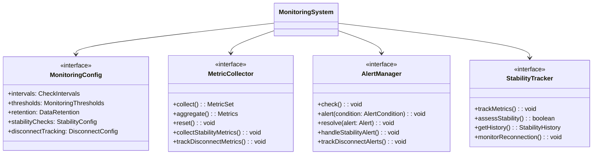

## 2. Health Monitoring Requirements

### 2.1 Component Health
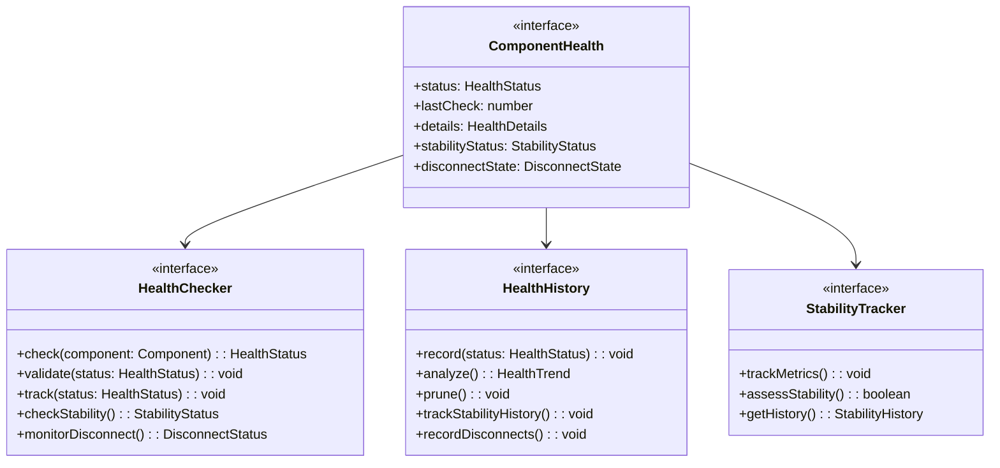

### 2.2 Health Metrics
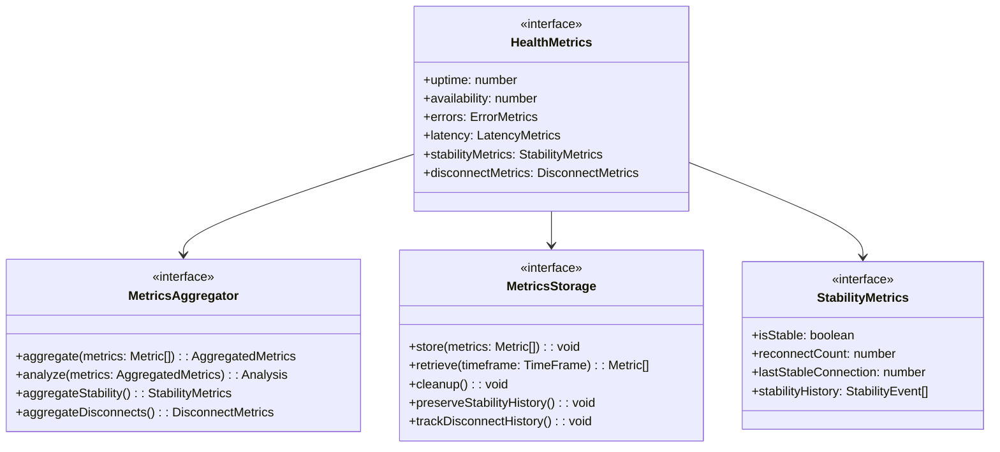

## 3. Performance Monitoring Requirements

### 3.1 Performance Tracking
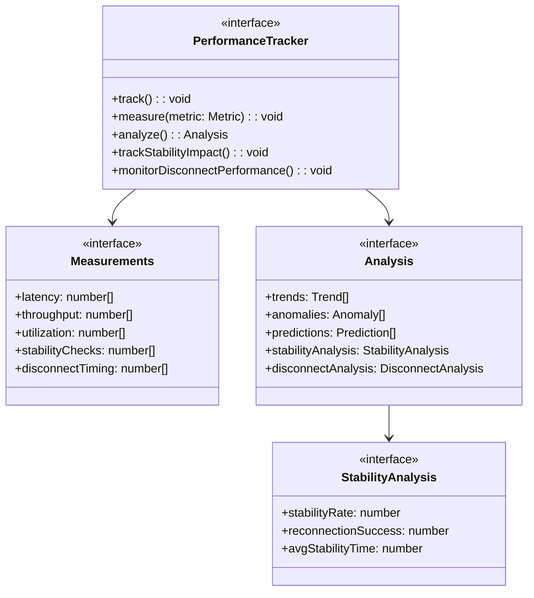

### 3.2 Resource Monitoring
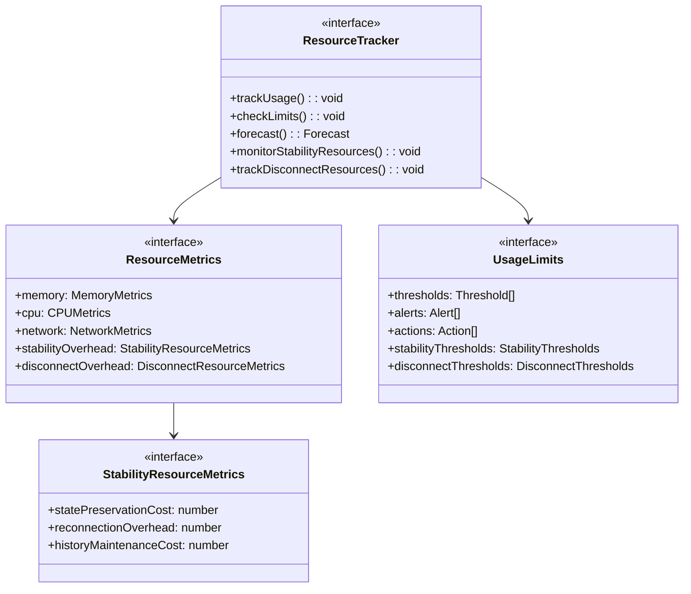

## 4. Connection Monitoring Requirements

### 4.1 Connection Tracking
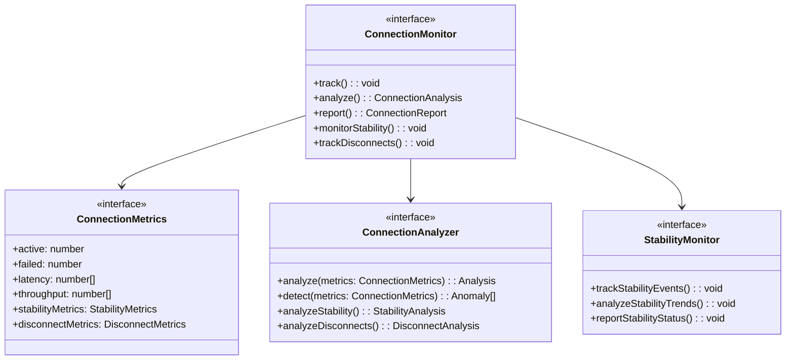

### 4.2 Protocol Monitoring
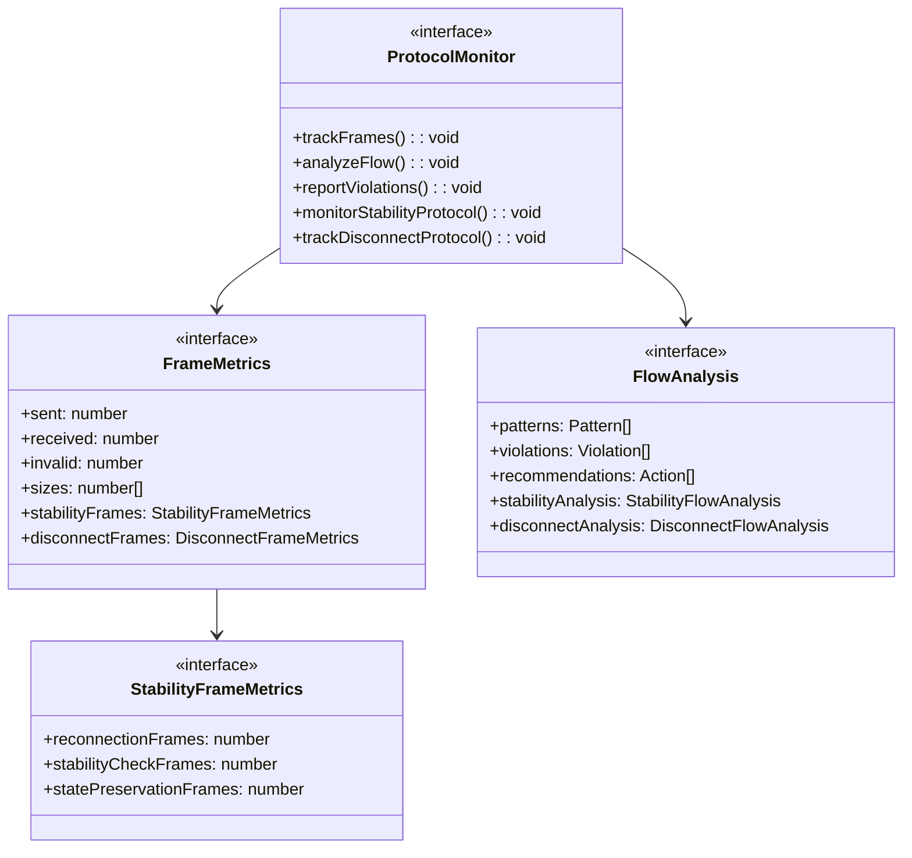

## 5. Message Monitoring Requirements

### 5.1 Message Tracking
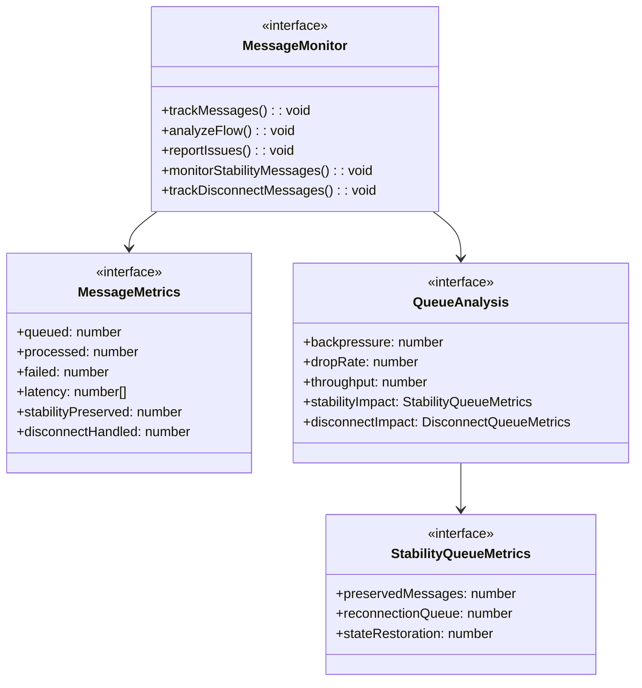

### 5.2 Flow Monitoring
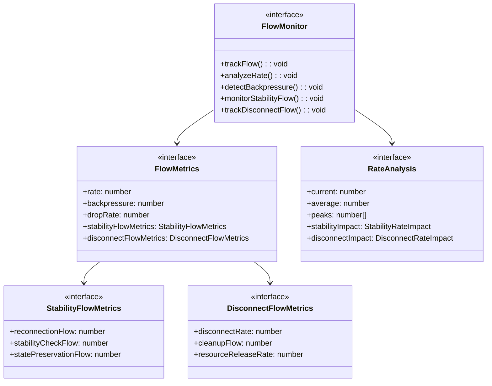

## 6. Error Monitoring Requirements

### 6.1 Error Tracking
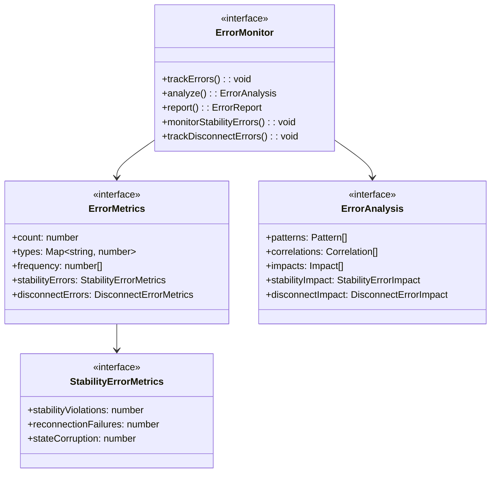

### 6.2 Recovery Monitoring
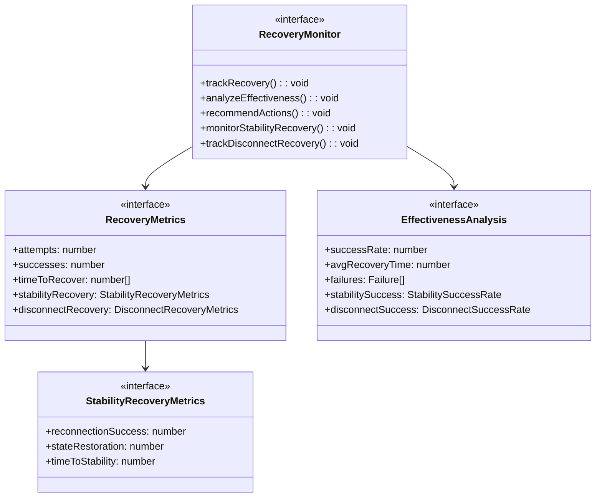

## 7. Implementation Verification

### 7.1 Monitoring Verification
Must verify:

1. Data collection
   - Metric accuracy
   - Collection frequency
   - Data completeness
   - Storage integrity
   - Stability metrics accuracy
   - Disconnect tracking completeness

2. Analysis accuracy
   - Calculation correctness
   - Trend detection
   - Anomaly detection
   - Prediction accuracy
   - Stability analysis precision
   - Disconnect pattern recognition

3. Alert system
   - Trigger accuracy
   - Alert delivery
   - Resolution tracking
   - Escalation paths
   - Stability alerts
   - Disconnect notifications

4. Stability verification
   - Reconnection tracking
   - State preservation monitoring
   - History accuracy
   - Metric consistency
   - Recovery validation

5. Disconnect verification
   - Clean shutdown monitoring
   - Resource cleanup tracking
   - State preservation validation
   - Recovery path monitoring

### 7.2 Performance Impact
Must verify:

1. Overhead limits
   - CPU usage
   - Memory usage
   - Network usage
   - Storage usage
   - Stability tracking overhead
   - Disconnect monitoring impact

2. Impact thresholds
   - Collection impact
   - Analysis impact
   - Storage impact
   - Alert impact
   - Stability verification impact
   - Disconnect tracking overhead

3. Stability overhead
   - State preservation cost
   - Reconnection monitoring
   - History maintenance
   - Metric processing

4. Disconnect overhead
   - Cleanup monitoring
   - Resource tracking
   - State verification
   - History maintenance

## 8. Security Requirements

### 8.1 Data Protection
Must implement:

1. Metric security
   - Data encryption
   - Access control
   - Audit logging
   - Data retention
   - Stability data protection
   - Disconnect data security

2. Alert security
   - Authentication
   - Authorization
   - Secure delivery
   - Audit trails
   - Stability alert protection
   - Disconnect notification security

3. Stability security
   - State protection
   - History encryption
   - Access control
   - Audit trails

4. Disconnect security
   - Reason protection
   - State preservation
   - Resource cleanup verification
   - Audit logging

### 8.2 Privacy Requirements
Must ensure:

1. Data privacy
   - PII protection
   - Data anonymization
   - Access controls
   - Retention limits
   - Stability data privacy
   - Disconnect reason privacy

2. Compliance
   - Regulatory compliance
   - Data governance
   - Audit requirements
   - Reporting standards
   - Stability tracking compliance
   - Disconnect handling compliance

This specification provides comprehensive monitoring requirements for the v9 WebSocket implementation, including stability tracking and disconnect monitoring capabilities while maintaining alignment with all core v9 specifications.