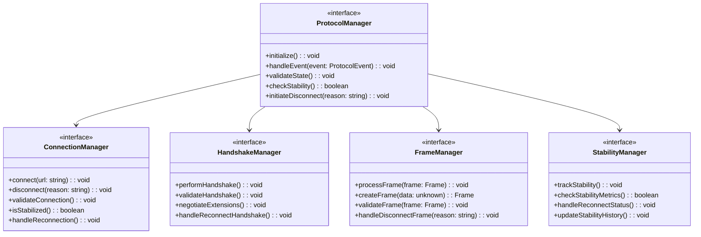
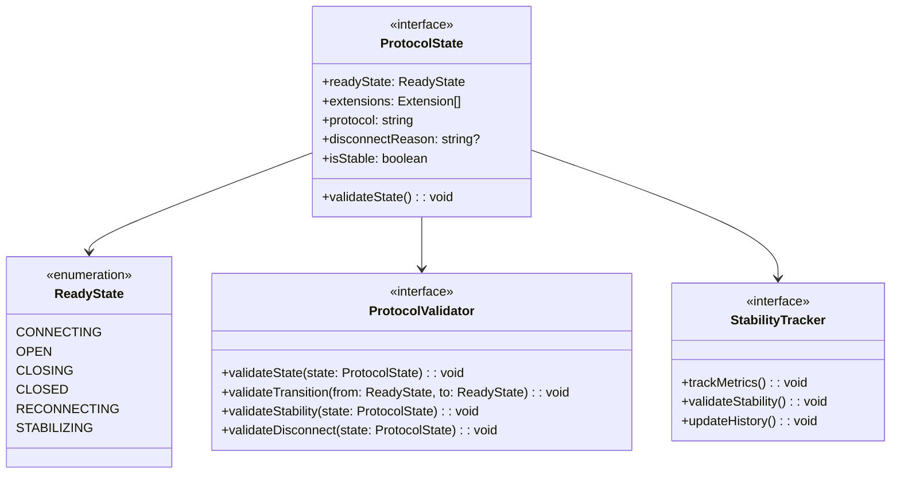
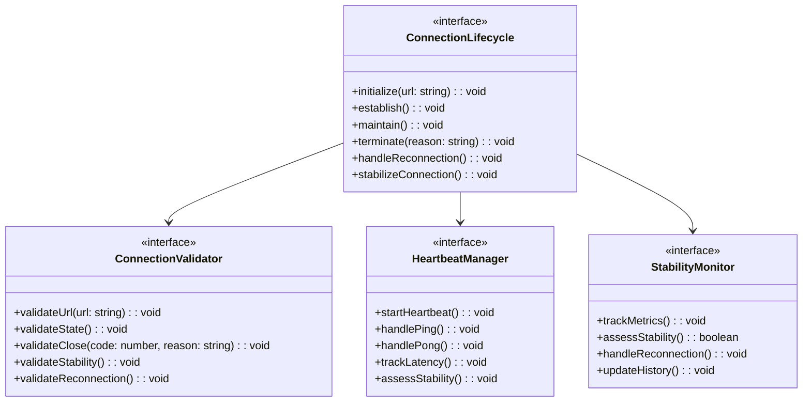
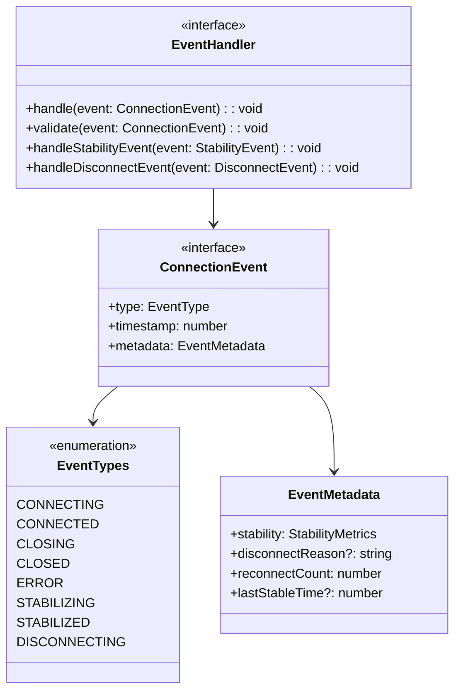
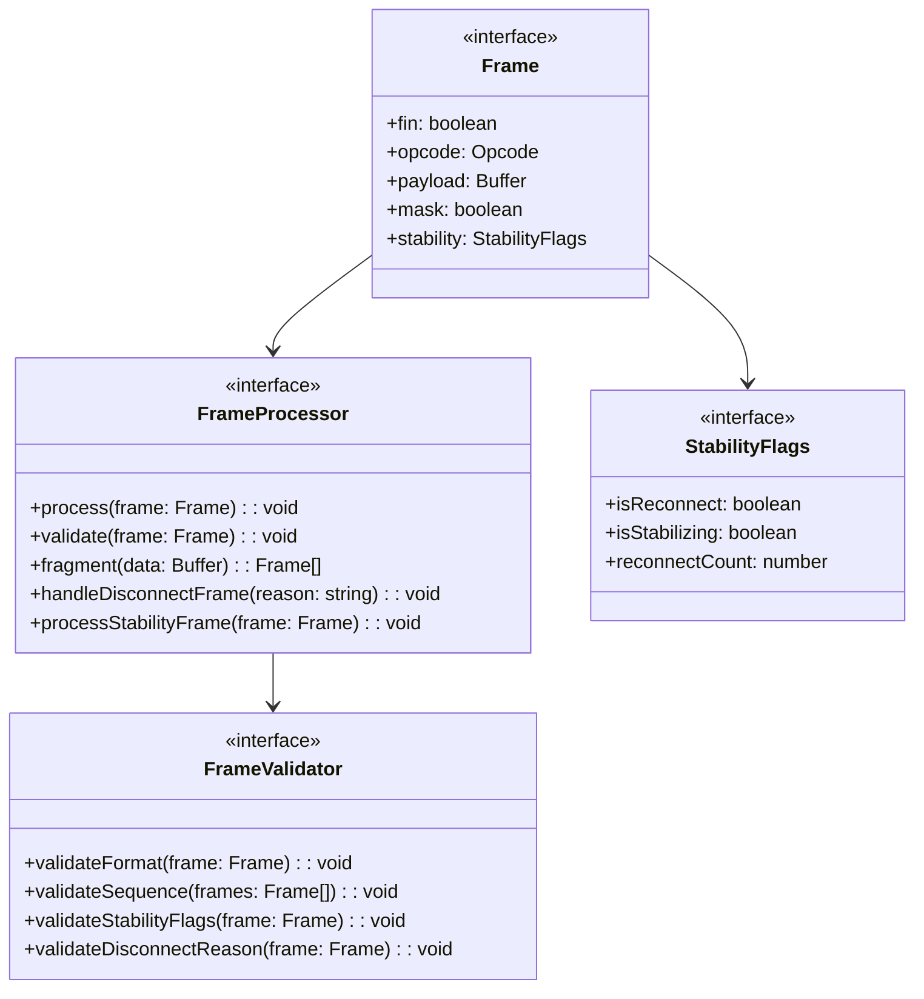
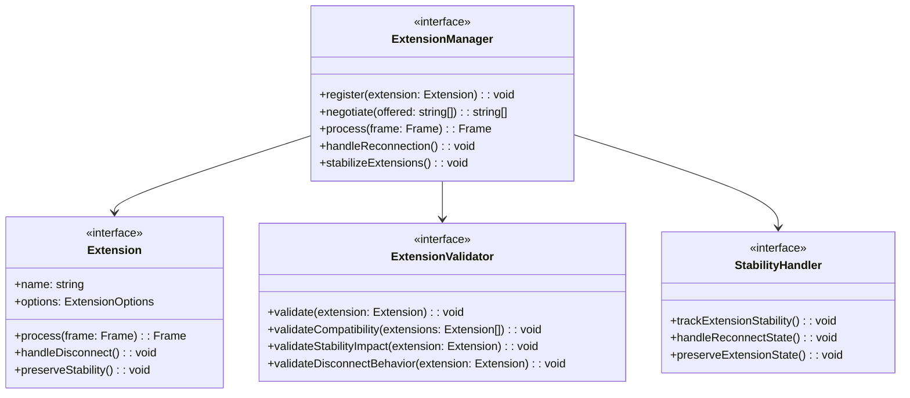
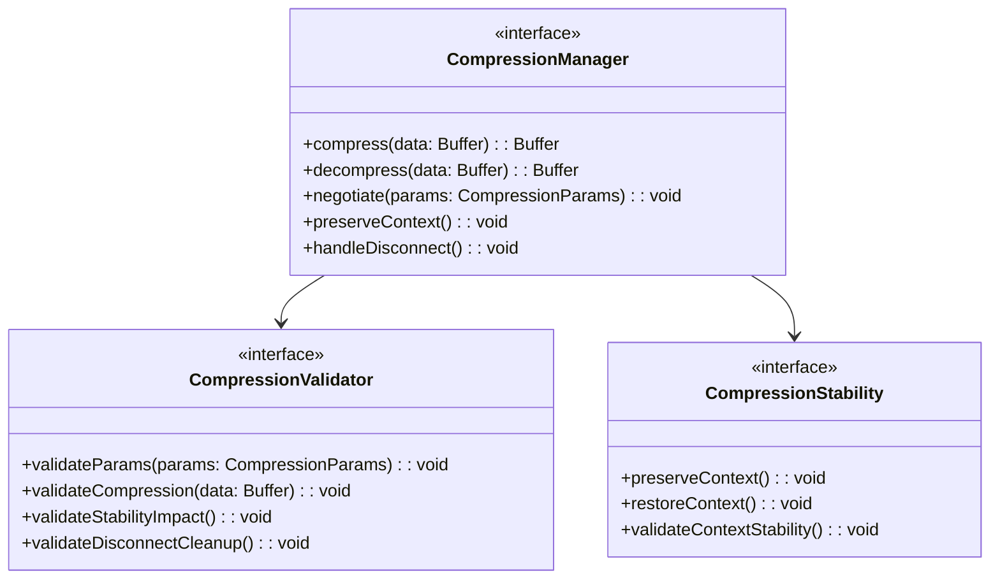
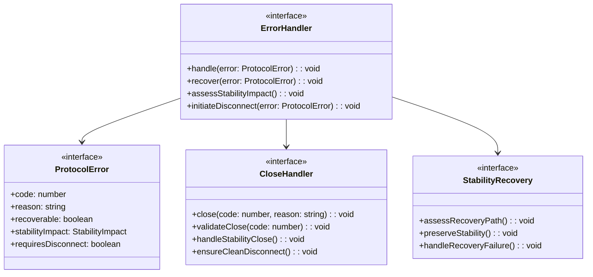
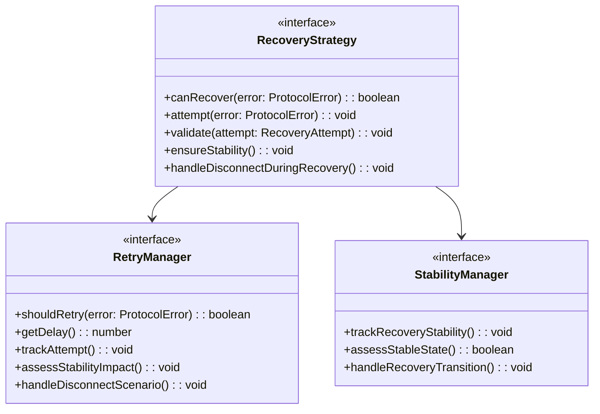

# WebSocket Implementation Design: Protocol Components

## Preamble

This document defines the WebSocket protocol implementation requirements that govern code generation based on the core state machine design. It specifies how protocol behaviors must be implemented while maintaining formal properties and enabling standardized connection management.

### Document Dependencies

This document inherits all dependencies from `machine.part.2.abstract.md` and additionally requires:

1. `machine.part.2.concrete.core.md`: Core design specifications
   - State machine implementation patterns
   - Interface and type definitions
   - Validation framework requirements
   - Extension mechanisms
   - Stability tracking requirements
   - Disconnect handling flows

### Document Purpose

- Define requirements for protocol implementation
- Specify connection lifecycle management patterns
- Establish error handling requirements
- Define protocol state mapping implementations
- Specify validation and verification criteria
- Define stability tracking implementation
- Specify disconnect handling flows

### Document Scope

This document SPECIFIES:
- Protocol state management requirements
- Connection handling patterns
- Event processing specifications
- Error classification system
- Protocol constraint validations
- Implementation verification criteria
- Stability monitoring requirements
- Disconnect process management

This document does NOT cover:
- Core state machine implementation
- Message queuing systems
- Monitoring implementations
- Configuration details

## 1. Protocol Component Architecture

### 1.1 Protocol Management Structure

Protocol components must:
1. Maintain WebSocket protocol standards
2. Handle protocol state transitions
3. Validate protocol operations
4. Manage connection lifecycle
5. Enable protocol extensions
6. Track connection stability
7. Handle graceful disconnection

### 1.2 Protocol State Management

## 2. Connection Management Requirements

### 2.1 Connection Lifecycle

Connection management must:
1. Handle connection establishment
2. Manage connection state
3. Handle graceful closure
4. Monitor connection health
5. Track connection stability
6. Manage reconnection flows

### 2.2 Connection Events

Event handling must:
1. Process protocol events
2. Validate event sequences
3. Track event timing
4. Maintain event history
5. Track stability events
6. Handle disconnect flows

## 3. Frame Processing Requirements

### 3.1 Frame Management

## 4. Protocol Extension Requirements

### 4.1 Extension Architecture

Extension system must:
1. Enable extension registration
2. Handle negotiation
3. Process extension data
4. Validate compatibility
5. Preserve stability
6. Handle disconnection

### 4.2 Compression Extension

## 5. Error Handling Requirements

### 5.1 Protocol Errors

### 5.2 Recovery Strategies

## 6. Implementation Verification

### 6.1 Protocol Verification

Must verify:

1. Protocol compliance
   - Handshake process
   - Frame format
   - Control frames
   - Extension negotiation
   - Stability tracking
   - Disconnect handling

2. Connection states
   - State transitions
   - Event sequences
   - Timeout handling
   - Closure processes
   - Stability transitions
   - Disconnect flows

3. Data handling
   - Frame processing
   - Message fragmentation
   - UTF-8 validation
   - Compression
   - Stability preservation
   - Disconnect cleanup

4. Stability verification
   - Reconnection flows
   - Stability metrics
   - History tracking
   - State preservation
   - Recovery validation

5. Disconnect verification
   - Clean shutdown
   - Resource cleanup
   - State preservation
   - Error handling
   - Recovery paths

### 6.2 Testing Requirements

Must include:

1. Protocol scenarios
   - Connection establishment
   - Data exchange
   - Extension negotiation
   - Graceful closure
   - Stability transitions
   - Disconnect sequences

2. Error scenarios
   - Network failures
   - Protocol violations
   - Timeout conditions
   - Invalid frames
   - Stability breaches
   - Disconnect errors

3. Performance scenarios
   - Connection time
   - Frame processing
   - Memory usage
   - Recovery time
   - Stability checks
   - Disconnect timing

4. Stability scenarios
   - Reconnection flows
   - State preservation
   - Metric tracking
   - History validation
   - Recovery paths

5. Disconnect scenarios
   - Clean shutdown
   - Error conditions
   - Resource cleanup
   - State preservation
   - Recovery handling

## 7. Security Requirements

### 7.1 Security Measures

Must implement:

1. Input validation
   - URL validation
   - Frame validation
   - UTF-8 checking
   - Length limits
   - Stability metrics