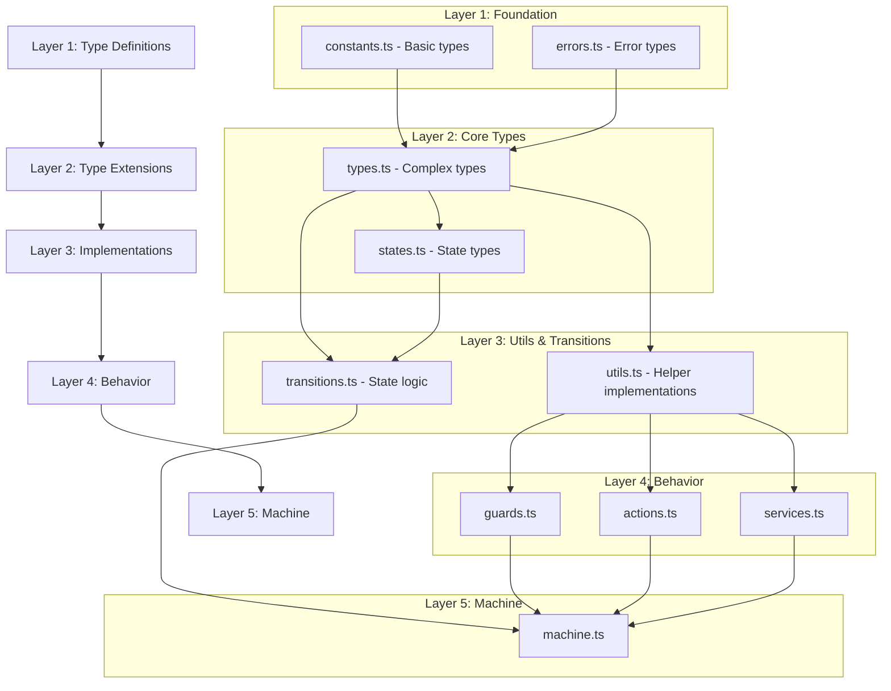

# WebSocket State Machine Verification Document

## Module Dependencies

## Layer Implementations

### Layer 1: Foundation

#### constants.ts
**Purpose**: 
Define all constant values and their basic types for the WebSocket state machine. This file serves as the single source of truth for all constant values used throughout the system.

**Usage**:
- Import when you need access to predefined constants
- Use for type definitions directly derived from constants
- Reference when you need standard configuration values
- Base other type definitions on these constants

| Must Contain | Must Not Contain |
|--------------|------------------|
| • Socket states (as const assertion) • Event types (as const assertion) • Config constants (as const assertion) • Close codes (as const assertion) • Basic type exports (e.g., `type State = typeof STATES[keyof typeof STATES]`) • Readonly property definitions | • Function declarations/implementations • Type guards • Validation logic • Helper functions • State management code • Default values without const assertions |

#### errors.ts
**Purpose**: 
Define the type system for error handling across the WebSocket state machine. This file establishes the error type hierarchy and interfaces for error handling.

**Usage**:
- Import when defining error-related types
- Use for creating error handling interfaces
- Reference when implementing error handling logic
- Base error implementations on these definitions

| Must Contain | Must Not Contain |
|--------------|------------------|
| • Error codes (as const assertion) • Error type definitions • Error interface definitions • Error context interfaces • ErrorCode type union • Readonly error properties • Error metadata types | • Error class implementations • Error throwing logic • Error handling functions • Validation methods • Error creation utilities • Helper functions • Runtime checks |

### Layer 2: Core Types

#### types.ts
**Purpose**: 
Define the core type system for the WebSocket state machine. This file provides the fundamental type definitions that describe the shape and structure of the system's data.

**Usage**:
- Import when you need core type definitions
- Use as the foundation for complex type compositions
- Reference when implementing interfaces
- Base implementation types on these definitions

| Must Contain | Must Not Contain |
|--------------|------------------|
| • Base event interface • WebSocket event type union • Context interface with readonly props • Timing metric interfaces • Rate limit interfaces • Message interfaces • Queue state interfaces • Configuration interfaces • Generic type parameters where needed | • Type guard implementations • Validation functions • Helper utilities • Actual values or instances • Runtime checks • State logic • Default implementations |

#### states.ts
**Purpose**: 
Define the type system for states and their metadata in the WebSocket state machine. This file establishes the structure for state definitions and their relationships.

**Usage**:
- Import when defining state-related structures
- Use for creating state type hierarchies
- Reference when implementing state logic
- Base state implementations on these definitions

| Must Contain | Must Not Contain |
|--------------|------------------|
| • State metadata interfaces • State definition interfaces • State validation interfaces • State history interfaces • Transition type definitions • Invariant interfaces • State action interfaces • State guard interfaces | • State validation logic • State management code • Helper functions • Runtime checks • Implementation logic • State instances • Default values |

### Layer 3: Implementations

#### utils.ts
**Purpose**: 
Provide generic, reusable utility functions that handle common operations and data manipulations. This file serves as the foundation layer for all basic operations that aren't specific to state machine logic.

**Usage**:
- Use for any generic operations that could be used outside the state machine context
- Import when you need basic data manipulation, validation, or helper functions
- Use as the foundation layer for higher-level operations in transitions.ts
- Call these utilities from any layer above to handle common tasks

| Must Contain | Must Not Contain |
|--------------|------------------|
| **Generic Utilities:** • Generic helper functions (data conversion, formatting) • Generic type guards (isWebSocketEvent, isValidPayload) • Generic validation (URLs, data formats) • Generic context manipulation (create, update) • Generic error handling utilities • Metric calculations (bytes, timing) • Rate limiting calculations • Pure mathematical functions • Data structure manipulation **Generic State Utilities:** • Context validation • Basic state checks • Event payload validation • Message queue operations | • State transition logic • State machine logic • Transition validation • State history tracking • State-specific guards • Machine-specific logic • WebSocket operations • Non-pure functions • Type definitions (use imports) • Circular dependencies |

#### transitions.ts
**Purpose**: 
Handle all state machine-specific logic and manage the lifecycle of states and transitions. This file is responsible for the core state machine behavior and ensures state transitions are valid and properly managed.

**Usage**:
- Use for all state machine-specific operations and logic
- Import when implementing state changes or transition validation
- Use to manage state history and transition sequences
- Call from the machine layer to handle state changes

| Must Contain | Must Not Contain |
|--------------|------------------|
| **State Machine Specifics:** • State transition logic • State change validation • Transition mapping implementation • State invariant checking • State history tracking • State-specific error handling • Transition guards implementation • State cleanup logic • State timing tracking **Transition-specific:** • Transition event handling • Transition validation rules • State sequence management • State recovery logic | • Generic utility functions • Generic validation logic • Generic type guards • Basic context operations • General purpose helpers • WebSocket operations • Non-pure functions • Type definitions (use imports) • Data formatting • Metric calculations |

## XState v5 Compliance

### Type System Requirements
- [ ] Use readonly type definitions for immutable data
- [ ] Use proper const assertions
- [ ] Implement proper type inference
- [ ] Avoid `any` type unless explicitly needed
- [ ] Use proper discriminated unions for events

### Implementation Requirements
- [ ] Pure functions only
- [ ] No direct state mutations
- [ ] Proper actor model usage
- [ ] Type-safe action implementations
- [ ] Proper service definitions

### Breaking Changes from v4
- [ ] Remove v4 action objects
- [ ] Use new guard syntax
- [ ] Use new service syntax
- [ ] Implement proper type inference
- [ ] Use new action creators

## Testing Strategy

### Layer 1 & 2 Tests
- Type compilation tests only
- Interface compatibility tests
- Constant immutability tests
- NO runtime tests needed

### Layer 3 Tests
- Implementation unit tests
- Integration tests
- Edge case testing
- Performance testing
- Error handling tests

## Implementation Verification

### Pre-implementation
- [ ] Layer boundaries are clear
- [ ] Dependencies are identified
- [ ] XState v5 patterns reviewed
- [ ] Testing strategy defined

### During Implementation
- [ ] Layer separation maintained
- [ ] No cross-layer implementation leaks
- [ ] Pure functions used
- [ ] Type safety maintained

### Post-implementation
- [ ] All tests passing
- [ ] No type errors
- [ ] Documentation complete
- [ ] Performance acceptable

## Review Checklist

### Code Review
- [ ] Layer boundary compliance
- [ ] Implementation correctness
- [ ] Error handling
- [ ] Type safety
- [ ] Documentation

### Architecture Review
- [ ] Layer separation
- [ ] Dependency management
- [ ] XState v5 compliance
- [ ] Testing coverage