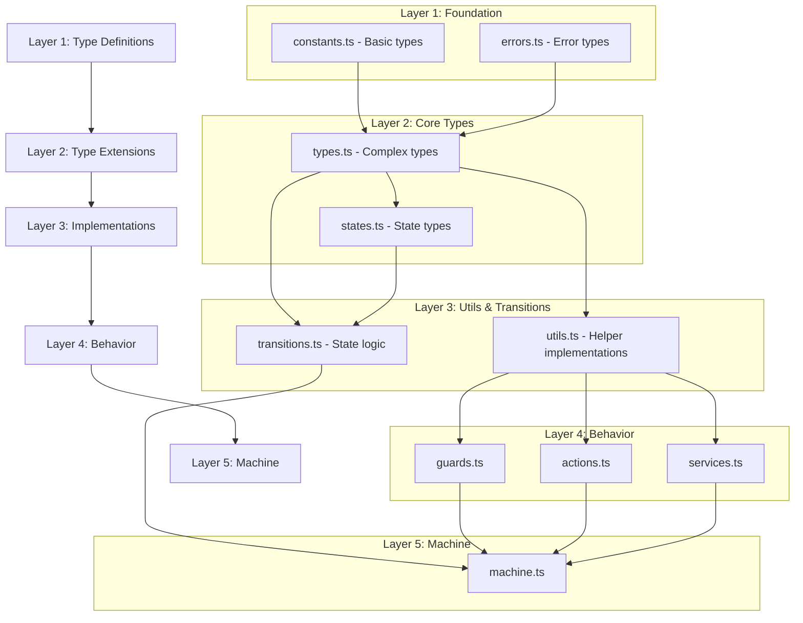

# WebSocket State Machine Verification Document

## Module Dependencies

## File Content Matrix

### Layer 1: Foundation

| File | Must Contain | Must Not Contain |
|------|--------------|------------------|
| constants.ts | • Socket states (as const assertion) • Event types (as const assertion) • Config constants (as const assertion) • Close codes (as const assertion) • Basic type exports (e.g., `type State = typeof STATES[keyof typeof STATES]`) • Readonly property definitions | • Function declarations/implementations • Type guards • Validation logic • Helper functions • State management code • Default values without const assertions |
| errors.ts | • Error codes (as const assertion) • Error type definitions • Error interface definitions • Error context interfaces • ErrorCode type union • Readonly error properties • Error metadata types | • Error class implementations • Error throwing logic • Error handling functions • Validation methods • Error creation utilities • Helper functions • Runtime checks |

### Layer 2: Core Types

| File | Must Contain | Must Not Contain |
|------|--------------|------------------|
| types.ts | • Base event interface • WebSocket event type union • Context interface with readonly props • Timing metric interfaces • Rate limit interfaces • Message interfaces • Queue state interfaces • Configuration interfaces • Generic type parameters where needed | • Type guard implementations • Validation functions • Helper utilities • Actual values or instances • Runtime checks • State logic • Default implementations |
| states.ts | • State metadata interfaces • State definition interfaces • State validation interfaces • State history interfaces • Transition type definitions • Invariant interfaces • State action interfaces • State guard interfaces | • State validation logic • State management code • Helper functions • Runtime checks • Implementation logic • State instances • Default values |

### Layer 3: Implementations

| File | Must Contain | Must Not Contain |
|------|--------------|------------------|
| utils.ts | • Helper function implementations • Type guard implementations • Validation utility implementations • Context creation/updates • Error handling utilities • URL validation • Metric calculation • Rate limit logic • Byte formatting • Data conversions | • Type definitions (use imports) • Interface definitions • Constant definitions • State machine logic • Direct WebSocket operations • Non-pure functions |
| transitions.ts | • Transition validation implementation • State change logic • State history tracking • Error recovery implementation • Transition guards implementation • Cleanup logic • Event processing • State invariant checks • Transition timing tracking | • Type definitions (use imports) • Interface definitions • Constant values • Direct WebSocket operations • Non-pure functions |

## Layer Dependency Rules

1. Layer 1 (Foundation):
   - constants.ts: No dependencies
   - errors.ts: May depend on constants.ts

2. Layer 2 (Core Types):
   - types.ts: May depend on Layer 1
   - states.ts: May depend on types.ts and Layer 1

3. Layer 3 (Implementations):
   - utils.ts: May depend on Layer 1 and types.ts
   - transitions.ts: May depend on Layer 1, Layer 2, and utils.ts

4. Layer 4 (Behavior):
   - All files may depend on Layers 1-3
   - No circular dependencies allowed

5. Layer 5 (Machine):
   - May depend on all previous layers
   - No circular dependencies allowed

## XState v5 Compliance

### Type System
- [ ] Readonly type definitions where appropriate
- [ ] Proper use of const assertions
- [ ] Proper type inference setup
- [ ] No use of any without explicit reason

### Implementation Patterns
- [ ] Pure functions for all implementations
- [ ] No state mutations
- [ ] Proper actor model usage
- [ ] Proper service definitions

### Breaking Changes
- [ ] No v4 action objects
- [ ] Using new guard syntax
- [ ] Using new service syntax
- [ ] Proper type inference setup

## Testing Requirements

### Layer 1 & 2 Tests
Focus:
- Type compilation
- Constant immutability
- Interface compatibility
- Type relationships

Test Types:
- [ ] Type compilation tests
- [ ] Interface compilation tests
- [ ] Constant immutability tests
- [ ] NO runtime tests needed

### Layer 3 Tests
Focus:
- Implementation correctness
- Error handling
- Edge cases
- Performance

Test Types:
- [ ] Unit tests
- [ ] Integration tests
- [ ] Edge case tests
- [ ] Performance tests
- [ ] Error handling tests

## Implementation Verification Checklist

### Pre-implementation
- [ ] Layer boundaries clear
- [ ] Dependencies identified
- [ ] XState v5 patterns reviewed
- [ ] Testing strategy defined

### During Implementation
- [ ] Layer separation maintained
- [ ] No cross-layer implementation leaks
- [ ] Pure functions used
- [ ] Type safety maintained

### Post-implementation
- [ ] All tests passing
- [ ] No type errors
- [ ] Documentation complete
- [ ] Performance acceptable

## Review Checklist

### Code Review
- [ ] Layer boundary compliance
- [ ] Implementation correctness
- [ ] Error handling
- [ ] Type safety
- [ ] Documentation

### Architecture Review
- [ ] Layer separation
- [ ] Dependency management
- [ ] XState v5 compliance
- [ ] Testing coverage