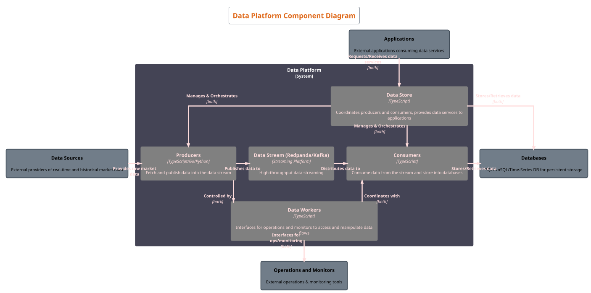

### Data Platform Component Diagram (C4 Style)

```plantuml
@startuml
!theme C4_superhero from <C4/themes>
!include <C4/C4_Component>
HIDE_STEREOTYPE()
LAYOUT_TOP_DOWN()
scale 1350 width
skinparam linetype ortho
skinparam backgroundcolor transparent

<style>
element {
  MinimumWidth 100
  MaximumWidth 400
  Fontcolor green
}
</style>

UpdateSystemBoundaryStyle($bgColor="#445",$fontColor="white",$borderStyle=SolidLine(),$borderColor="#445")
UpdateElementStyle(component,$bgColor="gray",$fontColor="#fdd",$borderColor="gray")
UpdateRelStyle(#fdd, #fdd)

title Data Platform Component Diagram

System_Ext(source, "Data Sources", "External providers of real-time and historical market data")
System_Ext(app, "Applications", "External applications consuming data services")
System_Ext(db, "Databases", "SQL/NoSQL/Time-Series DB for persistent storage")
System_Ext(iapp, "Operations and Monitors", "External operations & monitoring tools")

System_Boundary(data_platform, "Data Platform") {
  Component(producer, "Producers", "TypeScript/Go/Python", "Fetch and publish data into the data stream")
  Component(kafka, "Data Stream (Redpanda/Kafka)", "Streaming Platform", "High-throughput data streaming")
  Component(consumer, "Consumers", "TypeScript", "Consume data from the stream and store into databases")
  Component(data_store, "Data Store", "TypeScript", "Coordinates producers and consumers, provides data services to applications")
  Component(worker, "Data Workers", "TypeScript", "Interfaces for operations and monitors to access and manipulate data flows")
}

' Relationships
Rel_R(source, producer, "Provides raw market data")
Rel_R(producer, kafka, "Publishes data to")
Rel_R(kafka, consumer, "Distributes data to")
Rel_R(consumer, db, "Stores/Retrieves data")
Rel_D(data_store, producer, "Manages & Orchestrates", "both")
Rel_D(data_store, consumer, "Manages & Orchestrates", "both")
Rel_D(producer, worker, "Controlled by", "back")
Rel_U(worker, consumer, "Coordinates with", "both")
Rel_D(app, data_store, "Requests/Receives data services", "both")
Rel_D(worker, iapp, "Interfaces for ops/monitoring", "both")
Rel(data_store, db, "Stores/Retrieves data", "both")

@enduml
```

