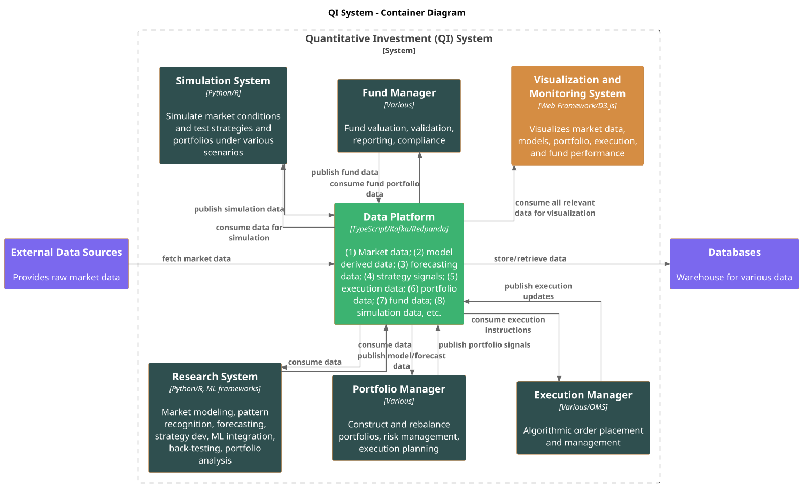

```plantuml
@startuml
!theme C4_brown from <C4/themes>
!include <C4/C4_Container>
HIDE_STEREOTYPE()
LAYOUT_TOP_DOWN()
scale 1500 width
skinparam linetype ortho
skinparam nodesep 80
skinparam backgroundcolor transparent

title QI System - Container Diagram

AddContainerTag("Data Platform", $bgColor="MediumSeaGreen",$fontColor="#fff")
AddContainerTag("Execution Manager",$bgColor="DarkSlateGrey")
AddContainerTag("Fund Manager",$bgColor="DarkSlateGrey")
AddContainerTag("Portfolio Manager",$bgColor="DarkSlateGrey")
AddContainerTag("Simulation System",$bgColor="DarkSlateGrey")
AddContainerTag("Research",$bgColor="DarkSlateGrey")
AddSystemTag("Data Sources",$bgColor="MediumSlateBlue")
AddSystemTag("Databases",$bgColor="MediumSlateBlue")

' External Systems
System_Ext(market_data,"External Data Sources","Provides raw market data",$tags="Data Sources")
System_Ext(data_store,"Databases","Warehouse for various data",$tags="Databases")

' QI System Boundary
System_Boundary(qi_boundary, "Quantitative Investment (QI) System") {
  
  Container(data_platform, "Data Platform", "TypeScript/Kafka/Redpanda", "(1) Market data; (2) model derived data; (3) forecasting data; (4) strategy signals; (5) execution data; (6) portfolio data; (7) fund data; (8) simulation data, etc.", $tags="Data Platform")

  Container(research, "Research System", "Python/R, ML frameworks", "Market modeling, pattern recognition, forecasting, strategy dev, ML integration, back-testing, portfolio analysis", $tags="Research")

  Container(portfolio, "Portfolio Manager", "Various", "Construct and rebalance portfolios, risk management, execution planning", $tags="Portfolio Manager")

  Container(execution, "Execution Manager", "Various/OMS", "Algorithmic order placement and management", $tags="Execution Manager")

  Container(simulator, "Simulation System", "Python/R", "Simulate market conditions and test strategies and portfolios under various scenarios", $tags="Simulation System")

  Container(fund, "Fund Manager", "Various", "Fund valuation, validation, reporting, compliance", $tags="Fund Manager")

  Container(visualization, "Visualization and Monitoring System", "Web Framework/D3.js", "Visualizes market data, models, portfolio, execution, and fund performance", $tags="Visualization and Monitoring System")
}

' Relationships
Rel_R(market_data, data_platform, "fetch market data")
Rel_D(data_platform, research, "consume data")
Rel_U(research, data_platform, "publish model/forecast data")

Rel_D(data_platform, portfolio, "consume data")
Rel_U(portfolio, data_platform, "publish portfolio signals")

Rel_U(execution, data_platform, "publish execution updates")
Rel_D(data_platform, execution, "consume execution instructions")

Rel_D(simulator, data_platform, "publish simulation data")
Rel_U(data_platform, simulator, "consume data for simulation")

Rel_D(fund, data_platform, "publish fund data")
Rel_U(data_platform, fund, "consume fund portfolio data")

Rel_U(data_platform, visualization, "consume all relevant data for visualization")

Rel_R(data_platform, data_store, "store/retrieve data")

@enduml
```