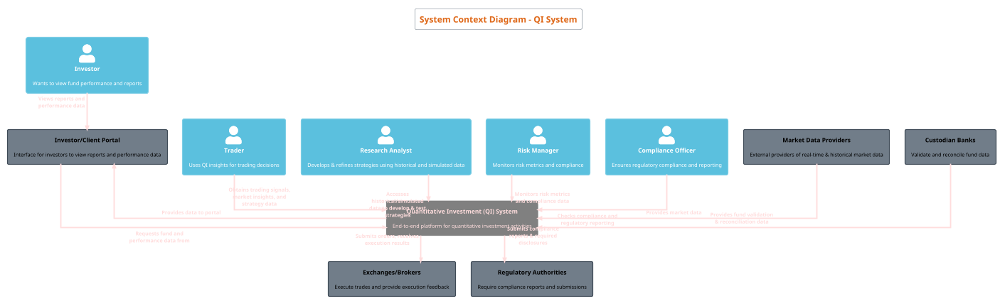

## Context diagram

Below is the `System Context Diagram` that represents the `Quantitative Investment (QI) System` as a single black box in the center, showing only the external entities (people and systems) that interact with it. This high-level view—aligned with the C4 model’s System Context diagram—omits internal details and focuses solely on what lies outside the QI System boundary.

**Key Points of the System Context Diagram**:

- **Central System (QI System)**: Represented as a single “System” boundary, encompassing all internal complexity.
  
- **External People (Actors)**:
  - **Investor**: Interested in the performance of their investments.
  - **Trader**: Uses the system’s signals and data to make informed trading decisions.
  - **Researcher**: Develops and refines quantitative strategies by leveraging QI System data and tools.
  - **Risk Manager**: Monitors risk metrics and ensures adherence to risk management practices.
  - **Compliance Officer**: Checks the system’s output to ensure it aligns with regulatory requirements.

- **External Systems**:
  - **Market Data Providers**: Supply raw data the QI System uses for modeling and analysis.
  - **Exchanges/Brokers**: Execute the orders sent from the QI System.
  - **Custodian Banks**: Validate and reconcile fund data.
  - **Regulatory Authorities**: Require data, reports, and audits to ensure the system’s compliance.
  - **Investor/Client Portal**: Interface where investors and stakeholders view reports generated by the QI System.

This diagram helps non-technical stakeholders quickly understand the "big picture" of who and what interacts with the QI System.

**Interpretation**:
- The QI System sits at the center as the main system.
- External data (e.g., market data) flows into the QI System from providers.
- The QI System sends trade instructions out to Exchanges/Brokers.
- Custodian Banks provide validation and reconciliation services.
- Regulatory Authorities receive compliance information from the QI System.
- Investors indirectly interact via an Investor/Client Portal which fetches data from the QI System.
- Internal roles (Trader, Researcher, Risk Manager, Compliance Officer, Operations Staff) represent users who interact with the QI System’s interfaces, dashboards, or services.

This context diagram effectively conveys the external environment, the QI System’s primary roles, and how it integrates within a broader financial ecosystem.

---
