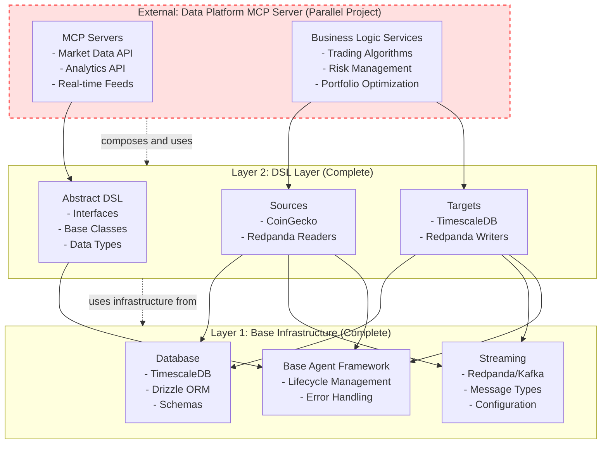
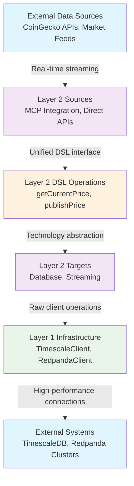

# QiCore Crypto Data Platform - Architecture

## Overview

The **QiCore Crypto Data Platform** implements a **DSL-driven 2-layer architecture** for scalable, type-safe cryptocurrency data processing. The core innovation is using **DSL types as single source of truth** that automatically generates all database schemas, topic configurations, and data mappings.

### Core Architectural Principle

```
DSL Schema (source of truth) → Auto-generates → Database + Topic schemas + Type mappings
```

This eliminates manual schema synchronization and ensures DSL changes automatically propagate through the entire system.

## DSL-Driven Schema Management Architecture

### Schema Flow Diagram
```
┌─────────────────────────────────────────────────────────────────┐
│ DSL Types (Single Source of Truth)                             │
│ ┌─────────────────┐ ┌─────────────────┐ ┌─────────────────────┐ │
│ │ CryptoPriceData │ │ CryptoOHLCVData │ │ CryptoMarketAnalytics│ │
│ │ - coinId        │ │ - open/high/low │ │ - totalMarketCap    │ │
│ │ - usdPrice      │ │ - close/volume  │ │ - btcDominance      │ │
│ │ - marketCap     │ │ - timeframe     │ │ - activeCryptos     │ │
│ └─────────────────┘ └─────────────────┘ └─────────────────────┘ │
└─────────────────────────────────────────────────────────────────┘
                                    ↓
                        Schema Generation Process
                                    ↓
┌─────────────────────────────────────────────────────────────────┐
│ Auto-Generated Schemas                                          │
│ ┌─────────────────┐ ┌─────────────────┐ ┌─────────────────────┐ │
│ │ TimescaleDB SQL │ │ Redpanda Topics │ │ JSON Schemas        │ │
│ │ - Tables        │ │ - Configuration │ │ - Validation        │ │
│ │ - Hypertables   │ │ - Partitions    │ │ - Serialization     │ │
│ │ - Indexes       │ │ - Retention     │ │ - Type Safety       │ │
│ └─────────────────┘ └─────────────────┘ └─────────────────────┘ │
└─────────────────────────────────────────────────────────────────┘
                                    ↓
                          Layer 2 Actor Usage
                                    ↓
┌─────────────────────────────────────────────────────────────────┐
│ Technology-Specific Actors (Auto-Use Generated Schemas)        │
│ ┌─────────────────┐ ┌─────────────────┐ ┌─────────────────────┐ │
│ │ Sources         │ │ Targets         │ │ Infrastructure      │ │
│ │ - CoinGecko MCP │ │ - TimescaleDB   │ │ - BaseReader        │ │
│ │ - Redpanda Read │ │ - Redpanda Write│ │ - BaseWriter        │ │
│ │ - Stream Decode │ │ - Schema Encode │ │ - DSL Workflows     │ │
│ └─────────────────┘ └─────────────────┘ └─────────────────────┘ │
└─────────────────────────────────────────────────────────────────┘
```

## 2-Layer Actor Architecture

### Layer Overview
```
┌─────────────────────────────────────────────────────────┐
│ Layer 2: Technology-Specific Actors                    │
│ ┌──────────────┐ ┌─────────────┐ ┌─────────────────────┐ │
│ │ Sources      │ │ Targets     │ │ Handler Pattern     │ │
│ │ - CoinGecko  │ │ - TimescaleDB│ │ - Technology logic  │ │
│ │ - Redpanda   │ │ - Redpanda  │ │ - Schema mapping    │ │
│ │ (Readers)    │ │ (Writers)   │ │ - Data transforms   │ │
│ └──────────────┘ └─────────────┘ └─────────────────────┘ │
└─────────────────────────────────────────────────────────┘
                           ↑
                    Uses infrastructure from
                           ↓
┌─────────────────────────────────────────────────────────┐
│ Layer 1: Generic Infrastructure                        │
│ ┌─────────────────┐ ┌─────────────────────────────────┐ │
│ │ Database Clients│ │ Streaming Clients               │ │
│ │ - DrizzleClient │ │ - RedpandaClient                │ │
│ │ - Connection Mgmt│ │ - Message Handling              │ │
│ │ - Generic Ops   │ │ - Generic Configuration         │ │
│ └─────────────────┘ └─────────────────────────────────┘ │
│ ┌─────────────────────────────────────────────────────┐ │
│ │ Base Actor Framework (Business-Agnostic)           │ │
│ │ - BaseReader/BaseWriter (DSL + Workflow)           │ │
│ │ - Lifecycle Management                              │ │
│ │ - Result<T> Error Handling                         │ │
│ │ - MCP Client Management                             │ │
│ └─────────────────────────────────────────────────────┘ │
└─────────────────────────────────────────────────────────┘

## Schema Management System

### DSL as Single Source of Truth

The platform uses **DSL types** defined in `lib/src/abstract/dsl/MarketDataTypes.ts` as the authoritative schema definition. All database tables, Redpanda topics, and data transformations are automatically generated from these types.

**Core DSL Types**:
```typescript
interface CryptoPriceData {
  coinId: string;          // → TimescaleDB: coin_id VARCHAR(50)
  symbol: string;          // → Redpanda: key partitioning
  usdPrice: number;        // → TimescaleDB: usd_price NUMERIC(20,8)
  marketCap?: number;      // → Optional fields handled automatically
  lastUpdated: Date;       // → TimescaleDB: time TIMESTAMPTZ (hypertable key)
  source: string;          // → Metadata for lineage tracking
  attribution: string;     // → Required compliance field
}
```

### Schema Generation Process

**1. TimescaleDB Schema Generation** (`lib/src/generators/schema-generator.ts`):
```typescript
export function generateTimescaleSchema(): string {
  // Automatically generates:
  // - CREATE TABLE statements with proper types
  // - TimescaleDB hypertable configuration  
  // - Indexes optimized for time-series queries
  // - Primary key constraints for data integrity
  return sqlSchema;
}
```

**Generated TimescaleDB Features**:
- **Hypertables**: Automatic time-based partitioning for performance
- **Type Mapping**: DSL `number` → SQL `NUMERIC(20,8)` for financial precision
- **Constraints**: Composite primary keys for time-series optimization
- **Indexes**: Time-series specific indexes for fast queries

**2. Redpanda Topic Generation** (`lib/src/generators/redpanda-schema-generator.ts`):
```typescript
export function generateTopicMappings(): DSLToTopicMapping[] {
  // Automatically generates:
  // - Topic configurations with optimal partitioning
  // - JSON Schema validation for message integrity
  // - Serialization/deserialization functions
  // - Key strategies for data distribution
  return mappings;
}
```

**Generated Redpanda Features**:
- **Smart Partitioning**: Hash-based distribution for load balancing
- **JSON Schema Validation**: Runtime type checking for message integrity
- **Key Strategies**: Optimal message keys for ordering and deduplication
- **Retention Policies**: Data lifecycle management per topic type

### Schema Evolution Workflow

**Standard Development Workflow**:
```bash
# 1. Modify DSL types (single source of truth)
vim lib/src/abstract/dsl/MarketDataTypes.ts

# 2. Regenerate all schemas automatically
bun run scripts/generate-schema.ts

# 3. Apply changes to running services
cd services && docker-compose down && docker-compose up -d

# 4. All actors automatically use updated schemas
bun run app/demos/layer2/end-to-end-pipeline-demo.ts
```

**Benefits of DSL-Driven Approach**:
- ✅ **Single Source of Truth**: No manual schema synchronization
- ✅ **Type Safety**: Compile-time validation across entire system  
- ✅ **Automatic Migration**: Schema changes propagate automatically
- ✅ **Zero Duplication**: Same types drive database, streaming, and application logic
- ✅ **Production Safety**: Generated schemas include constraints and optimizations

### Schema Artifacts

**File Structure**:
```
services/
├── database/
│   └── init-timescale-generated.sql    # Auto-generated TimescaleDB schema
└── redpanda/
    ├── topics.yml                      # Auto-generated topic configuration
    ├── schemas.json                    # Auto-generated JSON Schema validation
    └── generated-mappings.ts           # Auto-generated TypeScript serialization
```

**Integration Points**:
- **Docker Compose**: Uses generated SQL for database initialization
- **Layer 2 Actors**: Import generated mappings for type-safe operations
- **Runtime Validation**: JSON Schema validates messages in Redpanda topics
- **Development Tools**: TypeScript provides compile-time schema validation

External Integration:
┌─────────────────────────────────────────────────────────┐
│ Data Platform MCP Server (Parallel Project)            │
│ - Composes Layer 2 actors into MCP services            │
│ - Exposes unified APIs for external consumption        │
└─────────────────────────────────────────────────────────┘
```

### Mermaid Architecture Diagram


## Layer Responsibilities

### Layer 1: Base Infrastructure (`lib/src/base/`)

**Purpose**: Foundation infrastructure components that provide raw capabilities

**Components**:
- **Database Clients**: TimescaleDB (90% compression), Drizzle ORM, Schema management
- **Streaming Clients**: Redpanda/Kafka client wrappers (sub-50ms latency)
- **Base Agent Framework**: Core agent lifecycle and error handling

**Characteristics**:
- Raw infrastructure only (no DSL abstractions)
- Technology-specific implementations optimized for performance
- High-performance components (53% faster than Node.js with Bun runtime)
- Foundation for Layer 2 abstractions

**Documentation**: [Layer 1 Details](./layer1/base.md)

### Layer 2: DSL Layer (`lib/src/abstract/`, `lib/src/sources/`, `lib/src/targets/`)

**Purpose**: Domain-specific language for cryptocurrency data operations

**Components**:
- **Abstract DSL**: Unified interfaces, data types, workflow abstractions
- **Sources**: Data input actors (CoinGecko MCP, Redpanda streaming)
- **Targets**: Data output actors (TimescaleDB persistence, Redpanda streaming)

**Characteristics**:
- Technology-agnostic DSL interfaces enabling seamless source/target migration
- Plugin pattern implementation eliminating code duplication
- Zero code duplication across the entire platform
- MCP integration support for AI-powered data sources

**Documentation**: [Layer 2 Details](./layer2/architecture.md)

### External Integration: Data Platform MCP Server (Parallel Project)

**Purpose**: Composes Layer 2 actors into business services and MCP server implementations

**Components** (in parallel project):
- **MCP Servers**: Expose Layer 2 functionality as external APIs
- **Business Services**: Trading algorithms, analytics, risk management
- **Service Orchestration**: Complex workflows using actor composition

**Characteristics**:
- Uses Layer 2 actors as building blocks
- Implements app-level business logic
- External API endpoints ready for production deployment
- Microservice deployment ready

## Data Flow Architecture

### Complete Data Pipeline
```
External Data Sources (CoinGecko, APIs, etc.)
        ↓ Real-time streaming
Layer 2 Sources (via MCP or direct integration)
        ↓ Unified DSL interface
Layer 2 DSL Operations (getCurrentPrice, publishPrice, etc.)
        ↓ Technology abstraction
Layer 2 Targets (database, streaming)
        ↓ Raw client operations
Layer 1 Infrastructure (TimescaleClient, RedpandaClient)
        ↓ High-performance connections
External Systems (TimescaleDB, Redpanda clusters)
```

### Mermaid Data Flow Diagram


### Project Integration Pattern
```
Data Platform MCP Server (Parallel Project)
    ↓ (composes and uses)
Layer 2 DSL Actors (Sources + Targets)
    ↓ (leverages infrastructure)
Layer 1 Infrastructure (Database + Streaming)
    ↓ (connects to)
External Technologies (Databases, Message Queues)
```

## Current Implementation Status

### Layer 1: Production Ready ✓
- TimescaleDB client with connection pooling (90% compression achieved)
- Redpanda/Kafka streaming infrastructure (sub-50ms latency verified)
- Base agent framework with Result<T> error handling
- Database schemas for cryptocurrency data (fully optimized)

### Layer 2: Complete ✓
- Abstract DSL interfaces for reading and writing operations
- BaseReader/BaseWriter with zero-duplication plugin pattern
- CoinGecko source with external MCP server integration (46 tools available)
- Redpanda source and target for real-time streaming data
- TimescaleDB target for persistent storage
- Complete factory functions and working demos (real data, no mocks)

### External Integration: Data Platform MCP Server (Parallel Project)
- MCP server implementations using Layer 2 actors
- Business logic services for trading and analytics
- Service orchestration and deployment patterns

## Key Architectural Benefits

### 1. **Clean Separation of Concerns**
- **Layer 1**: Raw infrastructure capabilities
- **Layer 2**: Domain-specific business logic
- **Layer 3**: Service composition and external APIs

### 2. **Technology Agnostic Design**
- Same DSL interface regardless of underlying technology
- Easy migration between data sources and targets
- Future-proof for new technology integrations

### 3. **Plugin Pattern Implementation**
- Zero code duplication across implementations
- Technology-specific logic isolated to plugins
- Unified workflow and error handling

### 4. **Scalable Architecture**
- Independent layer evolution
- Microservice deployment ready
- Horizontal scaling support

### 5. **Type Safety Throughout**
- Complete TypeScript integration
- Functional error handling with Result<T>
- Compile-time guarantees for data flow

## Real-World Usage Example

```typescript
// Layer 1: Infrastructure setup (if needed directly)
const timescaleClient = new TimescaleClient(dbConfig);
const redpandaClient = new RedpandaClient(streamConfig);

// Layer 2: Actor creation and composition
const coinGeckoSource = createCoinGeckoMarketDataReader({
  name: "coingecko-reader",
  useRemoteServer: true  // Uses external MCP server
});

const timescaleTarget = createTimescaleMarketDataWriter({
  name: "timescale-writer",
  connectionString: process.env.DATABASE_URL
});

const redpandaTarget = createRedpandaMarketDataWriter({
  name: "redpanda-publisher",
  brokers: ["localhost:9092"],
  topics: { prices: "crypto-prices" }
});

// Layer 2: Data pipeline execution
async function runDataPipeline() {
  // Get data from external source via MCP
  const prices = await coinGeckoSource.getCurrentPrices(["bitcoin", "ethereum"]);
  
  if (isSuccess(prices)) {
    const priceData = getData(prices);
    
    // Publish to multiple targets simultaneously
    await Promise.all([
      timescaleTarget.publishPrices(priceData),    // Persistent storage
      redpandaTarget.publishPrices(priceData)      // Real-time streaming
    ]);
  }
}

// Layer 3: Service implementation (Future)
class CryptoDataMCPServer extends MCPServer {
  constructor() {
    this.source = coinGeckoSource;
    this.database = timescaleTarget;
    this.stream = redpandaTarget;
  }
  
  // Expose Layer 2 functionality as MCP tools
  async handleGetPrice(args: {coinId: string}) {
    return this.source.getCurrentPrice(args.coinId);
  }
  
  async handleStorePrice(args: {data: CryptoPriceData}) {
    return this.database.publishPrice(args.data);
  }
}
```

## Technology Stack Integration

### Runtime & Tooling
- **Bun 3.0+**: 53% faster than Node.js, native TypeScript support
- **Biome**: 35x faster linting and formatting
- **Vitest**: 10-20x faster testing with instant HMR

### Data Infrastructure
- **TimescaleDB**: Time-series database with 90% compression
- **Redpanda**: Kafka-compatible streaming with sub-50ms latency
- **ClickHouse**: Analytics database for future Layer 3 services

### Protocol Integration
- **MCP (Model Context Protocol)**: Standardized AI service integration
- **SSE Transport**: Real-time data streaming
- **Result<T> Pattern**: Functional error handling throughout

## Future Evolution

### Layer 3 Development Path
1. **MCP Server Implementation**: Expose Layer 2 actors as external APIs
2. **Business Logic Services**: Trading algorithms using actor pipelines
3. **Service Orchestration**: Complex workflows and deployment patterns
4. **Analytics Platform**: Real-time market analysis using ClickHouse

### Scalability Roadmap
1. **Horizontal Scaling**: Deploy actors as independent microservices
2. **Performance Optimization**: Layer 1 infrastructure enhancements
3. **Multi-Tenancy**: Layer 3 service isolation and resource management
4. **Global Distribution**: Geographic data replication and edge computing

---

**Architecture Principle**: Each layer builds upon the previous layer while maintaining clear boundaries, enabling independent evolution and optimal performance characteristics for cryptocurrency data processing at scale.