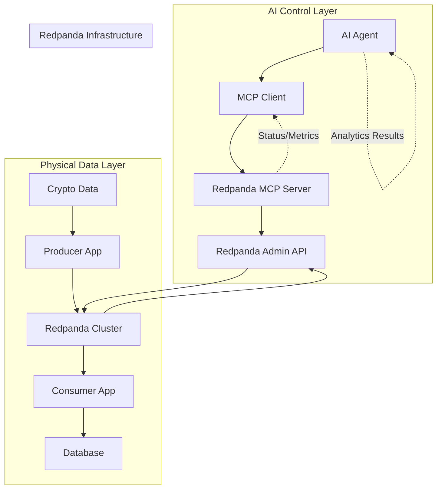
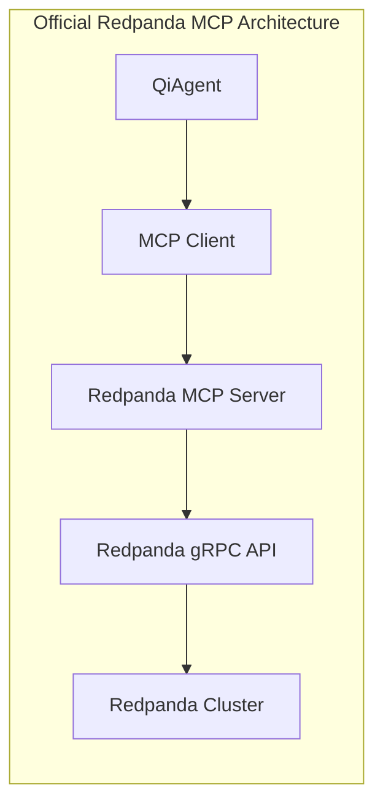

# Official Redpanda MCP Server Integration

## Overview

This document covers the **Official Redpanda MCP Server** approach for high-performance streaming infrastructure with AI control.

**Important**: When we say "Official MCP Server" we mean the **Official Redpanda MCP Server** built by Redpanda team using `protoc-gen-go-mcp`, not a generic MCP server.

## Complete Architecture

### Architecture Overview


### Text Diagram (ASCII)
```
┌─────────────────────────────────────────────────────────────────────────┐
│                        Pure Redpanda Architecture                       │
├─────────────────────────────────────────────────────────────────────────┤
│                                                                         │
│ AI Agent ──→ MCP Client ──→ Redpanda MCP Server ──→ Redpanda Cluster   │
│     ↑                           │                      │                │
│     │                           │                      ↓                │
│     └──── Analytics Results ────┼──── Admin Commands → Topics/Messages  │
│                                 │                      │                │
│                                 │                      ↓                │
│                                 └──── Status/Metrics ← Admin API       │
│                                                                         │
└─────────────────────────────────────────────────────────────────────────┘
```

## Why Pure Redpanda?

### **Primary Advantages**
- ✅ **100% FREE** - No licensing restrictions ever
- ✅ **53% faster than Kafka** - C++ implementation vs JVM
- ✅ **Single binary** - No ZooKeeper, JVM, or external dependencies
- ✅ **Kafka-compatible** - Works with all Kafka tooling
- ✅ **Built-in schema registry** - No separate Confluent dependency
- ✅ **Lower resource usage** - Smaller memory footprint
- ✅ **Simpler operations** - One service to manage

### **Recommended Architecture: Official Redpanda MCP Server**



**Why This Approach:**
- ✅ **Official Redpanda** - Built and maintained by Redpanda team
- ✅ **Auto-generated** - From gRPC .proto files using `protoc-gen-go-mcp`
- ✅ **Production ready** - Enterprise-grade reliability with official support
- ✅ **Complete API coverage** - All Redpanda features available
- ✅ **Standardized** - Follows MCP protocol correctly

**Correct Flow:** QiAgent → MCP Client → Official Redpanda MCP Server → Redpanda Cluster

## Implementation

### 1. Physical Redpanda Cluster Setup

### Docker Compose Configuration
```yaml
# docker-compose.yml - Pure Redpanda streaming infrastructure
version: '3.8'
services:
  redpanda:
    image: redpandadata/redpanda:v23.3.3
    container_name: redpanda
    ports:
      - "9092:9092"    # Kafka API
      - "9644:9644"    # Admin API  
      - "8082:8082"    # HTTP Proxy
      - "8081:8081"    # Schema Registry
    command: |
      redpanda start
      --kafka-addr internal://0.0.0.0:9092,external://0.0.0.0:19092
      --advertise-kafka-addr internal://redpanda:9092,external://localhost:19092
      --pandaproxy-addr internal://0.0.0.0:8082,external://0.0.0.0:18082
      --advertise-pandaproxy-addr internal://redpanda:8082,external://localhost:18082
      --schema-registry-addr internal://0.0.0.0:8081,external://0.0.0.0:18081
      --rpc-addr redpanda:33145
      --advertise-rpc-addr redpanda:33145
      --smp 4
      --memory 4G
      --mode dev-container
    volumes:
      - redpanda_data:/var/lib/redpanda/data
    networks:
      - crypto_net
    healthcheck:
      test: ["CMD-SHELL", "rpk cluster health"]
      interval: 30s
      timeout: 10s
      retries: 5

volumes:
  redpanda_data:

networks:
  crypto_net:
    driver: bridge
```

### Initial Setup
```bash
# Start Redpanda
docker-compose up -d redpanda

# Wait for startup
sleep 30

# Create crypto data topics
docker exec redpanda rpk topic create crypto-ohlcv --partitions 3 --replicas 1
docker exec redpanda rpk topic create crypto-prices --partitions 3 --replicas 1
docker exec redpanda rpk topic create crypto-analytics --partitions 2 --replicas 1

# Verify cluster health
docker exec redpanda rpk cluster health
docker exec redpanda rpk topic list
```

### 2. Official Redpanda MCP Server Setup

#### Installation
```bash
# Install Redpanda CLI (includes MCP server)
go install github.com/redpanda-data/redpanda/src/go/rpk@latest

# Or use Docker
docker pull redpandadata/redpanda:latest

# Install protoc-gen-go-mcp (if building custom MCP servers)
go install github.com/redpanda-data/protoc-gen-go-mcp@latest
```

#### Start MCP Server
```bash
# Start the official Redpanda MCP server
rpk mcp server --brokers localhost:9092

# With authentication (if needed)
rpk mcp server --brokers localhost:9092 --sasl-mechanism PLAIN --sasl-username user --sasl-password pass
```

#### MCP Server Configuration
```typescript
// src/mcp-servers/redpanda-mcp-config.ts
export const redpandaMCPConfig = {
  server: 'rpk',
  command: 'rpk',
  args: ['mcp', 'server', '--brokers', 'localhost:9092'],
  transport: 'stdio',
  environment: {
    REDPANDA_BROKERS: 'localhost:9092',
    RPK_MCP_LOG_LEVEL: 'info'
  }
};
```

### 3. QiAgent Implementation

### QiAgent with Official Redpanda MCP
```typescript
// src/agents/redpanda-streaming-agent.ts
import { BaseAgent } from '@qicore/agent-lib/qiagent';
import { MCPClient } from '@qicore/agent-lib/qimcp/client';

export class RedpandaStreamingAgent extends BaseAgent {
  private redpandaMCP: MCPClient;

  constructor() {
    super('redpanda-streaming-agent');
    // Connect to official Redpanda MCP server
    this.redpandaMCP = new MCPClient('stdio://rpk-mcp-server');
  }

  async initialize(): Promise<void> {
    await this.redpandaMCP.connect();
    await this.setupCryptoTopics();
    console.log('✅ Redpanda Streaming Agent initialized with official MCP');
  }

  // Topic Management via MCP
  async createTopic(name: string, partitions: number = 3, replicationFactor: number = 1): Promise<void> {
    await this.redpandaMCP.call('create_topic', {
      name,
      partitions,
      replication_factor: replicationFactor
    });
    console.log(`✅ Created topic: ${name}`);
  }

  async listTopics(): Promise<string[]> {
    const result = await this.redpandaMCP.call('list_topics');
    return result.topics.map(topic => topic.name);
  }

  async deleteTopic(name: string): Promise<void> {
    await this.redpandaMCP.call('delete_topic', { name });
    console.log(`🗑️ Deleted topic: ${name}`);
  }

  async describeTopic(name: string): Promise<any> {
    return await this.redpandaMCP.call('describe_topic', { name });
  }

  // Consumer Group Management via MCP
  async listConsumerGroups(): Promise<any[]> {
    const result = await this.redpandaMCP.call('list_consumer_groups');
    return result.groups;
  }

  async describeConsumerGroup(groupId: string): Promise<any> {
    return await this.redpandaMCP.call('describe_consumer_group', { group_id: groupId });
  }

  async resetConsumerGroupOffset(groupId: string, topic: string, toLatest: boolean = true): Promise<void> {
    await this.redpandaMCP.call('reset_consumer_group_offset', {
      group_id: groupId,
      topic,
      to_latest: toLatest
    });
    console.log(`🔄 Reset offset for group ${groupId} on topic ${topic}`);
  }

  // Cluster Information via MCP
  async getClusterInfo(): Promise<any> {
    return await this.redpandaMCP.call('cluster_info');
  }

  // Message Operations via MCP
  async publishMessage(topic: string, message: any, key?: string): Promise<void> {
    await this.redpandaMCP.call('produce_message', {
      topic,
      key,
      value: typeof message === 'string' ? message : JSON.stringify(message)
    });
  }

  async setupCryptoTopics(): Promise<void> {
    console.log('🏗️ Setting up crypto data topics...');
    
    const requiredTopics = [
      { name: 'crypto-ohlcv', partitions: 3 },
      { name: 'crypto-prices', partitions: 3 },
      { name: 'crypto-analytics', partitions: 2 }
    ];

    const existingTopics = await this.listTopics();

    for (const topic of requiredTopics) {
      if (!existingTopics.includes(topic.name)) {
        await this.createTopic(topic.name, topic.partitions);
      } else {
        console.log(`ℹ️ Topic already exists: ${topic.name}`);
      }
    }
  }

  async monitorStreaming(): Promise<void> {
    console.log('🔍 Monitoring Redpanda infrastructure...');
    
    // Check cluster health via MCP
    const clusterInfo = await this.getClusterInfo();
    console.log(`📊 Cluster: ${clusterInfo.brokers.length} brokers, controller: ${clusterInfo.controller}`);
    
    // Check consumer groups and lag via MCP
    const consumerGroups = await this.listConsumerGroups();
    console.log(`👥 Active consumer groups: ${consumerGroups.length}`);
    
    for (const group of consumerGroups) {
      try {
        const groupDetails = await this.describeConsumerGroup(group.group_id);
        console.log(`👥 Group ${group.group_id}: ${groupDetails.state} (${groupDetails.members.length} members)`);
      } catch (error) {
        console.error(`❌ Error checking group ${group.group_id}:`, error);
      }
    }
  }

  async cleanup(): Promise<void> {
    await this.redpandaMCP.disconnect();
    console.log('🔌 Redpanda Streaming Agent cleanup completed');
  }
}
```

## Available MCP Tools

```typescript
// Official Redpanda MCP server capabilities
interface RedpandaMCPTools {
  // Topic Management
  create_topic: (params: {
    name: string;
    partitions?: number;
    replication_factor?: number;
    config?: Record<string, string>;
  }) => Promise<void>;

  delete_topic: (params: {
    name: string;
  }) => Promise<void>;

  list_topics: () => Promise<{
    topics: Array<{
      name: string;
      partitions: number;
      replication_factor: number;
    }>;
  }>;

  describe_topic: (params: {
    name: string;
  }) => Promise<{
    name: string;
    partitions: Array<{
      partition: number;
      leader: number;
      replicas: number[];
      isr: number[];
    }>;
    config: Record<string, string>;
  }>;

  // Consumer Group Management
  list_consumer_groups: () => Promise<{
    groups: Array<{
      group_id: string;
      state: string;
      protocol_type: string;
    }>;
  }>;

  describe_consumer_group: (params: {
    group_id: string;
  }) => Promise<{
    group_id: string;
    state: string;
    members: Array<{
      member_id: string;
      client_id: string;
      assignments: Array<{
        topic: string;
        partitions: number[];
      }>;
    }>;
  }>;

  reset_consumer_group_offset: (params: {
    group_id: string;
    topic: string;
    partition?: number;
    to_offset?: number;
    to_earliest?: boolean;
    to_latest?: boolean;
  }) => Promise<void>;

  // Cluster Operations
  cluster_info: () => Promise<{
    cluster_id: string;
    brokers: Array<{
      node_id: number;
      host: string;
      port: number;
    }>;
    controller: number;
  }>;

  // Message Operations (if enabled)
  produce_message: (params: {
    topic: string;
    key?: string;
    value: string;
    headers?: Record<string, string>;
    partition?: number;
  }) => Promise<{
    partition: number;
    offset: number;
  }>;

  consume_messages: (params: {
    topic: string;
    group_id: string;
    timeout_ms?: number;
    max_messages?: number;
  }) => Promise<{
    messages: Array<{
      topic: string;
      partition: number;
      offset: number;
      key?: string;
      value: string;
      headers?: Record<string, string>;
      timestamp: number;
    }>;
  }>;
}
```

## Summary

This Official Redpanda MCP approach provides:

1. **Official Support** - Built and maintained by Redpanda team
2. **Correct MCP Architecture** - Agent → MCP Client → MCP Server → Redpanda
3. **High Performance** - 53% faster than Kafka, single binary
4. **Production Ready** - Enterprise-grade reliability
5. **Complete API Coverage** - All Redpanda features via MCP
6. **Zero Vendor Lock-in** - Open source, Apache 2.0 license

The architecture follows proper MCP patterns while leveraging Redpanda's official tooling for maximum reliability and feature completeness.