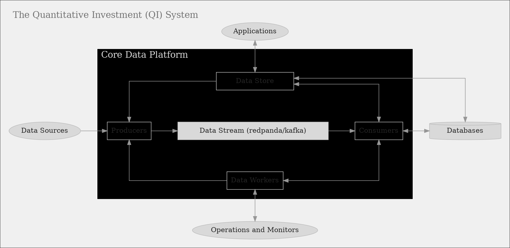

## Investment platform

**Investment** is about processing various type of information, most of which are in the form of data stream, making investment decision, executing decision, and managing investment portfolio.

An **investment system** is a system to manage the day-to-day primary investment activities, such as trading, risk management, portfolio management, investment strategy development, and so on. We view activities of the investment process as **operations** acting on **information flow**, With such view, the main design of the system is to decouple operations from the information flow.

A **quantitative investment system** is a system that is

1. capable of quantifying the operations with models and logic so that operations can be implemented in the (software) system;
2. utilizing software engineering framework and tools to model and implement information flow, providing interface for operations to access or to communicate with information flow.

The **data platform** in this proposal is the platform of modeling and implementing the information flow, in other words, _the data platform provides data services for the operations_.

---

## Overview of the data platform

### Scope

The scope of the data platform is to provide data services for the operations. The data platform has the following **functionalities**:

- **Data services**: The system provides data services via the `data store` and the `data worker` components. Both components provide clean interface to communicate with users. `data store` encapsulating the internal complexities from users, while `data workers` exposes the internal `producer` and `consumer` to its users. The users of the `data store` interface are called applications (of the data platform). These kind of applications need to consume data from the data platform, but no need to publish data in the platform. While the users of the `data workers` interface are called operations. They usually not only need to consume data from the data platform, but also need to publish data in the data platform.

- **Historical data acquisition**: The `Producer` component fetches historical data (assets, exchanges, most active assets, OHLCV, tick data) from external sources and publishes it to the internal data stream using `redpanda/kafka` which standardizes data ingestion.

- **Real-time tick data feed**: The system obtains real-time tick data from external sources.

- **Data consumption and storage**: The `Consumer` component consumes data from the data stream and stores it into databases.

### Key Mechanisms

- **Decoupling operations from data flow:** By separating the logic of operations from the data flow, the system promotes modularity and flexibility, and thus allows components operate independently but communicate with applications via well-defined interfaces.

- **Utilizing data flow for cross-language communication:** Using data streams (e.g., Kafka) to communicate between components written in different languages (TypeScript, Go, Python), which allows components to interact regardless of implementation language.

- **Reactive state machine-driven design:** Employing state machines (e.g., **xstate**) to manage component states and transitions, ensuring predictable and manageable system behavior.

### Architecture conceptual diagram

The key components in the data platform are colored by orange:

### Components

#### Producers

Responsibilities:

1. Data acquisition: Fetch historical and real-time data from external sources.
2. Data publishing: Publish data into the data stream (Redpanda/Kafka).

Implementation:

1. Typescript modules:
2. REST API clients: Communicate with external data sources (e.g., CryptoCompare, TwelveData) to fetch historical data.
3. WebSocket clients: Receive real-time tick data via WebSocket connections.
4. Cross-language communication:
5. Go and Python integration: Leverage Go and Python for specialized data fetching tasks.
6. Producer Machine Abstraction:
   - Interfaces for machine actions: Define interfaces for actions, context, events, states, and transformation functions.
   - Producer actor: Implement as an **xstate** actor, managing the producer's state and behavior.

---

#### Consumers

Responsibilities:

1. Data consumption: Consume data from the data stream.
2. Data storage: Push data to databases.

Implementation:

1. Typescript modules:
   - Database schema with sequelize: Define database schemas without relying on Sequelize TypeScript decorators, providing greater control and alignment with the system's needs.
   - Kafka consumers: Implement consumers to read data from Kafka topics.
2. Consumer machine abstraction:
   - Interfaces for machine actions: Similar to producers, define interfaces for the consumer's actions and states.
   - Consumer actor: Manage the consumer's behavior and state using **xstate**.

---

#### Data Workers

Responsibilities:

1. Provide interface to work with or to spawn producers and consumers.
2. Communicating with operations for investment process: any operations in the investment process will be implemented outside the data platform but access to data platform through data workers, to name a few:
   - portfolio construction
   - trading orders
   - risk management
3. Communicating with process monitors.

Implementation:

1. Interface to communicate with producers and/or consumers.
2. Interface to spawn producers or consumers.

---

#### Data Store

Responsibilities:

- Application interface: Interact with applications, providing data services transparently.

- Orchestration: Coordinate producers and consumers based on application needs.

Implementation:

- State machine management: Use _xstate_ to manage interactions between producer and consumer actors.

- Interface definitions: Define clear interfaces for applications to interact with the data store.