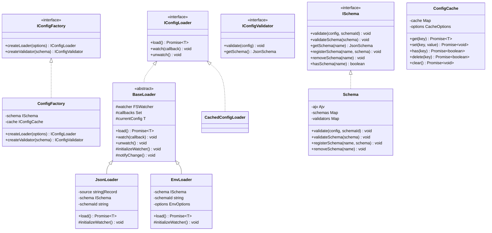

# Configuration Management System Documentation

- [Overview](#overview)
- [Features](#features)
- [Installation](#installation)
- [Quick Start](#quick-start)
- [Architecture](#architecture)
- [Usage Guide](#usage-guide)
- [API Reference](#api-reference)

## Overview

A robust, type-safe configuration management system for TypeScript/Node.js applications with JSON Schema validation, environment variable support, and caching capabilities.

## Features

- **Type-Safe Configuration**: Full TypeScript support with interface-based configuration definitions
- **Schema Validation**: JSON Schema-based validation with custom validation rules
- **Multiple Sources**: Support for JSON files and environment variables
- **Caching**: Built-in caching system with TTL and refresh policies
- **Change Detection**: Watch for configuration changes with event notifications
- **Extensible**: Plugin-based architecture for custom loaders and validators
- **Error Handling**: Comprehensive error types and detailed error messages

## Installation

```bash
npm install @qi/core
```

## Quick Start

```typescript
import { ConfigFactory, Schema, JsonSchema } from '@qi/core/config';

// Define your configuration schema
const schema: JsonSchema = {
  $id: 'app-config',
  type: 'object',
  properties: {
    port: { type: 'number', minimum: 1024 },
    host: { type: 'string' },
    database: {
      type: 'object',
      properties: {
        url: { type: 'string', format: 'uri' },
        pool: { type: 'number', default: 5 }
      },
      required: ['url']
    }
  },
  required: ['port', 'host']
};

// Create configuration factory
const factory = new ConfigFactory(new Schema());

// Create and use configuration loader
const loader = factory.createLoader({
  type: 'app',
  version: '1.0',
  schema
});

// Load configuration
const config = await loader.load();
```

## Architecture



## Usage Guide

### Schema Definition

Define your configuration schema using JSON Schema:

```typescript
const schema: JsonSchema = {
  $id: 'database-config',
  type: 'object',
  properties: {
    connections: {
      type: 'array',
      items: {
        type: 'object',
        properties: {
          host: { type: 'string' },
          port: { type: 'number' },
          credentials: {
            type: 'object',
            properties: {
              username: { type: 'string' },
              password: { type: 'string' }
            },
            required: ['username', 'password']
          }
        },
        required: ['host', 'port']
      },
      minItems: 1
    },
    poolSize: { 
      type: 'number',
      minimum: 1,
      maximum: 100
    }
  }
};
```

### Loading Configurations

Using JsonLoader:

```typescript
// Load from file
const jsonLoader = new JsonLoader<AppConfig>(
  'config/app.json',
  schema,
  'app-config'
);
const config = await jsonLoader.load();

// Load from object
const configObject = {
  port: 3000,
  host: 'localhost',
  database: {
    url: 'postgresql://localhost:5432/mydb',
    pool: 10
  }
};

const objectLoader = new JsonLoader<AppConfig>(
  configObject,
  schema,
  'app-config'
);
```

### Environment Variables

Using EnvLoader:

```typescript
const envLoader = new EnvLoader<AppConfig>(schema, 'app-config', {
  path: '.env',
  override: true,
  extraFiles: ['.env.local'],
  required: true,
  watch: true,
  refreshInterval: 60000
});

const config = await envLoader.load();
```

### Caching

Implementing cache:

```typescript
const cache = new ConfigCache<AppConfig>({
  ttl: 3600000, // 1 hour
  refreshOnAccess: true,
  onExpire: (key) => {
    console.log(`Cache expired for ${key}`);
  }
});

const cachedLoader = new CachedConfigLoader(jsonLoader, cache);
const config = await cachedLoader.load();
```

### Change Detection

Watching for changes:

```typescript
loader.watch((event) => {
  console.log('Previous config:', event.previous);
  console.log('New config:', event.current);
  console.log('Change timestamp:', event.timestamp);
  console.log('Change source:', event.source);
});

// Stop watching
loader.unwatch();
```

### Error Handling

Handling configuration errors:

```typescript
try {
  const config = await loader.load();
} catch (error) {
  if (error instanceof ConfigError) {
    switch (error.code) {
      case CONFIG_ERROR_CODES.INVALID_SCHEMA:
        console.error('Schema validation failed:', error.message);
        break;
      case CONFIG_ERROR_CODES.CONFIG_LOAD_ERROR:
        console.error('Failed to load config:', error.message);
        break;
      case CONFIG_ERROR_CODES.ENV_LOAD_ERROR:
        console.error('Failed to load environment variables:', error.message);
        break;
    }
  }
}
```

## API Reference

### Core Interfaces

#### IConfigFactory

Factory interface for creating configuration loaders and validators.

```typescript
interface IConfigFactory {
  createLoader<T extends BaseConfig>(options: {
    type: string;
    version: string;
    schema: JsonSchema;
  }): IConfigLoader<T>;
  
  createValidator<T extends BaseConfig>(schema: JsonSchema): IConfigValidator<T>;
}
```

#### IConfigLoader

Interface for loading configuration data.

```typescript
interface IConfigLoader<T extends BaseConfig> {
  load(): Promise<T>;
  watch?(callback: (event: ConfigChangeEvent<T>) => void): void;
  unwatch?(): void;
}
```

#### ISchema

Interface for schema management and validation.

```typescript
interface ISchema {
  validate(config: unknown, schemaId: string): void;
  validateSchema(schema: JsonSchema): void;
  getSchema(name: string): JsonSchema | undefined;
  registerSchema(name: string, schema: JsonSchema): void;
  removeSchema(name: string): void;
  hasSchema(name: string): boolean;
}
```

### Classes

#### ConfigFactory

Main factory class for creating configuration components.

```typescript
class ConfigFactory implements IConfigFactory {
  constructor(
    schema: ISchema,
    cache?: IConfigCache<BaseConfig>
  );
  
  createLoader<T extends BaseConfig>(options: {
    type: string;
    version: string;
    schema: JsonSchema;
  }): IConfigLoader<T>;
  
  createValidator<T extends BaseConfig>(
    schema: JsonSchema
  ): IConfigValidator<T>;
}
```

#### JsonLoader

Loads configuration from JSON files or objects.

```typescript
class JsonLoader<T extends BaseConfig> extends BaseLoader<T> {
  constructor(
    source: string | Record<string, unknown>,
    schema: ISchema,
    schemaId: string
  );
  
  load(): Promise<T>;
  protected initializeWatcher(): void;
}
```

#### EnvLoader

Loads configuration from environment variables.

```typescript
class EnvLoader<T extends BaseConfig> extends BaseLoader<T> {
  constructor(
    schema: ISchema,
    schemaId: string,
    options?: EnvOptions
  );
  
  load(): Promise<T>;
  protected initializeWatcher(): void;
}
```

#### ConfigCache

Caches configuration data with TTL support.

```typescript
class ConfigCache<T extends BaseConfig> implements IConfigCache<T> {
  constructor(options: CacheOptions);
  
  get(key: string): Promise<T | undefined>;
  set(key: string, value: T): Promise<void>;
  has(key: string): Promise<boolean>;
  delete(key: string): Promise<boolean>;
  clear(): Promise<void>;
}
```

### Types

#### BaseConfig

Base interface for all configuration objects.

```typescript
interface BaseConfig {
  readonly type: string;
  readonly version: string;
  readonly schemaVersion?: SchemaVersion;
}
```

#### ConfigChangeEvent

Event type for configuration changes.

```typescript
type ConfigChangeEvent<T> = {
  previous: T;
  current: T;
  timestamp: number;
  source: string;
};
```

#### EnvOptions

Options for environment variable loading.

```typescript
interface EnvOptions {
  path?: string;
  override?: boolean;
  extraFiles?: string[];
  required?: boolean;
  watch?: boolean;
  refreshInterval?: number;
}
```

#### CacheOptions

Options for configuration caching.

```typescript
interface CacheOptions {
  ttl: number;
  refreshOnAccess?: boolean;
  onExpire?: (key: string) => void;
}
```

### Error Handling

#### ConfigError

Base error class for configuration-related errors.

```typescript
class ConfigError extends ValidationError {
  constructor(
    message: string,
    code: ConfigErrorCode,
    context: Record<string, unknown>
  );
  
  static schemaError(
    message: string,
    schemaId: string,
    details?: Record<string, unknown>
  ): ConfigError;
  
  static validationError(
    message: string,
    schemaId: string,
    details?: Record<string, unknown>
  ): ConfigError;
  
  static envError(
    message: string,
    path: string,
    details?: Record<string, unknown>
  ): ConfigError;
  
  static loadError(
    message: string,
    source: string,
    details?: Record<string, unknown>
  ): ConfigError;
}
```

#### Error Codes

```typescript
const CONFIG_ERROR_CODES = {
  INVALID_SCHEMA: "INVALID_SCHEMA",
  SCHEMA_NOT_FOUND: "SCHEMA_NOT_FOUND",
  VALIDATION_FAILED: "VALIDATION_FAILED",
  ENV_LOAD_ERROR: "ENV_LOAD_ERROR",
  CONFIG_LOAD_ERROR: "CONFIG_LOAD_ERROR",
  CONFIG_PARSE_ERROR: "CONFIG_PARSE_ERROR"
} as const;
```