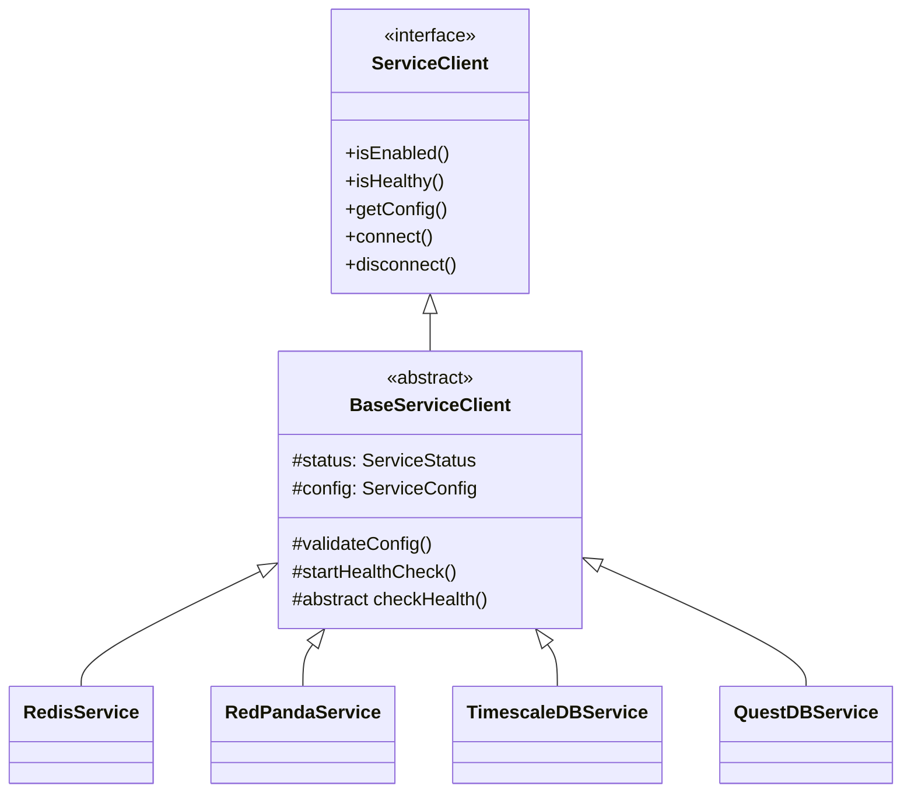

# Core Services Documentation

## Table of Contents
- [Architecture Overview](#architecture-overview)
- [Core Components](#core-components)
- [Service Implementations](#service-implementations)
- [Testing Strategy](#testing-strategy)
- [Error Handling](#error-handling)
- [Configuration Reference](#configuration-reference)
- [Service Management](#service-management)
- [Deployment](#deployment)
- [Troubleshooting](#troubleshooting)

## Architecture Overview

### Module Structure
```
@qi/core/services/
├── base/               # Base abstractions
│   ├── client.ts      # Abstract client implementation
│   ├── types.ts       # Common types and interfaces
│   └── manager.ts     # Service management
├── config/            # Configuration
│   ├── types.ts       # Configuration interfaces
│   ├── handlers.ts    # Connection handlers
│   ├── schema.ts      # JSON schemas
│   └── loader.ts      # Config loading
├── redis/            # Redis implementation
├── redpanda/         # Message queue service
├── timescaledb/      # TimescaleDB service
└── questdb/          # QuestDB service
```

### Service Architecture



## Core Components

### Base Service Client

```typescript
abstract class BaseServiceClient<T extends ServiceConfig> {
  protected status: ServiceStatus = ServiceStatus.INITIALIZING;
  protected lastHealthCheck?: HealthCheckResult;

  constructor(
    protected readonly config: T,
    protected readonly serviceName: string
  ) {
    this.validateConfig();
  }

  abstract connect(): Promise<void>;
  abstract disconnect(): Promise<void>;
  protected abstract checkHealth(): Promise<HealthCheckResult>;

  async isHealthy(): Promise<boolean> {
    try {
      this.lastHealthCheck = await this.checkHealth();
      return this.lastHealthCheck.status === "healthy";
    } catch (error) {
      logger.error(`Health check failed for ${this.serviceName}`, { error });
      return false;
    }
  }
}
```

### Service Manager

```typescript
class ServiceConnectionManager {
  private services = new Map<string, ServiceClient>();

  registerService(name: string, service: ServiceClient): void {
    if (this.services.has(name)) {
      throw new Error(`Service ${name} already registered`);
    }
    this.services.set(name, service);
  }

  async connectAll(): Promise<void> {
    for (const [name, service] of this.services) {
      if (!service.isEnabled()) continue;
      await service.connect();
    }
  }

  async disconnectAll(): Promise<void> {
    for (const service of this.services.values()) {
      await service.disconnect();
    }
  }
}
```

## Service Implementations

### RedPanda Service

Features:
- Kafka protocol compatibility
- Producer/Consumer management
- Topic subscription
- Message batching
- Health monitoring

```typescript
class RedPandaService extends BaseServiceClient<RedPandaConfig> {
  private kafka: Kafka;
  private producer: Producer | null = null;
  private consumer: Consumer | null = null;

  async connect(): Promise<void> {
    try {
      const kafkaConfig = this.createKafkaConfig();
      this.kafka = new Kafka(kafkaConfig);
      
      this.producer = this.kafka.producer();
      await this.producer.connect();
      
      if (this.config.consumer?.groupId) {
        this.consumer = this.kafka.consumer(this.createConsumerConfig());
        await this.consumer.connect();
      }
    } catch (error) {
      throw new ApplicationError(
        "Failed to connect to RedPanda",
        ErrorCode.CONNECTION_ERROR
      );
    }
  }
}
```

### Redis Service

Features:
- Connection pooling
- Key prefixing
- Command timeout handling
- Automatic reconnection
- Health monitoring

```typescript
class RedisService extends BaseServiceClient<RedisConfig> {
  private client: Redis | null = null;

  async connect(): Promise<void> {
    try {
      this.client = new Redis({
        host: this.config.connection.getHost(),
        port: this.config.connection.getPort(),
        password: this.getPassword(),
        maxRetriesPerRequest: 3,
        keyPrefix: this.config.options?.keyPrefix,
        commandTimeout: this.config.options?.commandTimeout,
        retryStrategy: times => Math.min(times * 1000, 3000)
      });
    } catch (error) {
      throw new ApplicationError(
        "Failed to connect to Redis",
        ErrorCode.CONNECTION_ERROR
      );
    }
  }
}
```

### TimescaleDB Service

Features:
- Connection pooling
- Query interface
- Model synchronization
- Transaction support
- Statement timeouts

```typescript
class TimescaleDBService extends BaseServiceClient<TimescaleDBConfig> {
  private sequelize: Sequelize | null = null;

  async connect(): Promise<void> {
    try {
      const sequelizeOptions = this.createSequelizeOptions();
      this.sequelize = new Sequelize(sequelizeOptions);
      await this.sequelize.authenticate();
    } catch (error) {
      throw new ApplicationError(
        "Failed to connect to TimescaleDB",
        ErrorCode.CONNECTION_ERROR
      );
    }
  }
}
```

## Configuration Reference

### Schema
```typescript
interface ServiceConfig {
  type: "services";
  version: string;
  databases: {
    postgres: PostgresConfig;
    questdb: QuestDBConfig;
    redis: RedisConfig;
  };
  messageQueue: MessageQueueConfig;
  monitoring: MonitoringConfig;
  networking: NetworkConfig;
}
```

### Environment Variables

Database Credentials:
```env
POSTGRES_PASSWORD=<required>
POSTGRES_USER=<required>
POSTGRES_DB=<required>
REDIS_PASSWORD=<required>
```

Monitoring:
```env
GF_SECURITY_ADMIN_PASSWORD=<required>
PGADMIN_DEFAULT_EMAIL=<required>
PGADMIN_DEFAULT_PASSWORD=<required>
```

### Port Matrix
| Service | Port | Protocol | Usage |
|---------|------|----------|--------|
| TimescaleDB | 5432 | PostgreSQL | Database connections |
| QuestDB | 9000 | HTTP | Web console |
| QuestDB | 8812 | PostgreSQL | Wire protocol |
| QuestDB | 9009 | InfluxDB | Line protocol |
| Redis | 6379 | Redis | Cache operations |
| RedPanda | 9092 | Kafka | Message broker |
| RedPanda | 8081 | HTTP | Schema registry |
| RedPanda | 9644 | HTTP | Admin API |
| RedPanda | 8082 | HTTP | REST proxy |
| Grafana | 3000 | HTTP | Monitoring UI |
| pgAdmin | 80 | HTTP | Database admin |

For more detail, please see [configuration](./config.md).

## Service Management

### Setup

1. Generate Configuration:
```bash
npm run config:init
npm run config:map -- 1.0.0
```

2. Network Setup:
```bash
docker network create qi_db
docker network create redis_network
docker network create redpanda_network
```

3. Start Services:
```bash
docker compose up -d
```

### Health Checks

Health check configurations:
- Interval: 30s
- Timeout: 10s
- Retries: 3-5

### Volume Management

Persistent volumes:
- `questdb_data`: QuestDB data
- `timescaledb_data`: TimescaleDB data
- `pgadmin_data`: pgAdmin settings
- `grafana_data`: Grafana dashboards
- `redis_data`: Redis data
- `redpanda_data`: RedPanda logs

## Testing Strategy

1. Test Setup
```typescript
describe("Service", () => {
  vi.mock("external-lib");
  
  const mockConfig = {
    enabled: true,
    connection: {
      getHost: () => "localhost",
      getPort: () => port
    }
  };

  beforeEach(() => {
    vi.clearAllMocks();
  });
});
```

2. Lifecycle Tests
```typescript
describe("lifecycle", () => {
  it("connects successfully", async () => {
    const service = new Service(config);
    await service.connect();
    expect(externalClient.connect).toHaveBeenCalled();
  });
});
```

For more information, please see [testing](./test.md).

## Error Handling

Error codes:
- CONNECTION_ERROR
- SERVICE_NOT_INITIALIZED 
- CONFIGURATION_ERROR
- OPERATION_ERROR

```typescript
try {
  // Service operation
} catch (error) {
  throw new ApplicationError(
    "Operation failed",
    ErrorCode.OPERATION_ERROR,
    500,
    { error: String(error) }
  );
}
```

## Best Practices

1. Service Implementation
- Extend BaseServiceClient
- Implement health checks
- Handle connection lifecycle
- Add error handling
- Include configuration validation

2. Testing
- Mock external dependencies
- Test error scenarios
- Check resource cleanup
- Verify health checks

3. Error Handling
- Use ApplicationError
- Include error details
- Log errors appropriately
- Clean up resources

4. Health Monitoring
- Regular health checks
- Detailed status reporting
- Connection verification
- Error recovery

5. Resource Management
- Proper cleanup
- Connection pooling
- Timeout handling
- Event handling

## Troubleshooting

### Common Issues

1. Service Won't Start
```bash
# Check logs
docker compose logs [service-name]

# Verify network
docker network inspect [network-name]

# Check port conflicts
netstat -tulpn | grep <port>
```

2. Connection Issues
```bash
# Verify service is running
docker compose ps

# Check container networking
docker inspect [container-name]

# Test connectivity
docker compose exec [service-name] ping [other-service]
```

3. Reset Environment
```bash
# Stop and clean up
docker compose down -v

# Remove networks
docker network rm qi_db redis_network redpanda_network

# Regenerate configuration
npm run config:init
npm run config:map -- 1.0.0

# Start fresh
docker compose up -d
```