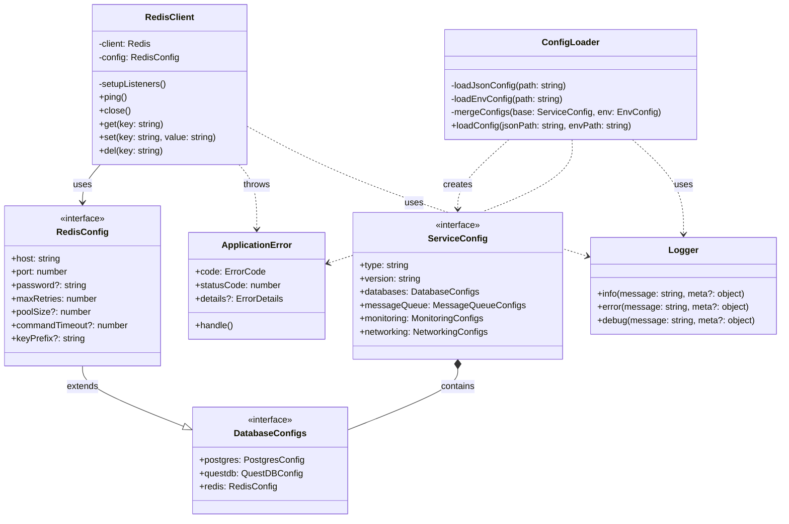

### Structures

File Structure:

```
qi/core/src/services/
├── config/
│   ├── types.ts           # Service configuration type definitions
│   ├── loader.ts          # Configuration loading implementation
│   └── index.ts           # Module exports
└── redis/
    ├── types.ts           # Redis-specific type definitions
    ├── client.ts          # Redis client implementation
    └── index.ts           # Module exports
```

### Diagram



Key aspects of the simplified architecture:

1. **Config Module**:

   - `ConfigLoader` is the main class responsible for loading and merging configurations
   - Uses core modules (`ApplicationError`, `Logger`) for error handling and logging
   - Produces a strongly-typed `ServiceConfig` object

2. **Redis Module**:

   - `RedisClient` is a simplified client implementation
   - Extends base Redis config from `DatabaseConfigs`
   - Direct dependency on service configuration
   - Uses core modules for error handling and logging

3. **Core Dependencies**:
   - Both modules use `ApplicationError` for error handling
   - Both modules use `Logger` for logging operations
   - Utility functions (not shown in diagram) are used for retrying operations

The main improvements from the previous implementation:

1. Removed unnecessary abstractions (no base clients, no complex validation)
2. Direct dependencies between modules
3. Simplified configuration hierarchy
4. Clear separation of concerns
5. Type-safe configuration handling

### Source code

````typescript
// types.ts
/**
 * @fileoverview Service configuration type definitions
 * @module @qi/core/services/config/types
 *
 * @description
 * Defines TypeScript interfaces for service configuration including databases,
 * message queues, monitoring tools, and networking. These types are used to
 * ensure type safety when working with configuration data loaded from JSON
 * and environment files.
 *
 * @example
 * ```typescript
 * import { ServiceConfig } from './types';
 *
 * const config: ServiceConfig = {
 *   type: 'service',
 *   version: '1.0',
 *   databases: {
 *     redis: {
 *       host: 'localhost',
 *       port: 6379,
 *       maxRetries: 3
 *     }
 *   }
 * };
 * ```
 */

import { BaseConfig } from "@qi/core/config";

/**
 * Database service configurations
 */
export interface DatabaseConfigs {
  postgres: {
    host: string;
    port: number;
    database: string;
    user: string;
    password?: string;
    maxConnections: number;
  };
  questdb: {
    host: string;
    httpPort: number;
    pgPort: number;
    influxPort: number;
    telemetryEnabled?: boolean;
  };
  redis: {
    host: string;
    port: number;
    password?: string;
    maxRetries: number;
  };
}

/**
 * Message queue service configurations
 */
export interface MessageQueueConfigs {
  redpanda: {
    kafkaPort: number;
    schemaRegistryPort: number;
    adminPort: number;
    pandaproxyPort: number;
    brokerId?: number;
    advertisedKafkaApi?: string;
    advertisedSchemaRegistryApi?: string;
    advertisedPandaproxyApi?: string;
  };
}

/**
 * Monitoring service configurations
 */
export interface MonitoringConfigs {
  grafana: {
    host: string;
    port: number;
    adminPassword?: string;
    plugins?: string;
  };
  pgAdmin: {
    host: string;
    port: number;
    email?: string;
    password?: string;
  };
}

/**
 * Network configurations
 */
export interface NetworkingConfigs {
  networks: {
    db: string;
    redis: string;
    redpanda: string;
  };
}

/**
 * Complete service configuration
 */
export interface ServiceConfig extends BaseConfig {
  type: "service";
  version: string;
  databases: DatabaseConfigs;
  messageQueue: MessageQueueConfigs;
  monitoring: MonitoringConfigs;
  networking: NetworkingConfigs;
}

/**
 * Environment variables configuration
 */
export interface EnvConfig {
  POSTGRES_PASSWORD: string;
  POSTGRES_USER: string;
  POSTGRES_DB: string;
  REDIS_PASSWORD: string;
  GF_SECURITY_ADMIN_PASSWORD: string;
  GF_INSTALL_PLUGINS?: string;
  PGADMIN_DEFAULT_EMAIL: string;
  PGADMIN_DEFAULT_PASSWORD: string;
  QDB_TELEMETRY_ENABLED?: string;
  REDPANDA_BROKER_ID?: string;
  REDPANDA_ADVERTISED_KAFKA_API?: string;
  REDPANDA_ADVERTISED_SCHEMA_REGISTRY_API?: string;
  REDPANDA_ADVERTISED_PANDAPROXY_API?: string;
}

// loader.ts
/**
 * @fileoverview Service configuration loader
 * @module @qi/core/services/config/loader
 *
 * @description
 * Provides functionality to load and merge service configurations from JSON
 * and environment files. Handles loading, parsing, and merging of configuration
 * data while providing type safety and error handling.
 *
 * @example
 * ```typescript
 * const loader = new ConfigLoader();
 * const config = await loader.loadConfig('services.json', 'services.env');
 * ```
 */

import { readFile } from "fs/promises";
import { ApplicationError, ErrorCode } from "@qi/core/errors";
import { loadEnv } from "@qi/core/utils";
import { logger } from "@qi/core/logger";
import { ServiceConfig, EnvConfig } from "./types";

/**
 * Service configuration loader class
 */
export class ConfigLoader {
  /**
   * Loads and merges service configuration from JSON and environment files
   *
   * @param jsonPath - Path to the JSON configuration file
   * @param envPath - Path to the environment file
   * @returns Promise resolving to merged ServiceConfig
   * @throws ApplicationError if loading or parsing fails
   */
  async loadConfig(jsonPath: string, envPath: string): Promise<ServiceConfig> {
    try {
      logger.info("Loading service configuration", { jsonPath, envPath });

      // Load base configuration
      const baseConfig = await this.loadJsonConfig(jsonPath);

      // Load environment variables
      const env = await this.loadEnvConfig(envPath);

      // Merge configurations
      const mergedConfig = this.mergeConfigs(baseConfig, env);
      logger.info("Service configuration loaded successfully");

      return mergedConfig;
    } catch (error) {
      logger.error("Failed to load service configuration", { error });
      throw new ApplicationError(
        "Failed to load service configuration",
        ErrorCode.CONFIG_LOAD_ERROR,
        { error: error instanceof Error ? error.message : String(error) }
      );
    }
  }

  /**
   * Loads configuration from JSON file
   *
   * @private
   * @param path - Path to JSON file
   * @returns Promise resolving to ServiceConfig
   */
  private async loadJsonConfig(path: string): Promise<ServiceConfig> {
    try {
      const content = await readFile(path, "utf-8");
      return JSON.parse(content) as ServiceConfig;
    } catch (error) {
      throw new ApplicationError(
        "Failed to load JSON configuration",
        ErrorCode.CONFIG_LOAD_ERROR,
        { path, error: error instanceof Error ? error.message : String(error) }
      );
    }
  }

  /**
   * Loads configuration from environment file
   *
   * @private
   * @param path - Path to environment file
   * @returns Promise resolving to environment variables
   */
  private async loadEnvConfig(path: string): Promise<EnvConfig> {
    const env = await loadEnv(path);
    if (!env) {
      throw new ApplicationError(
        "Environment file not found",
        ErrorCode.CONFIG_LOAD_ERROR,
        { path }
      );
    }
    return env as unknown as EnvConfig;
  }

  /**
   * Merges base configuration with environment variables
   *
   * @private
   * @param baseConfig - Base JSON configuration
   * @param env - Environment variables
   * @returns Merged ServiceConfig
   */
  private mergeConfigs(
    baseConfig: ServiceConfig,
    env: EnvConfig
  ): ServiceConfig {
    return {
      ...baseConfig,
      databases: {
        ...baseConfig.databases,
        postgres: {
          ...baseConfig.databases.postgres,
          password: env.POSTGRES_PASSWORD,
          user: env.POSTGRES_USER,
          database: env.POSTGRES_DB,
        },
        questdb: {
          ...baseConfig.databases.questdb,
          telemetryEnabled: env.QDB_TELEMETRY_ENABLED === "true",
        },
        redis: {
          ...baseConfig.databases.redis,
          password: env.REDIS_PASSWORD,
        },
      },
      monitoring: {
        ...baseConfig.monitoring,
        grafana: {
          ...baseConfig.monitoring.grafana,
          adminPassword: env.GF_SECURITY_ADMIN_PASSWORD,
          plugins: env.GF_INSTALL_PLUGINS,
        },
        pgAdmin: {
          ...baseConfig.monitoring.pgAdmin,
          email: env.PGADMIN_DEFAULT_EMAIL,
          password: env.PGADMIN_DEFAULT_PASSWORD,
        },
      },
      messageQueue: {
        ...baseConfig.messageQueue,
        redpanda: {
          ...baseConfig.messageQueue.redpanda,
          brokerId: env.REDPANDA_BROKER_ID
            ? parseInt(env.REDPANDA_BROKER_ID, 10)
            : undefined,
          advertisedKafkaApi: env.REDPANDA_ADVERTISED_KAFKA_API,
          advertisedSchemaRegistryApi:
            env.REDPANDA_ADVERTISED_SCHEMA_REGISTRY_API,
          advertisedPandaproxyApi: env.REDPANDA_ADVERTISED_PANDAPROXY_API,
        },
      },
    };
  }
}

// index.ts
/**
 * @fileoverview Service configuration module entry point
 * @module @qi/core/services/config
 *
 * @description
 * Exports service configuration types and loader functionality.
 */

export { ConfigLoader } from "./loader";
export type {
  ServiceConfig,
  EnvConfig,
  DatabaseConfigs,
  MessageQueueConfigs,
  MonitoringConfigs,
  NetworkingConfigs,
} from "./types";
````

Now let's provide the simplified Redis service module:

````typescript
// types.ts
/**
 * @fileoverview Redis service type definitions
 * @module @qi/core/services/redis/types
 *
 * @description
 * Defines TypeScript interfaces for Redis client configuration and operations.
 * Extends the base service configuration with Redis-specific options.
 */

import { DatabaseConfigs } from "../config/types";

/**
 * Redis client configuration
 * Extends the base Redis configuration from service config
 */
export interface RedisConfig extends DatabaseConfigs["redis"] {
  // Optional Redis-specific additions
  poolSize?: number;
  commandTimeout?: number;
  keyPrefix?: string;
}

// client.ts
/**
 * @fileoverview Redis client implementation
 * @module @qi/core/services/redis/client
 *
 * @description
 * Provides a simplified Redis client implementation that handles connection
 * management, basic operations, and error handling. Uses the ioredis library
 * for Redis operations.
 *
 * @example
 * ```typescript
 * const client = new RedisClient(config);
 * await client.set('key', 'value');
 * const value = await client.get('key');
 * await client.close();
 * ```
 */

import { Redis } from "ioredis";
import { ApplicationError, ErrorCode } from "@qi/core/errors";
import { logger } from "@qi/core/logger";
import { RedisConfig } from "./types";
import { retryOperation } from "@qi/core/utils";

export class RedisClient {
  private client: Redis;
  private readonly config: RedisConfig;

  /**
   * Creates a new Redis client instance
   *
   * @param config - Redis configuration
   */
  constructor(config: RedisConfig) {
    this.config = config;
    this.client = new Redis({
      host: config.host,
      port: config.port,
      password: config.password,
      maxRetriesPerRequest: config.maxRetries,
      retryStrategy: (times) => {
        const delay = Math.min(times * 1000, 3000);
        logger.debug("Redis retry", { attempt: times, delay });
        return delay;
      },
      keyPrefix: config.keyPrefix,
      commandTimeout: config.commandTimeout,
    });

    this.setupListeners();
  }

  /**
   * Sets up Redis event listeners
   *
   * @private
   */
  private setupListeners(): void {
    this.client.on("connect", () => {
      logger.info("Redis connected", {
        host: this.config.host,
        port: this.config.port,
      });
    });

    this.client.on("error", (error) => {
      logger.error("Redis error", {
        error: error.message,
        host: this.config.host,
        port: this.config.port,
      });
    });

    this.client.on("close", () => {
      logger.info("Redis connection closed");
    });
  }

  /**
   * Checks Redis connection health
   *
   * @returns Promise resolving to true if healthy
   * @throws ApplicationError if ping fails
   */
  async ping(): Promise<boolean> {
    try {
      const result = await retryOperation(() => this.client.ping(), {
        retries: this.config.maxRetries,
        minTimeout: 1000,
        onRetry: (times) => {
          logger.debug("Retrying Redis ping", { attempt: times });
        },
      });
      return result === "PONG";
    } catch (error) {
      throw new ApplicationError("Redis ping failed", ErrorCode.PING_ERROR, {
        error: error instanceof Error ? error.message : String(error),
      });
    }
  }

  /**
   * Closes Redis connection
   */
  async close(): Promise<void> {
    await this.client.quit();
    logger.info("Redis connection closed gracefully");
  }

  /**
   * Gets a value from Redis
   *
   * @param key - Key to retrieve
   * @returns Promise resolving to value or null if not found
   */
  async get(key: string): Promise<string | null> {
    return this.client.get(key);
  }

  /**
   * Sets a value in Redis
   *
   * @param key - Key to set
   * @param value - Value to set
   * @returns Promise resolving to OK on success
   */
  async set(key: string, value: string): Promise<"OK"> {
    return this.client.set(key, value);
  }

  /**
   * Deletes a key from Redis
   *
   * @param key - Key to delete
   * @returns Promise resolving to number of keys deleted
   */
  async del(key: string): Promise<number> {
    return this.client.del(key);
  }
}

// index.ts
/**
 * @fileoverview Redis service module entry point
 * @module @qi/core/services/redis
 *
 * @description
 * Exports Redis client and configuration types.
 */

export { RedisClient } from "./client";
export type { RedisConfig } from "./types";
````
