# Quantitative Investment (QI) System

## Investment Platform

**Investment** involves processing various types of information, most of which are in the form of data streams, making investment decisions, executing those decisions, and managing investment portfolios.

An **investment system** is designed to manage the day-to-day primary investment activities, such as trading, risk management, portfolio management, and investment strategy development. We view the activities of the investment process as **operations** acting on an **information flow**. With this perspective, the main design principle of the system is to **decouple operations from the information flow**.

A **quantitative investment system** is characterized by:

1. **Quantifying Operations**: It is capable of representing operations through models and logic so that they can be implemented within a software system.

2. **Modeling Information Flow**: It utilizes software engineering frameworks and tools to model and implement information flow, providing interfaces for operations to access or communicate with it.

---

The Quantitative Investment (QI) System is a comprehensive framework designed to support all aspects of quantitative investment activities. It integrates various components and processes to facilitate data acquisition, analysis, strategy development, portfolio management, execution, and monitoring within a cohesive ecosystem.

---

## Introduction to the QI System

### Purpose and Goals

The QI System aims to:

- **Automate Investment Processes**: Streamline the end-to-end investment workflow through automation, reducing manual intervention and operational risks.
- **Enhance Decision-Making**: Provide robust tools and data services to support informed investment decisions based on quantitative analysis.
- **Promote Flexibility and Scalability**: Utilize a modular architecture to allow for easy expansion and adaptation to new markets, instruments, and strategies.
- **Ensure Reliability and Compliance**: Maintain high levels of system reliability while adhering to regulatory requirements and industry best practices.

### Core Principles

- **Decoupling of Components**: Separate different system functionalities to promote modularity and independent development.
- **Data-Centric Design**: Place data at the core of the system, ensuring all components have access to accurate and timely information.
- **Cross-Language Interoperability**: Enable components written in different programming languages to interact seamlessly.
- **State Machine Management**: Use state machines to manage component behaviors, enhancing predictability and maintainability.

---

## High-Level Architecture

The QI System consists of several interconnected components, each responsible for specific aspects of the investment process. The primary components are:

1. **Data Platform**
2. **Research System**
3. **Portfolio Manager**
4. **Execution Manager**
5. **Simulation System**
6. **Fund Manager**
7. **Visualization and Monitoring System**
8. **External Data Sources and Databases**

---

```plantuml
@startuml
!theme C4_brown from <C4/themes>
'!include <C4/C4_Container>
'!include https://raw.githubusercontent.com/plantuml-stdlib/C4-PlantUML/master/C4_Context.puml
!include <C4/C4_Context>
<style>
element {
  MinimumWidth 200
  MaximumWidth 1200
  Fontcolor green
}
</style>
LAYOUT_TOP_DOWN()
scale 1400 width
skinparam linetype ortho
skinparam nodesep 80
skinparam backgroundcolor transparent
title System Context for QI V2 System

AddSystemTag("Data Platform", $bgColor="MediumSeaGreen",$fontColor="#fff")
AddSystemTag("Execution Manager",$bgColor="DarkSlateGrey")
AddSystemTag("Fund Manager",$bgColor="DarkSlateGrey")
AddSystemTag("Portfolio Manager",$bgColor="DarkSlateGrey")
AddSystemTag("Simulation System",$bgColor="DarkSlateGrey")
AddSystemTag("Research",$bgColor="DarkSlateGrey")
AddSystemTag("Data Sources",$bgColor="MediumSlateBlue")
AddSystemTag("Databases",$bgColor="MediumSlateBlue")
'skinparam defaultTextAlignment center

'==================================================================================================================================================================================
' begin systems
'==================================================================================================================================================================================
System(data_platform, "Data Platform", "(1) Market data; (2) model derived data; (3) forecasting data; (4) strategy signals; (5) execution data; (6) portfolio data; (7) fund data; (8) simulation data, etc.",$tags="Data Platform")
'==================================================================================================================================================================================
'WithoutPropertyHeader()
SetPropertyHeader("Module","Description")
AddProperty("cryptocompare","restapi")
AddProperty("cryptocompare","websocket")
AddProperty("twelvedata","restapi")
AddProperty("twelvedata","websocket")
System(market_data,"External Data Sources", $tags="Data Sources")
'==================================================================================================================================================================================
SetPropertyHeader("Module","Description")
AddProperty("consume market data","obtain market data from data stream")
AddProperty("market model","price multi-time scale state model")
AddProperty("market patterns","behavioral pattern based on market model")
AddProperty("forecasting model","forecasting in various time scales")
AddProperty("factor database","used for classification of market patterns")
AddProperty("strategy database","strategies for different market states")
AddProperty("risk model","market risk")
AddProperty("portfolio analysis","portfolio and strategy efficiency evaluation")
AddProperty("portfolio construction","asset based strategy deployment and asset composition")
AddProperty("Publish model data","publish data to data stream")
System(research,"Research System","The core of the QI V2 system",$tags="Research")
'==================================================================================================================================================================================
SetPropertyHeader("Module","Description")
AddProperty("consume fund portfolio data","obtain data from data stream")
AddProperty("portfolio construction","constructing and update portfolio for funds")
AddProperty("construct execution orders","compute execution list for each portfolio")
AddProperty("publish execution order","publish data to data stream")
System(portfolio,"Portfolio Manager","Portfolio manager uses models developed from research\l to perform portfolio management (PMS).",$tags="Portfolio Manager")
'==================================================================================================================================================================================
SetPropertyHeader("Module","Description")
AddProperty("consume order lists","obtain data from data stream")
AddProperty("OMS","algorithm order placement and order management")
AddProperty("publishing execution progress","publish data to data stream")
System(execution,"Execution Manager","Algorithm order placement and management system (OMS)",$tags="Execution Manager")
'==================================================================================================================================================================================
SetPropertyHeader("Module","Description")
AddProperty("consume market and model data","obtains data fromm data stream")
AddProperty("market data","market data simulation based on market model")
AddProperty("strategy usage","for examine the effectiveness of strategy deployment")
AddProperty("portfolio construction","simulate other possible portfolio construction scenarios")
AddProperty("publish simulation data","push simulated data to data stream")
System(simulator,"Simulation System","Simulate market data as well as strategy and \lportfolio deployment for various possible scenarios",$tags="Simulation System")
'==================================================================================================================================================================================
SetPropertyHeader("Module","Description")
AddProperty("consume market data","obtains data from data stream")
AddProperty("external data","obtain data from external entities (custodian banks)")
AddProperty("fund valuation","compute net value of each fund including investment performances")
AddProperty("fund validation","validate fund data (including execution data) with custodian banks or similar entities")
AddProperty("publish fund data","push data to data stream")
System(fund,"Fund Manager","Management of funds targets on monitoring and reporting",$tags="Fund Manager")
'==================================================================================================================================================================================
SetPropertyHeader("Module","Description")
AddProperty("market data","market data charts")
AddProperty("model data","model data charts (usually with market data)")
AddProperty("portfolio","portfolio performance chart and summaries")
AddProperty("execution","execution performance charts and summaries")
AddProperty("fund","fund performance charts and summaries")
AddProperty("research","strategy, portfolio performance charts and summaries")
System(visualization,"Visualization and Monitoring System","Visualizing and monitoring market data,model data, \land various data from other systems",$tags="Visualization and Monitoring System")
'==================================================================================================================================================================================
SetPropertyHeader("/Module","Description")
AddProperty("market database","level1, level2 and kline data")
AddProperty("model database","market model, strategy and features")
AddProperty("execution database","execution data for each fund")
AddProperty("portfolio database","composition and performance data")
AddProperty("fund database","external and internal fund data")
System(data_store,"Databases","Warehouse for various data",$tags="Databases")
'==================================================================================================================================================================================
' end systems
'==================================================================================================================================================================================

'==================================================================================================================================================================================
' begin relationships
'==================================================================================================================================================================================
Rel_R(market_data,data_platform,"fetch")
Rel_D(data_platform,research,"consume")
Rel_U(research,data_platform,"publish")
'Rel_Neighbor(research, portfolio, "models", "library")
Rel_D(data_platform,portfolio,"consume")
Rel_U(portfolio,data_platform,"publish")
Rel_U(execution,data_platform,"publish")
Rel_D(data_platform,execution,"consume")
Rel_D(simulator,data_platform,"publish")
Rel_U(data_platform,simulator,"consume")
Rel_D(fund,data_platform,"publish")
Rel_U(data_platform,fund,"consume")
Rel_U(data_platform,visualization,"consume")
Rel_R(data_platform,data_store,"consume")
'==================================================================================================================================================================================
' end relationships
'==================================================================================================================================================================================
@enduml
```

**Note on the diagram**:
1. Information flow is modeled by `Data Platform` system.  It is colored by `MediumSeaGreen`.
2. Operations: `Fund Manager`, `Portfolio Manager`, `Execution Manager`, `Research System`, and `Simulation System`, they are colored by `MediumSlateGray`. From data interaction point of view, operations are the models that not only need to consume data but also need to publish data into `Data Platform`.
3. Applications: `Visualization and Monitoring System`. These models only consume data from the `Data Platform` and is colored by `Brown`.
4. External resources: `External data sources` and `Databases`. These models are colored by `MediumSlateBlue`.

*Operations* and *applications* are the users of the *data platform*, together they form the QI core system, while the external resources are the resources on which the core system rely.

## Component Descriptions

### 1. [Data Platform](./data_platform.md)

**Role**: Serves as the backbone of the QI System, handling all aspects of data acquisition, storage, distribution, and services.

**Responsibilities**:

- **Data Acquisition**: Fetch historical and real-time market data from external sources.
- **Data Storage**: Store data in databases for persistence and future analysis.
- **Data Distribution**: Provide data services to other components through well-defined interfaces.
- **Data Services**: Offer APIs and interfaces for operations and applications to access and manipulate data.

**Key Features**:

- **Producers and Consumers**: Use producer and consumer patterns to manage data flow.
- **Data Stream (Redpanda/Kafka)**: Utilize a high-performance data streaming platform for decoupled communication.
- **Data Workers and Data Store**: Provide interfaces for operations and applications to interact with data seamlessly.

---

### 2. Research System

**Role**: Develops quantitative models, strategies, and analytical tools to inform investment decisions. Machine learning is a core component, heavily used in back-testing and strategy development, and relies significantly on simulation.

**Responsibilities**:

- **Market Modeling**: Create price models across multiple time scales.
- **Pattern Recognition**: Identify behavioral patterns based on market models.
- **Forecasting**: Generate forecasts using statistical and machine learning methods.
- **Strategy Development**: Design and test trading strategies tailored to different market conditions.
- **Machine Learning Integration**: Employ machine learning algorithms to enhance model accuracy and predictive capabilities.
- **Back-Testing**: Utilize historical data and simulations to evaluate the performance of strategies before deployment.
- **Risk Modeling**: Assess market risks and incorporate them into strategy design.
- **Portfolio Analysis**: Evaluate portfolio performance and efficiency.

**Implementation Details**:

- **Data Consumption**: Accesses data from the Data Platform for analysis.
- **Model Publishing**: Publishes derived data and insights back to the Data Platform for use by other components.
- **Tools and Languages**: Utilizes programming languages like Python and R, along with machine learning libraries such as TensorFlow, PyTorch, and scikit-learn.
- **Simulation Dependency**: Relies heavily on the Simulation System to test and validate models and strategies under various market scenarios.

---

### 3. Portfolio Manager

**Role**: Constructs and manages investment portfolios based on insights and models from the Research System.

**Responsibilities**:

- **Portfolio Construction**: Selects assets and determines their weightings within a portfolio.
- **Rebalancing**: Adjusts portfolio compositions in response to market changes or strategy updates.
- **Risk Management**: Monitors and mitigates portfolio risks.
- **Execution Planning**: Prepares execution orders for the Execution Manager.

**Implementation Details**:

- **Data Interaction**: Consumes data from the Data Platform, including market data and model outputs.
- **Strategy Implementation**: Applies strategies developed by the Research System to real portfolios.
- **Communication**: Publishes portfolio data and execution orders back to the Data Platform.

---

### 4. Execution Manager

**Role**: Handles the placement and management of orders in the market, ensuring efficient and effective trade execution.

**Responsibilities**:

- **Order Management System (OMS)**: Manages the life cycle of trade orders, including creation, modification, and cancellation.
- **Algorithmic Execution**: Utilizes execution algorithms to optimize trade execution, minimize market impact, and reduce transaction costs.
- **Market Connectivity**: Interfaces with exchanges, brokers, and trading platforms.
- **Execution Monitoring**: Tracks execution progress and performance.

**Implementation Details**:

- **Data Consumption**: Receives execution orders from the Portfolio Manager via the Data Platform.
- **Real-Time Data Usage**: Uses real-time market data to make execution decisions.
- **Publishing Execution Data**: Sends execution updates and confirmations back to the Data Platform.

---

### 5. Simulation System

**Role**: Simulates market conditions and investment strategies to test their effectiveness under various scenarios. It is integral to the Research System's use of machine learning for back-testing and strategy development.

**Responsibilities**:

- **Market Simulation**: Generates synthetic market data based on historical patterns and models.
- **Strategy Back-Testing**: Tests trading strategies using historical and simulated data, providing critical feedback for machine learning models.
- **Scenario Analysis**: Evaluates performance under different market conditions, including stress testing.
- **Portfolio Simulation**: Simulates alternative portfolio constructions and rebalancing strategies.

**Implementation Details**:

- **Data Interaction**: Consumes and produces data via the Data Platform.
- **Integration with Research**: Works closely with the Research System to validate models and strategies, particularly those involving machine learning.
- **Tools Used**: Employs statistical modeling, simulation tools, and machine learning frameworks.

---

### 6. Fund Manager

**Role**: Oversees the management of investment funds, focusing on monitoring, reporting, and compliance.

**Responsibilities**:

- **Fund Valuation**: Calculates the net asset value (NAV) of funds, including performance metrics.
- **Data Validation**: Cross-checks internal data with external sources such as custodian banks.
- **Regulatory Reporting**: Generates reports required by regulatory bodies.
- **Investor Communication**: Prepares reports and statements for fund investors.

**Implementation Details**:

- **Data Sources**: Consumes data from both the Data Platform and external entities.
- **Data Publishing**: Publishes fund performance data back to the Data Platform.
- **Compliance**: Ensures all activities meet legal and regulatory standards.

---

### 7. Visualization and Monitoring System

**Role**: Provides interfaces for visualizing data and monitoring system performance.

**Responsibilities**:

- **Data Visualization**: Generates charts, dashboards, and reports for market data, model outputs, portfolio performance, execution progress, and fund performance.
- **System Monitoring**: Tracks the health and performance of system components.
- **Alerts and Notifications**: Sends alerts for predefined events or anomalies.

**Implementation Details**:

- **Data Consumption**: Accesses data from the Data Platform.
- **User Interface**: Provides web-based interfaces or applications for users.
- **Technologies Used**: May utilize frameworks like React or Angular, and data visualization libraries such as D3.js.

---

### 8. External Data Sources and Databases

**Role**: Provide raw data and store processed data for the QI System.

**Responsibilities**:

- **Market Data Providers**: Supply real-time and historical market data.
- **Databases**: Store various types of data including market data, model outputs, execution records, portfolio compositions, and fund data.

**Implementation Details**:

- **Data Providers**: Integrate with providers like CryptoCompare, TwelveData, Bloomberg, etc.
- **Database Systems**: Use relational databases (e.g., PostgreSQL, MySQL) and time-series databases (e.g., InfluxDB) as appropriate.
- **Data Ingestion**: Data is fetched by Producers in the Data Platform and stored by Consumers.

---

## Inter-Component Interactions

### Data Flow

- **Producers** fetch data from **External Data Sources** and publish it to the **Data Stream**.
- **Consumers** read from the **Data Stream** and store data in **Databases**.
- **Operations and Monitors** interact with the **Data Platform** through **Data Workers**.
- **Applications** consume data services from the **Data Store**.

### Operational Workflow

1. **Data Acquisition**: Producers obtain data and feed it into the system.
2. **Data Storage**: Consumers store data in databases.
3. **Research and Analysis**: The Research System accesses data to develop models and strategies, heavily utilizing machine learning and simulations for back-testing.
4. **Strategy Deployment**: Portfolio Manager implements strategies and constructs portfolios.
5. **Order Execution**: Execution Manager places orders in the market based on portfolio decisions.
6. **Monitoring and Reporting**: Visualization System provides insights, and the Fund Manager handles reporting.
7. **Feedback Loop**: Performance data feeds back into the Research System for continuous improvement, informing machine learning models and strategy refinement.

---

## Key Mechanisms and Design Principles

### Decoupling and Modularity

- **Separation of Concerns**: Each component focuses on specific responsibilities.
- **Interoperability**: Components interact through well-defined interfaces and data streams.

### Cross-Language Communication

- **Data Streams**: Use Kafka or similar technologies to enable communication between components written in different languages.
- **Protocol Standardization**: Define standard data formats (e.g., JSON, Protobuf) for messages.

### State Machine Management

- **Predictable Behavior**: Components use state machines to manage states and transitions.
- **Error Handling**: Improved ability to handle exceptions and recover from failures.

### Scalability and Performance

- **Horizontal Scaling**: Components like Producers and Consumers can scale out to handle increased load.
- **Asynchronous Processing**: Use of messaging systems allows for non-blocking communication.

---

## Technologies and Tools

- **Programming Languages**:
  - **TypeScript**: Main language for the Data Platform components.
  - **Python**: Used extensively in the Research System and Simulation System, especially for machine learning tasks.
  - **Go**: Employed where performance and concurrency are critical.

- **Messaging Systems**:
  - **Kafka/Redpanda**: For high-throughput, low-latency messaging.

- **Databases**:
  - **Relational Databases**: PostgreSQL, MySQL.
  - **NoSQL Databases**: MongoDB, Cassandra.
  - **Time-Series Databases**: InfluxDB, TimescaleDB.

- **State Management**:
  - **XState**: For modeling state machines in JavaScript/TypeScript.

- **Machine Learning Frameworks**:
  - **TensorFlow**, **PyTorch**, **scikit-learn**: Used in the Research System for developing and training models.

- **Data Visualization**:
  - **Web Frameworks**: React, Angular.
  - **Visualization Libraries**: D3.js, Chart.js.

- **APIs and Interfaces**:
  - **RESTful APIs**: For synchronous communication.
  - **WebSockets**: For real-time data streams.

---

## Security and Compliance

- **Authentication and Authorization**: Implement robust mechanisms to ensure only authorized access.
- **Encryption**: Use SSL/TLS for data in transit and encryption at rest for sensitive data.
- **Audit Trails**: Maintain logs for all critical operations for compliance and forensic analysis.
- **Regulatory Compliance**: Adhere to regulations such as GDPR, MiFID II, or SEC requirements as applicable.

---

## Development and Deployment Practices

- **Continuous Integration/Continuous Deployment (CI/CD)**: Automate building, testing, and deployment processes.
- **Containerization**: Use Docker and Kubernetes for deployment to ensure consistency across environments.
- **Testing**:
  - **Unit Testing**: For individual components.
  - **Integration Testing**: To test interactions between components.
  - **End-to-End Testing**: Simulate real-world workflows.
- **Monitoring and Logging**:
  - **System Monitoring**: Use tools like Prometheus and Grafana.
  - **Application Logging**: Implement structured logging for easier analysis.

---

## Use Cases and Scenarios

### 1. Strategy Development and Back-Testing

**Process**:

- Researchers develop new strategies using historical data from the Data Platform.
- Machine learning models are trained and refined using this data.
- Strategies are back-tested using the Simulation System, which provides simulated market conditions.
- Successful strategies are deployed via the Portfolio Manager.

### 2. Real-Time Trading

**Process**:

- The Execution Manager receives real-time signals from the Portfolio Manager.
- Orders are executed in the market using algorithmic trading techniques.
- Execution data is fed back into the system for monitoring and analysis.

### 3. Risk Management

**Process**:

- Risk models in the Research System analyze portfolio exposures.
- Alerts are generated if risk thresholds are breached.
- The Portfolio Manager adjusts positions to mitigate risks.

### 4. Fund Performance Reporting

**Process**:

- The Fund Manager calculates fund performance metrics.
- Reports are generated and shared with investors.
- Data is archived for compliance purposes.

---

## Summary

The Quantitative Investment (QI) System is a sophisticated and comprehensive platform that supports the full spectrum of quantitative investment activities. By integrating advanced technologies and adhering to strong design principles, it enables efficient, scalable, and flexible operations. The system's modular architecture and decoupled components allow for continuous improvement and adaptation in the rapidly evolving financial landscape.

Notably, the Research System leverages machine learning extensively for back-testing and strategy development, relying heavily on the Simulation System to validate models and strategies under various market scenarios. This integration of machine learning enhances the system's ability to generate accurate forecasts and develop effective trading strategies.
