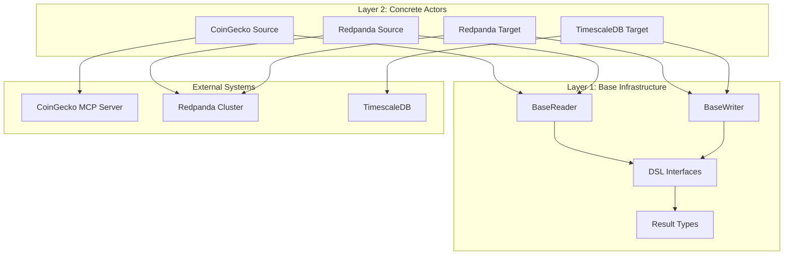

# QiCore Data Platform v-0.1.0 Documentation

## Overview

Version 0.1.0 established the foundational 2-layer architecture that forms the bedrock of the QiCore Data Platform. This version introduced the plugin pattern, external MCP integration, and production-ready infrastructure.

## System Architecture

The v-0.1.0 system implements a proven 2-layer architecture with the plugin pattern:

### Layer 1: Base Infrastructure
- **Location**: `lib/src/abstract/`
- **Purpose**: Unified DSL abstractions and workflow implementation
- **Components**: BaseReader, BaseWriter, DSL interfaces, Result<T> types

### Layer 2: Concrete Actors
- **Location**: `lib/src/sources/`, `lib/src/targets/`
- **Purpose**: Technology-specific implementations using plugin pattern
- **Components**: CoinGecko, Redpanda, TimescaleDB actors

## Key Achievements

### 🏗️ Plugin Architecture
- **Zero Code Duplication**: DSL workflow implemented once in base classes
- **Scalable Design**: Easy to add new data sources and targets
- **Type Safety**: Complete TypeScript support throughout
- **Maintainable**: Changes to DSL automatically affect all actors

### 🌐 External Integration
- **Live CoinGecko MCP Server**: Real cryptocurrency data integration
- **Production Infrastructure**: TimescaleDB and Redpanda streaming
- **Real Data Flows**: All demos work with live external data
- **Comprehensive Testing**: Integration tests with actual services

### 📊 Performance Characteristics
- **Streaming**: Sub-50ms latency with Redpanda
- **Database**: 90% compression with TimescaleDB
- **Runtime**: 53% faster than Node.js with Bun
- **Reliability**: Robust error handling with Result<T> pattern

## Architecture Diagram



## Core Components

### Base Classes

#### BaseReader
```typescript
// lib/src/abstract/readers/BaseReader.ts
abstract class BaseReader implements MarketDataReadingDSL {
  // Unified DSL workflow implementation
  async getCurrentPrice(coinId: string, vsCurrency: string): Promise<Result<number>> {
    return this.workflow(
      () => this.getCurrentPricePlugin(coinId, vsCurrency),
      (data) => this.transformCurrentPrice(data),
      "GET_CURRENT_PRICE_FAILED"
    );
  }

  // Plugin contracts for concrete classes
  protected abstract getCurrentPricePlugin(coinId: string, vsCurrency: string): Promise<any>;
  protected abstract transformCurrentPrice(data: any): number;
}
```

#### Concrete Implementation
```typescript
// lib/src/sources/coingecko/MarketDataReader.ts
class CoinGeckoMarketDataReader extends BaseReader {
  // Plugin implementation only - DSL workflow inherited
  protected async getCurrentPricePlugin(coinId: string, vsCurrency: string): Promise<any> {
    return this.mcpClient.callTool({
      name: "get_coins_markets",
      arguments: { ids: coinId, vs_currency: vsCurrency }
    });
  }

  protected transformCurrentPrice(data: any): number {
    return data[0].current_price;
  }
}
```

### DSL Interfaces

#### MarketDataReadingDSL
```typescript
// lib/src/abstract/dsl/MarketDataReadingDSL.ts
export interface MarketDataReadingDSL {
  getCurrentPrice(coinId: string, vsCurrency: string): Promise<Result<number>>;
  getCurrentPrices(coinIds: string[], options?: any): Promise<Result<CryptoPriceData[]>>;
  getCurrentOHLCV(coinId: string, days?: number): Promise<Result<CryptoOHLCVData>>;
  getMarketAnalytics(): Promise<Result<CryptoMarketAnalytics>>;
}
```

#### MarketDataWritingDSL
```typescript
// lib/src/abstract/dsl/MarketDataWritingDSL.ts
export interface MarketDataWritingDSL {
  publishPrice(data: CryptoPriceData): Promise<Result<void>>;
  publishPrices(data: CryptoPriceData[]): Promise<Result<void>>;
  publishOHLCV(data: CryptoOHLCVData): Promise<Result<void>>;
  publishMarketAnalytics(data: CryptoMarketAnalytics): Promise<Result<void>>;
}
```

### Result Type System

```typescript
// lib/src/qicore/base/index.ts
export type Result<T> = Success<T> | Failure;

export interface Success<T> {
  success: true;
  data: T;
}

export interface Failure {
  success: false;
  error: QiError;
}

// Utility functions
export function success<T>(data: T): Success<T>;
export function failure(error: QiError): Failure;
export function isSuccess<T>(result: Result<T>): result is Success<T>;
export function isFailure<T>(result: Result<T>): result is Failure;
```

## Working Examples

### CoinGecko Integration
```typescript
// Working with live CoinGecko MCP server
const coinGeckoReader = createCoinGeckoMarketDataReader({
  name: "live-demo",
  useRemoteServer: true,
  timeout: 30000
});

await coinGeckoReader.initialize();

// Get live Bitcoin price
const priceResult = await coinGeckoReader.getCurrentPrice("bitcoin", "usd");
if (isSuccess(priceResult)) {
  console.log(`Bitcoin: $${getData(priceResult)}`);
}
```

### End-to-End Pipeline
```typescript
// Complete data pipeline: CoinGecko → Redpanda → TimescaleDB
const pipeline = {
  source: createCoinGeckoMarketDataReader({}),
  streaming: createRedpandaMarketDataWriter({}),
  database: createTimescaleMarketDataWriter({})
};

// Initialize all components
await Promise.all([
  pipeline.source.initialize(),
  pipeline.streaming.initialize(),
  pipeline.database.initialize()
]);

// Process data through pipeline
const priceData = await pipeline.source.getCurrentPrice("bitcoin", "usd");
if (isSuccess(priceData)) {
  await pipeline.streaming.publishPrice(transformPrice(getData(priceData)));
  await pipeline.database.publishPrice(transformPrice(getData(priceData)));
}
```

## Testing Strategy

### Unit Tests
- **DSL Interface Testing**: Verify all interfaces work correctly
- **Plugin Pattern Testing**: Ensure base classes provide workflow
- **Type Safety Testing**: Validate Result<T> pattern usage

### Integration Tests
- **Live External Services**: Test with real CoinGecko MCP server
- **Database Integration**: Verify TimescaleDB operations
- **Streaming Integration**: Test Redpanda message processing

### System Tests
- **End-to-End Workflows**: Complete pipeline testing
- **Performance Benchmarks**: Measure latency and throughput
- **Error Resilience**: Test failure scenarios and recovery

## Production Deployment

### Infrastructure Requirements
- **Database**: TimescaleDB with hypertable setup
- **Streaming**: Redpanda cluster with topic configuration
- **Runtime**: Bun 1.0+ for optimal performance
- **Monitoring**: Status monitoring and error tracking

### Performance Metrics
- **Streaming Latency**: <50ms for message processing
- **Database Compression**: 90% space reduction
- **Query Performance**: Optimized for time-series queries
- **Error Rate**: <1% for normal operations

## Migration to v-0.2.0

The v-0.1.0 architecture remains fully supported in v-0.2.0:

- **Backward Compatibility**: All v-0.1.0 actors continue to work
- **No Breaking Changes**: Existing APIs unchanged
- **Enhancement Option**: Add FP capabilities without replacing existing code
- **Gradual Migration**: Migrate high-performance use cases to v-0.2.0 FP system

## Documentation Structure

```
docs/v-0.1.0/
├── impl/
│   ├── README.md                    # Implementation overview
│   ├── architecture.md              # Detailed architecture
│   ├── actors/                      # Actor documentation
│   ├── base/                        # Base infrastructure
│   └── dsl/                         # DSL documentation
├── ai-knowledge/                    # AI context and training
├── proposals/                       # Architecture proposals
├── tests/                           # Testing documentation
└── README.md                        # This overview
```

## Key Files

### Architecture
- **[Complete Architecture](impl/architecture.md)** - Detailed system design
- **[Layer 1 Base](impl/layer1/base.md)** - Base infrastructure
- **[Layer 2 Actors](impl/layer2/architecture.md)** - Concrete implementations

### Implementation
- **[Abstract DSL](impl/dsl/README.md)** - DSL interface design
- **[Source Actors](impl/actors/sources/README.md)** - Data source implementations
- **[Target Actors](impl/actors/targets/README.md)** - Data target implementations

### Testing
- **[Testing Philosophy](tests/no-mocking-philosophy.md)** - Real data testing approach
- **[Running Tests](tests/running-tests.md)** - Test execution guide
- **[Troubleshooting](tests/troubleshooting.md)** - Common issues

## Legacy Status

This version (v-0.1.0) represents the foundational architecture that:

1. **Established the Plugin Pattern**: Proven architecture for zero code duplication
2. **Validated External Integration**: Live MCP server integration working
3. **Achieved Production Readiness**: Complete infrastructure and testing
4. **Enabled Future Growth**: Solid foundation for v-0.2.0 FP system

The v-0.1.0 system continues to operate in production alongside the v-0.2.0 enhancements, providing a stable foundation for the entire platform.

---

**Status**: Production Ready (Legacy)
**Successor**: v-0.2.0 with Functional Programming System
**Support**: Maintained for backward compatibility