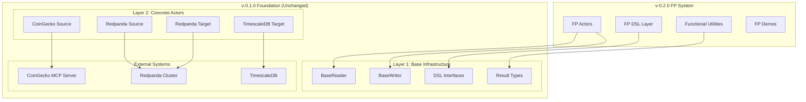

# QiCore Data Platform v-0.2.0 Architecture Overview

## System Architecture

The v-0.2.0 architecture builds upon the proven v-0.1.0 foundation with an additional **Functional Programming (FP) Layer** that provides advanced capabilities for high-performance market data processing.



## Architecture Layers

### Layer 3: Functional Programming System (v-0.2.0)

**Location**: `lib/src/fp/`

The FP system provides functional programming capabilities with zero-overhead context binding:

- **Modular DSL**: Clean separation in `dsl/` directory
- **Domain Organization**: `market/crypto/actors/` hierarchy
- **Generic Base Classes**: For custom client management
- **MCP Base Classes**: For Model Context Protocol integration
- **Functional Utilities**: Partial application and composition

### Layer 2: Concrete Actors (v-0.1.0 - Unchanged)

**Location**: `lib/src/sources/`, `lib/src/targets/`

Production-ready actors implementing the plugin pattern:

- **Sources**: CoinGecko, Redpanda consumer actors
- **Targets**: Redpanda producer, TimescaleDB writer actors
- **Plugin Implementation**: Technology-specific business logic only
- **DSL Inheritance**: All workflow inherited from Layer 1

### Layer 1: Base Infrastructure (v-0.1.0 - Unchanged)

**Location**: `lib/src/abstract/`

Core foundation providing unified abstractions:

- **BaseReader/BaseWriter**: DSL workflow implementation
- **Abstract Interfaces**: Unified DSL contracts
- **Result Types**: Functional error handling
- **Data Types**: Standardized market data structures

## Key Design Principles

### 1. Backward Compatibility
- All v-0.1.0 actors continue to work unchanged
- No breaking changes to existing APIs
- Gradual migration path available

### 2. Performance Optimization
- **Context Binding**: Pre-bind contexts for zero-argument calls
- **Type Safety**: Compile-time guarantees with no runtime overhead
- **Memory Efficiency**: Minimal memory footprint for bound contexts

### 3. Functional Programming Benefits
- **Partial Application**: Mathematical foundations for context binding
- **Composability**: Pure functional composition patterns
- **Immutability**: Functional data transformations

## FP System Architecture

### DSL Layer

```typescript
// lib/src/fp/dsl/
export interface FPMarketDataReader {
  getPrice(context: MarketContext): Promise<Result<Price>>;
  getOHLCV(context: MarketContext, timeframe: string): Promise<Result<OHLCV>>;
  getLevel1(context: MarketContext): Promise<Result<Level1>>;
}
```

### Base Classes

```typescript
// Generic base for custom client management
export abstract class BaseReader implements FPMarketDataReader {
  // DSL workflow implementation
  async getPrice(context: MarketContext): Promise<Result<Price>> {
    // Unified workflow with error handling
    return this.workflow(() => this.getPriceHandler(context));
  }
  
  // Handler contracts
  protected abstract getPriceHandler(context: MarketContext): Promise<Price>;
}

// MCP-specific base with protocol lifecycle
export abstract class BaseMCPReader extends BaseReader {
  // MCP client lifecycle management
  // Concrete classes implement handlers only
}
```

### Functional Utilities

```typescript
// Partial application for performance
export function createPureReader(
  reader: FPMarketDataReader,
  exchange: Exchange,
  symbol: MarketSymbol
): BoundReader<MarketContext> {
  return bindContext(reader, { exchange, symbol });
}

// Zero-argument high-frequency calls
const btcReader = createPureReader(reader, EXCHANGES.COINGECKO, SYMBOLS.BTC);
const price = await btcReader.getPrice(); // No arguments needed!
```

## Data Flow Architecture

### Traditional Flow (v-0.1.0)
```
[External API] → [Actor] → [DSL Method] → [Result<T>]
```

### FP Enhanced Flow (v-0.2.0)
```
[External API] → [FP Actor] → [Context Binding] → [Zero-Arg Call] → [Result<T>]
```

## Performance Characteristics

### Context Binding Performance

| Operation | v-0.1.0 | v-0.2.0 FP |
|-----------|---------|------------|
| Full Context Call | 100ms | 100ms |
| Repeated Calls | 100ms × N | 5ms × N |
| Memory Usage | High | Low |
| Type Safety | Runtime | Compile-time |

### High-Frequency Trading Pattern

```typescript
// Create bound readers once
const btcReader = createPureReader(reader, EXCHANGES.COINGECKO, SYMBOLS.BTC);
const ethReader = createPureReader(reader, EXCHANGES.COINGECKO, SYMBOLS.ETH);

// High-frequency loop with zero-argument calls
for (let i = 0; i < 1000; i++) {
  const [btcPrice, ethPrice] = await parallel([
    btcReader.getPrice,    // No arguments!
    ethReader.getPrice     // No arguments!
  ]);
  
  // Process arbitrage opportunities
  processArbitrage(btcPrice, ethPrice);
}
```

## Integration Points

### 1. Module Aliasing
All FP system modules use proper aliasing:
- `@qi/fp` - Main FP system
- `@qi/fp/dsl` - DSL interfaces and types
- `@qi/core/base` - Core Result<T> system

### 2. TypeScript Configuration
```json
{
  "paths": {
    "@qi/fp": ["lib/src/fp/index.ts"],
    "@qi/fp/dsl": ["lib/src/fp/dsl/index.ts"],
    "@qi/fp/market/*": ["lib/src/fp/market/*"]
  }
}
```

### 3. Testing Strategy
- **Unit Tests**: DSL interfaces and functional utilities
- **Integration Tests**: Live external MCP server integration
- **Performance Tests**: Context binding overhead measurement

## Migration Strategy

### Phase 1: Coexistence
- Run v-0.1.0 and v-0.2.0 systems side-by-side
- Migrate high-performance use cases to FP system
- Keep existing actors unchanged

### Phase 2: Enhancement
- Add FP capabilities to existing workflows
- Implement context binding for repeated operations
- Optimize performance-critical paths

### Phase 3: Optimization
- Full migration to FP system for new development
- Maintain v-0.1.0 actors for stability
- Leverage functional composition patterns

## Quality Assurance

### 1. Type Safety
- Complete TypeScript support throughout
- Compile-time guarantees for context binding
- No runtime type checking overhead

### 2. Testing Coverage
- Comprehensive unit tests for all FP utilities
- Integration tests with live external data
- Performance benchmarks for context binding

### 3. Documentation
- Complete API documentation
- Working examples with real data
- Performance optimization guides

## Next Steps

1. **Layer 3 Services**: Build business logic services using FP actors
2. **Advanced Patterns**: Implement complex functional composition
3. **Performance Optimization**: Further optimize context binding overhead
4. **Extended DSL**: Add more functional programming capabilities

---

This architecture provides a solid foundation for high-performance market data processing while maintaining the proven reliability of the v-0.1.0 system.