## Clear Agent/MCP Centric Architecture

The architecture is now clearly defined based on the two-centric approach implemented in the lib/ directory.

## Architecture
about the arhitecture: two centrics, one for structure and the other one for impl

### 1. Structural Framework: Data Stream Platform (Redpanda/Kafka)
- **High-performance streaming**: Redpanda cluster handles crypto data flow
- **Topics**: crypto-prices, crypto-ohlcv, crypto-analytics, crypto-trending
- **Physical infrastructure**: RedpandaClient, CryptoDataProducer, CryptoDataConsumer

### 2. Agent/MCP Centric Framework for Implementation
- **All components around data stream are agents**: Publisher agents, Consumer agents
- **Two primary agent types with clear functionalities**:

#### **Publisher Agent Type**
- **Functionality**: Get data from data source → Publish data into data stream
- **Examples**: CryptoCompare agent, TwelveData agent, CoinGecko agent
- **Workflow**: Data Source (API) → Agent → MCP Tools → Redpanda Topics

#### **Consumer Agent Type** 
- **Functionality**: Get data from data stream → Store data into data store
- **Examples**: TimescaleDB agent, ClickHouse agent, Analytics agent
- **Workflow**: Redpanda Topics → Agent → MCP Tools → Database/Storage

### 3. Agent Definition (QiCore Framework)
**Agent = Tool Set + Process Executor + Prompt/LLM**
- **Tool Set**: MCP tools (both official + custom)
- **Process Executor**: Workflow/orchestration logic
- **Prompt/LLM**: AI-powered decision making

### 4. MCP Integration Pattern (MANDATORY)

#### **Agent/MCP Architecture Diagram**

```mermaid
graph TB
    subgraph "Agent Layer (QiCore Framework)"
        PA[Publisher Agent<br/>Tool Set + Process Executor + Prompt/LLM]
        CA[Consumer Agent<br/>Tool Set + Process Executor + Prompt/LLM]
        
        subgraph "MCP Client (Single Manager)"
            MC[MCP Client<br/>Manages all connections]
        end
    end
    
    subgraph "Official MCP Servers (100% Usage Priority)"
        CGMCP[📈 CoinGecko MCP<br/>@coingecko/coingecko-mcp]
        PGMCP[🗄️ PostgreSQL MCP<br/>@modelcontextprotocol/server-postgres]
        KMCP[📨 Kafka MCP<br/>@confluent/mcp-confluent]
    end
    
    subgraph "Custom MCP Tools (Exception Only)"
        TR[🔧 Tool Registry]
        SCT[📤 StreamCryptoDataTool<br/>High-performance streaming]
        CCT[📥 ConsumeStreamDataTool<br/>High-performance consumption]
        PCT[⚡ ProcessCryptoStreamTool<br/>Real-time processing]
    end
    
    subgraph "Services & Infrastructure"
        CG[CoinGecko API]
        RP[Redpanda Cluster]
        TS[TimescaleDB]
    end
    
    PA --> MC
    CA --> MC
    
    MC --> CGMCP
    MC --> PGMCP
    MC --> KMCP
    MC --> TR
    
    TR --> SCT
    TR --> CCT
    TR --> PCT
    
    CGMCP --> CG
    SCT --> RP
    CCT --> RP
    PGMCP --> TS
    
    style CGMCP fill:#e1f5fe
    style PGMCP fill:#e1f5fe
    style KMCP fill:#e1f5fe
    style SCT fill:#fff3e0
    style CCT fill:#fff3e0
    style PCT fill:#fff3e0
```

#### **Official MCP First Principle (100% Usage)**
- **✅ ALWAYS USE**: Official MCP servers when available
- **PostgreSQL**: `@modelcontextprotocol/server-postgres` (works with TimescaleDB)
- **Kafka**: `@confluent/mcp-confluent` (works with Redpanda)
- **CoinGecko**: `@coingecko/coingecko-mcp` (15k+ coins, 8M+ tokens)
- **MCP Client**: Single manager for all MCP connections

#### **Custom MCP Tools: Exception Only**
- **ONLY when**: Official server doesn't exist or lacks functionality
- **High-performance components**: Wrapped as MCP tools for agent access
- **Examples**: StreamCryptoDataTool, ConsumeStreamDataTool, ProcessCryptoStreamTool
- **Justification**: Official Kafka MCP provides basic operations, NOT streaming pipelines

### 5. Platform Functionality (Complete Data Flow)

**Platform Purpose**: Get data from data source → Data pushed to data stream to be used → Users of the data stream get the data and do their jobs

#### **Complete Platform Flow**

#### **Detailed Agent Workflows**

**Publisher Agent Workflow (Get data from data source → Publish data into data stream)**:

**Consumer Agent Workflow (Get data from data stream → Store data into data store)**:

**Data Stream Users**:
- **Real-time Analytics**: Subscribe to crypto-prices topic for live price alerts
- **Historical Analysis**: Subscribe to crypto-ohlcv topic for technical analysis  
- **Market Intelligence**: Subscribe to crypto-analytics topic for market insights
- **Custom Applications**: Subscribe to any topic for specialized use cases

**Implementation Status**: ✅ All components implemented in lib/ directory following this architecture.

**Documentation**: See [docs/design_and_impl/](../design_and_impl/) for complete architecture specification with implementation diagrams.

## Implementation plan
with the above architecture view, the plan is clear, from structural point of view, we need to focus on the center and two ends, so
1. phase 1: data stream. the way to approach this is to study existing projects (documented in the docs), study and selection the right one to begin with, learn how to use the project and make them work, then extract the right component for this phase
2. phase 2: the publisher agent, crptocompare agent and twelvedata agent, the process of building these two agent is the same, mcp tools might different and i hope the data sources do provide mcp for it, this requires thorough studdy, another topic in the phase is the workflow for publisher agent, both should shared the same workflow, and the need to study workflow for such task, and i am hopping this is very standard and we should be able to find the right agent to borrow or imgrate from. we use AI Orchestra as the low level pack for agent (qiagent is the wrapprer) and we use typescript mcp/sdk for low level mcp (qimcp is the wrapper, right now only client and very small set of tools are wrapped, we can easily extend it to more tools or server)
3. phase 3: the cusoumer agent, timescale agent and clickhouse agent, this phase has the exact dev logic as phase 2

## Prerequisit

### Experiments
before executing the plan, we need
1. study the projects in `docs/existing-projects.md`
2. make experiments and demos on phase 1-3, from the study

only when the experiments achieve the expect results, we can kick off the execution of the plan.

### Architecture confirmation
after the experiment, we need work out a better architecture design. 
1. the two centric arhitecture
2. the comparison with the traditional way of software dev, to show how the current arhictecture improve the efficiency and intelligent into the process.

## Reseaarch topics

there is a fundamental problem we need to address throughout