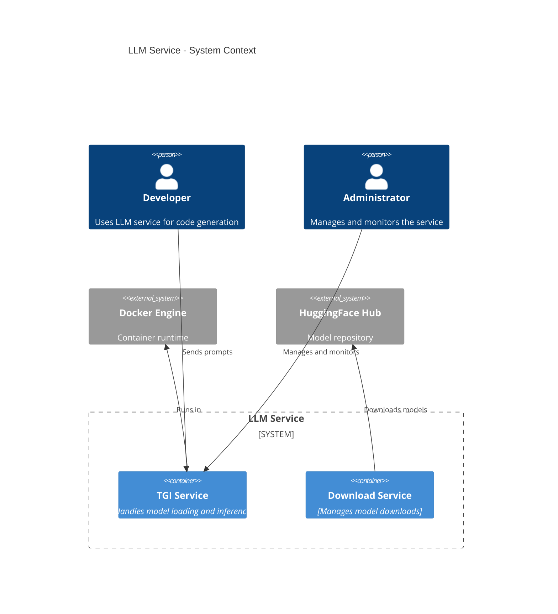
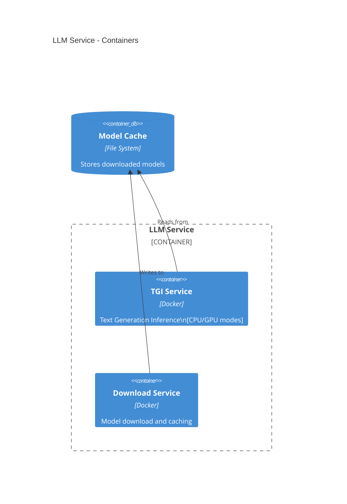

# TGI LLM Service Documentation Updates

## design.c4.md
```markdown
# TGI-Based LLM Service Design

## 1. Context Diagram



## 2. Container Diagram



## Project Structure

```text
services/ai/llm-service/
├── config/
│   ├── infra/              # Infrastructure configurations
│   │   ├── cpu.env         # CPU-specific settings
│   │   ├── gpu.env         # GPU-specific settings
│   │   └── base.env        # Base settings
│   └── models/             # Model configurations
│       ├── download.env    # Download settings
│       ├── model.env       # Active model config
│       └── variants/       # Model variants
├── docker/                 # Docker configurations
│   ├── docker-compose.cpu.yml
│   ├── docker-compose.download.yml
│   ├── docker-compose.gpu.yml
│   ├── Dockerfile
│   └── Dockerfile.downloader
├── docs/                   # Documentation
├── monitoring/             # Monitoring configs
├── scripts/               # Utility scripts
└── README.md
```

```

## guide.system.md
```markdown
# TGI Service Setup Guide

## System Requirements

### CPU-Only Deployment
- Ubuntu 20.04 LTS or later
- 32GB RAM minimum
- 100GB available disk space
- Docker Engine 24.0 or later

### CPU+GPU Deployment
- All CPU requirements, plus:
- NVIDIA GPU with 12GB+ VRAM
- NVIDIA Driver 525+
- nvidia-container-toolkit

## Deployment Steps

1. Download Model
```bash
docker compose -f docker/docker-compose.download.yml up --remove-orphans --build
```

2. Start Service
```bash
# CPU Mode
docker compose -f docker/docker-compose.cpu.yml up -d

# GPU Mode
docker compose -f docker/docker-compose.gpu.yml up -d
```

3. Verify Deployment
```bash
curl http://localhost:8080/health
```

## Configuration Files

### Base Infrastructure (config/infra/base.env)
```ini
USE_CUDA=0
USE_FLASH_ATTENTION=0
USE_TRITON=0
MAX_CONCURRENT_REQUESTS=8
MAX_BATCH_SIZE=4
```

### Model Configuration (config/models/model.env)
```ini
MODEL_ID=codellama/CodeLlama-7b-instruct-hf
MAX_INPUT_LENGTH=4096
MAX_TOTAL_TOKENS=8192
TEMPERATURE=0.7
TOP_P=0.95
```

## Monitoring and Maintenance

### Health Checks
```bash
# Service health
curl http://localhost:8080/health

# Model info
curl http://localhost:8080/info
```

### Resource Monitoring
```bash
# Container stats
docker stats llm-service-tgi-1

# GPU stats (if applicable)
nvidia-smi -l 1
```
```

## README.md
```markdown
# LLM Service

Text Generation Inference (TGI) based LLM service supporting both CPU and GPU deployments.

## Quick Start

1. Download model:
```bash
docker compose -f docker/docker-compose.download.yml up --remove-orphans --build
```

2. Start service:
```bash
# CPU mode
docker compose -f docker/docker-compose.cpu.yml up -d

# or GPU mode
docker compose -f docker/docker-compose.gpu.yml up -d
```

3. Test service:
```bash
curl http://localhost:8080/health
```

## Project Structure

```
services/ai/llm-service/
├── config/               # Service configurations
├── docker/              # Docker configurations
├── docs/                # Documentation
├── monitoring/          # Monitoring configurations
├── scripts/             # Utility scripts
└── README.md
```

## Documentation

- [System Guide](docs/guide.system.md)
- [Design Documentation](docs/design.c4.md)
- [Implementation Plan](docs/impl.plan.md)

## Configuration

1. Infrastructure settings in `config/infra/`
2. Model settings in `config/models/`
3. Docker configurations in `docker/`

## Development

Requires:
- Docker Engine 24.0+
- 32GB RAM (CPU mode)
- NVIDIA GPU + Drivers (GPU mode)

## License

Private
```