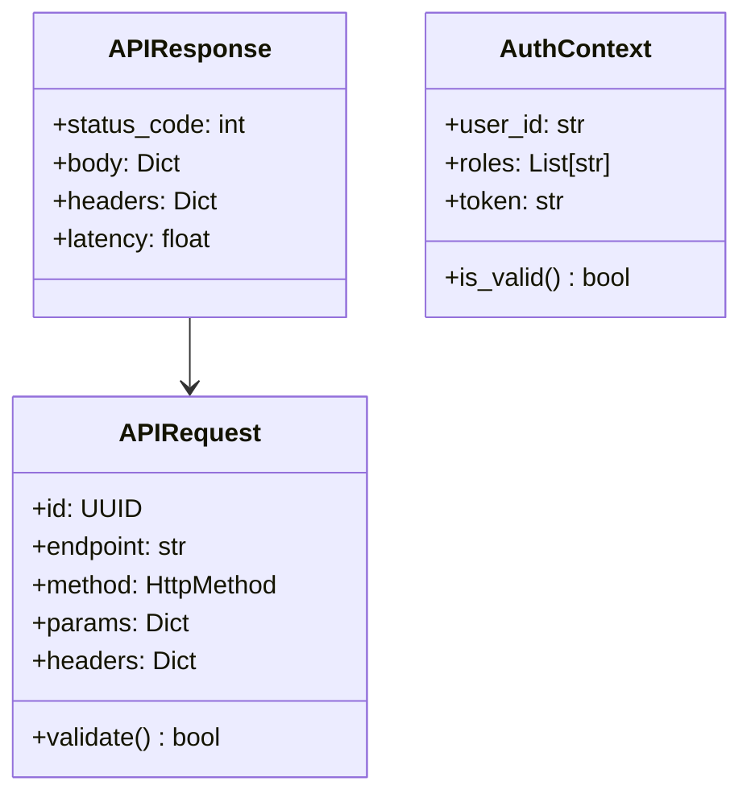
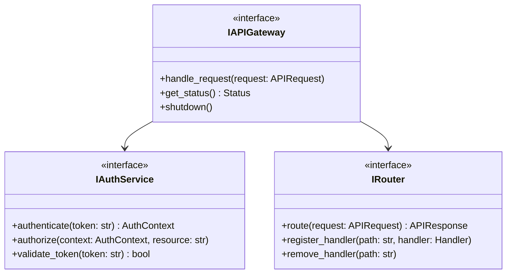
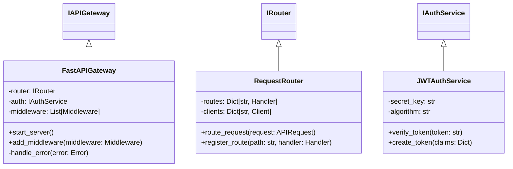
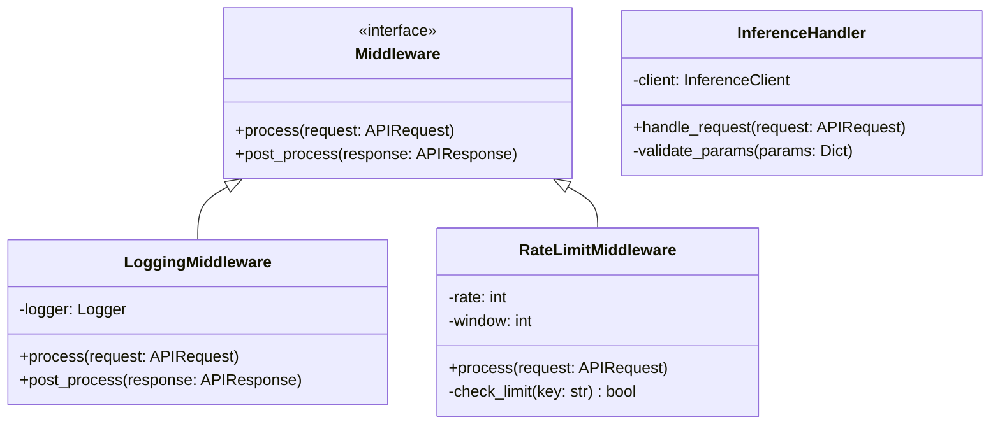
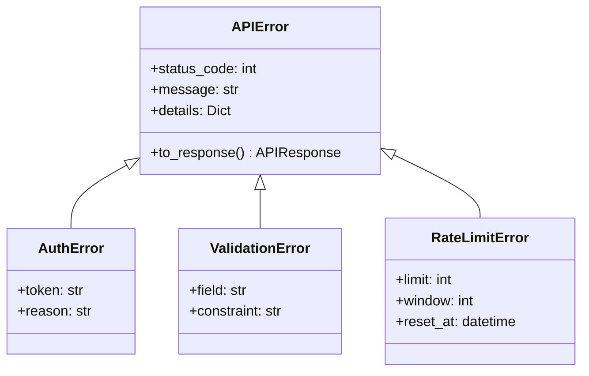

# API Gateway Classes

## Core Domain Models

```mermaid
classDiagram
    class APIRequest {
        +id: UUID
        +endpoint: str
        +method: HttpMethod
        +params: Dict
        +headers: Dict
        +validate() bool
    }

    class APIResponse {
        +status_code: int
        +body: Dict
        +headers: Dict
        +latency: float
    }

    class AuthContext {
        +user_id: str
        +roles: List[str]
        +token: str
        +is_valid() bool
    }

    APIResponse --> APIRequest
```

## Service Interfaces

```mermaid
classDiagram
    class IAPIGateway {
        <<interface>>
        +handle_request(request: APIRequest)
        +get_status() Status
        +shutdown()
    }

    class IAuthService {
        <<interface>>
        +authenticate(token: str) AuthContext
        +authorize(context: AuthContext, resource: str)
        +validate_token(token: str) bool
    }

    class IRouter {
        <<interface>>
        +route(request: APIRequest) APIResponse
        +register_handler(path: str, handler: Handler)
        +remove_handler(path: str)
    }

    IAPIGateway --> IAuthService
    IAPIGateway --> IRouter
```

## Service Implementations

```mermaid
classDiagram
    class FastAPIGateway {
        -router: IRouter
        -auth: IAuthService
        -middleware: List[Middleware]
        +start_server()
        +add_middleware(middleware: Middleware)
        -handle_error(error: Error)
    }

    class RequestRouter {
        -routes: Dict[str, Handler]
        -clients: Dict[str, Client]
        +route_request(request: APIRequest)
        +register_route(path: str, handler: Handler)
    }

    class JWTAuthService {
        -secret_key: str
        -algorithm: str
        +verify_token(token: str)
        +create_token(claims: Dict)
    }

    IAPIGateway <|-- FastAPIGateway
    IRouter <|-- RequestRouter
    IAuthService <|-- JWTAuthService
```

## Middleware and Handlers

```mermaid
classDiagram
    class Middleware {
        <<interface>>
        +process(request: APIRequest)
        +post_process(response: APIResponse)
    }

    class LoggingMiddleware {
        -logger: Logger
        +process(request: APIRequest)
        +post_process(response: APIResponse)
    }

    class RateLimitMiddleware {
        -rate: int
        -window: int
        +process(request: APIRequest)
        -check_limit(key: str) bool
    }

    class InferenceHandler {
        -client: InferenceClient
        +handle_request(request: APIRequest)
        -validate_params(params: Dict)
    }

    Middleware <|-- LoggingMiddleware
    Middleware <|-- RateLimitMiddleware
```

## Error Handling

```mermaid
classDiagram
    class APIError {
        +status_code: int
        +message: str
        +details: Dict
        +to_response() APIResponse
    }

    class AuthError {
        +token: str
        +reason: str
    }

    class ValidationError {
        +field: str
        +constraint: str
    }

    class RateLimitError {
        +limit: int
        +window: int
        +reset_at: datetime
    }

    APIError <|-- AuthError
    APIError <|-- ValidationError
    APIError <|-- RateLimitError
```
