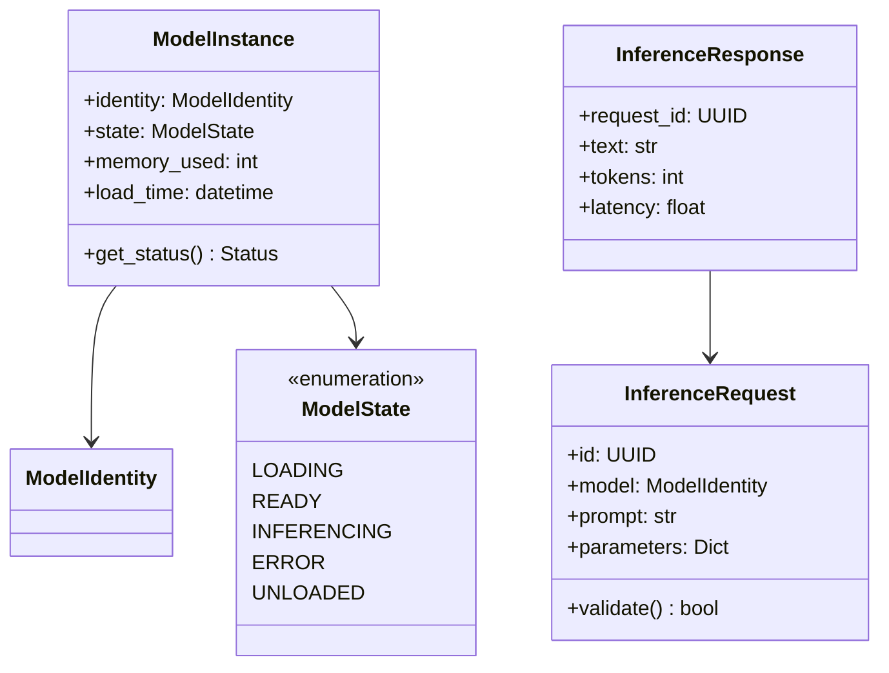
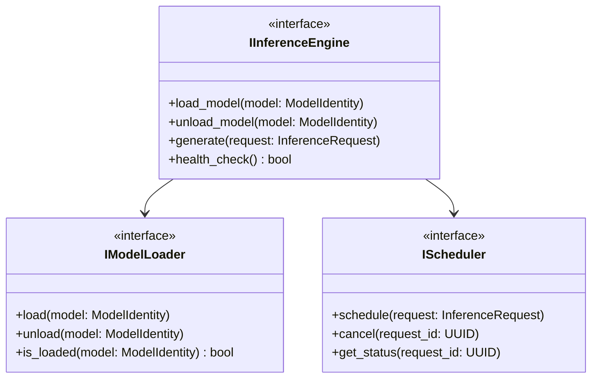
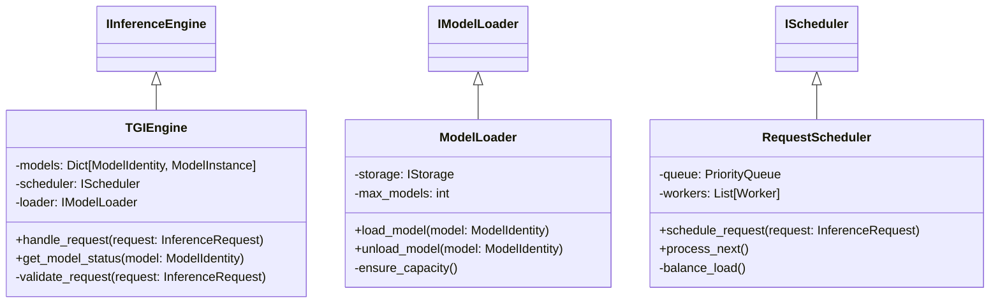
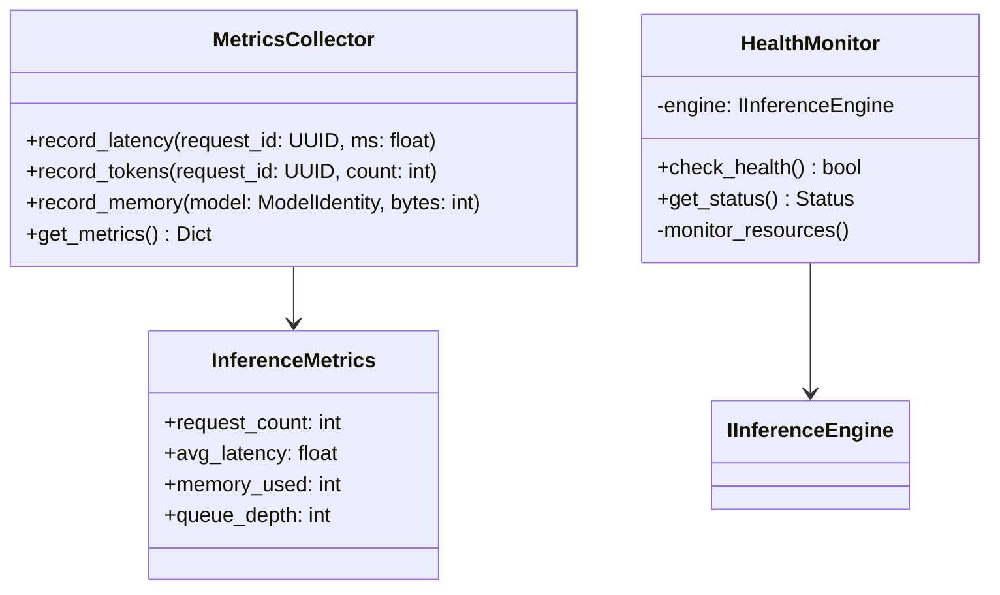
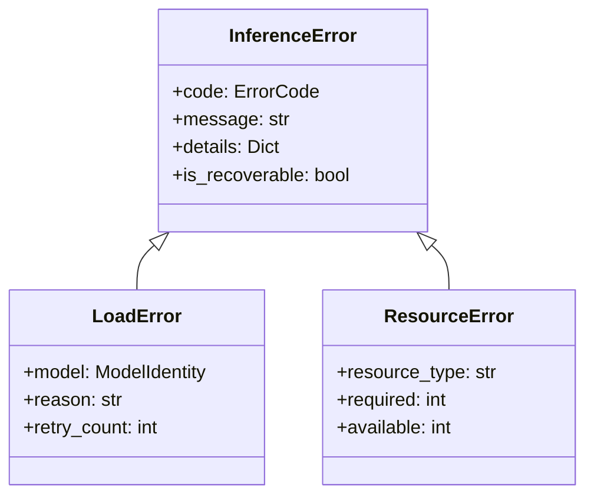

# Inference Engine Classes

## Core Domain Models

```mermaid
classDiagram
    class ModelInstance {
        +identity: ModelIdentity
        +state: ModelState
        +memory_used: int
        +load_time: datetime
        +get_status() Status
    }

    class InferenceRequest {
        +id: UUID
        +model: ModelIdentity
        +prompt: str
        +parameters: Dict
        +validate() bool
    }

    class InferenceResponse {
        +request_id: UUID
        +text: str
        +tokens: int
        +latency: float
    }

    class ModelState {
        <<enumeration>>
        LOADING
        READY
        INFERENCING
        ERROR
        UNLOADED
    }

    ModelInstance --> ModelIdentity
    ModelInstance --> ModelState
    InferenceResponse --> InferenceRequest
```

## Service Interfaces

```mermaid
classDiagram
    class IInferenceEngine {
        <<interface>>
        +load_model(model: ModelIdentity)
        +unload_model(model: ModelIdentity)
        +generate(request: InferenceRequest)
        +health_check() bool
    }

    class IModelLoader {
        <<interface>>
        +load(model: ModelIdentity)
        +unload(model: ModelIdentity)
        +is_loaded(model: ModelIdentity) bool
    }

    class IScheduler {
        <<interface>>
        +schedule(request: InferenceRequest)
        +cancel(request_id: UUID)
        +get_status(request_id: UUID)
    }

    IInferenceEngine --> IModelLoader
    IInferenceEngine --> IScheduler
```

## Service Implementations

```mermaid
classDiagram
    class TGIEngine {
        -models: Dict[ModelIdentity, ModelInstance]
        -scheduler: IScheduler
        -loader: IModelLoader
        +handle_request(request: InferenceRequest)
        +get_model_status(model: ModelIdentity)
        -validate_request(request: InferenceRequest)
    }

    class ModelLoader {
        -storage: IStorage
        -max_models: int
        +load_model(model: ModelIdentity)
        +unload_model(model: ModelIdentity)
        -ensure_capacity()
    }

    class RequestScheduler {
        -queue: PriorityQueue
        -workers: List[Worker]
        +schedule_request(request: InferenceRequest)
        +process_next()
        -balance_load()
    }

    IInferenceEngine <|-- TGIEngine
    IModelLoader <|-- ModelLoader
    IScheduler <|-- RequestScheduler
```

## Monitoring and Metrics

```mermaid
classDiagram
    class MetricsCollector {
        +record_latency(request_id: UUID, ms: float)
        +record_tokens(request_id: UUID, count: int)
        +record_memory(model: ModelIdentity, bytes: int)
        +get_metrics() Dict
    }

    class HealthMonitor {
        -engine: IInferenceEngine
        +check_health() bool
        +get_status() Status
        -monitor_resources()
    }

    class InferenceMetrics {
        +request_count: int
        +avg_latency: float
        +memory_used: int
        +queue_depth: int
    }

    MetricsCollector --> InferenceMetrics
    HealthMonitor --> IInferenceEngine
```

## Error Handling

```mermaid
classDiagram
    class InferenceError {
        +code: ErrorCode
        +message: str
        +details: Dict
        +is_recoverable: bool
    }

    class LoadError {
        +model: ModelIdentity
        +reason: str
        +retry_count: int
    }

    class ResourceError {
        +resource_type: str
        +required: int
        +available: int
    }

    InferenceError <|-- LoadError
    InferenceError <|-- ResourceError
```
