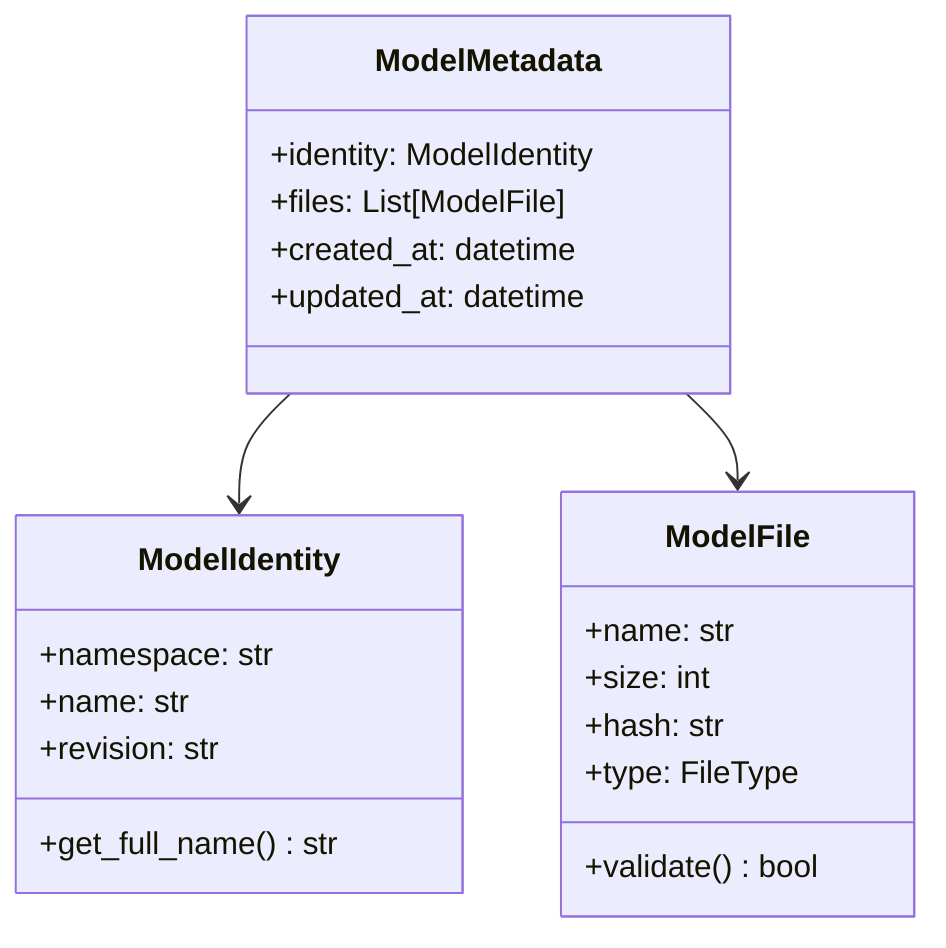
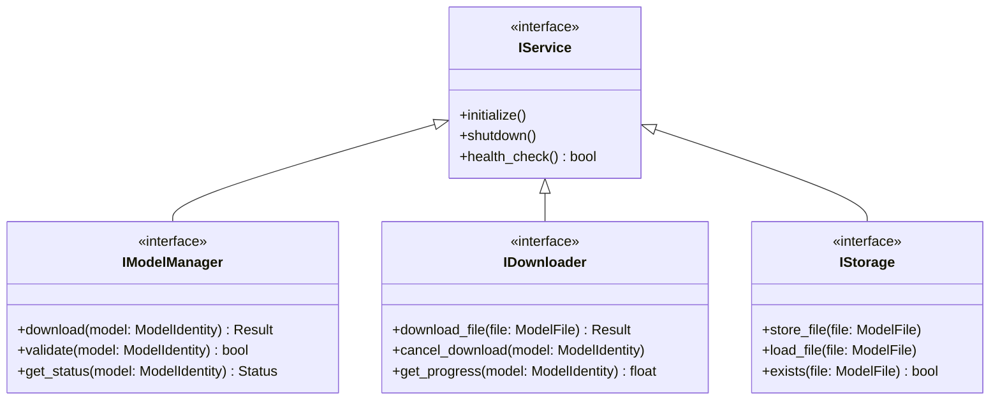
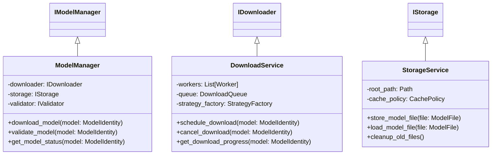
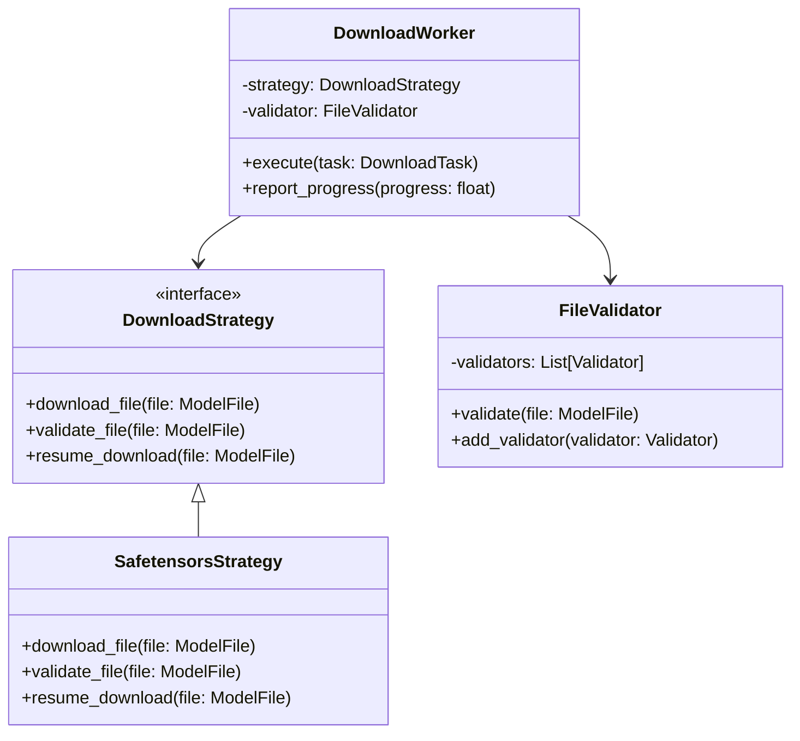
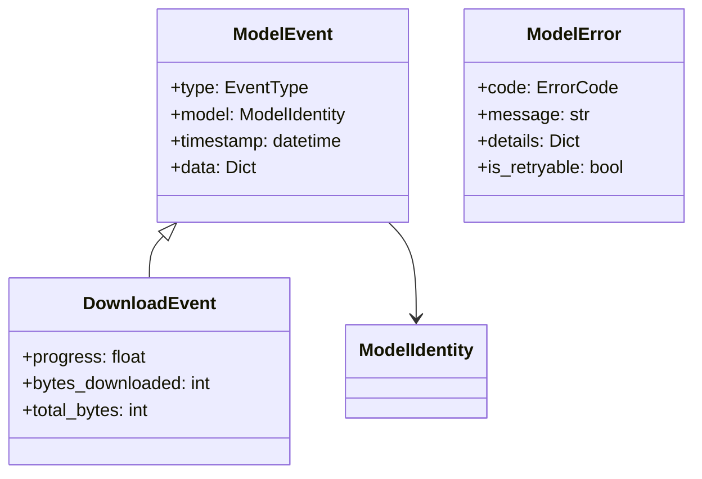

# Model Manager Classes

## Core Domain Models

```mermaid
classDiagram
    class ModelIdentity {
        +namespace: str
        +name: str
        +revision: str
        +get_full_name() str
    }

    class ModelFile {
        +name: str
        +size: int
        +hash: str
        +type: FileType
        +validate() bool
    }

    class ModelMetadata {
        +identity: ModelIdentity
        +files: List[ModelFile]
        +created_at: datetime
        +updated_at: datetime
    }

    ModelMetadata --> ModelIdentity
    ModelMetadata --> ModelFile
```

## Service Interfaces

```mermaid
classDiagram
    class IService {
        <<interface>>
        +initialize()
        +shutdown()
        +health_check() bool
    }

    class IModelManager {
        <<interface>>
        +download(model: ModelIdentity) Result
        +validate(model: ModelIdentity) bool
        +get_status(model: ModelIdentity) Status
    }

    class IDownloader {
        <<interface>>
        +download_file(file: ModelFile) Result
        +cancel_download(model: ModelIdentity)
        +get_progress(model: ModelIdentity) float
    }

    class IStorage {
        <<interface>>
        +store_file(file: ModelFile)
        +load_file(file: ModelFile)
        +exists(file: ModelFile) bool
    }

    IService <|-- IModelManager
    IService <|-- IDownloader
    IService <|-- IStorage
```

## Service Implementations

```mermaid
classDiagram
    class ModelManager {
        -downloader: IDownloader
        -storage: IStorage
        -validator: IValidator
        +download_model(model: ModelIdentity)
        +validate_model(model: ModelIdentity)
        +get_model_status(model: ModelIdentity)
    }

    class DownloadService {
        -workers: List[Worker]
        -queue: DownloadQueue
        -strategy_factory: StrategyFactory
        +schedule_download(model: ModelIdentity)
        +cancel_download(model: ModelIdentity)
        +get_download_progress(model: ModelIdentity)
    }

    class StorageService {
        -root_path: Path
        -cache_policy: CachePolicy
        +store_model_file(file: ModelFile)
        +load_model_file(file: ModelFile)
        +cleanup_old_files()
    }

    IModelManager <|-- ModelManager
    IDownloader <|-- DownloadService
    IStorage <|-- StorageService
```

## Workers and Strategies

```mermaid
classDiagram
    class DownloadWorker {
        -strategy: DownloadStrategy
        -validator: FileValidator
        +execute(task: DownloadTask)
        +report_progress(progress: float)
    }

    class DownloadStrategy {
        <<interface>>
        +download_file(file: ModelFile)
        +validate_file(file: ModelFile)
        +resume_download(file: ModelFile)
    }

    class SafetensorsStrategy {
        +download_file(file: ModelFile)
        +validate_file(file: ModelFile)
        +resume_download(file: ModelFile)
    }

    class FileValidator {
        -validators: List[Validator]
        +validate(file: ModelFile)
        +add_validator(validator: Validator)
    }

    DownloadWorker --> DownloadStrategy
    DownloadStrategy <|-- SafetensorsStrategy
    DownloadWorker --> FileValidator
```

## Events and Error Handling

```mermaid
classDiagram
    class ModelEvent {
        +type: EventType
        +model: ModelIdentity
        +timestamp: datetime
        +data: Dict
    }

    class DownloadEvent {
        +progress: float
        +bytes_downloaded: int
        +total_bytes: int
    }

    class ModelError {
        +code: ErrorCode
        +message: str
        +details: Dict
        +is_retryable: bool
    }

    ModelEvent <|-- DownloadEvent
    ModelEvent --> ModelIdentity
```
