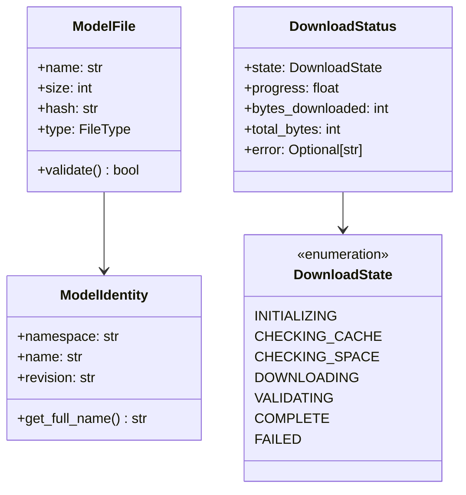
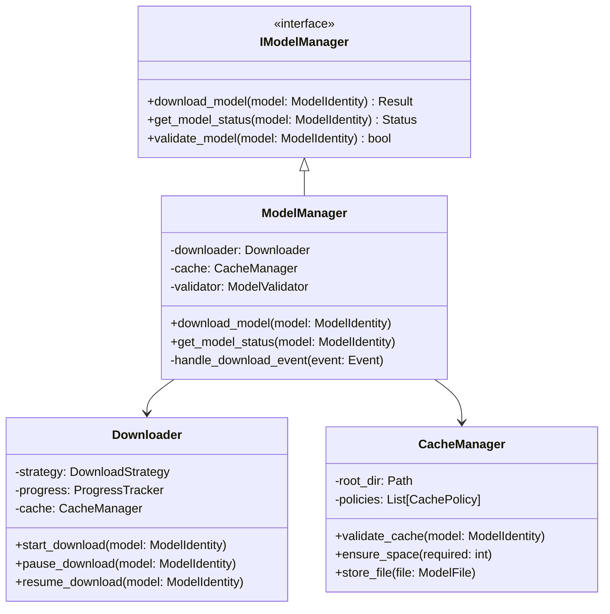
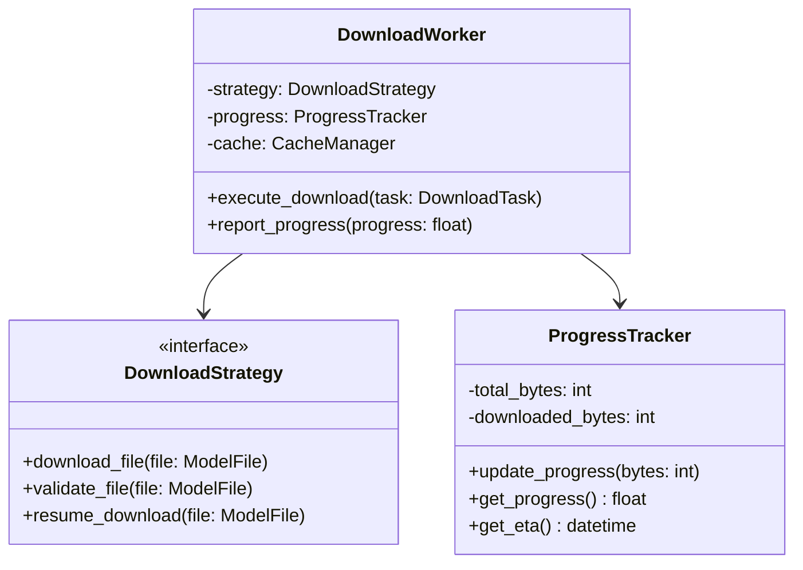
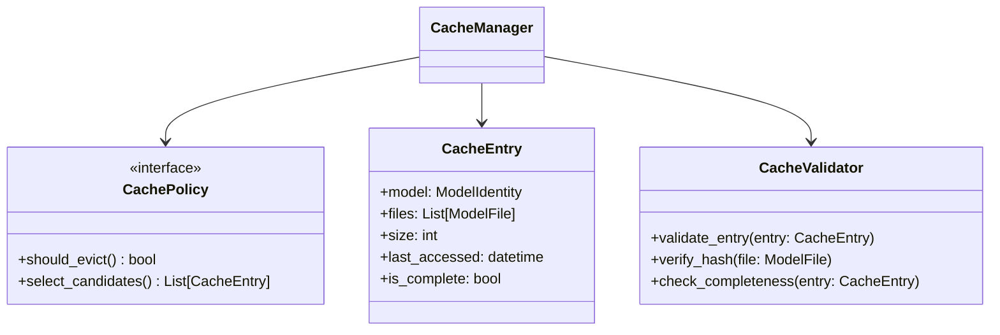
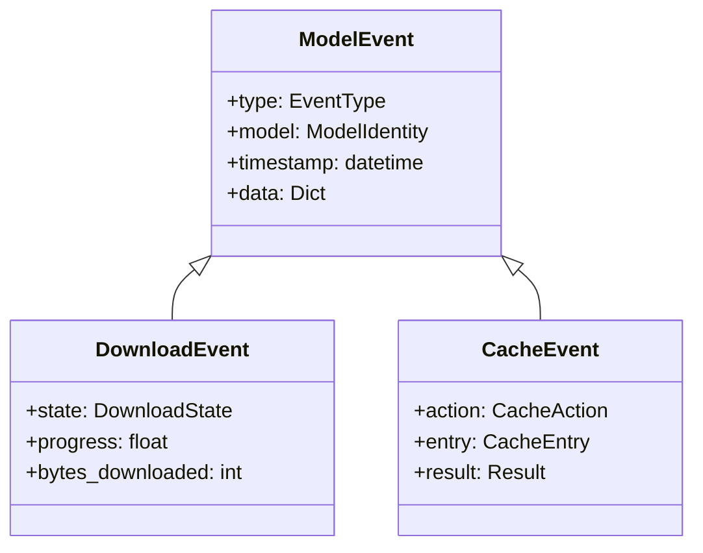

# Model Manager Classes

## Core Domain Models

```mermaid
classDiagram
    class ModelIdentity {
        +namespace: str
        +name: str
        +revision: str
        +get_full_name() str
    }

    class ModelFile {
        +name: str
        +size: int
        +hash: str
        +type: FileType
        +validate() bool
    }

    class DownloadState {
        <<enumeration>>
        INITIALIZING
        CHECKING_CACHE
        CHECKING_SPACE
        DOWNLOADING
        VALIDATING
        COMPLETE
        FAILED
    }

    class DownloadStatus {
        +state: DownloadState
        +progress: float
        +bytes_downloaded: int
        +total_bytes: int
        +error: Optional[str]
    }

    ModelFile --> ModelIdentity
    DownloadStatus --> DownloadState
```

## Service Components

```mermaid
classDiagram
    class IModelManager {
        <<interface>>
        +download_model(model: ModelIdentity) Result
        +get_model_status(model: ModelIdentity) Status
        +validate_model(model: ModelIdentity) bool
    }

    class ModelManager {
        -downloader: Downloader
        -cache: CacheManager
        -validator: ModelValidator
        +download_model(model: ModelIdentity)
        +get_model_status(model: ModelIdentity)
        -handle_download_event(event: Event)
    }

    class Downloader {
        -strategy: DownloadStrategy
        -progress: ProgressTracker
        -cache: CacheManager
        +start_download(model: ModelIdentity)
        +pause_download(model: ModelIdentity)
        +resume_download(model: ModelIdentity)
    }

    class CacheManager {
        -root_dir: Path
        -policies: List[CachePolicy]
        +validate_cache(model: ModelIdentity)
        +ensure_space(required: int)
        +store_file(file: ModelFile)
    }

    IModelManager <|-- ModelManager
    ModelManager --> Downloader
    ModelManager --> CacheManager
```

## Download Components

```mermaid
classDiagram
    class DownloadStrategy {
        <<interface>>
        +download_file(file: ModelFile)
        +validate_file(file: ModelFile)
        +resume_download(file: ModelFile)
    }

    class ProgressTracker {
        -total_bytes: int
        -downloaded_bytes: int
        +update_progress(bytes: int)
        +get_progress() float
        +get_eta() datetime
    }

    class DownloadWorker {
        -strategy: DownloadStrategy
        -progress: ProgressTracker
        -cache: CacheManager
        +execute_download(task: DownloadTask)
        +report_progress(progress: float)
    }

    DownloadWorker --> DownloadStrategy
    DownloadWorker --> ProgressTracker
```

## Cache Integration

```mermaid
classDiagram
    class CachePolicy {
        <<interface>>
        +should_evict() bool
        +select_candidates() List[CacheEntry]
    }

    class CacheEntry {
        +model: ModelIdentity
        +files: List[ModelFile]
        +size: int
        +last_accessed: datetime
        +is_complete: bool
    }

    class CacheValidator {
        +validate_entry(entry: CacheEntry)
        +verify_hash(file: ModelFile)
        +check_completeness(entry: CacheEntry)
    }

    CacheManager --> CachePolicy
    CacheManager --> CacheEntry
    CacheManager --> CacheValidator
```

## Event System

```mermaid
classDiagram
    class ModelEvent {
        +type: EventType
        +model: ModelIdentity
        +timestamp: datetime
        +data: Dict
    }

    class DownloadEvent {
        +state: DownloadState
        +progress: float
        +bytes_downloaded: int
    }

    class CacheEvent {
        +action: CacheAction
        +entry: CacheEntry
        +result: Result
    }

    ModelEvent <|-- DownloadEvent
    ModelEvent <|-- CacheEvent
```
