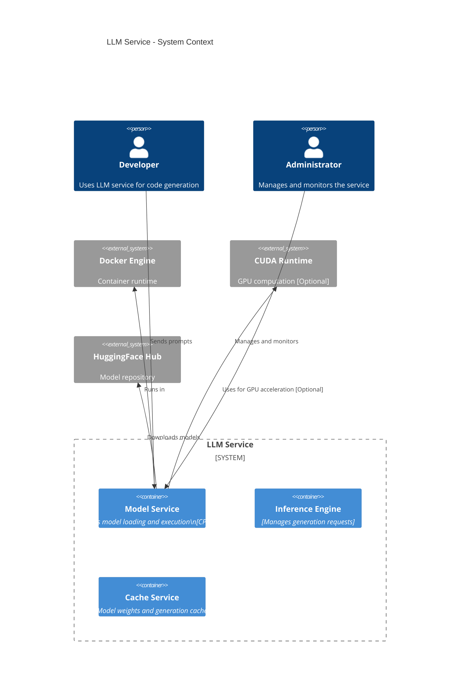
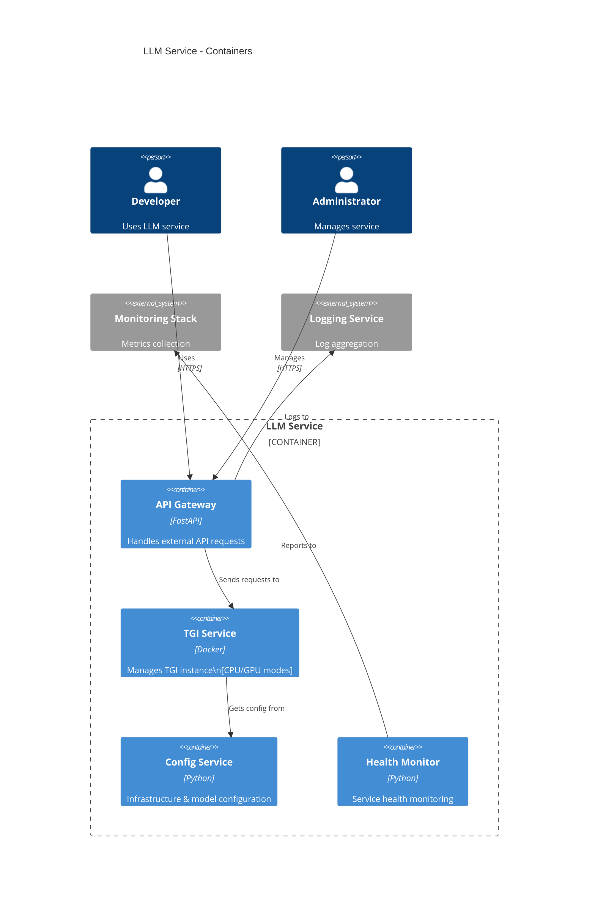
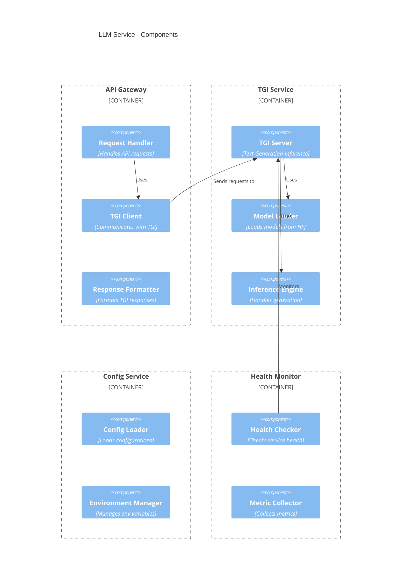
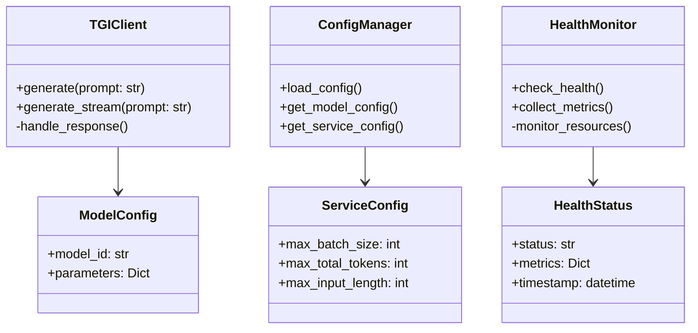

# TGI-Based LLM Server Design

## 1. Context Diagram



## 2. Container Diagram



## 3. Component Diagram



## 4. Class Diagram



## Key Differences from Previous Design

1. **Simplified Architecture**

   - TGI handles model management, inference, and resource optimization
   - Removed custom model managers and inference engine
   - Simplified configuration management

2. **Component Reduction**

   - No need for separate model factory
   - No custom tokenizer implementation
   - Resource management handled by TGI

3. **New Components**
   - TGI Client for communication with TGI service
   - Health monitoring specific to TGI
   - Streamlined configuration for TGI parameters

## Implementation Approach

1. **Infrastructure Layer**

   - Docker configuration for TGI
   - Resource allocation
   - Network setup

2. **Service Layer**

   - API Gateway implementation
   - TGI client wrapper
   - Configuration management

3. **Monitoring Layer**
   - Health checks
   - Metrics collection
   - Logging integration

## Deployment Structure

```
/
├── docker-compose.yml           # TGI and service configuration
├── config/
│   ├── models/                 # Model configurations
│   └── service/               # Service configurations
├── src/
│   ├── api/                   # API Gateway implementation
│   ├── client/               # TGI client wrapper
│   └── monitoring/           # Health and metrics
└── scripts/
    └── deploy.sh             # Deployment automation
```
