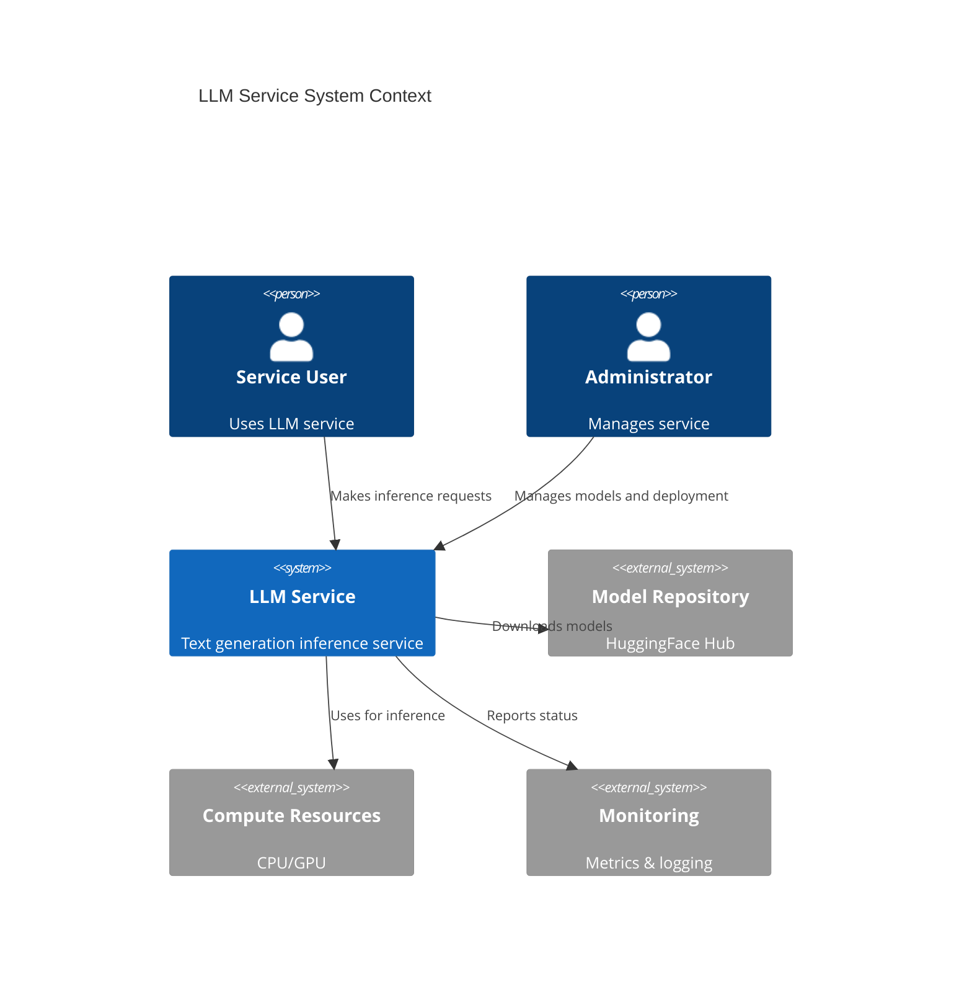
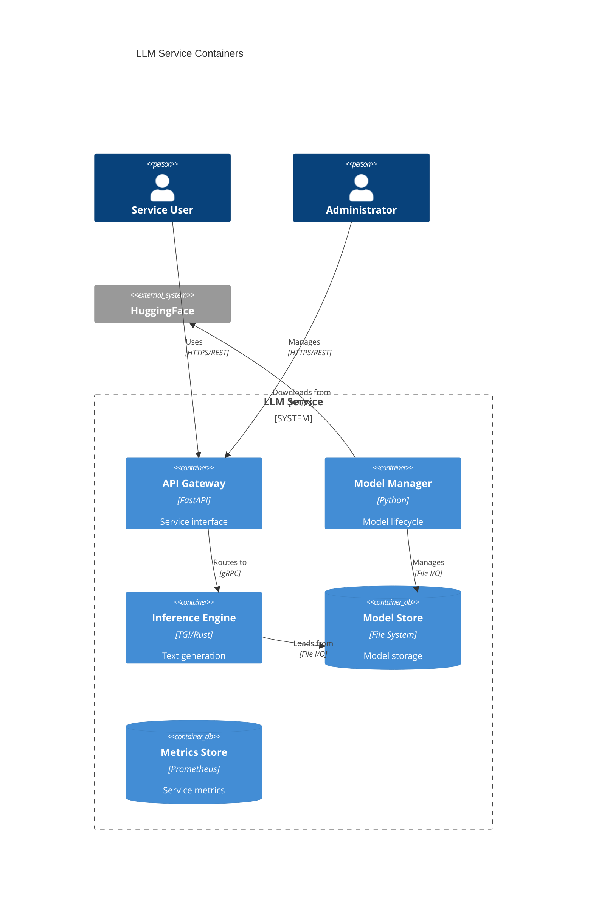
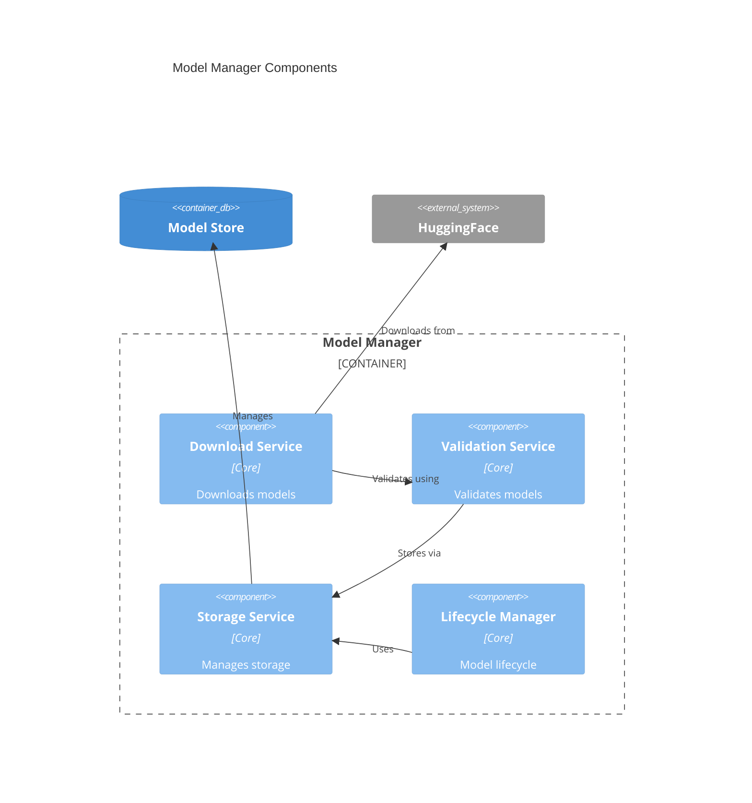
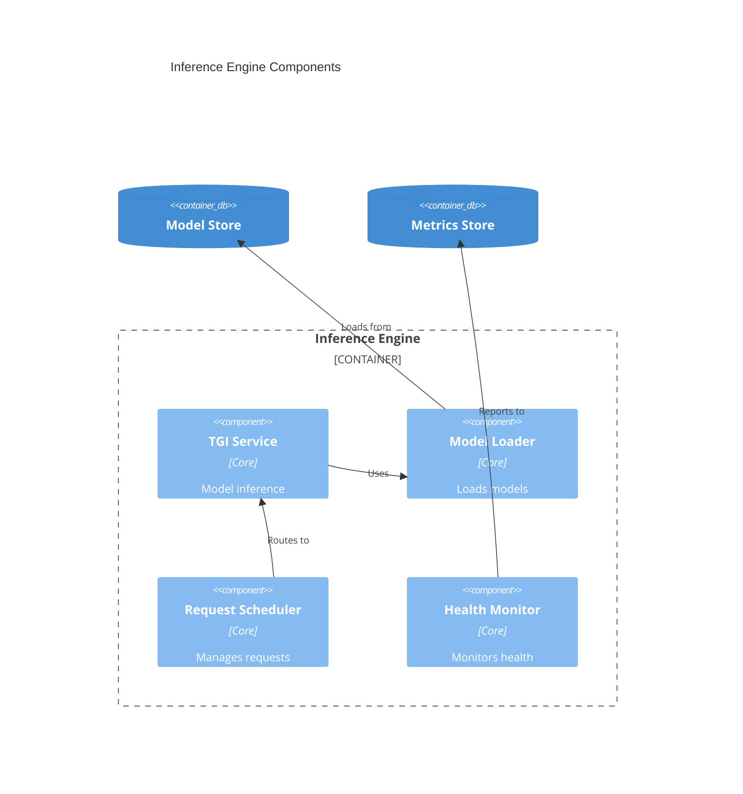
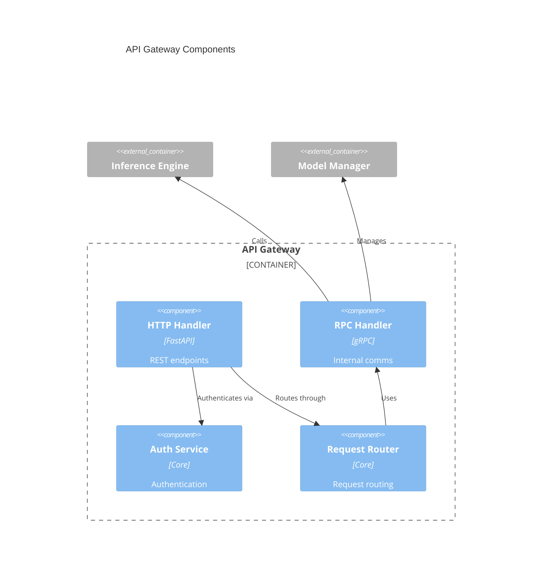

# LLM Service C4 Architecture

## Level 1: System Context

## Level 2: Container

## Level 3: Component

### Model Manager Components

### Inference Engine Components

### API Gateway Components

## Level 4: Class

See component-specific class diagrams:

- [Model Manager Classes](classes/model_manager.md)
- [Inference Engine Classes](classes/inference_engine.md)
- [API Gateway Classes](classes/api_gateway.md)
