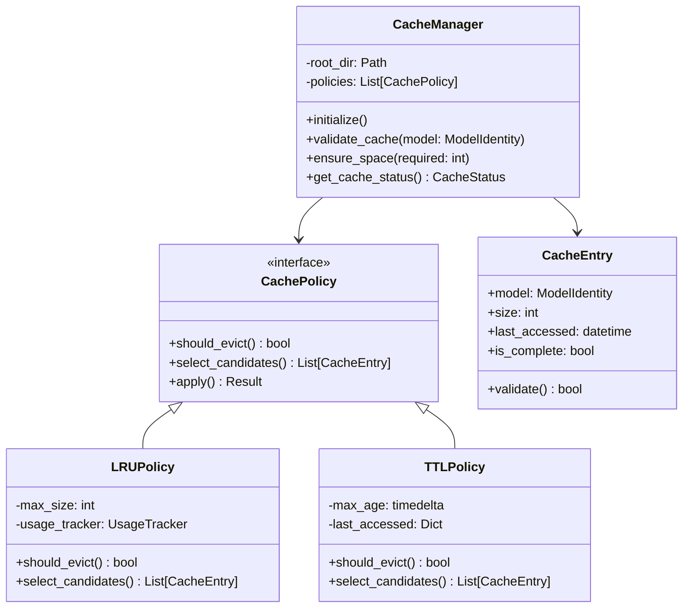
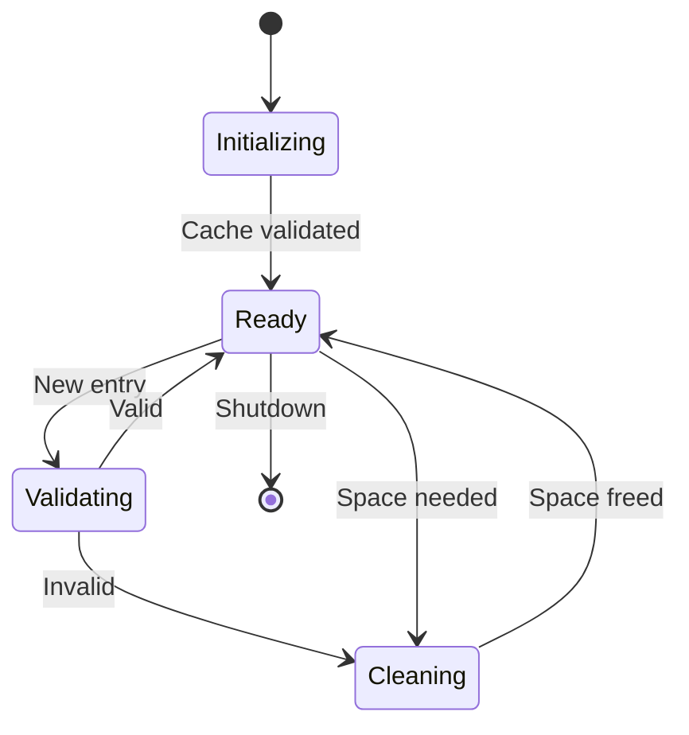
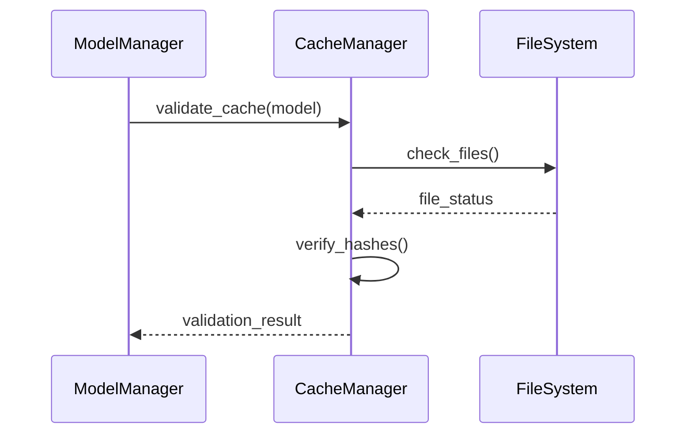
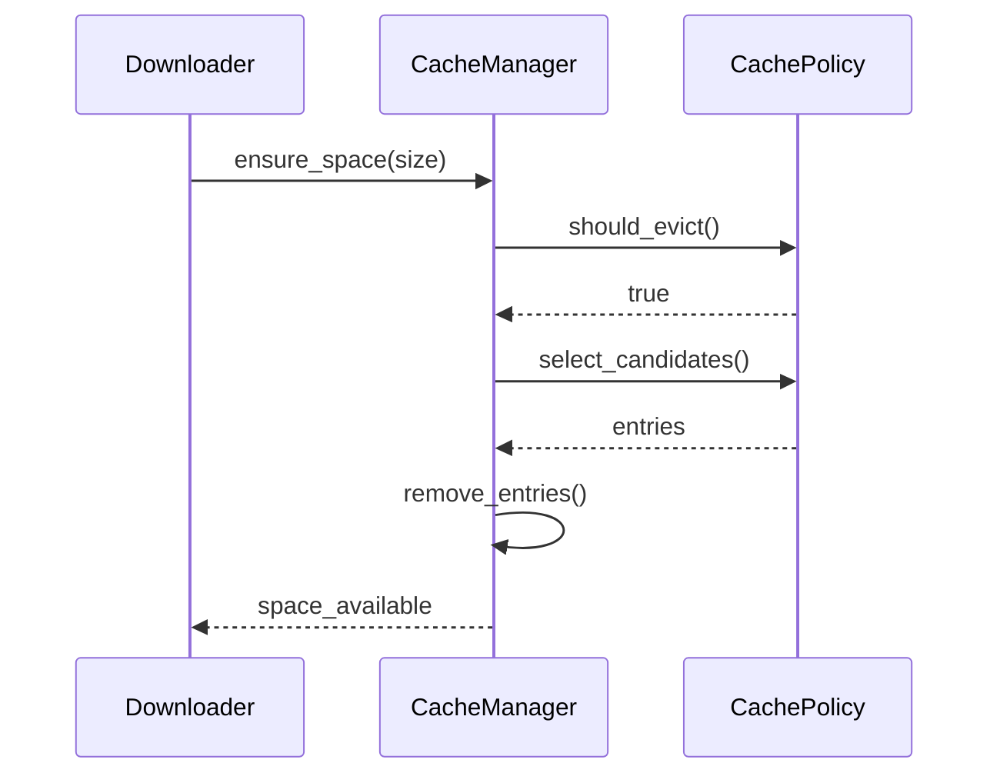

# Cache Management Design

## Overview

The cache management system handles model file storage, validation, and cleanup.

## Components

### Cache Structure



### State Management



## Operations

### Cache Validation



### Space Management



## Implementation Notes

1. Cache Directory Structure:

```
cache/
├── models/
│   ├── <namespace>/
│   │   └── <model>/
│   │       ├── <revision>/
│   │       │   ├── model.safetensors
│   │       │   └── config.json
│   │       └── metadata.json
│   └── temp/
└── index.json
```

2. Cache Index Format:

```json
{
  "entries": [
    {
      "model": "namespace/name@revision",
      "files": [
        {
          "path": "models/namespace/name/revision/file",
          "hash": "sha256:...",
          "size": 1234567,
          "last_accessed": "2024-02-21T12:00:00Z"
        }
      ],
      "total_size": 1234567,
      "is_complete": true
    }
  ],
  "size": 1234567,
  "last_cleanup": "2024-02-21T12:00:00Z"
}
```
