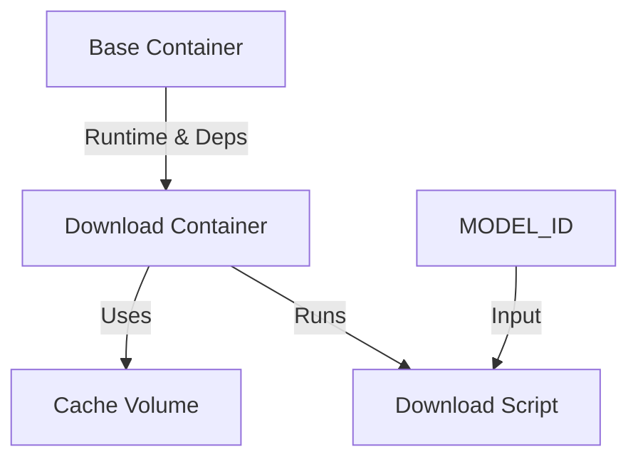
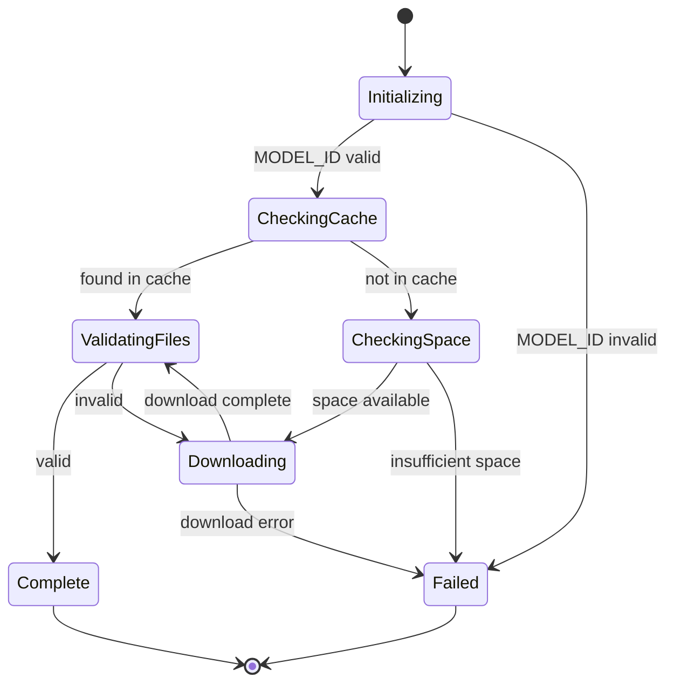
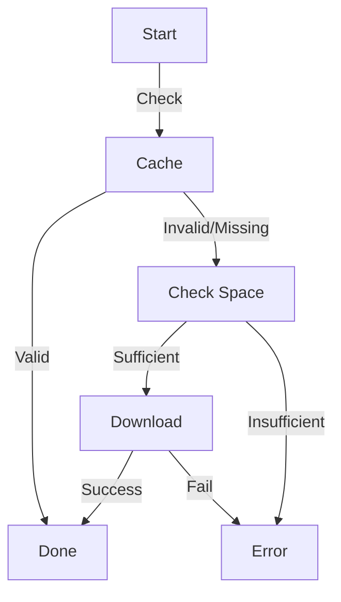
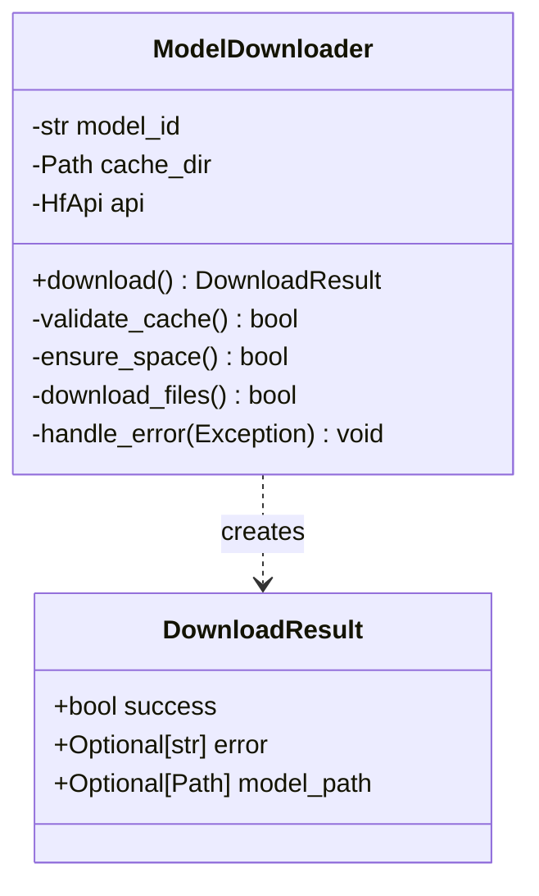
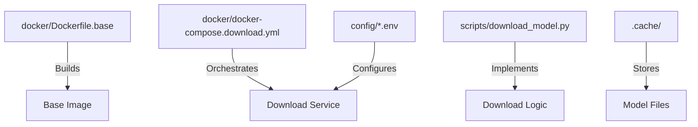

# Model Download System Design

## 1. Overall System Design

### Components and Relationships



### Component Specifications

1. **Base Container**

   - Python 3.10 runtime
   - HuggingFace dependencies (huggingface_hub, tqdm)
   - No business logic
   - Reusable across services

2. **Download Container**

   - Inherits base image
   - Mounts script and cache volumes
   - Passes environment variables
   - Single responsibility: model download

3. **Cache Volume**

   - Persistent storage at `.cache`
   - Model files location
   - Shared across runs
   - Path format: `models--{owner}--{model}`

4. **Download Script**
   - Business logic for download process
   - Progress reporting
   - Error handling
   - Clean exit states

## 2. Download Component Design

### Version 1 (State Machine Design)

_Note: Kept for reference, not used in implementation_



### Version 2 (Selected Implementation)

Simple, linear flow with clear error states:



### Core Structure



### Error Handling

1. **Input Validation**

   - MODEL_ID presence and format
   - Cache directory permissions
   - Environment setup

2. **System Checks**

   - Available disk space
   - Network connectivity
   - HuggingFace API access

3. **Download Issues**
   - Connection errors
   - Incomplete downloads
   - File validation failures

### Progress Reporting

1. **Download Progress**

   - Current/total size
   - Transfer speed
   - ETA calculation
   - Progress bar display

2. **Status Messages**
   - Operation stage
   - Error descriptions
   - Success confirmation
   - Cache status

## Implementation Notes

1. Using Version 2 design for:

   - Simpler implementation
   - Clear error states
   - Easy maintenance
   - Straightforward testing

2. Key Methods:

   - `download()`: Main entry point
   - `validate_cache()`: Check existing files
   - `ensure_space()`: Verify resources
   - `download_files()`: Handle transfer
   - `handle_error()`: Error management

3. Return Values:
   - Success/failure status
   - Error description if any
   - Path to model on success

## Implementation Structure

### File Organization

```
services/ai/llm-service/
├── docker/
│   ├── Dockerfile.base         # Base image with dependencies
│   ├── Dockerfile.downloader   # Download service image
│   └── docker-compose.download.yml  # Service orchestration
├── scripts/
│   └── download_model.py       # Main download logic
├── config/
│   ├── infra/
│   │   └── default.env        # Infrastructure configuration
│   └── models/
│       └── model.env          # Model-specific settings
└── .cache/                    # Model storage location
```

### Component Mapping



### File Responsibilities

1. **Dockerfile.base**

   - Python runtime setup
   - Package installation
   - Working directory configuration

2. **docker-compose.download.yml**

   - Service definition
   - Volume mounts
   - Environment variables
   - Container orchestration

3. **download_model.py**

   - ModelDownloader implementation
   - Error handling
   - Progress tracking
   - Cache management

4. **Environment Files**

   - default.env: Infrastructure settings
   - model.env: Model configuration

5. **Cache Directory**
   - Model file storage
   - Directory structure: `models--{owner}--{model}`
   - Persistent across runs
