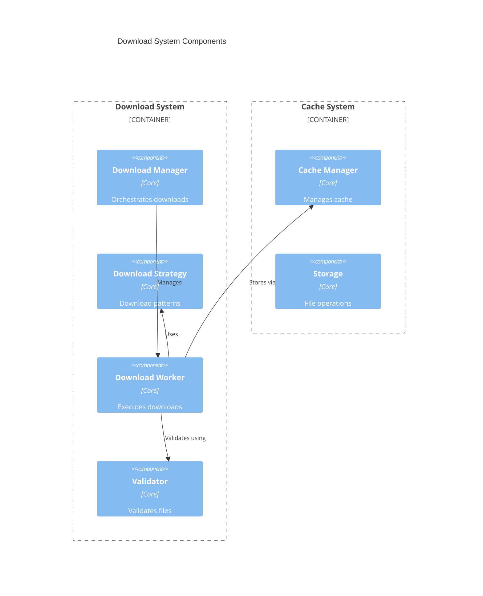
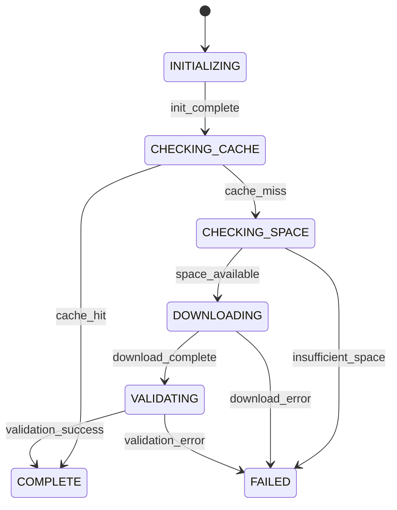
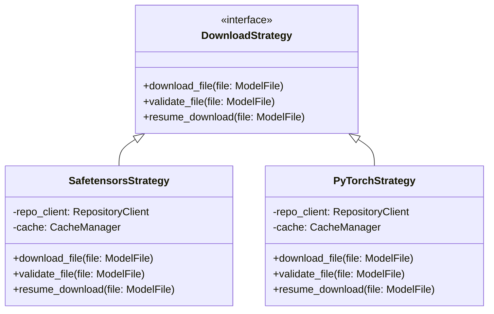
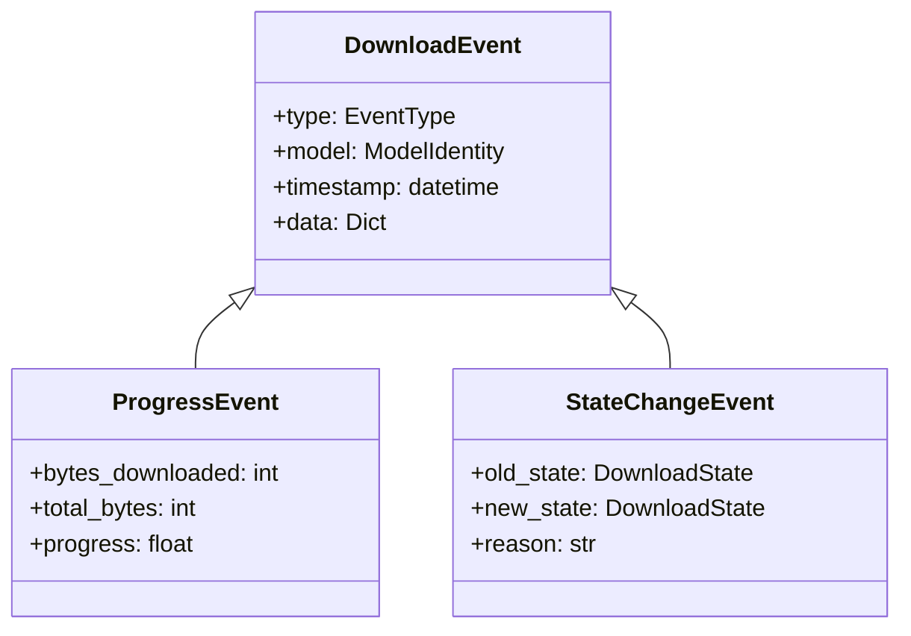
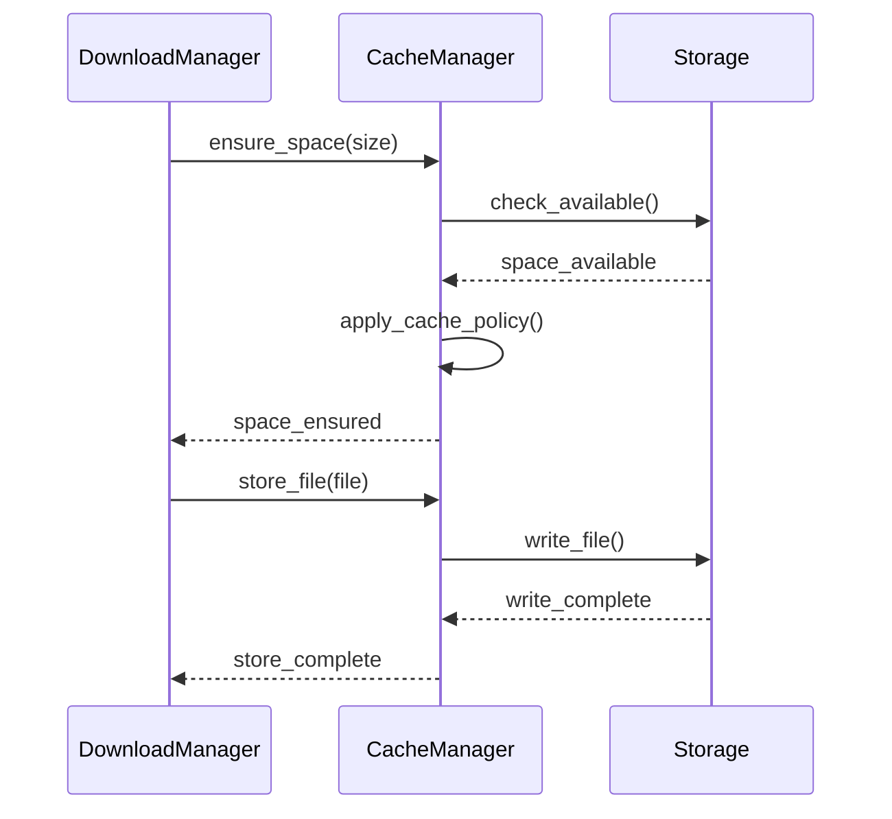
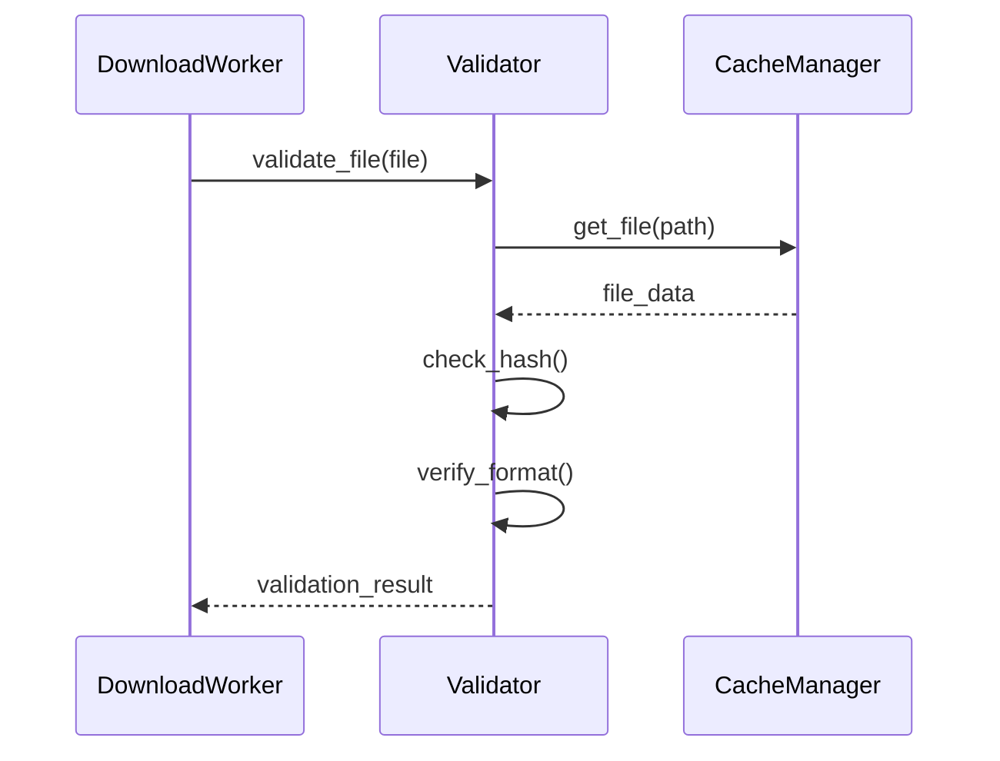

# Download System Design

## 1. Component Architecture

## 2. State Management

## 3. Download Strategy Pattern

## 4. Event System Integration

## 5. Cross-Component Communication

### Download Manager to Cache

### Download Worker to Validator

## 6. Integration Points

1. **With Model Manager**

   - Download initiation
   - Status reporting
   - Cache management

2. **With Cache System**

   - Space management
   - File storage
   - Validation

3. **With API Gateway**
   - Progress reporting
   - Error handling
   - Status updates
