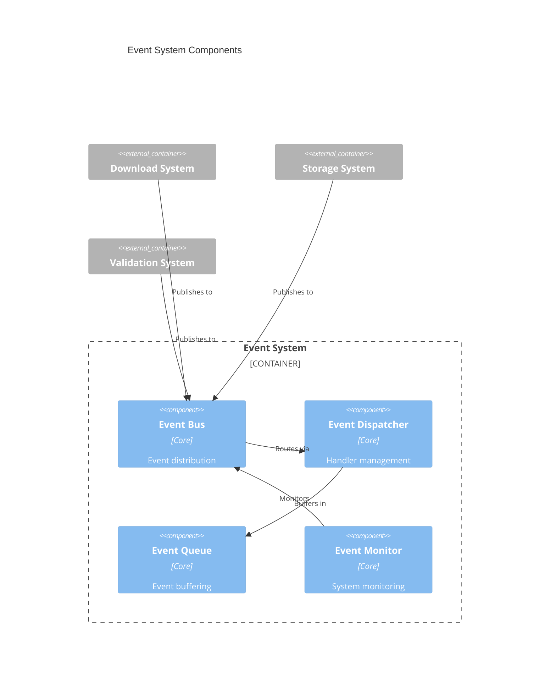
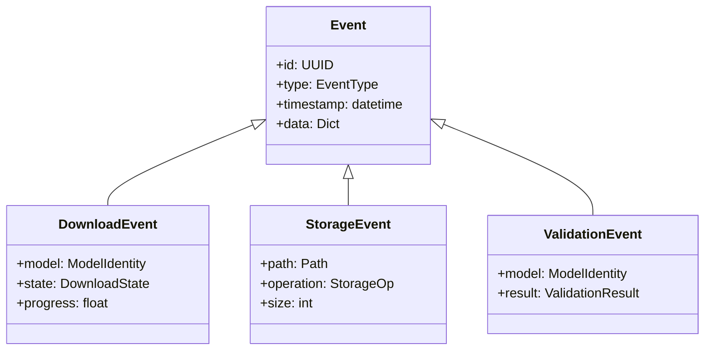
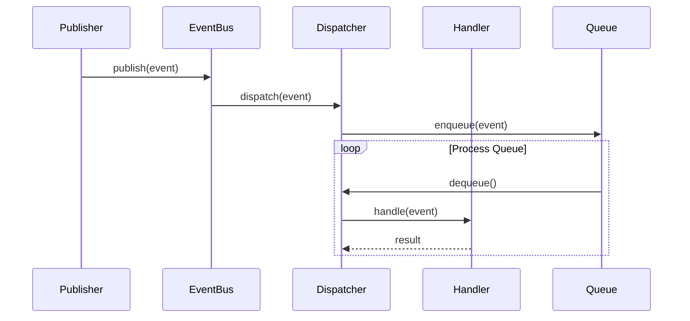
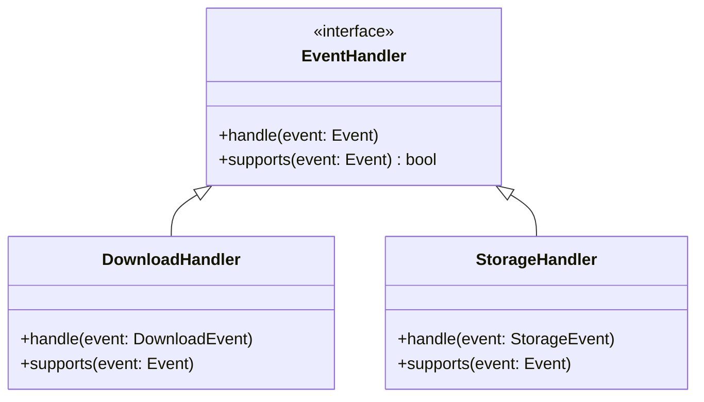

# Event System Design

## 1. Component Overview



## 2. Event Hierarchy



## 3. Event Processing



## 4. Handler Management



## 5. Event Types

### Download Events

- `DOWNLOAD_STARTED`
- `DOWNLOAD_PROGRESS`
- `DOWNLOAD_COMPLETED`
- `DOWNLOAD_FAILED`

### Storage Events

- `STORAGE_FILE_CREATED`
- `STORAGE_FILE_DELETED`
- `STORAGE_SPACE_LOW`
- `STORAGE_ERROR`

### Validation Events

- `VALIDATION_STARTED`
- `VALIDATION_COMPLETED`
- `VALIDATION_FAILED`

## 6. Integration Points

1. **With Download System**

   ```python
   class DownloadManager:
       def __init__(self, event_bus: EventBus):
           self.event_bus = event_bus

       def start_download(self, model: ModelIdentity):
           self.event_bus.publish(DownloadEvent(
               type=EventType.DOWNLOAD_STARTED,
               model=model
           ))
   ```

2. **With Storage System**

   ```python
   class StorageManager:
       def __init__(self, event_bus: EventBus):
           self.event_bus = event_bus

       def store_file(self, file: ModelFile):
           self.event_bus.publish(StorageEvent(
               type=EventType.STORAGE_FILE_CREATED,
               path=file.path
           ))
   ```

3. **With Validation System**

   ```python
   class ValidationManager:
       def __init__(self, event_bus: EventBus):
           self.event_bus = event_bus

       def validate_model(self, model: ModelIdentity):
           self.event_bus.publish(ValidationEvent(
               type=EventType.VALIDATION_STARTED,
               model=model
           ))
   ```
