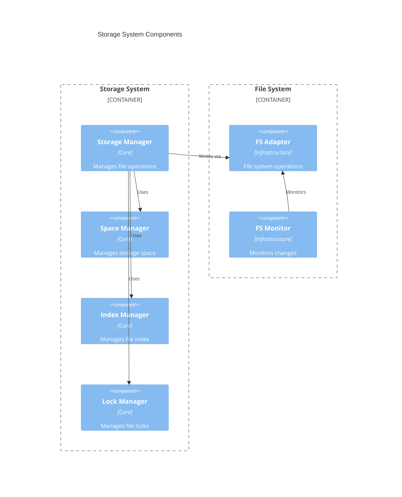
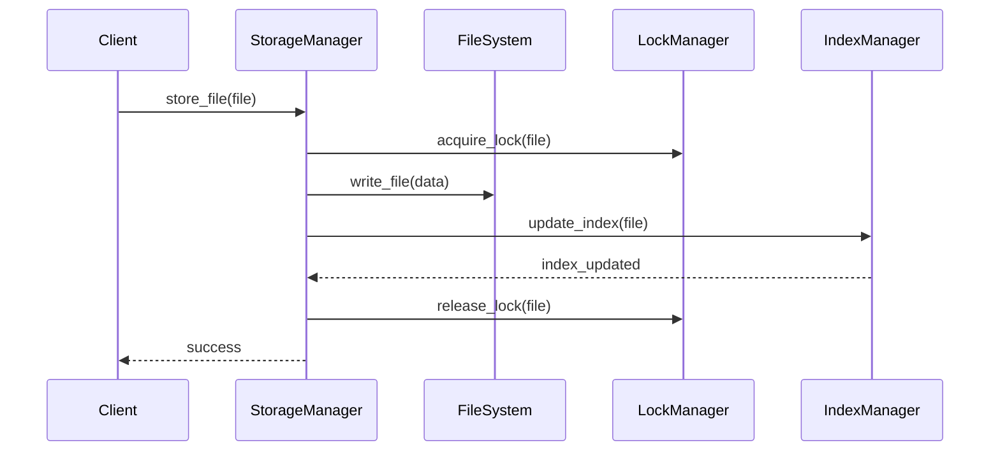
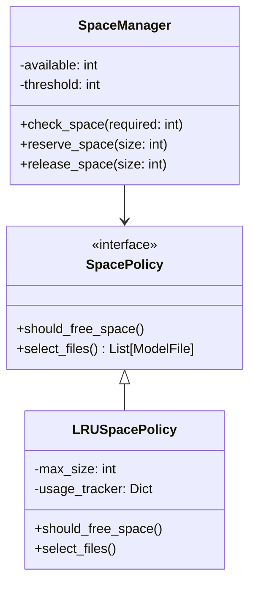
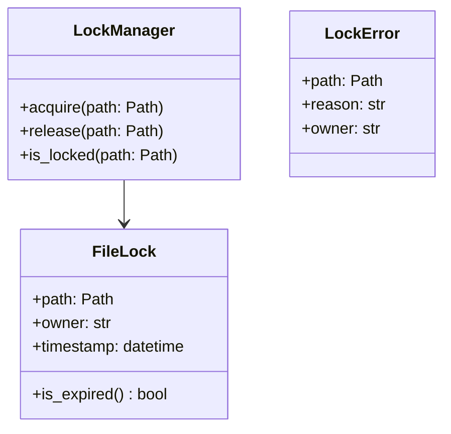
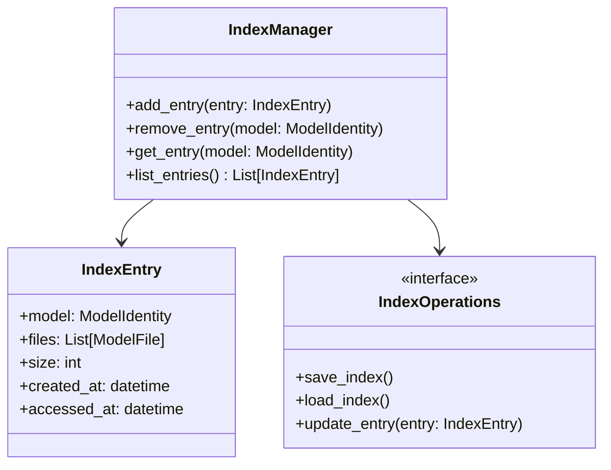

# Storage System Design

## 1. Component Overview



## 2. Storage Directory Structure

```plaintext
/data/model-cache/
├── models/
│   ├── <namespace>/
│   │   └── <model>/
│   │       ├── <revision>/
│   │       │   ├── model.safetensors
│   │       │   └── config.json
│   │       └── metadata.json
│   └── temp/
├── index.json
└── locks/
```

## 3. Storage Operations



## 4. Space Management



## 5. File Locking



## 6. Index Management



## 7. Integration Points

1. **With Download System**

   - File writing
   - Space checking
   - Temporary storage

2. **With Validation System**

   - File reading
   - Lock management
   - Index queries

3. **With Event System**
   - Storage events
   - Space alerts
   - Index updates
