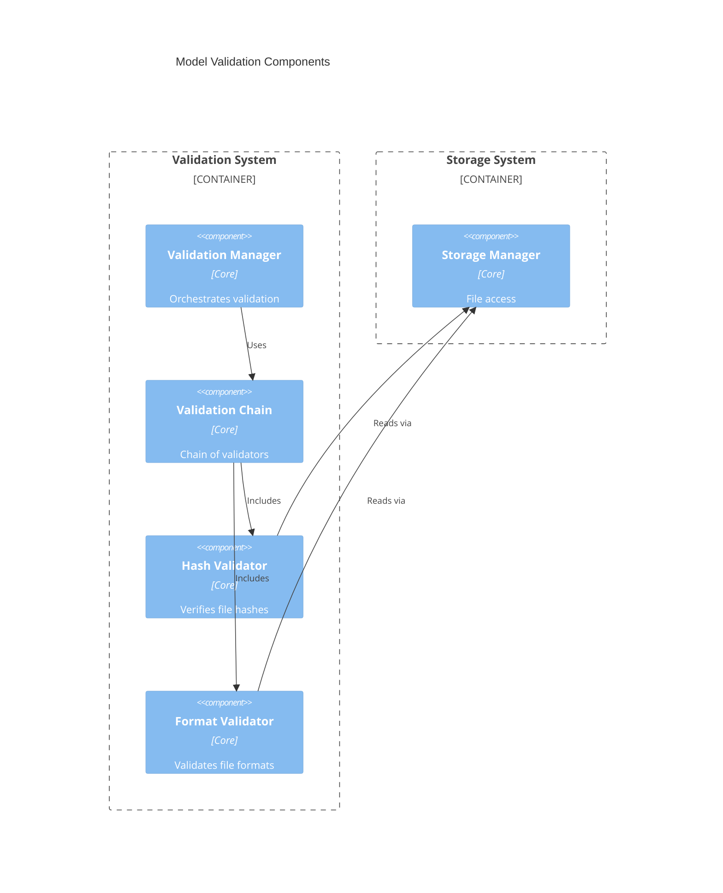
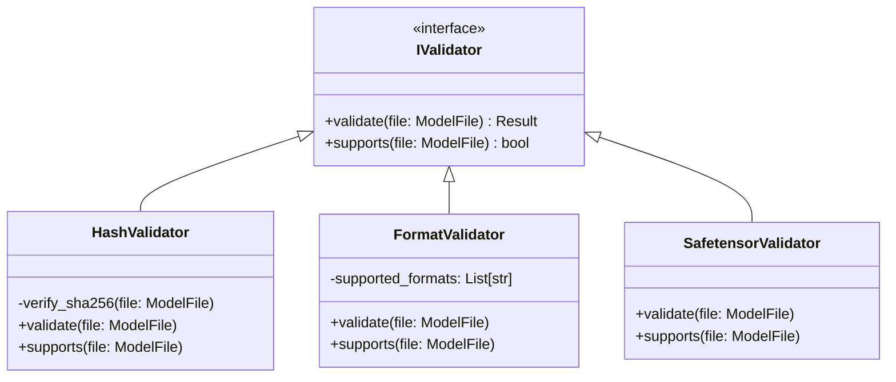
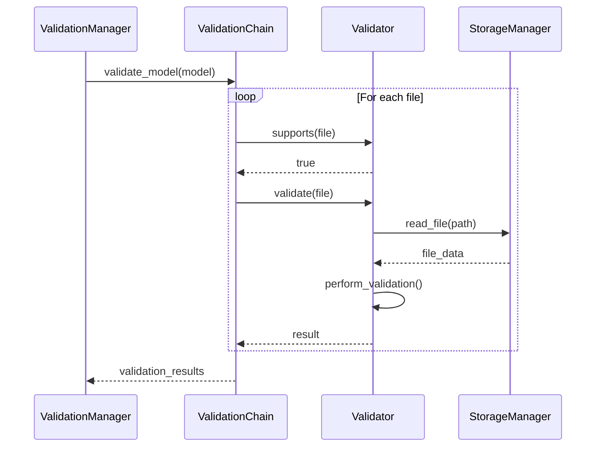
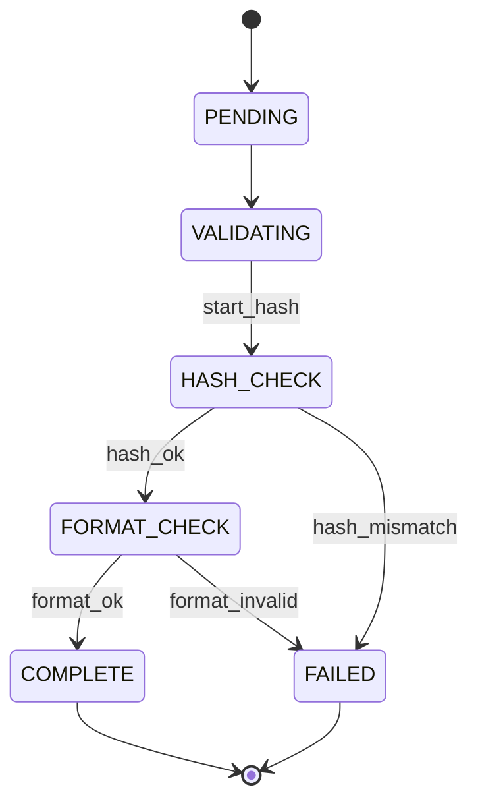
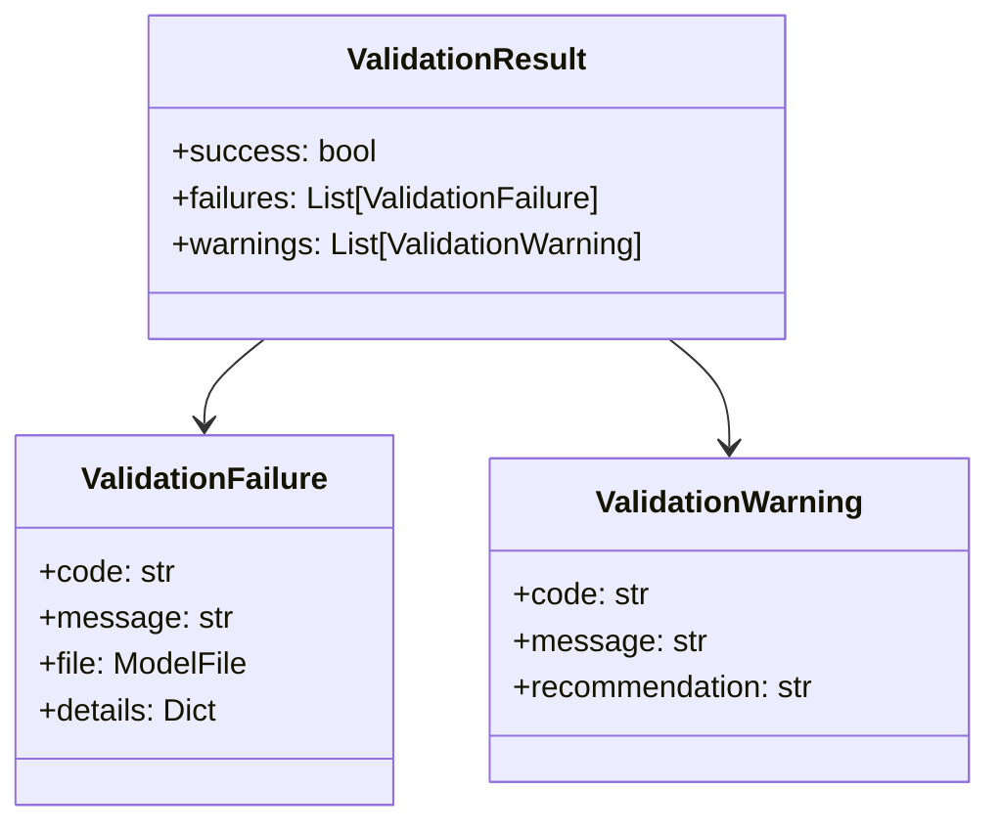

# Model Validation Design

## 1. Component Overview

## 2. Validation Chain Design

## 3. Validation Process

## 4. Validation States

## 5. Validation Results

## 6. Integration Points

1. **With Download System**

   - Validation triggers
   - Progress reporting
   - Failure handling

2. **With Storage System**

   - File access
   - Temporary storage
   - Cleanup on failure

3. **With Event System**
   - Validation events
   - Status updates
   - Error reporting
