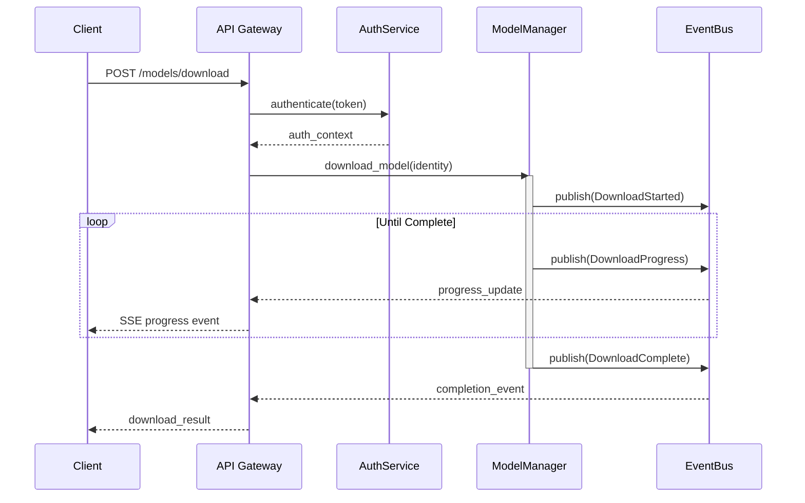
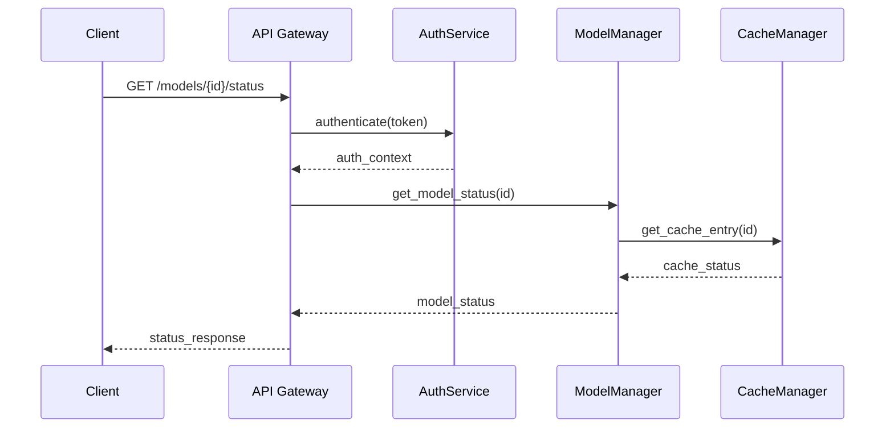
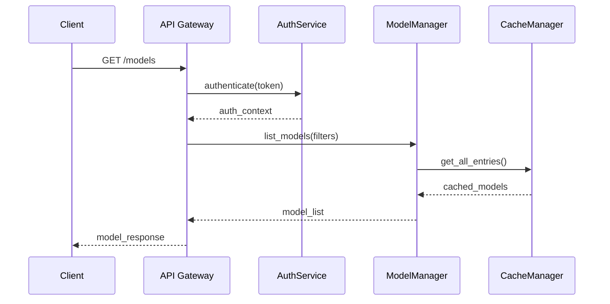
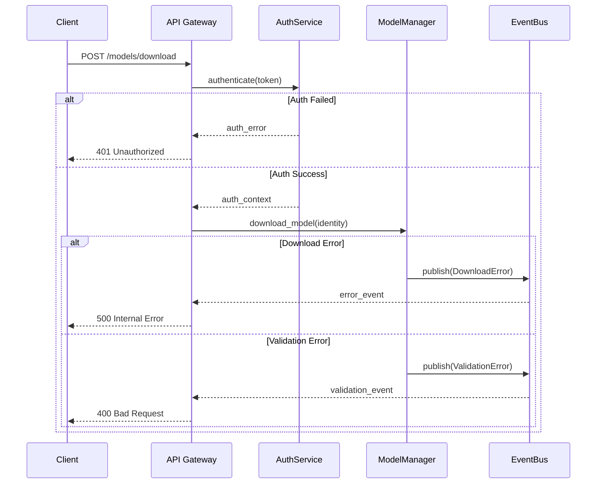

# API Flow Sequences

## Model Download API Flow

```mermaid
sequenceDiagram
    participant Client
    participant API as API Gateway
    participant Auth as AuthService
    participant MM as ModelManager
    participant Events as EventBus

    Client->>API: POST /models/download
    API->>Auth: authenticate(token)
    Auth-->>API: auth_context

    API->>MM: download_model(identity)

    activate MM
    MM->>Events: publish(DownloadStarted)

    loop Until Complete
        MM->>Events: publish(DownloadProgress)
        Events-->>API: progress_update
        API-->>Client: SSE progress event
    end

    MM->>Events: publish(DownloadComplete)
    deactivate MM

    Events-->>API: completion_event
    API-->>Client: download_result
```

## Model Status API Flow

```mermaid
sequenceDiagram
    participant Client
    participant API as API Gateway
    participant Auth as AuthService
    participant MM as ModelManager
    participant Cache as CacheManager

    Client->>API: GET /models/{id}/status
    API->>Auth: authenticate(token)
    Auth-->>API: auth_context

    API->>MM: get_model_status(id)
    MM->>Cache: get_cache_entry(id)
    Cache-->>MM: cache_status
    MM-->>API: model_status
    API-->>Client: status_response
```

## Model List API Flow

```mermaid
sequenceDiagram
    participant Client
    participant API as API Gateway
    participant Auth as AuthService
    participant MM as ModelManager
    participant Cache as CacheManager

    Client->>API: GET /models
    API->>Auth: authenticate(token)
    Auth-->>API: auth_context

    API->>MM: list_models(filters)
    MM->>Cache: get_all_entries()
    Cache-->>MM: cached_models
    MM-->>API: model_list
    API-->>Client: model_response
```

## Error Handling Flow

```mermaid
sequenceDiagram
    participant Client
    participant API as API Gateway
    participant Auth as AuthService
    participant MM as ModelManager
    participant Events as EventBus

    Client->>API: POST /models/download
    API->>Auth: authenticate(token)

    alt Auth Failed
        Auth-->>API: auth_error
        API-->>Client: 401 Unauthorized
    else Auth Success
        Auth-->>API: auth_context
        API->>MM: download_model(identity)

        alt Download Error
            MM->>Events: publish(DownloadError)
            Events-->>API: error_event
            API-->>Client: 500 Internal Error
        else Validation Error
            MM->>Events: publish(ValidationError)
            Events-->>API: validation_event
            API-->>Client: 400 Bad Request
        end
    end
```
